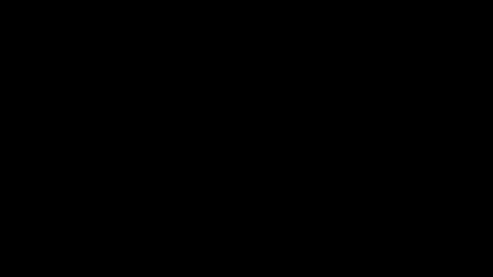
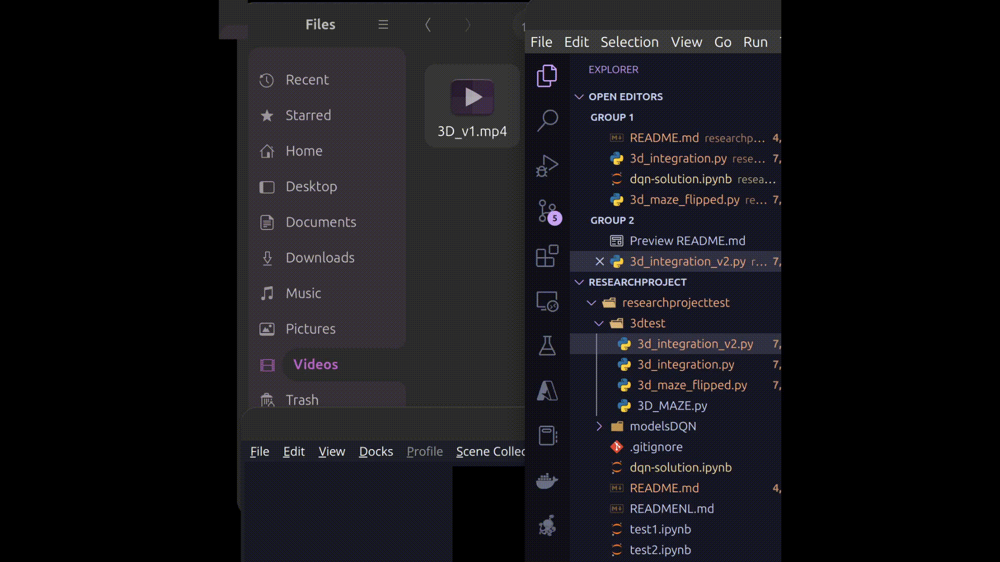
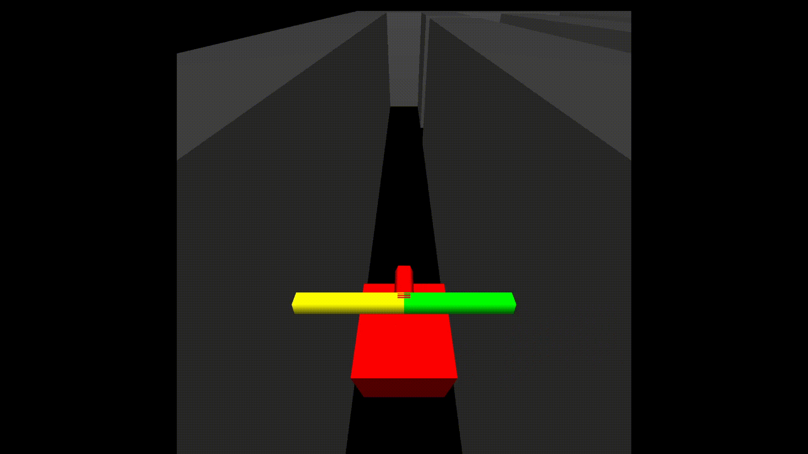

# Research Project

## Author Information

**Name:** Lucas Driessens  
**Institution:** HOWEST Kortrijk  
**Course:** Research Project  
**Date:** 2024-08-01

## Description

### Main Research Question

> In which ways can reinforcement learning be applied to control an RF-car? (to let it drive through a maze)

### Sub Research Questions

1. Which virtual environments exist to train a virtual RF-car?

2. Which reinforcement learning techniques can I best use in this application?

3. Can the simulation be transferred to the real world?

4. Does the simulation have any useful contributions? In terms of training time or performance?

5. How can I transfer my trained model to my physical RC car? (sim2real)

## Table of Contents

- [Research Project](#research-project)
  - [Author Information](#author-information)
  - [Description](#description)
    - [Main Research Question](#main-research-question)
    - [Sub Research Questions](#sub-research-questions)
  - [Table of Contents](#table-of-contents)
  - [Progress](#progress)
    - [2024-02-01](#2024-02-01)
    - [2024-04-02](#2024-04-02)
    - [2024-06-03](#2024-06-03)
  - [Subquestion 1](#subquestion-1)
    - [OpenAI Gym](#openai-gym)
      - [Installation](#installation)
      - [First test environment](#first-test-environment)
      - [second test environment](#second-test-environment)
    - [3D Maze using PyOpenGL](#3d-maze-using-pyopengl)
      - [installation](#installation-1)
  - [Sources](#sources)

## Progress

### 2024-02-01

- [x] Create repository
- [x] Create README.md

### 2024-04-02

- [x] Start subquestion 1

### 2024-06-03

- [x] Build 3d environment using PyOpenGL

## Subquestion 1

> Which virtual environments exist to train a virtual RF-car?

### OpenAI Gym

OpenAI Gym is a toolkit for developing and comparing reinforcement learning algorithms. It supports teaching agents everything from walking to playing games like Pong or Pinball.

#### Installation

```bash
pip install gym==0.23.0
```

#### First test environment

```python
import numpy as np

import gym
from gym import spaces

import pygame

class RCMazeEnv(gym.Env):
    def __init__(self, maze_size_x=12, maze_size_y=12):
        self.maze_size_x = maze_size_x
        self.maze_size_y = maze_size_y
        self.maze = self.generate_maze()
        self.car_position = (1, 1)
        self.possible_actions = range(3)
        self.car_orientation = 'N'
        self.sensor_readings = {'front': 0, 'left': 0, 'right': 0}
        self.steps = 0
        self.previous_distance = 0
        self.goal = (10, 10)
        self.previous_steps = 0
        self.reset()


    def generate_maze(self):
        # For simplicity, create a static maze with walls
        # '1' represents a wall, and '0' represents an open path
        maze = np.zeros((self.maze_size_y, self.maze_size_x), dtype=int)
        # Add walls to the maze (this can be customized)

        layout = [
                [1, 1, 1, 1, 1, 1, 1, 1, 1, 1, 1, 1],
                [1, 0, 0, 0, 0, 0, 0, 0, 0, 0, 0, 1],
                [1, 0, 1, 1, 1, 1, 1, 1, 0, 1, 1, 1],
                [1, 0, 0, 0, 0, 0, 0, 0, 0, 0, 0, 1],
                [1, 0, 1, 0, 1, 1, 1, 1, 1, 1, 0, 1],
                [1, 0, 1, 0, 1, 0, 0, 0, 0, 0, 0, 1],
                [1, 0, 0, 0, 1, 1, 0, 1, 0, 1, 0, 1],
                [1, 0, 1, 0, 0, 0, 0, 1, 1, 1, 0, 1],
                [1, 0, 1, 1, 0, 1, 0, 0, 0, 0, 0, 1],
                [1, 0, 1, 0, 0, 1, 0, 1, 1, 1, 0, 1],
                [1, 0, 0, 0, 1, 1, 0, 0, 0, 0, 0, 1],
                [1, 1, 1, 1, 1, 1, 1, 1, 1, 1, 1, 1]]


        maze = np.array(layout)

        return maze

    def reset(self):
        self.car_position = (1, 1)
        self.car_orientation = 'N'
        self.update_sensor_readings()
        self.steps = 0
        self.previous_distance = 0
        self.previous_steps = 0
        return self.get_state()

    def step(self, action):
        if action == 0:
            self.move_forward()
        elif action == 1:
            self.turn_left()
        elif action == 2:
            self.turn_right()
        self.update_sensor_readings()
        reward = self.compute_reward()
        self.steps += 1
        done = self.is_done()
        return self.get_state(), reward, done


    def move_forward(self):
        x, y = self.car_position
        if self.car_orientation == 'N' and y > 0 and self.maze[y - 1][x] != 1:
            self.car_position = (x, y - 1)
        elif self.car_orientation == 'S' and y < self.maze_size_y - 1 and self.maze[y + 1][x] != 1:
            self.car_position = (x, y + 1)
        elif self.car_orientation == 'E' and x < self.maze_size_x - 1 and self.maze[y][x + 1] != 1:
            self.car_position = (x + 1, y)
        elif self.car_orientation == 'W' and x > 0 and self.maze[y][x - 1] != 1:
            self.car_position = (x - 1, y)


    def turn_left(self):
        orientations = ['N', 'W', 'S', 'E']
        idx = orientations.index(self.car_orientation)
        self.car_orientation = orientations[(idx + 1) % 4]

    def turn_right(self):
        orientations = ['N', 'E', 'S', 'W']
        idx = orientations.index(self.car_orientation)
        self.car_orientation = orientations[(idx + 1) % 4]

    def update_sensor_readings(self):
        # Simple sensor implementation: counts steps to the nearest wall
        self.sensor_readings['front'] = self.distance_to_wall('front')
        self.sensor_readings['left'] = self.distance_to_wall('left')
        self.sensor_readings['right'] = self.distance_to_wall('right')

    def distance_to_wall(self, direction):
        x, y = self.car_position
        distance = 0
        max_distance = self.maze_size_x if direction in ['left', 'right'] else self.maze_size_y


        if direction == 'front':
            if self.car_orientation == 'N':
                while y - distance >= 0 and self.maze[y - distance][x] != 1:
                    distance += 1
            elif self.car_orientation == 'S':
                while y + distance < self.maze_size_y and self.maze[y + distance][x] != 1:
                    distance += 1
            elif self.car_orientation == 'E':
                while x + distance < self.maze_size_x and self.maze[y][x + distance] != 1:
                    distance += 1
            elif self.car_orientation == 'W':
                while x - distance >= 0 and self.maze[y][x - distance] != 1:
                    distance += 1
        elif direction == 'left':
            if self.car_orientation == 'N':
                while x - distance >= 0 and self.maze[y][x - distance] != 1:
                    distance += 1
            elif self.car_orientation == 'S':
                while x + distance < self.maze_size_x and self.maze[y][x + distance] != 1:
                    distance += 1
            elif self.car_orientation == 'E':
                while y - distance >= 0 and self.maze[y - distance][x] != 1:
                    distance += 1
            elif self.car_orientation == 'W':
                while y + distance < self.maze_size_y and self.maze[y + distance][x] != 1:
                    distance += 1
        elif direction == 'right':
            if self.car_orientation == 'N':
                while x + distance < self.maze_size_x and self.maze[y][x + distance] != 1:
                    distance += 1
            elif self.car_orientation == 'S':
                while x - distance >= 0 and self.maze[y][x - distance] != 1:
                    distance += 1
            elif self.car_orientation == 'E':
                while y + distance < self.maze_size_y and self.maze[y + distance][x] != 1:
                    distance += 1
            elif self.car_orientation == 'W':
                while y - distance >= 0 and self.maze[y - distance][x] != 1:
                    distance += 1

            # Normalize the measured distance
        normalized_distance = (max_distance - distance - 1) / (max_distance - 1)

        # Ensure the value is within the range [0, 1]
        normalized_distance = max(0, min(normalized_distance, 1))

        return normalized_distance

    def compute_reward(self):
        # # Initialize reward
        reward = 0

        # # Check for collision or out of bounds
        if any(self.sensor_readings[direction] == 0 for direction in ['front', 'left', 'right']):
            reward -= 20

        # # Check if goal is reached
        if self.car_position == self.goal:
            reward += 100
            # Additional penalty if it takes too many steps to reach the goal
            if self.steps > 750:
                reward -= 200
            return reward  # Return immediately as this is the terminal state

        # Calculate the Euclidean distance to the goal
        distance_to_goal = ((self.car_position[0] - self.goal[0]) ** 2 + (self.car_position[1] - self.goal[1]) ** 2) ** 0.5

        # Define a maximum reward when the car is at the goal
        max_reward_at_goal = 50

        # Reward based on proximity to the goal
        reward += max_reward_at_goal / (distance_to_goal + 1)  # Adding 1 to avoid division by zero

        # # Reward or penalize based on movement towards or away from the goal
        if distance_to_goal < self.previous_distance:
            reward += 50  # Positive reward for moving closer to the goal
        elif distance_to_goal > self.previous_distance:
            reward -= 25  # Negative reward for moving farther from the goal


        # Penalize for each step taken to encourage efficiency
        reward -= 2

        # # Update the previous_distance for the next step
        self.previous_distance = distance_to_goal
        return reward


    def is_done(self):
        # Define when the episode ends
        # ends when the car reaches the goal or it takes more than 3000 steps
        return self.car_position == self.goal or self.steps > 3000


    def get_state(self):
        return (self.car_position, self.car_orientation, self.sensor_readings)

    # def render(self):
    #     rendered_maze = np.array(self.maze, dtype=str)
    #     x, y = self.car_position
    #     rendered_maze[y][x] = 'C'  # Representing the car

    #     #print array
    #     print(rendered_maze, '\n')


    def init_pygame(self):
        # Initialize Pygame and set up the display
        pygame.init()
        self.cell_size = 40  # Size of each cell in pixels
        self.maze_size_x = 12  # Assuming the maze size_x is 12
        self.maze_size_y = 12  # Assuming the maze size_y is 12
        self.width = 600
        self.height = 600
        self.screen = pygame.display.set_mode((self.width, self.height))
        self.clock = pygame.time.Clock()

    def render(self):
        # Render the environment using Pygame
        for y in range(self.maze_size_y):
            for x in range(self.maze_size_x):
                rect = pygame.Rect(x * self.cell_size, y * self.cell_size, self.cell_size, self.cell_size)
                if (x, y) == self.goal:  # Goal position
                    color = (0, 255, 0)  # Green color for the goal
                elif self.maze[y][x] == 0:
                    color = (255, 255, 255)  # White color for empty space
                else:
                    color = (0, 0, 0)  # Black color for walls
                pygame.draw.rect(self.screen, color, rect)

        # Draw the car
        car_x, car_y = self.car_position
        car_rect = pygame.Rect(car_x * self.cell_size, car_y * self.cell_size, self.cell_size, self.cell_size)
        pygame.draw.rect(self.screen, (255, 0, 0), car_rect)  # Red color for the car

        pygame.display.flip()
        self.clock.tick(60)  # Limit the frame rate to 60 FPS


    def close_pygame(self):
        # Close the Pygame window
        pygame.quit()
```

**Conclusions first test environment**

- This environment was solved using a Q-agent

- After testing it is clear that it is able to solve the enivronment. But not at all efficient, the car gets stuck multiple times and will take go backwards often. (This is probably caused by the over engineered reward function.)

- Video:
  - 

#### second test environment

this time I decided to use a DQN to solve the environment. I had to make some changes to the environment for this to work more efficiently. During this I fixed the reward function issue I had in the previous environment.

I also changed the maze layout to make it more challenging.

**DQN agent**

```python
class DQNAgent:
    def __init__(self, replayCapacity, inputShape, outputShape):
        ## Initialize replay memory
        self.capacity = replayCapacity
        self.memory = collections.deque(maxlen=self.capacity)
        self.populated = False
        ## Policiy model
        self.inputShape = inputShape
        self.outputShape = outputShape
        self.policy_model = self.buildNetwork()

        ## Target model
        self.target_model = self.buildNetwork()
        self.target_model.set_weights(self.policy_model.get_weights())

    def addToReplayMemory(self, step):
        self.step = step
        self.memory.append(self.step)

    def sampleFromReplayMemory(self, batchSize):
        self.batchSize = batchSize
        if self.batchSize > len(self.memory):
            self.populated = False
            return self.populated
        else:
            return random.sample(self.memory, self.batchSize)


    def buildNetwork(self):
        model = Sequential()
        model.add(Dense(32, input_shape=self.inputShape, activation='relu'))
        model.add(Dense(64, activation='relu'))
        model.add(Dense(64, activation='relu'))
        model.add(Dense(32, activation='relu'))
        model.add(Dense(self.outputShape, activation='linear'))
        model.compile(loss='mse', optimizer=Adam(learning_rate=0.001), metrics=['MeanSquaredError'])
        return model

    def policy_network_fit(self,batch, batchSize):
        self.batchSize = batchSize
        self.batch = batch


    def policy_network_predict(self, state):
        self.state = state
        self.qPolicy = self.policy_model.predict(self.state)
        return self.qPolicy

    def target_network_predict(self, state):
        self.state = state
        self.qTarget = self.target_model.predict(self.state)
        return self.qTarget

    def update_target_network(self):
        self.target_model.set_weights(self.policy_model.get_weights())

```

**Maze environment**

```python
    ## The following additions were made:
 class RCMazeEnv(gym.Env):
    def __init__(self, maze_size_x=12, maze_size_y=12):
        self.maze_size_x = maze_size_x
        self.maze_size_y = maze_size_y
        self.maze = self.generate_maze()
        self.car_position = (1, 1)
        self.possible_actions = range(3)
        self.car_orientation = 'N'
        self.sensor_readings = {'front': 0, 'left': 0, 'right': 0}
        self.steps = 0
        self.previous_distance = 0
        self.goal = (10, 10)
        self.previous_steps = 0
        self.visited_positions = set()
        self.reset()
    def generate_maze(self):
        # For simplicity, create a static maze with walls
        # '1' represents a wall, and '0' represents an open path
        maze = np.zeros((self.maze_size_y, self.maze_size_x), dtype=int)
        # Add walls to the maze (this can be customized)

        layout = [
            [1, 1, 1, 1, 1, 1, 1, 1, 1, 1, 1, 1],
            [1, 0, 0, 0, 0, 0, 0, 0, 0, 0, 0, 1],
            [1, 0, 1, 1, 1, 1, 1, 1, 0, 1, 1, 1],
            [1, 0, 1, 0, 0, 0, 0, 0, 0, 0, 0, 1],
            [1, 0, 1, 0, 1, 1, 1, 1, 1, 1, 0, 1],
            [1, 0, 1, 0, 1, 0, 0, 0, 0, 0, 0, 1],
            [1, 0, 0, 0, 1, 1, 0, 1, 1, 1, 1, 1],
            [1, 0, 1, 0, 0, 0, 0, 1, 0, 1, 1, 1],
            [1, 0, 1, 1, 0, 1, 0, 0, 0, 0, 0, 1],
            [1, 0, 1, 0, 0, 1, 1, 1, 1, 1, 0, 1],
            [1, 0, 0, 0, 1, 1, 0, 0, 0, 0, 0, 1],
            [1, 1, 1, 1, 1, 1, 1, 1, 1, 1, 1, 1]]


        maze = np.array(layout)

        return maze
    def reset(self):
        self.car_position = (1, 1)
        self.car_orientation = 'N'
        self.update_sensor_readings()
        self.steps = 0
        self.previous_distance = 0
        self.previous_steps = 0
        self.visited_positions.clear()  # Clear the visited positions
        self.visited_positions.add(self.car_position)
        return self.get_state()
    def step(self, action):
        if action == 0:
            self.move_forward()
        elif action == 1:
            self.turn_left()
        elif action == 2:
            self.turn_right()
        self.update_sensor_readings()
        self.visited_positions.add(self.car_position)
        reward = self.compute_reward()
        self.steps += 1
        done = self.is_done()
        return self.get_state(), reward, done

    def move_forward(self):
        x, y = self.car_position
        if self.car_orientation == 'N' and y > 0 and self.maze[y - 1][x] != 1:
            self.car_position = (x, y - 1)
        elif self.car_orientation == 'S' and y < self.maze_size_y - 1 and self.maze[y + 1][x] != 1:
            self.car_position = (x, y + 1)
        elif self.car_orientation == 'E' and x < self.maze_size_x - 1 and self.maze[y][x + 1] != 1:
            self.car_position = (x + 1, y)
        elif self.car_orientation == 'W' and x > 0 and self.maze[y][x - 1] != 1:
            self.car_position = (x - 1, y)


    def turn_left(self):
        orientations = ['N', 'W', 'S', 'E']
        idx = orientations.index(self.car_orientation)
        self.car_orientation = orientations[(idx + 1) % 4]

    def turn_right(self):
        orientations = ['N', 'E', 'S', 'W']
        idx = orientations.index(self.car_orientation)
        self.car_orientation = orientations[(idx + 1) % 4]

    def update_sensor_readings(self):
        # Simple sensor implementation: counts steps to the nearest wall
        self.sensor_readings['front'] = self.distance_to_wall('front')
        self.sensor_readings['left'] = self.distance_to_wall('left')
        self.sensor_readings['right'] = self.distance_to_wall('right')

    def distance_to_wall(self, direction):
        x, y = self.car_position
        distance = 0
        max_distance = self.maze_size_x if direction in ['left', 'right'] else self.maze_size_y


        if direction == 'front':
            if self.car_orientation == 'N':
                while y - distance >= 0 and self.maze[y - distance][x] != 1:
                    distance += 1
            elif self.car_orientation == 'S':
                while y + distance < self.maze_size_y and self.maze[y + distance][x] != 1:
                    distance += 1
            elif self.car_orientation == 'E':
                while x + distance < self.maze_size_x and self.maze[y][x + distance] != 1:
                    distance += 1
            elif self.car_orientation == 'W':
                while x - distance >= 0 and self.maze[y][x - distance] != 1:
                    distance += 1
        elif direction == 'left':
            if self.car_orientation == 'N':
                while x - distance >= 0 and self.maze[y][x - distance] != 1:
                    distance += 1
            elif self.car_orientation == 'S':
                while x + distance < self.maze_size_x and self.maze[y][x + distance] != 1:
                    distance += 1
            elif self.car_orientation == 'E':
                while y - distance >= 0 and self.maze[y - distance][x] != 1:
                    distance += 1
            elif self.car_orientation == 'W':
                while y + distance < self.maze_size_y and self.maze[y + distance][x] != 1:
                    distance += 1
        elif direction == 'right':
            if self.car_orientation == 'N':
                while x + distance < self.maze_size_x and self.maze[y][x + distance] != 1:
                    distance += 1
            elif self.car_orientation == 'S':
                while x - distance >= 0 and self.maze[y][x - distance] != 1:
                    distance += 1
            elif self.car_orientation == 'E':
                while y + distance < self.maze_size_y and self.maze[y + distance][x] != 1:
                    distance += 1
            elif self.car_orientation == 'W':
                while y - distance >= 0 and self.maze[y - distance][x] != 1:
                    distance += 1

            # Normalize the measured distance
        normalized_distance = (max_distance - distance - 1) / (max_distance - 1)

        # Ensure the value is within the range [0, 1]
        normalized_distance = max(0, min(normalized_distance, 1))

        return normalized_distance

    def compute_reward(self):
        # Initialize reward
        reward = 0

        # Check for collision or out of bounds
        if any(self.sensor_readings[direction] == 0 for direction in ['front', 'left', 'right']):
            reward -= 20

        # Check if goal is reached
        if self.car_position == self.goal:
            reward += 500
            # Additional penalty if it takes too many steps to reach the goal
            if self.steps > 1000:
                reward -= 200
            return reward  # Return immediately as this is the terminal state

        # Calculate the Euclidean distance to the goal
        distance_to_goal = ((self.car_position[0] - self.goal[0]) ** 2 + (self.car_position[1] - self.goal[1]) ** 2) ** 0.5

        # Define a maximum reward when the car is at the goal
        max_reward_at_goal = 50

        # Reward based on proximity to the goal
        reward += max_reward_at_goal / (distance_to_goal + 1)  # Adding 1 to avoid division by zero

        # # Reward or penalize based on movement towards or away from the goal
        if distance_to_goal < self.previous_distance:
            reward += 50  # Positive reward for moving closer to the goal
        elif distance_to_goal > self.previous_distance:
            reward -= 25  # Negative reward for moving farther from the goal

        if self.car_position in self.visited_positions:
            # Apply a penalty for revisiting the same position
            reward -= 10

        # Penalize for each step taken to encourage efficiency
        reward -= 2

        # Update the previous_distance for the next step
        self.previous_distance = distance_to_goal
        return reward


    def is_done(self):
        #is done if it reaches the goal or goes out of bounds or takes more than 3000 steps
        return self.car_position == self.goal or self.steps > 3000 or self.car_position[0] < 0 or self.car_position[1] < 0 or self.car_position[0] > 11 or self.car_position[1] > 11


    def get_state(self):
        car_position = [float(coord) for coord in self.car_position]
        sensor_readings = [float(value) for value in self.sensor_readings.values()]

        state = car_position + [self.car_orientation] + sensor_readings

        # cast state to this ['1.0' '1.0' 'N' '1.0' '1.0' '10.0']
        state = np.array(state, dtype=str)

        #get the orientation and convert do label encoding
        if state[2] == 'N':
            state[2] = 0
        elif state[2] == 'E':
            state[2] = 1
        elif state[2] == 'S':
            state[2] = 2
        elif state[2] == 'W':
            state[2] = 3

        state = np.array(state, dtype=float)

        return state


    def init_pygame(self):
        # Initialize Pygame and set up the display
        pygame.init()
        self.cell_size = 40  # Size of each cell in pixels
        self.maze_size_x = 12  # Assuming the maze size_x is 12
        self.maze_size_y = 12  # Assuming the maze size_y is 12
        self.width = 600
        self.height = 600
        self.screen = pygame.display.set_mode((self.width, self.height))
        self.clock = pygame.time.Clock()

    def render(self, framerate=60, delay=0):
        # Render the environment using Pygame
        for y in range(self.maze_size_y):
            for x in range(self.maze_size_x):
                rect = pygame.Rect(x * self.cell_size, y * self.cell_size, self.cell_size, self.cell_size)
                if (x, y) == self.goal:  # Goal position
                    color = (0, 255, 0)  # Green color for the goal
                elif self.maze[y][x] == 0:
                    color = (255, 255, 255)  # White color for empty space
                else:
                    color = (0, 0, 0)  # Black color for walls
                pygame.draw.rect(self.screen, color, rect)

        # Draw the car
        car_x, car_y = self.car_position
        car_rect = pygame.Rect(car_x * self.cell_size, car_y * self.cell_size, self.cell_size, self.cell_size)
        pygame.draw.rect(self.screen, (255, 0, 0), car_rect)  # Red color for the car
        pygame.time.delay(delay)
        pygame.display.flip()
        self.clock.tick(framerate)  # Limit the frame rate to 60 FPS


    def close_pygame(self):
        # Close the Pygame window
        pygame.quit()
```

**Conclusions second test environment**

- The DQN is able to solve the environment in 34 steps, which is a great improvement over the Q-agent. The car now goes straight to the goal, so this is something I can work with.

- Video:
  - 

### 3D Maze using PyOpenGL

For this I needed to change the environment yet again. The rendering took a lot of time to figure out but it was worth it.
I used PyOpenGL to render the environment.

#### installation

```bash
pip install PyOpenGL PyOpenGL_accelerate
```

**Maze environment 3D**

```python
    ## The following additions were made:

   def __init__(self, maze_size_x=12, maze_size_y=12):
      self.maze_size_x = maze_size_x
      self.maze_size_y = maze_size_y
      self.maze = self.generate_maze()
      self.car_position = (1, 1)
      self.possible_actions = range(3)
      self.car_orientation = 'N'
      self.sensor_readings = {'front': 0, 'left': 0, 'right': 0}
      self.steps = 0
      self.previous_distance = 0
      self.goal = (10, 10)
      self.previous_steps = 0
      self.visited_positions = set()
      self.reset()
 def generate_maze(self): # For simplicity, create a static maze with walls # '1' represents a wall, and '0' represents an open path
    maze = np.zeros((self.maze_size_y, self.maze_size_x), dtype=int) # Add walls to the maze (this can be customized)
    layout = [
        [1, 1, 1, 1, 1, 1, 1, 1, 1, 1, 1, 1],
        [1, 0, 0, 0, 0, 0, 0, 0, 0, 0, 0, 1],
        [1, 0, 1, 1, 1, 1, 1, 1, 0, 1, 1, 1],
        [1, 0, 1, 0, 0, 0, 0, 0, 0, 0, 0, 1],
        [1, 0, 1, 0, 1, 1, 1, 1, 1, 1, 0, 1],
        [1, 0, 1, 0, 1, 0, 0, 0, 0, 0, 0, 1],
        [1, 0, 0, 0, 1, 1, 0, 1, 1, 1, 1, 1],
        [1, 0, 1, 0, 0, 0, 0, 1, 0, 1, 1, 1],
        [1, 0, 1, 1, 0, 1, 0, 0, 0, 0, 0, 1],
        [1, 0, 1, 0, 0, 1, 1, 1, 1, 1, 0, 1],
        [1, 0, 0, 0, 1, 1, 0, 0, 0, 0, 0, 1],
        [1, 1, 1, 1, 1, 1, 1, 1, 1, 1, 1, 1]]
    maze = np.array(layout)
    return maze
 def reset(self):
    self.car_position = (1, 1)
    self.car_orientation = 'N'
    self.update_sensor_readings()
    self.steps = 0
    self.previous_distance = 0
    self.previous_steps = 0
    self.visited_positions.clear() # Clear the visited positions
    self.visited_positions.add(self.car_position)
    return self.get_state()
 def step(self, action):
    if action == 0:
        self.move_forward()
    elif action == 1:
        self.turn_left()
    elif action == 2:
        self.turn_right()
    return self.get_state(), reward, done
 def move_forward(self):
    x, y = self.car_position
    if self.car_orientation == 'N' and y > 0 and self.maze[y - 1][x] != 1:
    self.car_position = (x, y - 1)
    elif self.car_orientation == 'S' and y < self.maze_size_y - 1 and self.maze[y + 1][x] != 1:
    self.car_position = (x, y + 1)
    elif self.car_orientation == 'E' and x < self.maze_size_x - 1 and self.maze[y][x + 1] != 1:
    self.car_position = (x + 1, y)
    elif self.car_orientation == 'W' and x > 0 and self.maze[y][x - 1] != 1:
    self.car_position = (x - 1, y)
 def turn_left(self):
    orientations = ['N', 'W', 'S', 'E']
    idx = orientations.index(self.car_orientation)
    self.car_orientation = orientations[(idx + 1) % 4]
 def turn_right(self):
    orientations = ['N', 'E', 'S', 'W']
    idx = orientations.index(self.car_orientation)
    self.car_orientation = orientations[(idx + 1) % 4]
 def update_sensor_readings(self): # Simple sensor implementation: counts steps to the nearest wall
    self.sensor_readings['front'] = self.distance_to_wall('front')
    self.sensor_readings['left'] = self.distance_to_wall('left')
    self.sensor_readings['right'] = self.distance_to_wall('right')
 def distance_to_wall(self, direction):
    x, y = self.car_position
    distance = 0
    max_distance = self.maze_size_x if direction in ['left', 'right'] else self.maze_size_y
    if direction == 'front':
        if self.car_orientation == 'N':
            while y - distance >= 0 and self.maze[y - distance][x] != 1:
                distance += 1
        elif self.car_orientation == 'S':
            while y + distance < self.maze_size_y and self.maze[y + distance][x] != 1:
                distance += 1
        elif self.car_orientation == 'E':
            while x + distance < self.maze_size_x and self.maze[y][x + distance] != 1:
                distance += 1
        elif self.car_orientation == 'W':
            while x - distance >= 0 and self.maze[y][x - distance] != 1:
                distance += 1
    elif direction == 'left':
        if self.car_orientation == 'N':
            while x - distance >= 0 and self.maze[y][x - distance] != 1:
                distance += 1
        elif self.car_orientation == 'S':
            while x + distance < self.maze_size_x and self.maze[y][x + distance] != 1:
                distance += 1
        elif self.car_orientation == 'E':
            while y - distance >= 0 and self.maze[y - distance][x] != 1:
                distance += 1
        elif self.car_orientation == 'W':
            while y + distance < self.maze_size_y and self.maze[y + distance][x] != 1:
                distance += 1
    elif direction == 'right':
        if self.car_orientation == 'N':
            while x + distance < self.maze_size_x and self.maze[y][x + distance] != 1:
                distance += 1
        elif self.car_orientation == 'S':
            while x - distance >= 0 and self.maze[y][x - distance] != 1:
                distance += 1
        elif self.car_orientation == 'E':
            while y + distance < self.maze_size_y and self.maze[y + distance][x] != 1:
                distance += 1
        elif self.car_orientation == 'W':
            while y - distance >= 0 and self.maze[y - distance][x] != 1:
                distance += 1
        # Normalize the measured distance
    normalized_distance = (max_distance - distance - 1) / (max_distance - 1)
    # Ensure the value is within the range [0, 1]
    normalized_distance = max(0, min(normalized_distance, 1))
    return normalized_distance
 def compute_reward(self): # Initialize reward
    reward = 0
    # Check for collision or out of bounds
    if any(self.sensor_readings[direction] == 0 for direction in ['front', 'left', 'right']):
        reward -= 20

    # Check if goal is reached
    if self.car_position == self.goal:
        reward += 500
        # Additional penalty if it takes too many steps to reach the goal
        if self.steps > 1000:
            reward -= 200
        return reward  # Return immediately as this is the terminal state
    # Calculate the Euclidean distance to the goal
    distance_to_goal = ((self.car_position[0] - self.goal[0]) ** 2 + (self.car_position[1] - self.goal[1]) ** 2) ** 0.5
    # Define a maximum reward when the car is at the goal
    max_reward_at_goal = 50
    # Reward based on proximity to the goal
    reward += max_reward_at_goal / (distance_to_goal + 1)  # Adding 1 to avoid division by zero
    # # Reward or penalize based on movement towards or away from the goal
    if distance_to_goal < self.previous_distance:
        reward += 50  # Positive reward for moving closer to the goal
    elif distance_to_goal > self.previous_distance:
        reward -= 25  # Negative reward for moving farther from the goal
    if self.car_position in self.visited_positions:
        # Apply a penalty for revisiting the same position
        reward -= 10
    # Penalize for each step taken to encourage efficiency
    reward -= 2
    # Update the previous_distance for the next step
    self.previous_distance = distance_to_goal
    return reward
 def is_done(self):
    #is done if it reaches the goal or goes out of bounds or takes more than 3000 steps
    return self.car_position == self.goal or self.steps > 3000 or self.car_position[0] < 0 or self.car_position[1] < 0 or self.car_position[0] > 11 or self.car_position[1] > 11
 def get_state(self):
    car_position = [float(coord) for coord in self.car_position]
    sensor_readings = [float(value) for value in self.sensor_readings.values()]
    state = car_position + [self.car_orientation] + sensor_readings
    # cast state to this ['1.0' '1.0' 'N' '1.0' '1.0' '10.0']
    state = np.array(state, dtype=str)
    #get the orientation and convert do label encoding
    if state[2] == 'N':
        state[2] = 0
    elif state[2] == 'E':
        state[2] = 1
    elif state[2] == 'S':
        state[2] = 2
    elif state[2] == 'W':
        state[2] = 3
    state = np.array(state, dtype=float)
    return state
 def init_opengl(self): # Initialize OpenGL context
    glutInit()
    glutInitDisplayMode(GLUT_RGBA | GLUT_DOUBLE | GLUT_DEPTH)
    glutInitWindowSize(1200, 1200)
    glutCreateWindow("RC Maze Environment")
    # Set up OpenGL environment
    glEnable(GL_DEPTH_TEST)
    glClearColor(0.0, 0.0, 0.0, 0.0)  # Clear to a grey color
    # Set up lighting (optional)
    glEnable(GL_LIGHTING)
    glEnable(GL_LIGHT0)
    glLightfv(GL_LIGHT0, GL_POSITION, [0, 10, 10, 1])
    glLightfv(GL_LIGHT0, GL_AMBIENT, [0.1, 0.1, 0.1, 1])
    glLightfv(GL_LIGHT0, GL_DIFFUSE, [1, 1, 1, 1])

    glColorMaterial(GL_FRONT_AND_BACK, GL_AMBIENT_AND_DIFFUSE)
    glEnable(GL_COLOR_MATERIAL)


    # Set up camera (you may want to make this adjustable)
    gluLookAt(self.maze_size_x / 2, self.maze_size_y / 2, 10,  # Camera position (above the center of the maze)
        self.maze_size_x / 2, self.maze_size_y / 2, 0,  # Look at point (center of the maze)
        0, 1, 0)  # Up vector

    glMatrixMode(GL_PROJECTION)
    glLoadIdentity()
    gluPerspective(60, 1, 0.1, 100)  # Adjust field of view angle, aspect ratio, near and far planes
    glMatrixMode(GL_MODELVIEW)

    glClear(GL_COLOR_BUFFER_BIT | GL_DEPTH_BUFFER_BIT)

    # Set the rendering function
    glutDisplayFunc(self.render)

 def run_opengl(self): # Set up the rendering context and callbacks # but do NOT call glutMainLoop()
    glutDisplayFunc(self.render)
    glutIdleFunc(self.render) # Update rendering in idle time

 def render(self):

    # Clear buffers
    glClear(GL_COLOR_BUFFER_BIT | GL_DEPTH_BUFFER_BIT)

    # Render the maze
    for y in range(self.maze_size_y):
        for x in range(self.maze_size_x):
            if self.maze[y][x] == 1:
                self.draw_cube(x, y, color=(0.5, 0.5, 0.5))
            elif (x, y) == self.goal:
                #set color to green
                self.draw_cube(x, y, color=(0.0, 1.0, 0.0))

    # Draw the car
    car_x, car_y = self.car_position
    self.draw_cube(car_x, car_y, color=(1, 0, 0))
    # Swap buffers
    glutSwapBuffers()
 def draw_cube(self, x, y, color): # Set the color
    glColor3fv(color)

    # Draw a cube at position (x, y), flipping y coordinate
    glPushMatrix()
    glTranslate(x, self.maze_size_y - y - 1, 0)  # Adjust for vertical flipping
    glScalef(1, 1, 1)  # Adjust the size of your cube
    glutSolidCube(1)  # Adjust the size if needed
    glPopMatrix()

 def close_opengl(self): # Close the OpenGL context
    glutLeaveMainLoop()

```

- This environment is just a 3d rendering of the previous environment with nothing much added.

- Video:
  - 

**Maze environment 3D version 2**

```python
    ## The following additions were made:
   def generate_maze(self):
      # For simplicity, create a static maze with walls
      # '1' represents a wall, and '0' represents an open path
      maze = np.zeros((self.maze_size_y, self.maze_size_x), dtype=int)
      # Add walls to the maze (this can be customized)


      layout = [
         [1, 1, 1, 1, 1, 1, 1, 1, 1, 1, 1, 1],
         [1, 0, 0, 0, 0, 0, 0, 0, 0, 0, 0, 1],
         [1, 0, 1, 1, 1, 1, 1, 1, 0, 1, 1, 1],
         [1, 0, 1, 0, 0, 0, 0, 0, 0, 0, 0, 1],
         [1, 0, 1, 0, 1, 1, 1, 1, 1, 1, 0, 1],
         [1, 0, 1, 0, 1, 0, 0, 0, 0, 0, 0, 1],
         [1, 0, 0, 0, 1, 1, 0, 1, 1, 1, 1, 1],
         [1, 0, 1, 0, 0, 0, 0, 1, 0, 1, 1, 1],
         [1, 0, 1, 1, 0, 1, 0, 0, 0, 0, 0, 1],
         [1, 0, 1, 0, 0, 1, 1, 1, 1, 1, 0, 1],
         [1, 0, 0, 0, 1, 1, 0, 0, 0, 0, 0, 1],
         [1, 1, 1, 1, 1, 1, 1, 1, 1, 1, 1, 1]]
      maze = np.array(layout)
      return maze
   def reset(self):
      self.car_position = (1, 1)
      self.car_orientation = 'N'
      self.update_sensor_readings()
      self.steps = 0
      self.previous_distance = 0
      self.previous_steps = 0
      self.visited_positions.clear()  # Clear the visited positions
      self.visited_positions.add(self.car_position)
      return self.get_state()
   def step(self, action):
      if action == 0:
         self.move_forward()
      elif action == 1:
         self.turn_left()
      elif action == 2:
         self.turn_right()
      self.update_sensor_readings()
      self.visited_positions.add(self.car_position)
      reward = self.compute_reward()
      self.steps += 1
      done = self.is_done()
      return self.get_state(), reward, done

   def move_forward(self):
      x, y = self.car_position
      if self.car_orientation == 'N' and y > 0 and self.maze[y - 1][x] != 1:
         self.car_position = (x, y - 1)
      elif self.car_orientation == 'S' and y < self.maze_size_y - 1 and self.maze[y + 1][x] != 1:
         self.car_position = (x, y + 1)
      elif self.car_orientation == 'E' and x < self.maze_size_x - 1 and self.maze[y][x + 1] != 1:
         self.car_position = (x + 1, y)
      elif self.car_orientation == 'W' and x > 0 and self.maze[y][x - 1] != 1:
         self.car_position = (x - 1, y)

   def turn_left(self):
      orientations = ['N', 'W', 'S', 'E']
      idx = orientations.index(self.car_orientation)
      self.car_orientation = orientations[(idx + 1) % 4]
   def turn_right(self):
      orientations = ['N', 'E', 'S', 'W']
      idx = orientations.index(self.car_orientation)
      self.car_orientation = orientations[(idx + 1) % 4]
   def update_sensor_readings(self):
      # Simple sensor implementation: counts steps to the nearest wall
      self.sensor_readings['front'] = self.distance_to_wall('front')
      self.sensor_readings['left'] = self.distance_to_wall('left')
      self.sensor_readings['right'] = self.distance_to_wall('right')
   def distance_to_wall(self, direction):
      x, y = self.car_position
      distance = 0
      max_distance = self.maze_size_x if direction in ['left', 'right'] else self.maze_size_y
      if direction == 'front':
         if self.car_orientation == 'N':
               while y - distance >= 0 and self.maze[y - distance][x] != 1:
                  distance += 1
         elif self.car_orientation == 'S':
               while y + distance < self.maze_size_y and self.maze[y + distance][x] != 1:
                  distance += 1
         elif self.car_orientation == 'E':
               while x + distance < self.maze_size_x and self.maze[y][x + distance] != 1:
                  distance += 1
         elif self.car_orientation == 'W':
               while x - distance >= 0 and self.maze[y][x - distance] != 1:
                  distance += 1
      elif direction == 'left':
         if self.car_orientation == 'N':
               while x - distance >= 0 and self.maze[y][x - distance] != 1:
                  distance += 1
         elif self.car_orientation == 'S':
               while x + distance < self.maze_size_x and self.maze[y][x + distance] != 1:
                  distance += 1
         elif self.car_orientation == 'E':
               while y - distance >= 0 and self.maze[y - distance][x] != 1:
                  distance += 1
         elif self.car_orientation == 'W':
               while y + distance < self.maze_size_y and self.maze[y + distance][x] != 1:
                  distance += 1
      elif direction == 'right':
         if self.car_orientation == 'N':
               while x + distance < self.maze_size_x and self.maze[y][x + distance] != 1:
                  distance += 1
         elif self.car_orientation == 'S':
               while x - distance >= 0 and self.maze[y][x - distance] != 1:
                  distance += 1
         elif self.car_orientation == 'E':
               while y + distance < self.maze_size_y and self.maze[y + distance][x] != 1:
                  distance += 1
         elif self.car_orientation == 'W':
               while y - distance >= 0 and self.maze[y - distance][x] != 1:
                  distance += 1
         # Normalize the measured distance
      normalized_distance = (max_distance - distance - 1) / (max_distance - 1)
      # Ensure the value is within the range [0, 1]
      normalized_distance = max(0, min(normalized_distance, 1))
      return normalized_distance
   def compute_reward(self):
      # Initialize reward
      reward = 0
      # Check for collision or out of bounds
      if any(self.sensor_readings[direction] == 0 for direction in ['front', 'left', 'right']):
         reward -= 20
      # Check if goal is reached
      if self.car_position == self.goal:
         reward += 500
         # Additional penalty if it takes too many steps to reach the goal
         if self.steps > 1000:
               reward -= 200
         return reward  # Return immediately as this is the terminal state
      # Calculate the Euclidean distance to the goal
      distance_to_goal = ((self.car_position[0] - self.goal[0]) ** 2 + (self.car_position[1] - self.goal[1]) ** 2) ** 0.5
      # Define a maximum reward when the car is at the goal
      max_reward_at_goal = 50
      # Reward based on proximity to the goal
      reward += max_reward_at_goal / (distance_to_goal + 1)  # Adding 1 to avoid division by zero
      # # Reward or penalize based on movement towards or away from the goal
      if distance_to_goal < self.previous_distance:
         reward += 50  # Positive reward for moving closer to the goal
      elif distance_to_goal > self.previous_distance:
         reward -= 25  # Negative reward for moving farther from the goal
      if self.car_position in self.visited_positions:
         # Apply a penalty for revisiting the same position
         reward -= 10
      # Penalize for each step taken to encourage efficiency
      reward -= 2
      # Update the previous_distance for the next step
      self.previous_distance = distance_to_goal
      return reward
   def is_done(self):
      #is done if it reaches the goal or goes out of bounds or takes more than 3000 steps
      return self.car_position == self.goal or self.steps > 3000 or self.car_position[0] < 0 or self.car_position[1] < 0 or self.car_position[0] > 11 or self.car_position[1] > 11
   def get_state(self):
      car_position = [float(coord) for coord in self.car_position]
      sensor_readings = [float(value) for value in self.sensor_readings.values()]
      state = car_position + [self.car_orientation] + sensor_readings
      # cast state to this ['1.0' '1.0' 'N' '1.0' '1.0' '10.0']
      state = np.array(state, dtype=str)
      #get the orientation and convert do label encoding
      if state[2] == 'N':
         state[2] = 0
      elif state[2] == 'E':
         state[2] = 1
      elif state[2] == 'S':
         state[2] = 2
      elif state[2] == 'W':
         state[2] = 3
      state = np.array(state, dtype=float)
      return state
   def init_opengl(self):
      # Initialize OpenGL context
      glutInit()
      glutInitDisplayMode(GLUT_RGBA | GLUT_DOUBLE | GLUT_DEPTH)
      glutInitWindowSize(1200, 1200)
      glutCreateWindow("RC Maze Environment")
      # Set up OpenGL environment
      glEnable(GL_DEPTH_TEST)
      glClearColor(0.0, 0.0, 0.0, 0.0)  # Clear to a grey color
      # Set up lighting (optional)
      glEnable(GL_LIGHTING)
      glEnable(GL_LIGHT0)
      glLightfv(GL_LIGHT0, GL_POSITION, [0, 10, 10, 1])
      glLightfv(GL_LIGHT0, GL_AMBIENT, [0.1, 0.1, 0.1, 1])
      glLightfv(GL_LIGHT0, GL_DIFFUSE, [1, 1, 1, 1])
      glColorMaterial(GL_FRONT_AND_BACK, GL_AMBIENT_AND_DIFFUSE)
      glEnable(GL_COLOR_MATERIAL)
      # Set up camera (you may want to make this adjustable)
      gluLookAt(self.maze_size_x / 2, self.maze_size_y / 2, 10,  # Camera position (above the center of the maze)
          self.maze_size_x / 2, self.maze_size_y / 2, 0,  # Look at point (center of the maze)
          0, 1, 0)  # Up vector
      glMatrixMode(GL_PROJECTION)
      glLoadIdentity()
      gluPerspective(60, 1, 0.1, 100)  # Adjust field of view angle, aspect ratio, near and far planes
      glMatrixMode(GL_MODELVIEW)
      glClear(GL_COLOR_BUFFER_BIT | GL_DEPTH_BUFFER_BIT)


        # Set the rendering function
      glutDisplayFunc(self.render)
   def run_opengl(self):
        # Set up the rendering context and callbacks
        # but do NOT call glutMainLoop()
        glutDisplayFunc(self.render)
        glutIdleFunc(self.render)  # Update rendering in idle time
   def render(self):
      # Clear buffers
      glClear(GL_COLOR_BUFFER_BIT | GL_DEPTH_BUFFER_BIT)
      camera_distance = 5.0  # Distance behind the car
      camera_height = 10.0  # Height above the car

      # Assuming self.car_orientation is 'N' and you want to be behind the car (to the 'S')
      if self.car_orientation == 'N':  # Car is facing North
         camera_x = self.car_position[0]
         camera_y = (self.maze_size_y - self.car_position[1] - 1) - camera_distance  # Move camera to South
         camera_z = camera_height
      elif self.car_orientation == 'S':  # Car is facing South
         camera_x = self.car_position[0]
         camera_y = (self.maze_size_y - self.car_position[1] - 1) + camera_distance  # Move camera to North
         camera_z = camera_height
      elif self.car_orientation == 'E':  # Car is facing East
         camera_x = self.car_position[0] - camera_distance  # Move camera to West
         camera_y = self.maze_size_y - self.car_position[1] - 1
         camera_z = camera_height
      elif self.car_orientation == 'W':  # Car is facing West
         camera_x = self.car_position[0] + camera_distance  # Move camera to East
         camera_y = self.maze_size_y - self.car_position[1] - 1
         camera_z = camera_height

      # The point where the camera should be pointed: the car's position
      look_at_x = self.car_position[0]
      look_at_y = self.maze_size_y - self.car_position[1] - 1
      look_at_z = 1  # Assuming the car is at ground level (z=0)

      # Set up the camera
      glMatrixMode(GL_MODELVIEW)
      glLoadIdentity()
      gluLookAt(camera_x, camera_y, camera_z,  # Camera position (x, y, z)
               look_at_x, look_at_y, look_at_z,  # Look at position (x, y, z)
               0, 0, 2)  # Up vector (x, y, z), assuming Z is up
      # Render the maze
      for y in range(self.maze_size_y):
         for x in range(self.maze_size_x):
               if self.maze[y][x] == 1:
                  self.draw_cube(x, y, color=(0.5, 0.5, 0.5))
               elif (x, y) == self.goal:
                  #set color to green
                  self.draw_cube(x, y, color=(0.0, 1.0, 0.0))
      # Draw the car
      car_x, car_y = self.car_position
      self.draw_car(car_x, car_y, color=(1.0, 0.0, 0.0))
      # Swap buffers
      glutSwapBuffers()

   def draw_cube(self, x, y, color):
      # Set the color
      glColor3fv(color)
      # Draw a cube at position (x, y)
      glPushMatrix()
      glTranslate(x, self.maze_size_y - y - 1, 0)  # Adjust for vertical flipping
      glScalef(1, 1, 1)  # Adjust the size of your cube ## adjust the last number to change the height of the walls
      glutSolidCube(1)  # You may want to adjust the size

      glPopMatrix()


   def draw_car(self, x, y, color):
      # Set the color
      glColor3fv(color)

      # Draw a cube at position (x, y), flipping y coordinate
      glPushMatrix()
      glTranslate(x, self.maze_size_y - y - 1, 0)  # Adjust for vertical flipping
      glScalef(1, 1, 1)  # Adjust the size of your cube
      glutSolidCube(0.5)  # Adjust the size if needed
      glPopMatrix()
   def close_opengl(self):
      # Close the OpenGL context
      glutLeaveMainLoop()
```

- In the second version the camera is now following the car in third person which gives a nice overview of the environment.

- Video:
  - 

**Maze environment 3D version 3**

```python
    ## The following additions were made:
      gluPerspective(90, 1, 0.1, 100)  # Adjust field of view angle, aspect ratio, near and far planes
      camera_distance = 0.5 # Distance from the camera to the car
      camera_height = 1.5  # Height of the camera above the car

      # Render the car's sensor readings
      car_x, car_y = self.car_position
      #set sensor_color_directon with front being light blue, left being yellow and right being green
      sensor_colors = {'front': (0.0, 1.0, 1.0), 'left': (1.0, 1.0, 0.0), 'right': (0.0, 1.0, 0.0)}

      # Render the sensors
      for sensor in ['front', 'left', 'right']:
         self.draw_sensor_line(car_x, car_y, self.sensor_readings[sensor],
                                 sensor_colors[sensor], sensor)

      # Draw a cube at position (x, y), flipping y coordinate
      glScalef(2, 2, 5)  # Adjust the size of your cube
      glutSolidCube(0.5)  # Adjust the size if needed
   def get_sensor_rotation_angle(self, sensor_orientation):
      print('direction: ', self.car_orientation)
      # Rotation logic based on car's orientation and sensor's relative position
      rotation_mapping = {
         'N': {'front': 0, 'left': 90, 'right': -90},
         'S': {'front': -90, 'left': 0, 'right': 180},
         'E': {'front': 0, 'left': 90, 'right': -90},
         'W': {'front': 180, 'left': -90, 'right': 90}
      }


      # Calculate total rotation angle
      return rotation_mapping[self.car_orientation][sensor_orientation]

   def draw_sensor_line(self, car_x, car_y, distance, color, sensor_orientation):
      close_threshold = 0.5
      glColor3fv((1.0, 0.0, 0.0) if distance <= close_threshold else color)

      # Calculate rotation based on car's and sensor's orientation
      rotation_angle = self.get_sensor_rotation_angle(sensor_orientation)

      glPushMatrix()
      glTranslate(car_x, self.maze_size_y - car_y - 1, 0.5)  # Adjust for vertical flipping
      glRotatef(rotation_angle, 0, 0, 1)
      glRotatef(90, 0, 1, 0)

      # Draw sensor line
      distance = min(distance, 0.5)  # Cap distance
      glutSolidCylinder(0.05, distance, 5, 5)

      glPopMatrix()
```

- In the 'final' version there are 'vision cones' which represent the sensors measuring the distance to the walls. Also the walls are higher here which makes it a fun way to follow the car.

- Video:
  - 

## Sources

[1] “2WD miniQ Robot Chassis.” Accessed: Jan. 08, 2024. [Online]. Available: <https://www.dfrobot.com/product-367.html>

[2] W. Zhao, J. P. Queralta, and T. Westerlund, “Sim-to-Real Transfer in Deep Reinforcement Learning for Robotics: a Survey,” in _2020 IEEE Symposium Series on Computational Intelligence (SSCI)_, Dec. 2020, pp. 737–744. doi: 10.1109/SSCI47803.2020.9308468.

[3] _Self Driving and Drifting RC Car using Reinforcement Learning_, (Aug. 19, 2019). Accessed: Jan. 08, 2024. [Online Video]. Available: <https://www.youtube.com/watch?v=U0-Jswwf0hw>

[4] _Reinforcement Learning with Multi-Fidelity Simulators -- RC Car_, (Dec. 30, 2014). Accessed: Jan. 08, 2024. [Online Video]. Available: <https://www.youtube.com/watch?v=c\_d0Is3bxXA>

[5] S. Tjiharjadi, M. Wijaya, and E. Setiawan, “Optimization Maze Robot Using A\* and Flood Fill Algorithm,” _International Journal of Mechanical Engineering and Robotics Research_, vol. 6, pp. 366–372, Sep. 2017, doi: 10.18178/ijmerr.6.5.366-372.

[6] “Open Labyrinth mission. python coding challenges - Py.CheckiO,” Py.CheckiO - games for coders. Accessed: Jan. 08, 2024. [Online]. Available: <https://py.checkio.org/en/mission/open-labyrinth/share/574bd1ded68c9705c5d6f07c6206be12/>

[7] Thingiverse.com, “Multi-purpose 2wd robot chassis by Mayur7600.” Accessed: Jan. 08, 2024. [Online]. Available: <https://www.thingiverse.com/thing:2544002>

[8] M. A. Dharmasiri, “Micromouse from scratch| Algorithm- Maze traversal|Shortest path|Floodfill,” Medium. Accessed: Jan. 08, 2024. [Online]. Available: <https://medium.com/@minikiraniamayadharmasiri/micromouse-from-scratch-algorithm-maze-traversal-shortest-path-floodfill-741242e8510>

[9] Thingiverse.com, “Holder for a HC SR04 Case by Legieps.” Accessed: Jan. 08, 2024. [Online]. Available: <https://www.thingiverse.com/thing:3436448>

[10] D. Backhouse, J. Gourlay, B. Guta, K. Huang, and K. Ng, “Gym2Real: An Open-Source Platform for Sim2Real Transfer”.

[11] FinFET, “FinFetChannel/RayCastingPythonMaze.” Nov. 15, 2023. Accessed: Jan. 08, 2024. [Online]. Available: <https://github.com/FinFetChannel/RayCastingPythonMaze>

[12] D. Li, “DailyL/Sim2Real_autonomous_vehicle.” Nov. 14, 2023. Accessed: Jan. 08, 2024. [Online]. Available: <https://github.com/DailyL/Sim2Real\_autonomous\_vehicle>

[13] J. Fu, A. Kumar, O. Nachum, G. Tucker, and S. Levine, “D4RL: Datasets for Deep Data-Driven Reinforcement Learning.” arXiv, Feb. 05, 2021. Accessed: Jan. 08, 2024. [Online]. Available: <http://arxiv.org/abs/2004.07219>

[14] “Case for Raspberry PI 3 / 4 with a PiSugar 2 PRO or PiSugar 3 by tommycederlund | Download free STL model | Printables.com.” Accessed: Jan. 08, 2024. [Online]. Available: <https://www.printables.com/en/model/296484-case-for-raspberry-pi-3-4-with-a-pisugar-2-pro-or->
