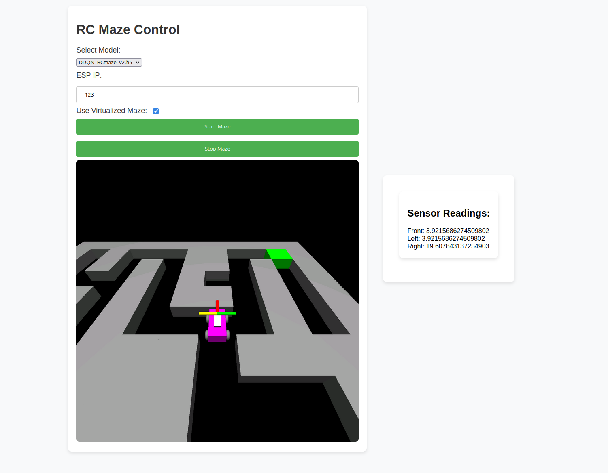

# Research Project

## Author Information

**Name:** Lucas Driessens  
**Institution:** HOWEST Kortrijk  
**Course:** Research Project  
**Date:** 2024-08-01

## Description

This project explores the feasibility of transferring a trained Reinforcement Learning (RL) agent from a virtual environment to the real world, focusing on navigating a maze with a remote-controlled (RC) car.

## Abstract

In this research project, I delve into the fascinating realm of artificial intelligence, specifically focusing on reinforcement learning (RL) and its application in real-world scenarios. The crux of our investigation revolves around the challenging question: "Is it possible to transfer a trained RL agent from a simulation to the real world?" This inquiry is particularly examined in the context of maze navigation.

Our research is partitioned into three pivotal sub-questions, which collectively aim to create a comprehensive understanding of the process. Firstly, I explore the various virtual environments available for training a virtual RF-car, seeking the most effective platform for our purposes. Secondly, I delve into identifying the most suitable reinforcement learning techniques for this specific application, considering factors like efficiency, adaptability, and real-world applicability. Lastly, the research seeks to bridge the gap between simulation and reality, investigating the practicality and challenges involved in this transition.

Through this study, I aspire to contribute significantly to the field of AI and robotics, offering insights and methodologies that could potentially advance the implementation of RL in real-world applications. The outcomes of this research could have far-reaching implications, not only in robotics but also in areas where simulation-based training is crucial.

### Main Research Question

> Is it possible to transfer a trained RL-agent from a simulation to the real world? (case: maze)

### Sub Research Questions

1. Which virtual environments exist to train a virtual RF-car?

2. Which reinforcement learning techniques can I best use in this application?

3. Can the simulation be transferred to the real world? Difference between how the car moves in the simulation and in the real world.

4. Does the simulation have any useful contributions? In terms of training time or performance?

5. How can I transfer my trained model to my physical RC car? (sim2real) How do I adjust the agent, environment and model to work in the real world?

6. How can Real-time learning be implemented?

7. Extra: How can I make the car drive through an unknown maze?

## Table of Contents

- [Research Project](#research-project)
  - [Author Information](#author-information)
  - [Description](#description)
  - [Abstract](#abstract)
    - [Main Research Question](#main-research-question)
    - [Sub Research Questions](#sub-research-questions)
  - [Table of Contents](#table-of-contents)
  - [Getting Started](#getting-started)
  - [Hardware Installation](#hardware-installation)
  - [Virtual Environment](#virtual-environment)
    - [RCMazeEnv](#rcmazeenv)
    - [Movement Capabilities](#movement-capabilities)
    - [Sensory Information](#sensory-information)
    - [Rewards and Penalties](#rewards-and-penalties)
    - [Reset](#reset)
    - [Visualization](#visualization)
    - [Virtual Environment for Training](#virtual-environment-for-training)
  - [Agent](#agent)
  - [Training](#training)
  - [Results](#results)
  - [Web app](#web-app)
    - [Flask](#flask)
  - [Sources and Inspiration](#sources-and-inspiration)

## Getting Started

To get started with this project, you'll need to set up your development environment and install the necessary dependencies. Please refer to the [manual.md](./manual.md) for detailed instructions on setting up and running the project.

## Hardware Installation

For instructions on how to set up the hardware, please refer to the [hardware_installation_guide.md](./hardware_installtion_guide.md).

## Virtual Environment

For this project I created my own class based on the openai GYM environment [openai gym](https://gymnasium.farama.org/)

### RCMazeEnv

the **RCMazeEnv** environment, specifically designed for simulating a robotic car navigating through a maze. The robotic car typically starts at a starting position, usually at the top-left corner of the maze, with the goal of finding the exit, often located at the bottom-right corner.

### Movement Capabilities

The robotic car can perform three different actions: moving forward, turning left, or turning right. The details of these movements can be found in the program code of the environment. These actions enable the car to navigate through the maze, taking into account the car's orientation (North, East, South, West).

### Sensory Information

The car is equipped with sensors that detect distances to walls on the front, left, and right sides. This sensor data is used to prevent collisions with the walls and to guide the car through the maze.

### Rewards and Penalties

- Every step the car takes results in a negative reward to encourage efficiency.
- Hitting a wall incurs a substantial negative reward.
- Revising a position incurs a negative reward.
- Reaching the exit yields a significant positive reward.
- The car also receives a reward based on its proximity to the exit, calculated using the negative Euclidean distance to the goal.

### Reset

- The `reset()` method can return the car to its starting position and reinitialize all variables.

### Visualization

- The `render()` method displays a visual representation of the maze, the car's position, the exit, and the sensor values. In this visualization, the car is marked with a specific symbol, as are the exit and sensor readings.

This environment provides a rich testing ground for developing algorithms in reinforcement learning, with an emphasis on spatial navigation and sensor-based decision-making. 🤖🧭🏁

<details>
<summary>RCMazeEnv.py</summary>

```python
class RCMazeEnv(gym.Env):
   def __init__(self, maze_size_x=12, maze_size_y=12, esp_ip='192.168.0.7', use_virtual_sensors=True):
      """
       Initialize the maze.

       @param maze_size_x - The size of the maze in x - direction
       @param maze_size_y - The size of the maze in y - direction
       @param esp_ip - The IP address of the ESP for motor control
      """
      self.maze_size_x = maze_size_x
      self.maze_size_y = maze_size_y
      self.maze = self.generate_maze()
      self.car_position = (1, 1)
      self.possible_actions = range(3)
      self.car_orientation = 'E'
      self.sensor_readings = {'front': 0, 'left': 0, 'right': 0}
      self.steps = 0
      self.previous_distance = 0
      self.goal = (10, 10)
      self.esp_ip = esp_ip
      self.previous_steps = 0
      self.visited_positions = set()
      self.opelgl_window = (1200,1200)
      self.use_virtual_sensors = use_virtual_sensors
      # self.reset()

   def generate_maze(self):
      """
       Generate maze. This is a function that will generate the maze


       @return A tuple containing the number of rows and the number of columns
      """
      layout = [
         [1, 1, 1, 1, 1, 1, 1, 1, 1, 1, 1, 1],
         [1, 0, 0, 0, 0, 0, 0, 0, 0, 0, 0, 1],
         [1, 0, 1, 1, 1, 1, 1, 1, 0, 1, 1, 1],
         [1, 0, 1, 0, 0, 0, 0, 0, 0, 0, 0, 1],
         [1, 0, 1, 0, 1, 1, 1, 1, 1, 1, 0, 1],
         [1, 0, 1, 0, 1, 1, 0, 0, 0, 0, 0, 1],
         [1, 0, 0, 0, 1, 1, 0, 1, 1, 1, 1, 1],
         [1, 0, 1, 0, 0, 0, 0, 1, 0, 1, 1, 1],
         [1, 0, 1, 1, 0, 1, 0, 0, 0, 0, 0, 1],
         [1, 0, 1, 0, 0, 1, 1, 1, 1, 1, 0, 1],
         [1, 0, 0, 0, 1, 1, 0, 0, 0, 0, 0, 1],
         [1, 1, 1, 1, 1, 1, 1, 1, 1, 1, 1, 1]]

      maze = np.array(layout)

      return maze

   async def reset(self):
      """
       Reset the state of the environment.


       @return the current state of the environment ==> ['1.0' '1.0' 'N' '1.0' '1.0' '10.0'] // car position, car direction and the sensor readings
      """
      self.car_position = (1, 1)
      self.car_orientation = 'E'
      await self.update_sensor_readings()
      self.steps = 0
      self.previous_distance = 0
      self.previous_steps = 0
      self.visited_positions.clear()
      self.visited_positions.add(self.car_position)
      return self.get_state()

   async def step(self, action):
      """
       Move car one step. This is a coroutine. It returns the state, reward and if the environment is done or not after this 'step' is done

       @param action - The action to take.

       @return Tuple of ( state reward done )
      """
      # Move the car to the right or forward
      if action == 0:
         # dont allow to move forward if the car is too close to a wall
         # Move forward or car if sensor readings of the front sensor is greater than 4
         if self.sensor_readings['front'] >= 4:
            self.move_forward()
            if self.use_virtual_sensors == False:
               self.move_car('forward')
      elif action == 1:
         self.turn_left()
         if self.use_virtual_sensors == False:
               self.move_car('left')
      elif action == 2:
         self.turn_right()
         if self.use_virtual_sensors == False:
               self.move_car('right')

      await self.update_sensor_readings()

      self.visited_positions.add(self.car_position)
      reward = self.compute_reward()
      self.steps += 1
      done = self.is_done()

      print('sensor readings: ', self.sensor_readings)
      return self.get_state(), reward, done

   def move_forward(self):
      """
       Move car forward in maze.
      """
      x, y = self.car_position
      # position of the car in the maze
      if self.car_orientation == 'N' and y > 0 and self.maze[y - 1][x] != 1:
         self.car_position = (x, y - 1)
      elif self.car_orientation == 'S' and y < self.maze_size_y - 1 and self.maze[y + 1][x] != 1:
         self.car_position = (x, y + 1)
      elif self.car_orientation == 'E' and x < self.maze_size_x - 1 and self.maze[y][x + 1] != 1:
         self.car_position = (x + 1, y)
      elif self.car_orientation == 'W' and x > 0 and self.maze[y][x - 1] != 1:
         self.car_position = (x - 1, y)

   def turn_left(self):
      """
       Turns the car to the left
      """
      orientations = ['N', 'W', 'S', 'E']
      idx = orientations.index(self.car_orientation)
      self.car_orientation = orientations[(idx + 1) % 4]

   def turn_right(self):
      """
       Turns the car to the right
      """
      orientations = ['N', 'E', 'S', 'W']
      idx = orientations.index(self.car_orientation)
      self.car_orientation = orientations[(idx + 1) % 4]

   def move_car(self, direction):
      """
       Make a call to the esp so it knows in which direction to move the motors

       @param direction - 'left'or'right'or'forward'
      """
      # Get the request to the ESP server.
      if direction == 'forward':
        esp_forward = f'http://{self.esp_ip}/forward'
        requests.get(esp_forward)
      elif direction == 'left':
        esp_left = f'http://{self.esp_ip}/left'
        requests.get(esp_left)
      elif direction == 'right':
        esp_right = f'http://{self.esp_ip}/right'
        requests.get(esp_right)

   async def update_sensor_readings(self):
      if self.use_virtual_sensors:
         await self.update_virtual_sensor_readings()
      else:
         await self.update_real_sensor_readings()

   ## for actual sensors
   async def update_real_sensor_readings(self):
        """
         Fetch sensor readings and update the sensor_readings
        """
        async with aiohttp.ClientSession() as session:
            tasks = [
                self.fetch_sensor_data(session, 'front'),
                self.fetch_sensor_data(session, 'left'),
                self.fetch_sensor_data(session, 'right')
            ]
            results = await asyncio.gather(*tasks)

            self.sensor_readings['front'], self.sensor_readings['left'], self.sensor_readings['right'] = results
                    # Update shared sensor data structure
            global sensor_data, sensor_data_lock
            with sensor_data_lock:
               sensor_data.update(self.sensor_readings)

   async def fetch_sensor_data(self, , direction):
      """
       Fetch sensor data from sensor. This is a function to be used in order to get sensor data from sensor

       @param direction - Direction of sensor ( front / back ).

       @return Float value of sensor data from the HC-SR04
      """
      time.sleep(0.1)
      try:
         sensor_front = DistanceSensor(echo=5, trigger=6)
         sensor_left = DistanceSensor(echo=17, trigger=27)
         sensor_right = DistanceSensor(echo=23, trigger=24)
      except:
         pass
      try:
         # distance between sensor and front direction
         if direction == "front":
               return float(sensor_front.distance * 100)
         elif direction == "left":
               return float(sensor_left.distance * 100)
         elif direction == "right":
               return float(sensor_right.distance * 100)
      except Exception as e:
         print(f"Error: {e}")
         return "Error reading sensor"


   async def update_virtual_sensor_readings(self):
      """
       Update the readings from the virtual sensors.
      """
      # Simple sensor implementation: counts steps to the nearest wall
      self.sensor_readings['front'] = self.distance_to_wall('front')
      self.sensor_readings['left'] = self.distance_to_wall('left')
      self.sensor_readings['right'] = self.distance_to_wall('right')

      global sensor_data, sensor_data_lock
      with sensor_data_lock:
         sensor_data.update(self.sensor_readings)

   def distance_to_wall(self, direction):
        """
         Returns the distance to the wall. It is based on the car orientation and the position of the car

         @param direction - 'front'or'right'or'front'

         @return The distance to the wall
        """
        x, y = self.car_position
        sensor_max_range = 255  # Maximum range of the ultrasonic sensor

        def calculate_distance(dx, dy):
            """
             Calculates the distance from the sensor. This is used to calculate the distance between the maze and the sensor

             @param dx - The distance in the x direction
             @param dy - The distance in the y direction ( 0 is top 1 is bottom )

             @return The distance between the sensor and the maze
            """
            distance = 0
            # This function is used to determine the distance between the sensor range and the sensor range.
            while 0 <= x + distance * dx < self.maze_size_x and \
                0 <= y + distance * dy < self.maze_size_y and \
                self.maze[y + distance * dy][x + distance * dx] != 1:
                distance += 1
                # This method is used to limit the sensor range.
                if distance > sensor_max_range:  # Limiting the sensor range
                    break
            return distance

        # Calculates the distance between the two directions.
        if direction == 'front':
            # Calculates the distance between the car_orientation and the orientation of the car.
            if self.car_orientation == 'N':
                distance = calculate_distance(0, -1)
            elif self.car_orientation == 'S':
                distance = calculate_distance(0, 1)
            elif self.car_orientation == 'E':
                distance = calculate_distance(1, 0)
            elif self.car_orientation == 'W':
                distance = calculate_distance(-1, 0)

        elif direction == 'left':
            # Calculates the distance between the car_orientation and the orientation of the car.
            if self.car_orientation == 'N':
                distance = calculate_distance(-1, 0)
            elif self.car_orientation == 'S':
                distance = calculate_distance(1, 0)
            elif self.car_orientation == 'E':
                distance = calculate_distance(0, -1)
            elif self.car_orientation == 'W':
                distance = calculate_distance(0, 1)

        elif direction == 'right':
            # Calculates the distance between the car_orientation and the orientation of the car.
            if self.car_orientation == 'N':
                distance = calculate_distance(1, 0)
            elif self.car_orientation == 'S':
                distance = calculate_distance(-1, 0)
            elif self.car_orientation == 'E':
                distance = calculate_distance(0, 1)
            elif self.car_orientation == 'W':
                distance = calculate_distance(0, -1)

        # Normalize the distance to a range of 0-1
        normalized_distance = distance / sensor_max_range
        normalized_distance = max(0, min(normalized_distance, 1))


        return normalized_distance * 1000

   def compute_reward(self):
        """
         Compute the reward based on the current state of the environment


         @return The reward to be added to the step function
        """
        # Initialize reward
        reward = 0

        # Check for collision or out of bounds
        # If the sensor is on the front left right or front side of the sensor is not on the board.
        if any(self.sensor_readings[direction] == 0 for direction in ['front', 'left', 'right']):
            reward -= 20

        # Check if goal is reached
        # The reward of the goal.
        if self.car_position == self.goal:
            reward += 500
            # Additional penalty if it takes too many steps to reach the goal
            # If the reward is less than 1000 steps then the reward is decremented by 200.
            if self.steps > 1000:
                reward -= 200
            return reward  # Return immediately as this is the terminal state

        # Calculate the Euclidean distance to the goal
        distance_to_goal = ((self.car_position[0] - self.goal[0]) ** 2 + (self.car_position[1] - self.goal[1]) ** 2) ** 0.5

        # Define a maximum reward when the car is at the goal
        max_reward_at_goal = 50

        # Reward based on proximity to the goal
        reward += max_reward_at_goal / (distance_to_goal + 1)  # Adding 1 to avoid division by zero

        # # Reward or penalize based on movement towards or away from the goal
        # Move the reward to the goal
        if distance_to_goal < self.previous_distance:
            reward += 50  # Positive reward for moving closer to the goal
        elif distance_to_goal > self.previous_distance:
            reward -= 25  # Negative reward for moving farther from the goal

        # Apply a penalty to revisit the same position
        if self.car_position in self.visited_positions:
            # Apply a penalty for revisiting the same position
            reward -= 10

        # Penalize for each step taken to encourage efficiency
        reward -= 2

        # Update the previous_distance for the next step
        self.previous_distance = distance_to_goal
        return reward

   def is_done(self):
      """
       Checks if the environment is done. It is done if it reaches the goal or takes more than 3000 steps or the car is out of bounds
      """
      #is done if it reaches the goal or goes out of bounds or takes more than 3000 steps
      return self.car_position == self.goal or self.steps > 3000 or self.car_position[0] < 0 or self.car_position[1] < 0 or self.car_position[0] > 11 or self.car_position[1] > 11

   def get_state(self):
      """
       Get the state of the car. This is a list of position sensor readings and orientation


       @return a combination of the car position, orientation, sensor readings in an array ['1.0' '1.0' 'N' '1.0' '1.0' '10.0'] // car position, car direction and the sensor readings
      """
      car_position = [float(coord) for coord in self.car_position]
      # self.update_sensor_readings()
      sensor_readings = [float(value) for value in self.sensor_readings.values()]

      state = car_position + [self.car_orientation] + sensor_readings

      # cast state to this ['1.0' '1.0' 'N' '1.0' '1.0' '10.0']
      state = np.array(state, dtype=str)

      #get the orientation and convert do label encoding
      # Set the state of the state to the next character in the state string.
      if state[2] == 'N':
         state[2] = 0
      elif state[2] == 'E':
         state[2] = 1
      elif state[2] == 'S':
         state[2] = 2
      elif state[2] == 'W':
         state[2] = 3

      state = np.array(state, dtype=float)

      return state

   async def run_maze_env(self, model='DDQN_RCmaze_v2.h5' ,replayCapacity=2000000):
      """
       Run RCMaze environment and return rewards.

       @param esp_ip - IP address of ESP to use //outdates use self.esp_ip
       @param replayCapacity - Size of replay memory
      """
      global maze_running, frame_queue


      # env = env
      state = await self.reset()

      self.init_opengl()
      self.run_opengl()

      REPLAY_MEMORY_CAPACITY = replayCapacity
      POSSIBLE_ACTIONS = self.possible_actions

      # create DQN agent
      test_agent = DQNAgent(replayCapacity=REPLAY_MEMORY_CAPACITY, input_shape=state.shape, output_shape=len(POSSIBLE_ACTIONS))

      test_agent.policy_model = load_model(f'./models/{model}')


      done = False
      rewards = []

      desired_fps = 2.0
      frame_duration = 1.0 / desired_fps

      last_time = time.time()
      done = False

      while maze_running:  # Use the maze_running flag to control the loop
         # This is a loop that is run in a loop.
         while not done:
            if not maze_running:
                print("Stopping maze environment...")
                break  # Exit the loop if maze_running is False

            current_time = time.time()
            elapsed = current_time - last_time
            # If the frame is full or full we can t wait for the frame to be processed.
            if elapsed >= frame_duration:

               glutMainLoopEvent()
               qValues = test_agent.policy_network_predict(np.array([state]))
               action = np.argmax(qValues[0])
               self.render()
               frame = self.capture_frame()
               try:
                  frame_queue.put_nowait(frame)  # Non-blocking put
               except queue.Full:
                  pass  # Skip if the queue is full

               state, reward, done = await self.step(action)
               rewards.append(reward)

               self.render()
               frame = self.capture_frame()
               try:
                  frame_queue.put_nowait(frame)  # Non-blocking put
               except queue.Full:
                  pass  # Skip if the queue is full

               last_time = current_time

               # prints the number of steps in the list
               if done:
                  print('done in ', len(rewards), 'steps')
                  maze_running = False
                  break

         print(sum(rewards))
         self.close_opengl()
      self.close_opengl()
      print("Maze environment stopped.")


   def init_opengl(self):
      """
       Initialize OpenGL and set up the RC Maze environment.
      """
      # Initialize OpenGL context
      glutInit()
      glutInitDisplayMode(GLUT_RGBA | GLUT_DOUBLE | GLUT_DEPTH)
      glutInitWindowSize(self.opelgl_window[0], self.opelgl_window[1])
      glutCreateWindow("RC Maze Environment")

      # Set up OpenGL environment
      glEnable(GL_DEPTH_TEST)
      glClearColor(0.0, 0.0, 0.0, 0.0)  # Clear to a grey color

      # Set up lighting (optional)
      glEnable(GL_LIGHTING)
      glEnable(GL_LIGHT0)
      glLightfv(GL_LIGHT0, GL_POSITION, [0, 10, 10, 1])
      glLightfv(GL_LIGHT0, GL_AMBIENT, [0.1, 0.1, 0.1, 1])
      glLightfv(GL_LIGHT0, GL_DIFFUSE, [1, 1, 1, 1])

      glColorMaterial(GL_FRONT_AND_BACK, GL_AMBIENT_AND_DIFFUSE)
      glEnable(GL_COLOR_MATERIAL)

      # Set up camera (you may want to make this adjustable)
      gluLookAt(self.maze_size_x / 2, self.maze_size_y / 2, 10,  # Camera position (above the center of the maze)
         self.maze_size_x / 2, self.maze_size_y / 2, 0,  # Look at point (center of the maze)
         0, 1, 0)  # Up vector

      glMatrixMode(GL_PROJECTION)
      glLoadIdentity()
      gluPerspective(90, 1, 0.1, 100)  # Adjust field of view angle, aspect ratio, near and far planes
      glMatrixMode(GL_MODELVIEW)
      glClear(GL_COLOR_BUFFER_BIT | GL_DEPTH_BUFFER_BIT)

      # Set the rendering function
      glutDisplayFunc(self.render)
      glutHideWindow()

   def run_opengl(self):
      """
       Run OpenGL.
      """
      # Set up the rendering context and callbacks
      # but do NOT call glutMainLoop()
      glutDisplayFunc(self.render)
      glutIdleFunc(self.render)  # Update rendering in idle time

   def third_person_view(self, CAMERA_DISTANCE=2.5,CAMERA_HEIGHT=1.5):
      """
       Returns the position of the third person view. It is possible to specify the distance and height of the camera

       @param CAMERA_DISTANCE - Distance from the camera to the car
       @param CAMERA_HEIGHT - Height of the camera above the car
      """
      camera_distance = CAMERA_DISTANCE # Distance from the camera to the car
      camera_height = CAMERA_HEIGHT  # Height of the camera above the car

      if self.car_orientation == 'N':  # Car is facing North
         camera_x = self.car_position[0]
         camera_y = (self.maze_size_y - self.car_position[1] - 1) - camera_distance  # Move camera to South
         camera_z = camera_height
      elif self.car_orientation == 'S':  # Car is facing South
         camera_x = self.car_position[0]
         camera_y = (self.maze_size_y - self.car_position[1] - 1) + camera_distance  # Move camera to North
         camera_z = camera_height
      elif self.car_orientation == 'E':  # Car is facing East
         camera_x = self.car_position[0] - camera_distance  # Move camera to West
         camera_y = self.maze_size_y - self.car_position[1] - 1
         camera_z = camera_height
      elif self.car_orientation == 'W':  # Car is facing West
         camera_x = self.car_position[0] + camera_distance  # Move camera to East
         camera_y = self.maze_size_y - self.car_position[1] - 1
         camera_z = camera_height

      # The point where the camera should be pointed: the car's position
      look_at_x = self.car_position[0]
      look_at_y = self.maze_size_y - self.car_position[1] - 1
      look_at_z = 1  # Assuming the car is at ground level (z=0)

      # Set up the camera
      glMatrixMode(GL_MODELVIEW)
      glLoadIdentity()
      gluLookAt(camera_x, camera_y, camera_z,  # Camera position (x, y, z)
               look_at_x, look_at_y, look_at_z,  # Look at position (x, y, z)
               0, 0, 2)  # Up vector (x, y, z), assuming Z is up

   def capture_frame(self):
      """
       Captures and returns the OpenGL frame. This is used to display the openGL window on the web app


       @return The PNG image of the current frame as a bytes
      """
      # Capture the OpenGL frame
      width, height = self.opelgl_window[0], self.opelgl_window[1]
      glPixelStorei(GL_PACK_ALIGNMENT, 1)
      data = glReadPixels(0, 0, width, height, GL_RGB, GL_UNSIGNED_BYTE)
      image = Image.frombytes("RGB", (width, height), data)
      image = image.transpose(Image.FLIP_TOP_BOTTOM)

      buffer = io.BytesIO()
      image.save(buffer, format="PNG")
      buffer.seek(0)

      return buffer.getvalue()

   def render(self):
      """
       Render the maze and the car's readings to the OpenGL
      """
      # Clear buffers
      glClear(GL_COLOR_BUFFER_BIT | GL_DEPTH_BUFFER_BIT)
      # set third person view over the car (you can commit this for a top down view)
      self.third_person_view( CAMERA_DISTANCE=2.5,CAMERA_HEIGHT=3.5 )

      # Render the maze
      # draws the cube at the maze_size_y maze_size_x
      for y in range(self.maze_size_y):
         # draw the cube at the given x y
         for x in range(self.maze_size_x):
            # draw the cube at x y
            if self.maze[y][x] == 1:
               self.draw_cube(x, y, color=(0.5, 0.5, 0.5))
            elif (x, y) == self.goal:
               #set color to green
               self.draw_cube(x, y, color=(0.0, 1.0, 0.0))

      # Render the car's sensor readings
      car_x, car_y = self.car_position
      #set sensor_color_directon with front being light blue, left being yellow and right being green
      sensor_colors = {'front': (0.0, 1.0, 1.0), 'left': (1.0, 1.0, 0.0), 'right': (0.0, 1.0, 0.0)}

      # Render the sensors
      # draws the sensor line for each sensor
      for sensor in ['front', 'left', 'right']:
         self.draw_sensor_line(car_x, car_y, self.sensor_readings[sensor],
                                 sensor_colors[sensor], sensor)

      # Draw the car
      car_x, car_y = self.car_position
      # self.draw_car(car_x, car_y, color=(1.0, 0.0, 1.0))
      self.draw_car(car_x, car_y, [1, 0, 1], [0.5, 0.5, 0.5], [0.25, 0.25, 0.25])  # pink body, grey wheels, dark grey window


      # Swap buffers
      glutSwapBuffers()

   def draw_cube(self, x, y, color):
      """
       Draw a cube at x y with the given color.

       @param x - x coordinate of the cube
       @param y - y coordinate of the cube ( 0 0 )
       @param color - color of the cube
      """
      # Set the color
      glColor3fv(color)
      # Draw a cube at position (x, y), flipping y coordinate
      glPushMatrix()
      glTranslate(x, self.maze_size_y - y - 1, 0)  # Adjust for vertical flipping
      glScalef(2, 2, 1)  # Adjust the size of your cube
      glutSolidCube(0.5)  # Adjust the size if needed
      glPopMatrix()

   def get_sensor_rotation_angle(self, sensor_orientation):
      """
       Get rotation angle based on sensor orientation and car orientation.

       @param sensor_orientation - Sensor orientation ( N S E W )

       @return Rotation angle ( degrees )
      """
      # print('direction: ', self.car_orientation)
      # Rotation logic based on car's orientation and sensor's relative position
      rotation_mapping = {
         'N': {'front': 90, 'left': 180, 'right': 0},
         'S': {'front': -90, 'left': 0, 'right': 180},
         'E': {'front': 0, 'left': 90, 'right': -90},
         'W': {'front': 180, 'left': -90, 'right': 90}
      }
      # Calculate total rotation angle
      return rotation_mapping[self.car_orientation][sensor_orientation]

   def draw_sensor_line(self, car_x, car_y, distance, color, sensor_orientation):
      """
       Draw a line on the maze that is acts like a sensor coming out of the car.

       @param car_x - x coordinate of the car's position
       @param car_y - y coordinate of the car's position
       @param distance - distance to the car from the walls
       @param color - color of the line
       @param sensor_orientation - orientation of the sensor ( left / right / front )
      """
      close_threshold = 4
      glColor3fv((1.0, 0.0, 0.0) if distance <= close_threshold else color)

      # Calculate rotation based on car's and sensor's orientation
      rotation_angle = self.get_sensor_rotation_angle(sensor_orientation)

      glPushMatrix()
      glTranslate(car_x, self.maze_size_y - car_y - 1, 0.5)  # Adjust for vertical flipping
      glRotatef(rotation_angle, 0, 0, 1)
      glRotatef(90, 0, 1, 0)

      # Draw sensor line
      # distance = min(distance, 0.5)  # Cap distance
      glutSolidCylinder(0.05, 0.5, 5, 5)

      glPopMatrix()

   def draw_car(self, x, y, body_color, wheel_color, window_color):
      """
      Draw a car with a given orientation and different colors for body, wheels, and window.

      @param x - x coordinate of the car
      @param y - y coordinate of the car
      @param body_color - color of the car's body
      @param wheel_color - color of the wheels
      @param window_color - color of the window
      """

      # Car orientation
      car_orientation = self.car_orientation

      # Calculate rotation based on car's orientation
      rotation_angle = self.get_sensor_rotation_angle('front')

      # Set the color for the car body and draw it with the correct orientation
      glColor3fv(body_color)
      glPushMatrix()
      glTranslate(x, self.maze_size_y - y - 1, 0)
      glRotatef(rotation_angle, 0, 0, 1)  # Rotate the car body
      glScalef(1.0, 0.5, 0.3)  # Car body size
      glutSolidCube(1)
      glPopMatrix()

      # wheel distance
      wheel_distance = 0.30

      # Draw the wheels in a different color
      glColor3fv(wheel_color)
      wheel_radius = 0.1
      wheel_width = 0.05
      wheel_positions = [
         (x - wheel_distance, y - wheel_distance),
         (x + wheel_distance, y - wheel_distance),
         (x - wheel_distance, y + wheel_distance),
         (x + wheel_distance, y + wheel_distance)
      ]
      for wheel_x, wheel_y in wheel_positions:
         glPushMatrix()
         glTranslate(wheel_x, self.maze_size_y - wheel_y - 1, -0.1)
         glRotatef(rotation_angle, 0, 0, 1)  # Rotate the wheel with the car
         glRotatef(90, 1, 0, 0)  # Orient the wheel correctly
         glutSolidTorus(wheel_width, wheel_radius, 10, 10)
         glPopMatrix()

      # Add a smaller rectangle on top as a window, in a different color
      glColor3fv(window_color)
      glPushMatrix()
      glTranslate(x, self.maze_size_y - y - 1, 0.15)  # Adjust for the height of the window
      glRotatef(rotation_angle, 0, 0, 1)  # Rotate the window with the car
      glScalef(0.4, 0.2, 0.1)  # Window size
      glutSolidCube(1)
      glPopMatrix()

   def close_opengl(self):
      """
       Close the OpenGL context and clean up the GLUT window.
      """
      # Close the OpenGL context
      glutLeaveMainLoop()

```

</details>

### Virtual Environment for Training

For training I mostly used the same environment, except for 1 key difference, The rendering method.
To allow for faster training I have the render_mode option, with 'human' being the default which is a 2D pygame rendering (which is way less resource intensive than the openGL method) or an even faster array rendering method which just prints the maze and car position to the console.

```python
    def init_pygame(self):
        # Initialize Pygame and set up the display
        pygame.init()
        self.cell_size = 40  # Size of each cell in pixels
        self.maze_size_x = 12  # Assuming the maze size_x is 12
        self.maze_size_y = 12  # Assuming the maze size_y is 12
        self.width = 600
        self.height = 600
        self.screen = pygame.display.set_mode((self.width, self.height))
        self.clock = pygame.time.Clock()

    def render(self,render_mode='human', framerate=60, delay=0):
        if render_mode == 'human':
            # Render the environment using Pygame
            for y in range(self.maze_size_y):
                for x in range(self.maze_size_x):
                    rect = pygame.Rect(x * self.cell_size, y * self.cell_size, self.cell_size, self.cell_size)
                    if (x, y) == self.goal:  # Goal position
                        color = (0, 255, 0)  # Green color for the goal
                    elif self.maze[y][x] == 0:
                        color = (255, 255, 255)  # White color for empty space
                    else:
                        color = (0, 0, 0)  # Black color for walls
                    pygame.draw.rect(self.screen, color, rect)

            # Draw the car
            car_x, car_y = self.car_position
            car_rect = pygame.Rect(car_x * self.cell_size, car_y * self.cell_size, self.cell_size, self.cell_size)
            pygame.draw.rect(self.screen, (255, 0, 0), car_rect)  # Red color for the car
            pygame.time.delay(delay)
            pygame.display.flip()
            self.clock.tick(framerate)  # Limit the frame rate to 60 FPS
        else:
            rendered_maze = np.array(self.maze, dtype=str)
            x, y = self.car_position
            rendered_maze[y][x] = 'C'  # Representing the car
            #print array
            print(rendered_maze, '\n')


    def close_pygame(self):
        # Close the Pygame window
        pygame.quit()
```

## Agent

In this challenging environment of RCMazeEnv, the key to success lies in the adept utilization of a sophisticated agent. To navigate the complexities of the maze and achieve the goal efficiently, I've employed an advanced algorithm known as the Double Deep Q-Network (Double DQN). This cutting-edge approach builds upon the foundations of traditional reinforcement learning methods, enhancing decision-making capabilities through a dual-network structure.

The core principle behind the Double DQN agent is to disentangle the action selection from the policy evaluation. This is achieved by integrating two distinct but interrelated neural networks: the policy network and the target network. The policy network is responsible for selecting the best possible action given the current state, while the target network provides a stable baseline to evaluate the future state. This dual network structure significantly reduces the overestimation of Q-values, a common pitfall in traditional DQN methods, leading to more reliable and effective learning outcomes.

The agent's architecture is meticulously designed to process and interpret the intricate sensor data from the maze environment, translating it into intelligent movement decisions. It continually learns and adapts through interaction with the environment, storing experiences in a replay memory for effective learning and optimization.

<details>
<summary>Double DQN</summary>

```python
class DQNAgent:
   def __init__(self, replayCapacity, input_shape, output_shape, learning_rate=0.001, discount_factor=0.90):
      """
       Initialize the policy and target network.

       @param replayCapacity - The capacity of the replay network
       @param input_shape - The shape of the input to the policy
       @param output_shape - The shape of the output to the policy
       @param learning_rate - The learning rate to be used for learning
       @param discount_factor - The discount factor to be
      """
      self.capacity = replayCapacity
      self.memory = collections.deque(maxlen=self.capacity)
      self.learning_rate = learning_rate
      self.discount_factor = discount_factor
      self.input_shape = input_shape
      self.output_shape = output_shape
      self.policy_model = self.buildNetwork()
      self.target_model = self.buildNetwork()
      self.target_model.set_weights(self.policy_model.get_weights())


   def addToReplayMemory(self, step):
      """
       Add a step to the replay memory. This is used to track the progress of the step that was replayed.

       @param step - The step to add to the replay memory. Note that it is up to the caller to make sure this is indeed the last step
      """
      self.step = step
      self.memory.append(self.step)

   def sampleFromReplayMemory(self, batchSize):
      """
       Sample from replay memory. This is a re - implementation of L { sampleFromReplayMemory } to avoid having to do a lot of random sampling in the case of large batches.

       @param batchSize - The number of items to sample from the replay memory.

       @return A batch of items from the replay memory that has been filled
      """
      self.batchSize = batchSize
      # Sample a random number of samples from the memory.
      if self.batchSize > len(self.memory):
         self.populated = False
         return self.populated
      else:
         return random.sample(self.memory, self.batchSize)

   def buildNetwork(self):
      """
       Builds and compiles the neural network. This is a helper to allow subclasses to override the build method in order to add more features such as learning rate and loss.


       @return A Sequential object that can be used to train the
      """
      model = Sequential()
      model.add(Dense(32, input_shape=self.input_shape, activation='relu'))
      model.add(Dense(64, activation='relu'))
      model.add(Dense(32, activation='relu'))
      model.add(Dense(self.output_shape, activation='linear'))
      model.compile(loss='mse', optimizer=Adam(learning_rate=self.learning_rate), metrics=['MeanSquaredError'])
      return model

   def policy_network_fit(self, batch, batch_size):
      """
       Fit the policy network to the batch. Predict Q - values for starting state using the policy network Select the best action for the next state using the target network Update Q - values for actions taken

       @param batch - List of ( states actions rewards next_states dones )
       @param batch_size - Size of the batch to be used
      """
      states, actions, rewards, next_states, dones = zip(*batch)
      states = np.array(states)
      next_states = np.array(next_states)
      # Predict Q-values for starting state using the policy network
      q_values = self.policy_model.predict(states)
      # Predict Q-values for next state using the policy network
      q_values_next_state_policy = self.policy_model.predict(next_states)
      # Select the best action for the next state using the policy network
      best_actions = np.argmax(q_values_next_state_policy, axis=1)
      # Predict Q-values for next state using the target network
      q_values_next_state_target = self.target_model.predict(next_states)
      # Update Q-values for actions taken
      # Update the q_values and actions for each batch.
      for i in range(batch_size):
         # Update the q_values for the i th dones.
         if dones[i]:
            q_values[i, actions[i]] = rewards[i]
         else:
            # Double DQN update rule
            q_values[i, actions[i]] = rewards[i] + self.discount_factor * q_values_next_state_target[i, best_actions[i]]
      # Train the policy network
      self.policy_model.fit(states, q_values, batch_size=batch_size, verbose=0)

   def policy_network_predict(self, state):
      """
       Predict Q - Policy for a given state. This is a wrapper around policy_model. predict

       @param state - A dictionary of state to predict Q - Policy for

       @return A numpy array of shape ( N_samples N
      """
      self.state = state
      self.qPolicy = self.policy_model.predict(self.state)
      return self.qPolicy

   def target_network_predict(self, state):
      """
       Predict the target for a given state using the target network. This is a low - level method and should not be called directly.

       @param state - A dictionary containing the state to predict. Must be an instance of : py : class : ` qutip. states. ChainState `

       @return A
      """
      self.state = state
      self.qTarget = self.target_model.predict(self.state)
      return self.qTarget

   def update_target_network(self):
      """
       Update the target network based on the policy model. This is called when the policy is changed
      """
      self.target_model.set_weights(self.policy_model.get_weights())
```

</details>

## Training

To say the way I trained the models and the results, you can look at the juptyer notebook [here](./ResearchProject_v2.ipynb)

## Results

The results of the training:


## Web app

> Please not that you should have gone through the [manual](./manual.md) before trying to run the web app yourself.

The web app I created to be able to have a virtual twin of the rc-car and the maze environment. The web app is built using the Flask framework and should be ran on your Raspberry Pi, then you can see the web app by going to the IP address of your Raspberry Pi on port 5000.

On the web app you can opt to run the simulation, which will not be using real sensors and not move the actual rc-car (this is used for demo purposes) or you can run the simulation with the real sensors and the real rc-car (If you have actually built the rc-car and the maze to scale).



### Flask

I used flask to run the web app on the Raspberry Pi, the web app is built using the Flask framework and should be ran on your Raspberry Pi, then you can see the web app by going to the IP address of your Raspberry Pi on port 5000.

Here are the routes that are available on the web app:

```python
@app.route('/frame')
def frame():
    """
     Get a frame from the queue and return it as a PNG. This is a blocking call so it will block until something is available to be returned.

     @return Response object with status 200 or 503 if queue is full
    """

@app.route("/get_sensor_readings")
def get_sensor_readings():
   """
    Get a copy of the sensor data and return it as a JSON object.


    @return A JSON object containing the readings of the sensor
   """

@app.route("/get-models")
def get_models():
   """
    Get the models that are available to be used.


    @return A JSON object containing the models that are available to be used
   """

@app.route('/start-maze/<use_virtual>/<esp_ip>/<model>')
def start_maze(use_virtual,esp_ip,model):
   """
    Starts maze if it is not already running. This is a blocking call

    @param use_virtual - choose if you want to run the simulation or the real rc car // true for virtual and false for real
    @param esp_ip - ESP IP to use for the maze
    @param model - The model to use for the maze

    @return String describing success or failure of the maze startup
   """

@app.route('/close-maze')
def close_maze():
    """
    Stops the maze if it is running.

    @return String describing success or failure of the maze closure
    """

@app.route('/')
def index():
   """
    The index page of the web application. This is used to display the home page of the web application.


    @return The template that renders the index page of the web application
   """

@app.route('/video')
def video():
   """
    Generate and stream a video. This is a wrapper around : func : ` generate_frames ` that creates a thread to stream the video.


    @return A : class : ` twisted. web. server. Response ` object
   """
```

## Sources and Inspiration

[1] “2WD miniQ Robot Chassis.” Accessed: Jan. 08, 2024. [Online]. Available: <https://www.dfrobot.com/product-367.html>

[2] W. Zhao, J. P. Queralta, and T. Westerlund, “Sim-to-Real Transfer in Deep Reinforcement Learning for Robotics: a Survey,” in _2020 IEEE Symposium Series on Computational Intelligence (SSCI)_, Dec. 2020, pp. 737–744. doi: 10.1109/SSCI47803.2020.9308468.

[3] _Self Driving and Drifting RC Car using Reinforcement Learning_, (Aug. 19, 2019). Accessed: Jan. 08, 2024. [Online Video]. Available: <https://www.youtube.com/watch?v=U0-Jswwf0hw>

[4] _Reinforcement Learning with Multi-Fidelity Simulators -- RC Car_, (Dec. 30, 2014). Accessed: Jan. 08, 2024. [Online Video]. Available: <https://www.youtube.com/watch?v=c\_d0Is3bxXA>

[5] S. Tjiharjadi, M. Wijaya, and E. Setiawan, “Optimization Maze Robot Using A\* and Flood Fill Algorithm,” _International Journal of Mechanical Engineering and Robotics Research_, vol. 6, pp. 366–372, Sep. 2017, doi: 10.18178/ijmerr.6.5.366-372.

[6] “Open Labyrinth mission. python coding challenges - Py.CheckiO,” Py.CheckiO - games for coders. Accessed: Jan. 08, 2024. [Online]. Available: <https://py.checkio.org/en/mission/open-labyrinth/share/574bd1ded68c9705c5d6f07c6206be12/>

[7] Thingiverse.com, “Multi-purpose 2wd robot chassis by Mayur7600.” Accessed: Jan. 08, 2024. [Online]. Available: <https://www.thingiverse.com/thing:2544002>

[8] M. A. Dharmasiri, “Micromouse from scratch| Algorithm- Maze traversal|Shortest path|Floodfill,” Medium. Accessed: Jan. 08, 2024. [Online]. Available: <https://medium.com/@minikiraniamayadharmasiri/micromouse-from-scratch-algorithm-maze-traversal-shortest-path-floodfill-741242e8510>

[9] Thingiverse.com, “Holder for a HC SR04 Case by Legieps.” Accessed: Jan. 08, 2024. [Online]. Available: <https://www.thingiverse.com/thing:3436448>

[10] D. Backhouse, J. Gourlay, B. Guta, K. Huang, and K. Ng, “Gym2Real: An Open-Source Platform for Sim2Real Transfer”.

[11] FinFET, “FinFetChannel/RayCastingPythonMaze.” Nov. 15, 2023. Accessed: Jan. 08, 2024. [Online]. Available: <https://github.com/FinFetChannel/RayCastingPythonMaze>

[12] D. Li, “DailyL/Sim2Real_autonomous_vehicle.” Nov. 14, 2023. Accessed: Jan. 08, 2024. [Online]. Available: <https://github.com/DailyL/Sim2Real\_autonomous\_vehicle>

[13] J. Fu, A. Kumar, O. Nachum, G. Tucker, and S. Levine, “D4RL: Datasets for Deep Data-Driven Reinforcement Learning.” arXiv, Feb. 05, 2021. Accessed: Jan. 08, 2024. [Online]. Available: <http://arxiv.org/abs/2004.07219>

[14] “Case for Raspberry PI 3 / 4 with a PiSugar 2 PRO or PiSugar 3 by tommycederlund | Download free STL model | Printables.com.” Accessed: Jan. 08, 2024. [Online]. Available: <https://www.printables.com/en/model/296484-case-for-raspberry-pi-3-4-with-a-pisugar-2-pro-or->
