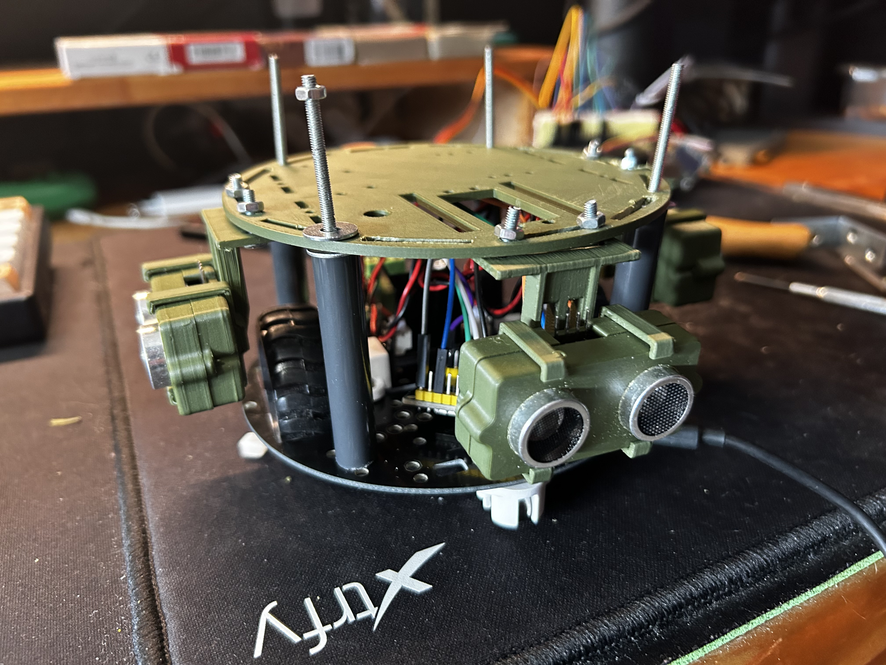

- **Title:** "Exploring the Feasibility of Sim2Real Transfer in Reinforcement Learning"
- **Author:** Lucas Driessens
- **Date:** June 1, 2024 (expected completion date)
- **Institution:** Howest (Bachelor Multimedia & Communication Technology)

---
> Want to read more? : go look at the [thesis.pdf](https://github.com/driessenslucas/researchproject/blob/main/thesis.pdf)

# Exploring the Feasibility of Sim2Real Transfer in Reinforcement Learning

This repository contains the research and implementation files for the bachelor thesis by Lucas Driessens, presented at Howest, focused on sim-to-real transfer in reinforcement learning, particularly navigating a maze using a remote-controlled (RC) car.


https://github.com/driessenslucas/researchproject/assets/91117911/972541d6-5010-4f73-a56f-5b60bb8b4f3e




## Project Overview

This thesis investigates the transition of reinforcement learning algorithms from simulated environments to real-world applications. The core of this research revolves around the practical deployment of a Double Deep Q-Network (DDQN) for controlling an RC car in a physical maze setting, highlighting both the potential and challenges of such technological transfers.

### Objectives

- Validate the practical application of simulated RL algorithms in real-world scenarios.
- Assess the efficacy of DDQN in real-world maze navigation.
- Explore the interplay between theoretical concepts and their real-world implementations.

## Key Insights

- **Sim-to-Real Transition Challenges:** Detailed exploration of adjustments needed to translate simulation training into real-world effectiveness.
- **Algorithmic Efficacy:** Analysis on the performance of DDQN in navigating complex real-world environments.
- **Practical Implementation Considerations:** Discussion on overcoming real-world implementation challenges, including sensor integration and environmental variability.

## Contributions

This project welcomes academic collaborations and further research enhancements. Contributions that improve the algorithms, extend the simulations, or refine the real-world testing components are highly encouraged.

## Citation

Please cite this thesis if it assists or influences your research:
```
Lucas Driessens, "Exploring the Feasibility of Sim2Real Transfer in Reinforcement Learning", Bachelor Thesis, Howest, June 2024.
```

## License

This project is released under the MIT License - see the [LICENSE.md](LICENSE) file for details.

## Contact

For inquiries or further information, please contact:
```
Lucas Driessens - lucas.driessens@hotmail.com
```

## Acknowledgments

- Special thanks to guest speakers and faculty advisors who provided invaluable insights and guidance throughout this research journey.
- Gratitude towards Howest for the support and resources provided during this academic pursuit.
