<!-- pandoc thesis_new.md --o thesis_new.pdf -H deeplist.tex -f markdown-implicit_figures  --template template.tex --lua-filter pagebreak.lua -->
<!-- pandoc --from markdown --to html5 --standalone --toc --number-sections --citeproc --wrap=preserve --highlight-style=kate --mathml -->


\pagebreak

## Glossary of Terms

1. **Artificial Intelligence (AI)**: The simulation of human intelligence processes by machines, especially computer systems, enabling them to perform tasks that typically require human intelligence.

2. **Double Deep Q-Network (DDQN)**: An enhancement of the Deep Q-Network (DQN) algorithm that addresses the overestimation of action values, thus improving learning stability and performance.

3. **Epsilon Decay**: A technique in reinforcement learning that gradually decreases the rate of exploration over time, allowing the agent to transition from exploring the environment to exploiting known actions for better outcomes.

4. **Mean Squared Error (MSE)**: A loss function used in regression models to measure the average squared difference between the estimated values and the actual value, useful for training models by minimizing error.

5. **Motion Processing Unit (MPU6050)**: A sensor device combining a MEMS (Micro-Electro-Mechanical Systems) gyroscope and a MEMS accelerometer, providing comprehensive motion processing capabilities.

6. **Policy Network**: In reinforcement learning, a neural network model that directly maps observed environment states to actions, guiding the agent's decisions based on the current policy.

7. **Raspberry Pi (RPI)**: A small, affordable computer used for various programming projects, including robotics and educational applications.

8. **RC Car**: A remote-controlled car used as a practical application platform in reinforcement learning experiments, demonstrating how algorithms can control real-world vehicles.

9. **Reinforcement Learning (RL)**: A subset of machine learning where an agent learns to make decisions by taking actions within an environment to achieve specified goals, guided by a system of rewards and penalties.

10. **Sim2Real Transfer**: The practice of applying models and strategies developed within a simulated environment to real-world situations, crucial for bridging the gap between theoretical research and practical application.

11. **Target Network**: Utilized in the DDQN framework, a neural network that helps stabilize training by providing consistent targets for the duration of the update interval.

12. **Virtual Environment**: A simulated setting designed for training reinforcement learning agents, offering a controlled, risk-free platform for experimentation and learning.

13. **Wheel Slippage**: A phenomenon where the wheels of a vehicle lose traction, causing them to spin without propelling the vehicle forward, often encountered in real-world scenarios with uneven terrain.

14. **Ultrasonic Distance Sensor (HC-SR04)**: A sensor that uses ultrasonic waves to measure distance, commonly employed in robotics for obstacle detection and navigation.

15. **Over the air updates (OTA)**: A method of remotely updating software or firmware on devices, allowing for seamless upgrades and maintenance without physical access to the device.

\pagebreak

## List of Abbreviations

1. **AI** - Artificial Intelligence
2. **DDQN** - Double Deep Q-Network
3. **DQN** - Deep Q-Network
4. **ESP32** - Espressif Systems 32-bit Microcontroller
5. **HC-SR04** - Ultrasonic Distance Sensor
6. **MSE** - Mean Squared Error
7. **MPU6050** - Motion Processing Unit (Gyroscope + Accelerometer)
8. **PPO** - Proximal Policy Optimization
9. **RC** - Remote Controlled
10. **RPI** - Raspberry Pi
11. **RL** - Reinforcement Learning
12. **RCMazeEnv** - RC Maze Environment (Custom Virtual Environment for RL Training)
13. **Sim2Real** - Simulation to Reality Transfer
14. **OTA** Over the air updates

<!-- ## Table of contents

- [Glossary of Terms](#glossary-of-terms)
- [List of Abbreviations](#list-of-abbreviations)
- [Table of contents](#table-of-contents)
- [Introduction](#introduction)
  - [Navigating the Maze: Sim-to-Real Transfer in Reinforcement Learning](#navigating-the-maze-sim-to-real-transfer-in-reinforcement-learning)
  - [Sim-to-Real Transfer: Bridging the Gap](#sim-to-real-transfer-bridging-the-gap)
  - [The Maze Navigation Challenge: RC Cars and Algorithms](#the-maze-navigation-challenge-rc-cars-and-algorithms)
  - [The Expedition: Four Key Steps](#the-expedition-four-key-steps)
  - [Beyond Mazes: A Broader Canvas](#beyond-mazes-a-broader-canvas)
  - [Background on Reinforcement Learning](#background-on-reinforcement-learning)
- [Research Questions](#research-questions)
  - [Main Research Question](#main-research-question)
  - [Sub Research Questions](#sub-research-questions)
- [Methodology](#methodology)
  - [Environment Setup (RCMazeEnv)](#environment-setup-rcmazeenv)
  - [Agent Design (DDQNAgent)](#agent-design-ddqnagent)
  - [Training Process](#training-process)
  - [Reward Function Components](#reward-function-components)
    - [Collision Penalty $R\_{\\text{collision}}$](#collision-penalty-r_textcollision)
    - [Goal Achievement Bonus $R\_{\\text{goal}}$](#goal-achievement-bonus-r_textgoal)
    - [Proximity Reward $R\_{\\text{proximity}}$](#proximity-reward-r_textproximity)
    - [Progress Reward $R\_{\\text{progress}}$](#progress-reward-r_textprogress)
    - [Exploration Penalty $R\_{\\text{revisit}}$](#exploration-penalty-r_textrevisit)
    - [Efficiency Penalty $R\_{\\text{efficiency}}$](#efficiency-penalty-r_textefficiency)
    - [Generic Reward based on relative distance to goal](#generic-reward-based-on-relative-distance-to-goal)
  - [Scope of Real-World Testing](#scope-of-real-world-testing)
- [Experimental Outcomes and Implementation Details](#experimental-outcomes-and-implementation-details)
  - [Virtual Environment and Agent Design](#virtual-environment-and-agent-design)
  - [Implementation Highlights](#implementation-highlights)
  - [Evaluation and Metrics](#evaluation-and-metrics)
  - [Unique Features](#unique-features)
- [Analysis and Results: Addressing the Research Questions](#analysis-and-results-addressing-the-research-questions)
  - [1. Virtual Environments for RF-Car Training](#1-virtual-environments-for-rf-car-training)
  - [2. Reinforcement Learning Techniques for Virtual RF-Car Training](#2-reinforcement-learning-techniques-for-virtual-rf-car-training)
  - [3. Sim-to-Real Transfer Challenges and Solutions](#3-sim-to-real-transfer-challenges-and-solutions)
  - [4. Contributions of Simulation in RF-Car Training](#4-contributions-of-simulation-in-rf-car-training)
  - [5. Practical Application of Simulated Training to Real-World RF-Cars](#5-practical-application-of-simulated-training-to-real-world-rf-cars)
- [Model Architecture and Training Insights](#model-architecture-and-training-insights)
  - [Training Parameters](#training-parameters)
  - [Training Procedure](#training-procedure)
- [Visual Insights and Further Exploration](#visual-insights-and-further-exploration)
  - [Evaluation Metrics Overview](#evaluation-metrics-overview)
    - [Simulation Metrics](#simulation-metrics)
      - [Episodic Performance](#episodic-performance)
      - [Step Efficiency](#step-efficiency)
      - [MSE Loss Measurement](#mse-loss-measurement)
      - [Reward Trend Analysis](#reward-trend-analysis)
      - [Epsilon Decay Tracking](#epsilon-decay-tracking)
    - [Real-World Metrics](#real-world-metrics)
- [Results of RL Techniques and Simulations](#results-of-rl-techniques-and-simulations)
  - [Reinforcement Learning Techniques Overview](#reinforcement-learning-techniques-overview)
  - [Deep Q-Network (DQN)](#deep-q-network-dqn)
  - [Double Deep Q-Network (DDQN)](#double-deep-q-network-ddqn)
  - [Proximal Policy Optimization (PPO)](#proximal-policy-optimization-ppo)
- [Experimental Results and Analysis](#experimental-results-and-analysis)
  - [Visit Heatmap for DDQN](#visit-heatmap-for-ddqn)
  - [Reward History for DDQN](#reward-history-for-ddqn)
  - [Reward Distribution for DDQN](#reward-distribution-for-ddqn)
  - [Maze Solution for DDQN](#maze-solution-for-ddqn)
  - [Average Steps per Episode with Moving Average for DDQN](#average-steps-per-episode-with-moving-average-for-ddqn)
  - [Epsilon History for DDQN](#epsilon-history-for-ddqn)
  - [Mean Squared Error over Time (Sampled) for DDQN](#mean-squared-error-over-time-sampled-for-ddqn)
- [Implementation of Real-World Control Algorithms](#implementation-of-real-world-control-algorithms)
  - [Introduction to Real-World Implementation](#introduction-to-real-world-implementation)
  - [System Overview](#system-overview)
  - [Code Architecture and Integration](#code-architecture-and-integration)
- [Real-World Application and Limitations](#real-world-application-and-limitations)
  - [Introduction to Sensor and Movement Discrepancies](#introduction-to-sensor-and-movement-discrepancies)
  - [Real-World Application](#real-world-application)
    - [Enhanced Sensor-Based Navigation](#enhanced-sensor-based-navigation)
    - [Informing Autonomous Vehicle Movement](#informing-autonomous-vehicle-movement)
  - [Limitations](#limitations)
    - [Discrepancies in Sensor Data Interpretation](#discrepancies-in-sensor-data-interpretation)
    - [Challenges in Movement Replication](#challenges-in-movement-replication)
    - [Practical Implementation Considerations](#practical-implementation-considerations)
  - [Conclusion for Real-World Application](#conclusion-for-real-world-application)
- [Challenges and Solutions in RL Implementation](#challenges-and-solutions-in-rl-implementation)
  - [Challenge 1: Selection of an Appropriate Virtual Environment](#challenge-1-selection-of-an-appropriate-virtual-environment)
  - [Challenge 2: Choosing the Optimal Reinforcement Learning Technique](#challenge-2-choosing-the-optimal-reinforcement-learning-technique)
  - [Challenge 3: Sim2Real Transfer - Addressing Movement Discrepancies](#challenge-3-sim2real-transfer---addressing-movement-discrepancies)
  - [Challenge 4: alignment Issue and Motor Encoder Implementation](#challenge-4-alignment-issue-and-motor-encoder-implementation)
  - [Challenge 5: Ensuring Consistent and Effective Training](#challenge-5-ensuring-consistent-and-effective-training)
  - [Challenge 6: Accurate Sensor Data Normalization for Sim2Real Transfer](#challenge-6-accurate-sensor-data-normalization-for-sim2real-transfer)
  - [Challenge 7: Integration of Failsafe Mechanisms](#challenge-7-integration-of-failsafe-mechanisms)
  - [Challenge 8: Training Environment and Technique Efficacy](#challenge-8-training-environment-and-technique-efficacy)
  - [Viewing Practical Experiments](#viewing-practical-experiments)
  - [Conclusion for Challenges and Solutions](#conclusion-for-challenges-and-solutions)
- [Sources of Inspiration and Conceptual Framework](#sources-of-inspiration-and-conceptual-framework)
  - [Micro mouse Competitions and Reinforcement Learning](#micro-mouse-competitions-and-reinforcement-learning)
  - [Influential YouTube Demonstrations and GitHub Insights](#influential-youtube-demonstrations-and-github-insights)
  - [Technical Exploration and Academic Foundation](#technical-exploration-and-academic-foundation)
  - [Synthesis and Research Direction](#synthesis-and-research-direction)
- [Integration of Practical Experiments](#integration-of-practical-experiments)
  - [Addressing Alignment and Orientation Challenges](#addressing-alignment-and-orientation-challenges)
  - [Enhancing Movement Precision with Encoders](#enhancing-movement-precision-with-encoders)
  - [Real-World Application Tests](#real-world-application-tests)
- [Reflections on the Research Project](#reflections-on-the-research-project)
  - [Lessons Learned and the Path Ahead](#lessons-learned-and-the-path-ahead)
  - [The Value of Openness](#the-value-of-openness)
  - [Bridging Theory and Practice](#bridging-theory-and-practice)
  - [Anticipatory Thinking: Navigating Barriers](#anticipatory-thinking-navigating-barriers)
  - [Policy and Regulation: A Symbiotic Dance](#policy-and-regulation-a-symbiotic-dance)
  - [Societal Impact: Echoes in Time](#societal-impact-echoes-in-time)
  - [The Forward Path: A Research Ethos](#the-forward-path-a-research-ethos)
- [Self-Reflection on the Research Project](#self-reflection-on-the-research-project)
  - [Proposed Success Criteria: A North Star](#proposed-success-criteria-a-north-star)
  - [Achieved Success Criteria: The Joy of Control](#achieved-success-criteria-the-joy-of-control)
  - [Unachieved Success Criteria: The Elusive Consistency](#unachieved-success-criteria-the-elusive-consistency)
  - [Smooth Sailing and Hidden Currents](#smooth-sailing-and-hidden-currents)
  - [The Murmurs of Complexity](#the-murmurs-of-complexity)
  - [Jury Feedback: Winds of Wisdom](#jury-feedback-winds-of-wisdom)
  - [The Ethical Compass: Navigating Humanity](#the-ethical-compass-navigating-humanity)
  - [The Ripple Effect: Echoes in Time](#the-ripple-effect-echoes-in-time)
  - [The Next Voyage: Beyond the Horizo](#the-next-voyage-beyond-the-horizo)
- [Advice](#advice)
  - [Practical Utilization of Simulations](#practical-utilization-of-simulations)
  - [Strategies for Effective Transition from Simulation to Reality](#strategies-for-effective-transition-from-simulation-to-reality)
  - [Overcoming Common Challenges in Simulation-to-Reality Transitions](#overcoming-common-challenges-in-simulation-to-reality-transitions)
  - [Insights from My Research](#insights-from-my-research)
  - [Methodological Advice](#methodological-advice)
  - [Practical Experiment Integration](#practical-experiment-integration)
  - [Guidelines for Future Research](#guidelines-for-future-research)
    - [Introduction for Future Research](#introduction-for-future-research)
    - [Step-by-Step Plan](#step-by-step-plan)
      - [step 1: Selection of Simulation Environments](#step-1-selection-of-simulation-environments)
      - [step 2: Managing Expectations and Adaptability](#step-2-managing-expectations-and-adaptability)
      - [Step 3: Methodology Flexibility](#step-3-methodology-flexibility)
- [General Conclusion](#general-conclusion)
- [Guest Speakers](#guest-speakers)
  - [Innovations and Best Practices in AI Projects by Jeroen Boeye at Faktion](#innovations-and-best-practices-in-ai-projects-by-jeroen-boeye-at-faktion)
  - [Pioneering AI Solutions at Noest by Toon Vanhoutte](#pioneering-ai-solutions-at-noest-by-toon-vanhoutte)
- [Installation Steps](#installation-steps)
  - [Prerequisites](#prerequisites)
  - [Repository Setup](#repository-setup)
  - [Hardware Setup and Assembly](#hardware-setup-and-assembly)
    - [Introduction to Hardware Components](#introduction-to-hardware-components)
    - [Components List](#components-list)
    - [Wiring Guide](#wiring-guide)
    - [Software Configuration](#software-configuration)
  - [Web Application Setup](#web-application-setup)
    - [Note](#note)
    - [Steps](#steps)
  - [Usage Instructions](#usage-instructions)
  - [Additional Information: Model Training](#additional-information-model-training)
- [References](#references)
 -->

\pagebreak

## Introduction

### Navigating the Maze: Sim-to-Real Transfer in Reinforcement Learning

In our ever-evolving world, the boundaries between virtual simulations and tangible reality are becoming increasingly connected. Imagine a scenario: you, meticulously training a robot within the confines of a computer simulation, now face the daunting task of navigating a physical maze to rescue a stranded hiker. This seemingly straightforward challenge, however, unravels profound questions about the transferability of knowledge from the digital realm to the tangible environment. Welcome to the captivating intersection of **Reinforcement Learning (RL)** and the elusive concept of **sim-to-real transfer.**

### Sim-to-Real Transfer: Bridging the Gap

**Sim-to-real transfer** - a term that resonates with roboticists, AI enthusiasts, and anyone intrigued by the future—refers to the process of translating learned behaviors from simulated environments into effective actions in the real world. Why does this matter? Because while simulations provide a safe and controlled space for training, they often diverge significantly from reality. Factors like sensor noise, friction, lighting conditions, and unexpected obstacles can confound even the most sophisticated algorithms.

### The Maze Navigation Challenge: RC Cars and Algorithms

The spotlight shines squarely on maze navigation. Imagine an RC car—a miniature explorer—equipped with sensors, wheels, and your curious algorithmic mind. Within the simulated maze, it learns optimal paths, avoids dead ends, and optimizes its trajectory. But can this digital prowess seamlessly translate to the physical maze, where friction, uneven terrain, and unforeseen obstacles await?

### The Expedition: Four Key Steps

  1. **Simulator Design:** I embark on creating a realistic maze simulator—one that captures physical nuances like wheel slippage, sensor noise, and limited field of view. The virtual car will explore a maze while learning through trial and error.

  2. **Transfer Learning Strategies:** How do I bridge the gap? I'll delve into techniques such as domain adaptation, fine-tuning, and meta-learning. Can we distill the essence of maze-solving without overfitting to the simulation?

  3. **Sensor Calibration:** The RC car’s sensors—lidar, cameras, and encoders—differ from their virtual counterparts. Calibrating them effectively is crucial. I’ll explore sensor fusion and adaptation methods to ensure seamless transitions.

  4. **Robust Policies:** The car won’t encounter neatly defined corridors; it’ll face real-world messiness. Robust policies—resilient to noisy data and unexpected scenarios—are essential.


## Bridging the Gap: From Introduction to Methodology

In our initial act, we introduced a complex maze of curiosity, algorithms, and the promise of sim-to-real transfer. Now, as we shift our focus to the methodology, let's explore how we connect theory to practice:

### Customized Simulation Environment

Our virtual maze—the canvas for our agent's exploration—must closely resemble reality. We add elements like wheel slippage, sensor noise, and limited visibility. The digital world becomes tangible, allowing the agent to learn within these digital walls.

### Transfer Learning Strategies

The bridge emerges. We use domain adaptation, fine-tuning, and meta-learning as our tools. How do we ensure the agent's knowledge extends beyond the simulation? We adjust parameters, balancing stability and adaptability.

### Sensor Calibration

The RC car's sensors—our eyes and ears—need calibration. Lidar, cameras, and encoders differ from their virtual counterparts. Sensor fusion and adaptation methods align perception with reality.

### Robust Policies

The real world isn't straightforward. Our agent won't encounter neatly defined corridors. Robustness is crucial. Noise tolerance and the balance between exploration and exploitation allow the agent to thrive amidst uncertainty.

### Beyond Mazes: A Broader Canvas

While our primary focus remains on mazes, the implications extend far beyond. Imagine autonomous drones navigating urban landscapes, self-driving cars avoiding pedestrians, or medical robots operating in cluttered hospital rooms. Sim-to-real transfer is the bridge that makes these scenarios feasible.

So buckle up (or tighten your wheel nuts), as we embark on this thrilling expedition. The RC car awaits, ready to unravel the mysteries of both simulation and reality.

## Background on Reinforcement Learning

Reinforcement Learning (RL) employs a computational approach where agents learn to optimize their action sequences through trials and errors, engaging with their environment to maximize rewards over time. This learning framework is built upon the foundation of Markov Decision Processes (MDP), which includes:

- **States ($S$)**: A definitive set of environmental conditions.
- **Actions ($A$)**: A comprehensive set of possible actions for the agent.
- **Transition Probabilities ($P(s_{t+1} | s_t, a_t)$)**: The likelihood of moving from state $s_t$ to state $s_{t+1}$ after the agent takes action $a_t$ at time $t$.
- **Rewards ($R(s_t, a_t)$)**: The reward received when transitioning from state $s_t$ to state $s_{t+1}$ due to action $a_t$.

The principles of Reinforcement Learning, particularly the dynamics of Markov Decision Processes involving states $S$, actions $A$, transition probabilities $P(s_{t+1} | s_t, a_t)$, and rewards $R(s_t, a_t)$, form the foundation of how agents learn from and interact with their environment to optimize decision-making over time. This understanding is crucial in the development of autonomous vehicles, improving navigational strategies, decision-making capabilities, and adaptation to real-time environmental changes. The seminal work by R.S. Sutton and A.G. Barto significantly elucidates these principles and complexities of RL algorithms \hyperref[ref18]{[18]}.

\pagebreak

## Research Questions

This investigation centers around the question: "Can a trained RL agent effectively transition from a simulation to a real-world environment for maze navigation?" To address this question, we'll explore various aspects of RL training and implementation:

1. **Selecting Virtual Environments**: determine which virtual environments are most effective for RL training.
2. **Suitable RL Techniques**: Identifying RL techniques suitable for autonomous navigation.
3. **Sim-to-Real Transfer Evaluation**: Assessing how well the agent adapts to real-world dynamics.
4. **Simulation-Based Training Efficacy**: Evaluating training effectiveness and optimizing performance through simulation.
5. **Model Adaptation to Real RC Car**: Discussing necessary adjustments for real-world application.

My research combines qualitative and quantitative methodologies, including simulation experiments and real-world trials. By doing so, I aim not only to validate sim-to-real transfer but also to contribute to the ongoing discourse on practical challenges in Reinforcement Learning (RL).
<!-- 
### Main Research Question

**Is it possible to transfer a trained RL-agent from a simulation to the real world? (case: maze)**

### Sub Research Questions

1. Which virtual environments exist to train a virtual RC-car?

2. Which reinforcement learning techniques can I best use in this application?

3. Can the simulation be transferred to the real world? Explore the difference between how the car moves in the simulation and in the real world.

4. Does the simulation have any useful contributions? In terms of training time or performance?

5. How can the trained model be transferred to the real RC car? (sim2real) How do you need to adjust the agent and the environment for it to translate to the real world? -->

\pagebreak

## Methodology

This section explores the Reinforcement Learning Maze Navigation (RCMazeEnv) method, which utilizes a Double Deep Q-Network (DDQNAgent) architecture. We'll delve into the maze environment setup, the design of the DDQN agent, and the comprehensive training algorithm, incorporating mathematical functions to describe the system's mechanics.

### Environment Setup (RCMazeEnv)

The RCMazeEnv is a custom maze navigation environment derived from the OpenAI Gym framework. It's designed for a 12x12 cell grid maze navigation task. Within this grid:

- Cells are either walls (represented by '1') or paths (represented by '0').
- The goal is located at cell position (10, 10).
- The agent, visualized as a car, starts at cell (1, 1) facing eastward.
- The agent can take three possible actions: moving forward, turning left, and turning right.

To aid navigation, the agent has sensors providing readings in three directions: front, left, and right. These sensors measure the distance to the nearest wall in their respective directions, crucial for decision-making. The environment's state space ($\mathcal{S}$) includes the agent's current position $(x, y)$, orientation $\theta$ (north, east, south, or west), and sensor readings $\{s_{\text{front}}, s_{\text{left}}, s_{\text{right}}\}$. The agent's goal is efficient maze navigation, reaching the goal while avoiding collisions with walls and optimizing its path based on sensor inputs and past experiences.

### Agent Design (DDQNAgent)

The agent uses a Double Deep Q-Network (DDQN) architecture to learn the optimal policy $\pi^*$. DDQN is an enhancement over the standard DQN, aiming to reduce overestimation of Q-values by separating action selection from evaluation \hyperref[ref19]{[19]}.

- **Policy Network**: Estimates the Q-value $Q(s, a; \theta)$ for taking action $a$ in state $s$, with weights $\theta$. This network selects actions based on the current policy.
- **Target Network**: Independently parameterized by weights $\theta^-$, it estimates the target Q-value for updating the policy network. The target network mirrors the policy network's architecture but updates less frequently to provide stable target values.

The DDQN update equation modifies the Q-function:

$$
Y_t^{DDQN} = R_{t+1} + \gamma Q\left(S_{t+1}, \underset{a}{\mathrm{argmax}}\, Q(S_{t+1}, a; \theta); \theta^-\right)
$$

Where:

- $R_{t+1}$ is the reward received after taking action $a$ in state $s$.
- $\gamma$ is the discount factor.
- $\underset{a}{\mathrm{argmax}}\, Q(S_{t+1}, a; \theta)$ selects the action using the policy network.
- $Q\left(S_{t+1}, a; \theta^-\right)$ evaluates the action using the target network.

This approach reduces overestimation by separating the max operation in the target, mitigating overoptimism observed in Q-learning \hyperref[ref20]{[20]}.

The action space $\mathcal{A}$ and other agent setup details remain consistent. DDQN significantly improves stability and performance by addressing Q-value overestimation, although its effectiveness varies depending on the task compared to traditional DQN approaches \hyperref[ref21]{[21]}.

### Training Process

The training process involves utilizing experience replay, where transitions $(s, a, r, s')$ are stored in a replay buffer denoted as $D$. Our objective is to train a Deep Q-Network (DQN) by minimizing the loss function $L(\theta)$. This loss function quantifies the discrepancy between the current Q-values and the target Q-values:

$$
L(\theta) = \mathbb{E}_{(s,a,r,s') \sim U(D)}\left[\left(r + \gamma \max_{a'}Q(s', a'; \theta^-) - Q(s, a; \theta)\right)^2\right]
$$

Where:

- $s$ represents the current state.
- $a$ corresponds to the action taken.
- $r$ denotes the received reward.
- $s'$ signifies the subsequent state.
- $\theta^-$ refers to the weights of a target network.
- $\gamma$ represents the discount factor.

To enhance training stability, we periodically synchronize the target network's weights with those of the policy network. Additionally, we employ an epsilon-greedy strategy for action selection. Initially, we prioritize exploration (with $\epsilon$ set to 1), gradually reducing exploration as training progresses. This balance between exploration and exploitation contributes to the DQN's overall performance.

## Reward Function Components

In the context of maze navigation, designing an effective reward function is crucial for guiding an agent's learning process. Below, we outline the key components of the reward function used in our framework:

1. **Collision Penalty ($R_{\text{collision}}$):**
   - When the agent attempts to move into a wall or outside the designated maze boundaries, it triggers a collision state.
   - To discourage such actions, a significant penalty is applied: $R_{\text{collision}} = -20$.
   - This penalty ensures that the agent learns about the environment's boundaries and obstacles, promoting safe navigation.

2. **Goal Achievement Bonus ($R_{\text{goal}}$):**
   - Reaching the goal is the primary objective of the maze navigation task.
   - Upon achieving this objective, the agent receives a substantial reward: $R_{\text{goal}} = +500$.
   - However, if the agent takes an excessively long route to reach the goal (more than 1000 steps), it incurs a penalty: $R_{\text{goal}} = -200$.
   - This mechanism encourages efficient navigation while rewarding successful goal attainment.

3. **Proximity Reward ($R_{\text{proximity}}$):**
   - Encourages the agent to minimize its distance to the goal over time.
   - The reward decreases as the distance to the goal increases: $R_{\text{proximity}} = \frac{50}{d_{\text{goal}} + 1}$.
   - Here, $d_{\text{goal}}$ represents the Euclidean distance to the goal.

4. **Progress Reward ($R_{\text{progress}}$):**
   - Provides immediate feedback based on the agent's movement relative to the goal.
   - If the distance to the goal decreases, the agent receives a positive reward: $R_{\text{progress}} = +50$.
   - Conversely, if the distance increases, it incurs a penalty: $R_{\text{progress}} = -25$.
   - This encourages smarter navigation decisions.

5. **Exploration Penalty ($R_{\text{revisit}}$):**
   - Discourages repetitive exploration of the same areas.
   - The agent receives a penalty for re-entering previously visited cells: $R_{\text{revisit}} = -10$.
   - This promotes exploration of new paths and prevents the agent from getting stuck.

6. **Efficiency Penalty ($R_{\text{efficiency}}$):**
   - Every step the agent takes incurs a small penalty: $R_{\text{efficiency}} = -5$.
   - Balances the need for exploration with the goal of reaching the destination efficiently.

7. **Generic Reward Based on Relative Distance to Goal ($R(s, a)$):**
   - Encourages reaching the goal while penalizing collisions and inefficient paths.
   - Defined as follows:
     - If the goal is reached: $R(s, a) = 500$.
     - If a collision occurs: $R(s, a) = -20$.
     - Otherwise: $R(s, a) = \frac{50}{d + 1}$, where $d$ is the Euclidean distance to the goal.

The episode terminates when the agent successfully reaches the goal, collides with an obstacle, or exceeds a predefined step limit. This framework aims to learn an efficient navigation policy within the maze environment.

### Expanding Real-World Testing

In this study, we conducted experiments indoors to closely replicate theoretical conditions. The tests were performed on a hard cloth surface to minimize ground-related issues and ensure a consistent testing environment. This step was crucial because during real-world testing, the RC car encountered challenges on uneven surfaces.

However, the exploration wasn't limited to indoor setups alone. We also aimed to assess the adaptability and resilience of my proposed solutions in outdoor environments. Taking the experiments outdoors posed significant challenges due to the differences in ground conditions. Outdoor landscapes are diverse and unpredictable, which exposed limitations in my current method's ability to handle such variations.

One notable area of concern was navigating varying environments. While the system successfully transferred from simulations to real-world scenarios indoors, it faced difficulties outdoors. This highlighted the need for further research and improvements to enhance the system's flexibility. Expanding the experimental scope is essential to advance autonomous technologies and tackle the complexities of unregulated terrains.

## Experimental Outcomes and Implementation Details

The study set out to connect virtual simulations with real-world environments through a carefully crafted setting and innovative agent architecture.

### Simulation Design and Agent Framework

- **RCMazeEnv**: Tailored for this study, the environment mimics a robotic car maneuvering through a maze. It's designed to echo the physics and limitations of the real world, providing a comprehensive testbed for reinforcement learning algorithms. The maze's layout, from start to finish, along with the robotic car's design details, such as its movement capabilities and sensor configurations, are essential for the authenticity of the simulation.

- **Double Deep Q-Network (DDQN)**: This approach uses two neural networks to improve upon standard reinforcement learning techniques by mitigating the overvaluation of Q-values. The policy network and the target network collaborate to enhance the learning process, drawing on continuous interaction and interpretation of sensor data.

### Implementation Insights

- **Interaction Between Environment and Agent**: At the heart of the DDQN agent's strategy is its ongoing adjustment to the environment, using sensor feedback to guide its decisions and refine its route through the maze. This dynamic learning cycle is showcased on a simulation platform, providing a window into the agent's evolving tactics and performance.

- **Application in the Real World**: Adapting the virtual training to a tangible RC robot required an extensive hardware arrangement and fine-tuning. Issues like aligning sensor data and achieving precise movement control were tackled to facilitate a smooth transfer from the virtual model to practical application.

### Performance Evaluation

To gauge the agent's effectiveness in maze navigation, specific metrics were used, focusing on both the simulation's success and its real-world performance. This included tracking the agent's progress per episode, its movement efficiency, and its ability to adapt to actual conditions.

### Distinctive Elements

- **Physical Maze and Digital Interface**: A real maze was built to mirror the virtual `RCMazeEnv`, playing a pivotal role in assessing the RC robot's ability to navigate. In addition, a web application was crafted to serve as both a visualization tool and a control interface, bridging the gap between virtual simulations and real-world execution.

## Analysis and Results: Addressing Research Questions

### 1. Virtual Environments for RF-Car Training

Selecting an appropriate virtual environment is a crucial initial step in RF-car training. Several platforms, including Unity 3D, AirSim, CARLA, OpenAI Gym, and ISAAC Gym, offer diverse features for driving simulation. However, for RF-car training, I've chosen OpenAI Gym due to its flexibility in creating custom environments and Python compatibility. This choice facilitates seamless integration with existing advanced AI coursework and supports effective SIM2REAL transfer practices \hyperref[ref1]{[1]}.

While Unity 3D and AirSim provide realistic simulations, their complexity extends beyond Python, limiting accessibility for my project. CARLA, although comprehensive for autonomous driving simulations, caters more to traditional vehicle models than RF-cars. ISAAC Gym, focused on robotics, also doesn't align perfectly with my goals. OpenAI Gym's simplicity and reinforcement learning focus make it an ideal fit for my project.

### 2. Reinforcement Learning Techniques for Virtual RF-Car Training

Comparing Deep Q-Network (DQN), Double Deep Q-Network (DDQN), and Proximal Policy Optimization (PPO) techniques, I find that DDQN best suits my needs. DDQN's architecture addresses the overestimation bias inherent in DQN, improving Q-value approximation accuracy—an essential factor in navigating complex, sensor-driven RF-car environments.

While DQN excels in high-dimensional sensory input processing, it falls short in unpredictable dynamic environments. DDQN overcomes this limitation. PPO focuses on direct policy optimization but lacks the precision in value estimation required for RF-car training. Empirical trials confirm DDQN's superior performance in intricate maze-like virtual RF-car scenarios \hyperref[ref3]{[3]}.

### 3. Sim-to-Real Transfer Challenges and Solutions

Transferring simulation models to real-world applications involves addressing sensor data interpretation discrepancies, action synchronization, and physical dynamics. I implemented solutions like sensor data normalization and action synchronization mechanisms to align simulation outcomes with real-world performance \hyperref[ref5]{[5]}.

Introducing failsafe mechanisms and adjusting motor control timings proved critical in mitigating collision risks and movement inaccuracies during sim-to-real transfer. Iterative testing and adaptation play a vital role in this process \hyperref[ref6]{[6]}.

### 4. Contributions of Simulation in RF-Car Training

Simulation training offers efficiency, safety, and computational advantages. It allows uninterrupted, automated training sessions, eliminating real-world risks. Leveraging powerful computing resources accelerates the training process, making simulation indispensable in RF-car development \hyperref[ref7]{[7]}.

Comparing simulation and real-world training outcomes highlights the practicality and effectiveness of simulation in developing autonomous driving models.

### 5. Practical Application of Simulated Training to Real-World RF-Cars

Applying a trained model to a physical RC car requires careful adjustments. Effective sim-to-real adaptation involves fine-tuning sensor interpretations, implementing action synchronization measures, and adjusting physical dynamics to mirror the simulation. This ensures successful application in real-world scenarios, facilitating robust and reliable autonomous driving systems \hyperref[ref10]{[10]}.

## Model Architecture and Training Insights

The Double DQN model's architecture is central to understanding the agent's learning and decision-making capabilities. Structured with four dense layers, it outputs three actions tailored to the RC car's movement, enabling sophisticated navigation strategies within the maze.

**Model Architecture:**

This model is instrumental in the agent's ability to learn from its environment, adapting its strategy to optimize for both efficiency and effectiveness in maze navigation.

```markdown
## Model: "sequential_52"

# Layer (type) Output Shape Param

=================================================================
dense_200 (Dense) (None, 32) 224
dense_201 (Dense) (None, 64) 2112
dense_202 (Dense) (None, 32) 2080
dense_203 (Dense) (None, 3) 99
=================================================================
Total params: 4515 (17.64 KB)
Trainable params: 4515 (17.64 KB)
Non-trainable params: 0 (0.00 Byte)

---
```

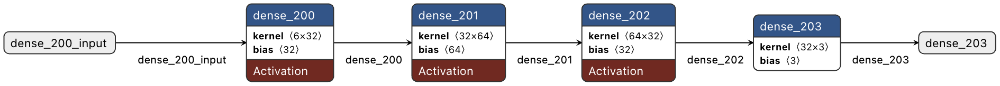{ width=100% }

### Training Parameters

The training of the Double DQN agent was governed by the following parameters:

- **Discount Factor (`DISCOUNT`)**: 0.90
- **Batch Size**: 128
  - Number of steps (samples) used for training at a time.
- **Update Target Interval (`UPDATE_TARGET_INTERVAL`)**: 2
  - Frequency of updating the target network.
- **Epsilon (`EPSILON`)**: 0.99
  - Initial exploration rate.
- **Minimum Epsilon (`MIN_EPSILON`)**: 0.01
  - Minimum value for exploration rate.
- **Epsilon Decay Rate (`DECAY`)**: 0.99973
  - Rate at which exploration probability decreases.
- **Number of Episodes (`EPISODE_AMOUNT`)**: 170
  - Total episodes for training the agent.
- **Replay Memory Capacity (`REPLAY_MEMORY_CAPACITY`)**: 2,000,000
  - Maximum size of the replay buffer.
- **Learning Rate**: 0.001
  - The rate at which the model learns from new observations.

### Training Procedure

1. **Initialization**: Start with a high exploration rate (`EPSILON`) allowing the agent to explore the environment extensively.
2. **Episodic Training**: For each episode, the agent interacts with the environment, collecting state, action, reward, and next state data.
3. **Replay Buffer**: Store these experiences in a replay memory, which helps in breaking the correlation between sequential experiences.
4. **Batch Learning**: Randomly sample a batch of experiences from the replay buffer to train the network.
5. **Target Network Update**: Every `UPDATE_TARGET_INTERVAL` episodes, update the weights of the target network with those of the policy network.
6. **Epsilon Decay**: Gradually decrease the exploration rate (`EPSILON`) following the decay rate (`DECAY`), shifting the strategy from exploration to exploitation.
7. **Performance Monitoring**: Continuously monitor the agent's performance in terms of rewards and success rate in navigating the maze.

## Visual Insights and Further Exploration

This project takes an innovative approach to sim-to-real transfer in reinforcement learning, which I've showcased through a series of visual elements and demonstrations. These visuals range from the meticulous setup of our physical maze to the user-friendly design of our web application.

- **Maze Visualization:**

The following image provides a more detailed look at the real-world maze setup. This physical representation mirrors the virtual maze environment.

{ width=50% }

- **Web Application Interface:**

This web application serves as a control interface for the RC car, allowing me to easily monitor what the RC car sees (due to the sensor values being displayed) and emergency stop the car if needed.

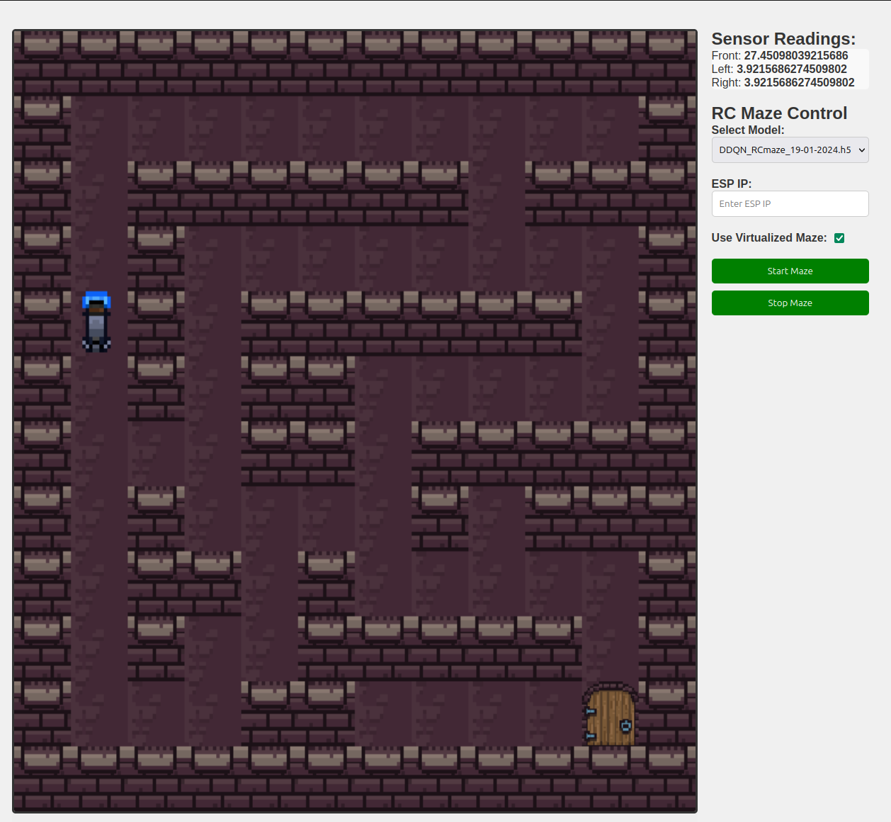{ width=100% }

- **Simulation Test Video:**

Watch the Double Deep Q-Network (DDQN) in action in this test video. It gives a real sense of how the algorithm navigates through the maze.

  - **DDQN Simulation test:** <https://github.com/driessenslucas/researchproject/assets/91117911/66539a97-e276-430f-ab93-4a8a5138ee5e>

### Evaluation Metrics Overview

#### Simulation Metrics

##### Episodic Performance

- **Objective and Goal:** The aim of this metric is to monitor the agent’s progress in mastering the maze. By evaluating the learning curve, I see how efficiently the agent can navigate to the end of the maze over successive trials. This gives us insights into its ability to optimize strategies and adapt over time.
- **How it’s Assessed:** I measure the number of episodes the agent needs before it can consistently complete the maze. A reduction in episodes over time is a good indicator that the agent is learning and adapting well.
- **Analytical Techniques:** To examine episodic performance, we either conduct statistical analyses or create visual plots, such as learning curves. These tools help us track and visualize changes in performance throughout the training period.
- **Accuracy and Consistency Measures:** To maintain accuracy and consistency, I ensure data integrity and control experimental conditions. Averaging results across multiple trials helps smooth out any randomness in the learning process, providing a clearer picture of the agent’s performance.

##### Step Efficiency

- **Objective and Goal:** This metric evaluates the agent's decision-making efficiency and ability to optimize its path through the maze. By measuring the steps the agent takes to solve the maze, fewer steps indicate a more efficient and smarter learning process.
- **How it's Assessed:** I keep track of the steps required to reach the maze's endpoint in each episode and analyze the reduction in steps over time.
- **Analytical Techniques:** I use quantitative analysis to examine trends in step count. Smoothing techniques may be applied to provide a clearer view of the overarching trends amidst episode-to-episode variability.
- **Accuracy and Consistency Measures:** To ensure reliable metrics, I replicate tests and average results, maintaining the same maze configuration for all experiments.

##### MSE Loss Measurement

$$
MSE(y, \hat{y}) = \frac{1}{N} \sum_{i=0}^{N-1} (y_i - \hat{y}_i)^2
$$

- **Objective and Goal:** This metric quantifies the accuracy of the agent's predictions by measuring the squared discrepancies between predicted values and actual outcomes, providing a clear gauge of learning precision.
- **How it's Assessed:** Using the provided mathematical formula, I average the squared differences across all predictions for an episode or series of episodes.
- **Analytical Techniques:** Calculating MSE is straightforward, but understanding its trend requires examining how it correlates with different stages of the agent’s learning, such as initial acquisition of knowledge versus later strategy refinement.
- **Accuracy and Consistency Measures:** Regularly evaluating against a validation set or maintaining a consistent testing framework ensures reliable insights into the agent's predictive accuracy and learning trajectory.

##### Reward Trend Analysis

- **Objective and Goal:** This analysis helps determine how effectively the agent's actions lead to positive outcomes, which are indicative of its learning and strategy development.
- **How it's Assessed:** By tracking and analyzing the rewards the agent accumulates over time, looking for trends that show an increase in reward collection.
- **Analytical Techniques:** Employing time series analysis or plotting cumulative rewards can vividly illustrate improvements in the agent's decision-making and learning.
- **Accuracy and Consistency Measures:** Averaging trends over several runs and keeping the reward structures consistent throughout the experiments to ensure comparability.

##### Epsilon Decay Tracking

- **Objective and Goal:** This metric monitors how well the agent balances exploration of new paths with exploitation of known successful strategies, key for adapting learning methods effectively.
- **How it's Assessed:** By observing the decline in the epsilon parameter over episodes, which indicates the agent’s shift from exploring to exploiting.
- **Analytical Techniques:** Plotting epsilon values across episodes helps visualize how the agent’s learning strategy evolves over time.
- **Accuracy and Consistency Measures:** Applying the epsilon decay strategy uniformly across all training sessions and maintaining consistent experimental conditions to ensure comparability of results.

#### Real-World Metrics

Transitioning to real-world application involved assessing how well the strategies developed in simulation held up when the agent faced a physical maze with real obstacles and constraints.

- **Maze Navigation**: Observing the RC car as it maneuvered through a real-world maze served as direct proof of how effectively the training translated from simulation to reality. This hands-on test demonstrated the practical utility of the trained agent in navigating complex paths.
- **Sensor Data Analysis**: By examining the real-time sensor data during navigation trials, I gained a deeper insight into how the agent interacts with its physical environment. This analysis was crucial for evaluating the agent’s ability to avoid obstacles and optimize its pathfinding strategies efficiently.

## Results of RL Techniques and Simulations

### Reinforcement Learning Techniques Overview

In the quest for an autonomous RC car capable of navigating mazes, we explored three reinforcement learning (RL) techniques. Each technique brought its strengths, limitations, and unique dance with the maze. Let's delve into their performances:

### Deep Q-Network (DQN)

- **Description**: The Deep Q-Network (DQN) marries deep neural networks with Q-learning. Its prowess lies in handling high-dimensional sensory inputs, making it suitable for environments demanding detailed interaction.
- **Integration and Results**:
  - **Reward History**: The DQN's reward history stabilized after around 50 episodes, signifying learning progress. However, its tendency to overestimate Q-values in complex scenarios limited its effectiveness.
  - **Performance**: Competent but not optimal, the DQN struggled with intricate mazes.

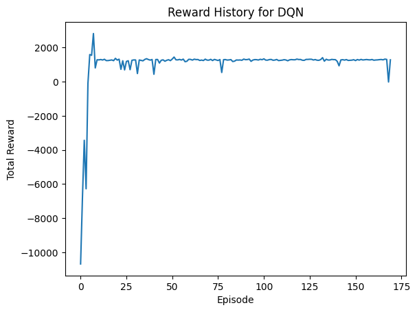

### Double Deep Q-Network (DDQN)

- **Description**: The Double Deep Q-Network (DDQN) refines the DQN by employing two neural networks. This structure mitigates Q-value overestimation, a critical factor in complex environments.
- **Reason for Selection**:
  - DDQN's accuracy in Q-value approximation aligns well with maze navigation precision requirements.
  - Addressing sensor limitations, DDQN outperformed DQN in maze-solving tasks.
- **Integration and Results**:
  - **Reward History**: DDQN solved the maze in an average of 25 steps (compared to DQN's 34), showcasing its efficiency.

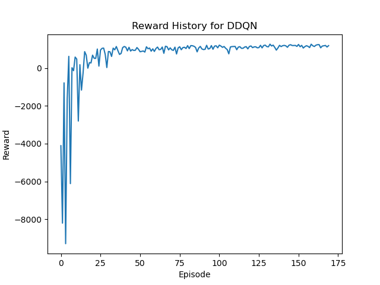

### Proximal Policy Optimization (PPO)

- **Description**: Proximal Policy Optimization (PPO) directly optimizes decision-making policies using policy gradients. It excels in stability and efficiency but emphasizes policy over value estimation.
- **Integration and Results**:
  - **Reward History**: While stable, PPO didn't align well with RC-car maze navigation precision requirements.
  - **Suitability**: PPO's focus on policy optimization makes it less suitable for accurate Q-value approximation.

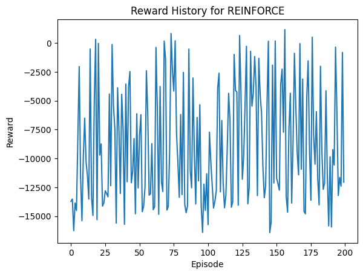

## Experimental Results and Analysis

In this section, I delve into the results from employing the Double Deep Q-Network (DDQN) for reinforcement learning. By thoroughly analyzing the data, I have uncovered key patterns and insights that enhance my understanding of effective maze navigation. Let's explore how our chosen algorithms meet the complexities of real-world challenges.

### Visit Heatmap for DDQN

The visit heatmap highlights the agent’s preferred routes through the maze. It pinpoints bottlenecks and illustrates the agent's exploration strategies. Through strategic movements, DDQN avoided dead ends and optimized its paths effectively.


### Reward History for DDQN

The reward history graph illustrates the learning journey. After initial fluctuations, the DDQN stabilized around episode 50, consistently garnering positive rewards. The occasional dips reflect exploratory actions, while the overall upward trend indicates refined strategies.


### Reward Distribution for DDQN

This histogram of reward distribution provides insight into the agent's performance outcomes. A concentration of higher rewards indicates successful strategies, whereas the presence of a long tail towards negative rewards highlights occasional setbacks. The DDQN effectively balanced risk with reward.

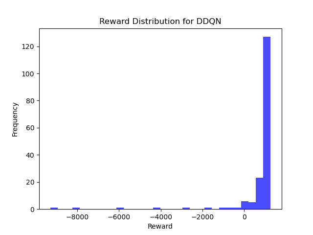

### Maze Solution for DDQN

The DDQN solved the maze in just 25 steps, showcasing its ability to choose efficient routes without unnecessary detours. The solution diagram below demonstrates the DDQN's capability in finding the optimal path.

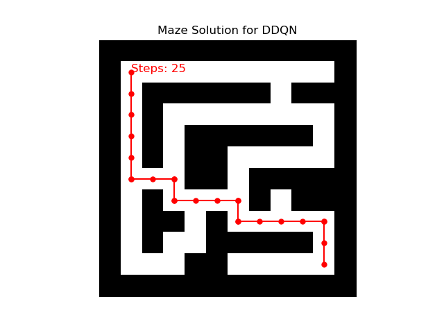

### Average Steps per Episode with Moving Average for DDQN

The moving average graph of steps per episode illustrates the DDQN's learning curve. A decreasing trend in the number of steps shows increasing efficiency in solving the maze, reflecting the agent's continuous improvement.

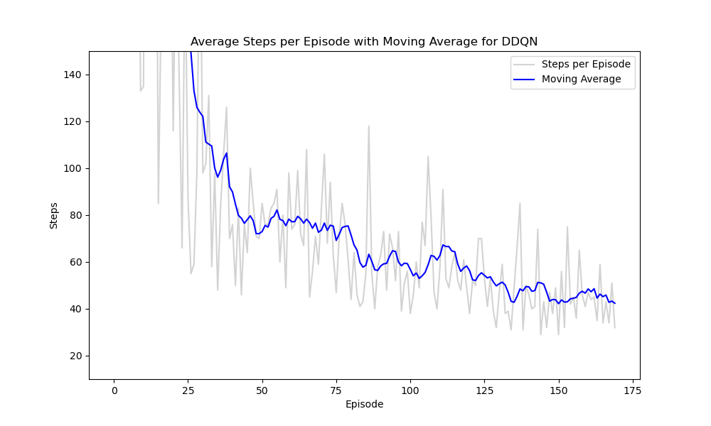

### Epsilon History for DDQN

The epsilon decay chart tracks the shift from exploration to exploitation as the DDQN refines its decision-making strategy. This balance between curiosity and known strategies ensures proficient maze navigation.

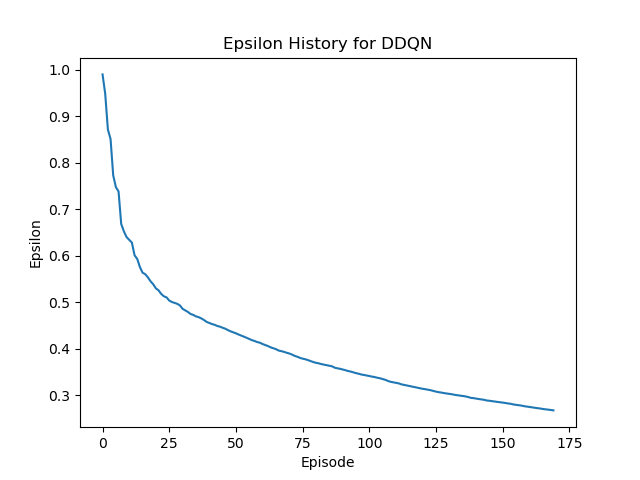

### Mean Squared Error over Time (Sampled) for DDQN

The MSE trend graph depicts the prediction accuracy of DDQN over time. Early spikes due to trial and error gradually stabilize as the DDQN learns from its experiences, leading to precise and reliable predictions.

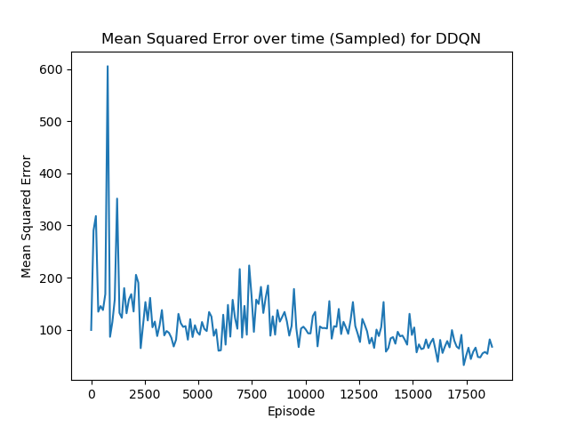

As we delve deeper into the capabilities of DDQN, these visualizations serve as a guide through a narrative of data-driven insights, precision, and innovative problem-solving.

## Implementation of Real-World Control Algorithms

### Introduction to Real-World Implementation

In this section, I delve into the practical application of control algorithms developed through simulations, now being adapted to control a physical robot. This transition is pivotal for evaluating how simulated behaviors translate into real-world scenarios, thereby assessing the effectiveness and limitations of sim-to-real transfer.

### System Overview

The experimental setup employs an ESP32 microcontroller combined with MPU6050 gyroscopic sensors and ultrasonic sensors for distance measurement, connected to a motor control system. These components enable the robot to perform essential navigational maneuvers like moving forward, turning left, and turning right—fundamental for validating the real-world applicability of the simulated algorithms.

### Code Architecture and Integration

**System Initialization**

Understanding the system's initial setup is crucial for ensuring robust and reliable operation. This phase involves preparing the robot by configuring its hardware interfaces, establishing network connectivity, and setting up sensors and actuators.

- **WiFi and OTA Configuration**: This sets up a network connection and facilitates Over-The-Air (OTA) updates, crucial for remote debugging and iterative improvements.
- **Sensor and Display Setup**: Activates ultrasonic sensors for distance monitoring and initializes a display to provide real-time feedback on the robot's status and IP address, enhancing user interaction and debugging capabilities.
- **MPU6050 Setup and Calibration**: Calibrates the gyroscopic sensor for accurate angle measurements, essential for precise navigation.
- **Motor Setup**: Configures motor drivers and establishes initial motor states, prepping the robot for subsequent movement commands.

**Motor Control Mechanism**

This subsection elaborates on how movement functions are implemented, translating simulated navigation algorithms into the real-world robotic system.

- **Variables for Motor Control**
  
  ```cpp
  int initialSpeed = 125; // Higher initial speed for robust movement
  int minSpeed = 40;      // Minimum speed to maintain control
  int speed = initialSpeed;
  constexpr int TURN_DURATION = 245;
  ```

  These variables dictate the motors' initial and minimum speeds, and the duration for turning, facilitating precise and controlled movements by adjusting the speed dynamically based on the robot's turning angle.

- **Forward Movement**

  The `move_forward` function initiates rapid forward motion, with real-time checks for obstacles to ensure safe stops—mimicking the real-world need for dynamic responsiveness.

- **Left Turn**

  The `move_left` function adjusts motor speeds dynamically, a strategy refined in simulations to accommodate physical and inertia effects during turns, ensuring smooth and controlled navigation.

- **Right Turn**

  The `move_right` function applies similar adjustments and sensor feedback to execute precise right turns. Incorporating `calibrateSensors()` before each movement guarantees accurate gyroscopic data, vital for the precise execution of turns.

- **Stopping Movement**

  The `stop_moving` function is designed to immediately halt all motions, crucial for accident prevention and adaptation to sudden changes in dynamic environments.

**Calibration and Sensor Data Interpretation**

Calibration is crucial for ensuring sensor accuracy and reliability, maintaining the integrity of behaviors developed in simulations when applied in real-world settings. The `calibrateSensors` function periodically recalibrates the gyroscopic sensors to correct any data drift or inaccuracies.

```cpp
void calibrateSensors()
{
    long gyroZAccum = 0;
    Serial.println("Calibrating...");
    for (int i = 0; i < 100; i++)
    {
        int16_t ax, ay, az, gx, gy, gz;
        mpu.getMotion6(&ax, &ay, &az, &gx, &gy, &gz);
        gyroZAccum += gz;
        delay(20);
    }
    mpu.setZGyroOffset(-gyroZAccum / 13100); // Calibration based on 100 readings
    Serial.println("Calibration Complete");
}
```

<!-- TODO : Vooral nog wat dieper ingaan op het feit dat jouw sensoren niet voldoende data opleveren om de exacte positie te bepalen binnen de real-world grid. Je doet dat dan wel binnen jouw conclusies, maar hier mag je er ook al wat dieper op ingaan -->
## Real-World Application and Limitations

### Introduction to Sensor and Movement Discrepancies

The leap from simulated environments to real-world application unveils a complex landscape of challenges, especially in the interpretation of sensor data and the replication of vehicle movements. This discussion delves into these critical aspects, highlighting both the opportunities and constraints of applying simulation-derived insights to actual autonomous vehicle (AV) operations.

### Real-World Application

#### Enhanced Sensor-Based Navigation

Sensor-based navigation technologies, refined through simulation, promise substantial improvements in autonomous vehicles' functionality. In real-world applications, such technologies are pivotal for environments demanding high precision and adaptability. For instance, in congested urban settings or in automated delivery systems, the ability to dynamically navigate with high accuracy can significantly elevate both safety and efficiency. Integrating simulation insights into sensor-based navigation aids in refining these systems to better interpret complex, variable real-world conditions.

#### Informing Autonomous Vehicle Movement

Simulated environments offer a controlled setting to study vehicle dynamics and movement responses. Applying these insights to the development of autonomous vehicles can lead to advanced algorithms capable of handling the unpredictable nature of real-world environments. This knowledge is instrumental in enhancing autonomous systems' ability to safely and efficiently navigate through dynamic and often chaotic traffic conditions, thereby improving the overall functionality of autonomous transportation.

### Limitations

#### Discrepancies in Sensor Data Interpretation

A substantial hurdle in the real-world application of simulation-based insights is the variation in sensor data accuracy between simulated and actual environments. These discrepancies can directly impact the effectiveness of navigational algorithms, potentially compromising the vehicle's decision-making processes and, by extension, its safety and operational efficiency.

#### Challenges in Movement Replication

The precise replication of simulated vehicle movements in real-world conditions encounters numerous obstacles. External factors such as road surface variations, environmental conditions, vehicle load, and mechanical constraints can introduce unforeseen deviations in vehicle behavior. These real-world variances necessitate adjustments and recalibration of the algorithms developed in simulated environments to ensure their effectiveness and reliability outside the lab.

#### Practical Implementation Considerations

Successfully translating simulation insights into real-world applications requires meticulous attention to several practical aspects. These include, but are not limited to, sensor calibration to account for environmental influences, adapting algorithms to hardware limitations, and ensuring the system's resilience to real-world unpredictabilities. Addressing these factors is crucial for the effective deployment and operational success of autonomous vehicles based on sim2real insights.

### Conclusion for Real-World Application

Transitioning from simulation-based research to practical real-world applications in autonomous vehicle navigation presents a unique set of challenges and opportunities. While the application of simulation-derived insights into sensor use and vehicle movement has the potential to revolutionize autonomous vehicle technologies, significant effort is required to bridge the gap between simulated accuracy and real-world variability. Overcoming these challenges is essential for the successful integration of sim2real technologies in enhancing the safety, efficiency, and reliability of autonomous transportation systems.

## Challenges and Solutions in RL Implementation

### Challenge 1: Selection of an Appropriate Virtual Environment

- **Description**: Choosing a virtual environment conducive to effective RC-car training is crucial.
- **Solution**: After evaluating various platforms, **OpenAI Gym** was selected for its simplicity, familiarity from previous coursework, and its focus on reinforcement learning.

### Challenge 2: Choosing the Optimal Reinforcement Learning Technique

- **Description**: Selecting the most effective RL technique for training the virtual RC-car.
- **Solution**: Through comparative analysis and empirical testing, the Double Deep Q-Network (DDQN) was identified as the most suitable technique, demonstrating superior performance in navigating complex environments with fewer episodes.

### Challenge 3: Sim2Real Transfer - Addressing Movement Discrepancies

- **Description**: Bridging the gap between simulation and real-world in terms of RC-car movement and control.
- **Solution Attempt**: Fine-tuning the frequency of action commands with an async method, waiting for the motor to finish moving or considering a queued action system. Further more the importance of precise movement in the real world was highlighted, which was not a problem in the simulation.

### Challenge 4: alignment Issue and Motor Encoder Implementation

- **Description**: Difficulty in achieving precise straight-line movement in the RC car, with a persistent ~3-degree offset.
- **Solution Attempt 1**: Implementation of motor encoders was pursued to enhance movement accuracy. However, this approach faced the same limitations in achieving the desired precision.
- **Solution Attempt 2**: The motor was replaced with a more powerful one, which initially showed promise in addressing the alignment issue. However, after adding all the other components, the car's weight increased, leading to the same problem.
- **Solution Attempt 3**: The use of a MPU6050 gyroscope was explored to measure the car's orientation and adjust the movement accordingly. Even though this approach succeeded to some extent (90 degrees turns were accurate), it was not able to solve the ~3-degree offset issue when moving forward.

- **Solution Attempt 4**: The final solution I tried was done by removing the RPI5 (previously used for sensor data and running the web app) from the robot all together and using the ESP32 to control both all the sensors and the motors. This allowed for a more lightweight robot, which was able to move forward more precisely but it failed to rotate 90 degrees accurately.

### Challenge 5: Ensuring Consistent and Effective Training

- **Description**: Maximizing training efficiency and performance while maintaining consistency between simulation and real-world scenarios.
- **Solution**: The simulation demonstrated considerable advantages in terms of training efficiency, safety, and computational power, establishing it as an indispensable tool in autonomous vehicle model development.

### Challenge 6: Accurate Sensor Data Normalization for Sim2Real Transfer

- **Description**: Aligning sensor data between simulated and real-world environments is critical for model accuracy.
- **Solution**: Implementing specific normalization techniques for both real-world and simulation sensor data ensured consistency and compatibility, enhancing the model's accuracy in real-world applications.

  - **Real-World Sensor Data Normalization:**

    The function `map_distance` normalizes real-world sensor data. It can be represented as follows:

    <!-- 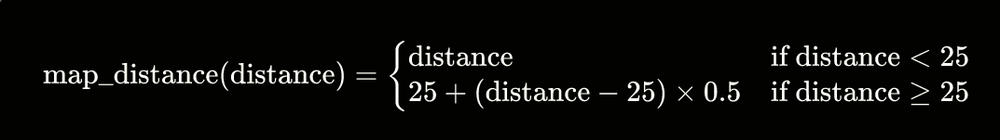 -->

    $$
    \text{map\_distance}(d) = \begin{cases}
    d & \text{if } d < 25 \\
    25 + (d - 25) \times 0.5 & \text{otherwise}
    \end{cases}
    $$

    This function keeps distances under 25 cm unchanged and applies a scaling factor of 0.5 to distances beyond 25 cm, adding this scaled value to a base of 25 cm.

  - **Simulation Sensor Data Normalization:**

    The function `normalize_distance` adjusts simulated sensor data to a 0-1 range. Its equation is:

    <!--  -->

    $$
    \text{normalize\_distance}(d) = \text{max}\left(0, \text{min}\left(\frac{d}{\text{sensor\_max\_range}}, 1\right)\right) \times 1000
    $$

    In this function, the distance is first scaled by dividing by `sensor_max_range`. It's then clamped between 0 and 1 before multiplying by 1000 to normalize it within a specific range.

### Challenge 7: Integration of Failsafe Mechanisms

- **Description**: Preventing potential collisions and ensuring safe navigation in the real world.
- **Solution**: Development of a failsafe system that prevents forward movement in hazardous situations, retraining the model with this protocol to align real-world behavior with the simulated environment.

### Challenge 8: Training Environment and Technique Efficacy

- **Description**: Determining the most effective environment and RL technique for training.
- **Solution**: The DDQN solved the environment more efficiently than DQN, highlighting the importance of technique selection. The simulation provided a safer, more controlled environment for training, reinforcing its selection over real-world training.

### Viewing Practical Experiments

For visual insights into my practical experiments addressing these challenges, please refer to my supplementary video materials, which illustrate the implementation and testing of solutions, from gyroscopic adjustments to the integration of a more sophisticated control system using the ESP32.

### Conclusion for Challenges and Solutions

This section has outlined the practical challenges encountered in applying reinforcement learning (RL) techniques to autonomous RC cars. My journey began with the selection of OpenAI Gym as the virtual environment, chosen for its simplicity and relevance to RL. The Double Deep Q-Network (DDQN) emerged as the most effective RL technique for navigating complex environments.

However, transitioning from simulated models to real-world applications revealed significant discrepancies, particularly in movement control and sensor data alignment. I explored innovative solutions such as the implementation of motor encoders, power adjustments, and gyroscope integration, which partially addressed these issues. Efforts to normalize sensor data and implement failsafe mechanisms also contributed to better alignment with real-world conditions.

A significant advancement was achieved by replacing the Raspberry Pi and ESP32 with just the ESP32 module in the robot's design, leading to a more lightweight and precise robot. This change marked a considerable step in overcoming the challenges previously faced.

Although I made substantial progress, some challenges remain. This indicates a need for ongoing research and development to fully harness the potential of RL in autonomous RC car navigation.

In conclusion, this project underscores the iterative and demanding nature of applying RL techniques in real-world scenarios. It highlights the importance of continuous refinement, innovation, and adaptation, beyond the theoretical knowledge base. The journey through these challenges has emphasized the significance of perseverance and creative problem-solving in the evolving field of autonomous vehicle technology.

## Sources of Inspiration and Conceptual Framework

The genesis of this research draws from a diverse collection of sources, uniquely combining insights from technical documentation, digital platforms, and academic literature. Central to the inspiration were the challenges of micro mouse competitions and the potential of reinforcement learning (RL) in navigating these complex mazes. These initial sparks of interest were further fueled by dynamic demonstrations of RL applications in autonomous vehicle control, particularly through the lens of YouTube and GitHub repositories, alongside influential academic research.

### Micro mouse Competitions and Reinforcement Learning

Micro mouse competitions, which task small robotic mice with the navigation of mazes, served as a foundational inspiration for this study. The direct application of RL in these competitions and related technological showcases provided a compelling narrative on the potential of RL in real-world problem-solving and autonomous control. The exploration of maze traversal algorithms and the strategies for shortest path finding, as detailed in the insightful Medium article by M. A. Dharmasiri \hyperref[ref15]{[15]}, enriched the conceptual foundation by illustrating practical algorithmic approaches in similar contexts.

### Influential YouTube Demonstrations and GitHub Insights

YouTube videos such as "Self Driving and Drifting RC Car using Reinforcement Learning" \hyperref[ref11]{[11]} and "Reinforcement Learning with Multi-Fidelity Simulators -- RC Car" \hyperref[ref16]{[16]} provided vivid demonstrations of RL's applicability in real-world settings, emphasizing the feasibility of sim-to-real transfer. These resources, along with GitHub repositories detailing ventures like the "Sim2Real_autonomous_vehicle" project \hyperref[ref13]{[13]}, highlighted the practical steps and challenges in implementing RL in physical systems.

### Technical Exploration and Academic Foundation

The academic exploration was significantly shaped by articles on autonomous driving decision control by Q. Song et al.\hyperref[ref12]{[12]} and a survey on sim-to-real transfer in deep reinforcement learning for robotics by W. Zhao, J. P. Queralta, and T. Westerlund \hyperref[ref17]{[17]}, which detailed the application of advanced RL algorithms in controlling autonomous vehicles. These articles provided a deep dive into the methodologies and challenges of applying RL in autonomous systems, offering a broad academic perspective on the field.

### Synthesis and Research Direction

These varied sources collectively informed the development of this research, steering the focus towards the feasibility and intricacies of sim2real transfer in the realm of autonomous navigation. The exploration aims to synthesize insights from both digital and academic realms, tackling the nuanced challenges of applying sophisticated RL models in practical, tangible scenarios.

<!-- ## Integration of Practical Experiments

Throughout this research project, I employed a series of practical experiments to navigate and overcome encountered challenges. These experiments, documented through video demonstrations, provide tangible insights into my problem-solving process.

### Addressing Alignment and Orientation Challenges

One of the key challenges I faced was ensuring precise orientation and alignment of the RC-car during movement. To tackle this, I utilized the MPU6050 gyroscope, aiming to correct alignment issues and achieve accurate 90-degree turns.

- **Utilizing the MPU6050 Gyroscope for Precise Orientation**: My first set of experiments focused on leveraging the gyroscope to correct the car's orientation for accurate navigation. This approach was pivotal in my attempts to ensure the RC-car could navigate mazes with high precision.

  - To address alignment issues when attempting precise 90-degree turns, I explored the potential of the MPU6050 gyroscope to adjust the car's movement based on its orientation. This experiment aimed to refine my control over the vehicle's navigation through the maze ([View Test 1](https://github.com/driessenslucas/researchproject/assets/91117911/32d9e29f-6d5a-4676-b609-2c08923ca1ac), [View Test 2](https://github.com/driessenslucas/researchproject/assets/91117911/624b40f2-bee8-49f6-961d-1f72ab18fe13)).
  - Further testing focused on using the gyroscope for realigning the car's forward movement, aiming to rectify the persistent ~3-degree offset. Despite my efforts, completely eliminating this offset proved challenging, showcasing the complexities of simulating real-world physics ([View Test 1](https://github.com/driessenslucas/researchproject/assets/91117911/bb9aa643-9620-4979-a70c-ec2826c7dd33), [View Test 2](https://github.com/driessenslucas/researchproject/assets/91117911/689b590f-3a9a-4f63-ba9c-978ddd08ab53), [View Test 3](https://github.com/driessenslucas/researchproject/assets/91117911/99da37df-d147-43dc-828f-524f55dc6f70)).

### Enhancing Movement Precision with Encoders

The pursuit of enhancing the RC-car's movement precision led us to experiment with rotary encoders. These devices were integrated to measure wheel rotations accurately, aiming to improve straight-line movements and correct the noted ~3-degree offset.

- **Experimenting with Rotary Encoders**: I introduced rotary encoders to my setup, hoping to gain more precise control over the car's movements by accurately measuring wheel rotations. This experiment represented a significant effort to refine the vehicle's navigation capabilities by ensuring more accurate movement and orientation.
  - Initial tests with a new RC-car model, equipped with an encoder and a more powerful motor, showed promise in addressing the forward movement precision. However, the addition of extra components increased the vehicle's weight, impacting its movement and reintroducing the alignment challenge ([View Test 1](https://github.com/driessenslucas/researchproject/assets/91117911/9728e29a-d2fa-48fa-b6e0-e2e1da92228f), [View Test 2](https://github.com/driessenslucas/researchproject/assets/91117911/b9ce2cc3-85fd-4136-8670-516c123ba442)).
  - Despite an encouraging start, a malfunction with one of the encoders halted further tests using this specific setup, highlighting the practical challenges of hardware reliability in real-world applications ([View Test](https://github.com/driessenslucas/researchproject/assets/91117911/ae5129fa-c25f-4f89-92bb-4ee81df9f7a5)).

### Real-World Application Tests

Moving beyond controlled environments, I conducted tests in both outdoor and indoor settings to evaluate the RC-car's performance in real-world conditions. These tests were crucial for assessing the practical application of my research findings.

- **Outdoor and Indoor Maze Tests**: Real-world testing scenarios presented unique challenges, such as varying surface textures and unpredictable environmental conditions, which significantly impacted the RC-car's navigation capabilities.

  - The outdoor test attempted to navigate the RC-car on uneven surfaces, where surface texture variations greatly affected its performance. This test underscored the importance of environmental factors in autonomous navigation ([View Test 1](https://github.com/driessenslucas/researchproject/assets/91117911/02df8a25-b7f0-4061-89b7-414e6d25d31c), [View Test 2](https://github.com/driessenslucas/researchproject/assets/91117911/187561a7-c0cb-4921-af3e-9c2c99cb0137)).
  - Indoor testing provided a more controlled environment, allowing us to closely monitor and adjust the RC-car's navigation strategies. Despite the controlled conditions, these tests highlighted the challenge of accurately translating simulation models to real-world applications, reflecting on the complexities of sim-to-real transfer ([View Test 1](https://github.com/driessenslucas/researchproject/assets/91117911/ce0f47e9-26cd-459e-8b26-ff345d1ee96b), [View Test 2](https://github.com/driessenslucas/researchproject/assets/91117911/ea4a9bff-e191-4ce2-b2cc-acc57c781fa3), [View Test 3](https://github.com/driessenslucas/researchproject/assets/91117911/4783729f-10cc-4c61-afa4-71cfc93d5d3e), [View Test 4](https://github.com/driessenslucas/researchproject/assets/91117911/77091cb5-dbc5-4447-abc2-dc820dc66188)). -->
## Integration of Practical Experiments

Throughout this research project, I employed a series of practical experiments to navigate and overcome encountered challenges. These experiments, documented through video demonstrations, provide tangible insights into my problem-solving process.

### Addressing Alignment and Orientation Challenges

One of the key challenges I faced was ensuring precise orientation and alignment of the RC-car during movement. To tackle this, I utilized the MPU6050 gyroscope, aiming to correct alignment issues and achieve accurate 90-degree turns.

#### Utilizing the MPU6050 Gyroscope for Precise Orientation

My first set of experiments focused on leveraging the gyroscope to correct the car's orientation for accurate navigation. This approach was pivotal in my attempts to ensure the RC-car could navigate mazes with high precision.

- To address alignment issues when attempting precise 90-degree turns, I explored the potential of the MPU6050 gyroscope to adjust the car's movement based on its orientation. This experiment aimed to refine my control over the vehicle's navigation through the maze. See \hyperref[ref22]{[22]} and \hyperref[ref23]{[23]}.
- Further testing focused on using the gyroscope for realigning the car's forward movement, aiming to rectify the persistent ~3-degree offset. Despite my efforts, completely eliminating this offset proved challenging, showcasing the complexities of simulating real-world physics. See \hyperref[ref24]{[24]}, \hyperref[ref25]{[25]}, and \hyperref[ref26]{[26]}.

### Enhancing Movement Precision with Encoders

The pursuit of enhancing the RC-car's movement precision led us to experiment with rotary encoders. These devices were integrated to measure wheel rotations accurately, aiming to improve straight-line movements and correct the noted ~3-degree offset.

- I introduced rotary encoders to my setup, hoping to gain more precise control over the car's movements by accurately measuring wheel rotations. This experiment represented a significant effort to refine the vehicle's navigation capabilities by ensuring more accurate movement and orientation. See \hyperref[ref27]{[27]} and \hyperref[ref28]{[28]}.
- Despite an encouraging start, a malfunction with one of the encoders halted further tests using this specific setup, highlighting the practical challenges of hardware reliability in real-world applications. See \hyperref[ref29]{[29]}.

### Real-World Application Tests

Moving beyond controlled environments, I conducted tests in both outdoor and indoor settings to evaluate the RC-car's performance in real-world conditions. These tests were crucial for assessing the practical application of my research findings.

- The outdoor test attempted to navigate the RC-car on uneven surfaces, where surface texture variations greatly affected its performance. This test underscored the importance of environmental factors in autonomous navigation. See \hyperref[ref30]{[30]} and \hyperref[ref31]{[31]}.
- Indoor testing provided a more controlled environment, allowing us to closely monitor and adjust the RC-car's navigation strategies. Despite the controlled conditions, these tests highlighted the challenge of accurately translating simulation models to real-world applications, reflecting on the complexities of sim-to-real transfer. See \hyperref[ref32]{[32]}, \hyperref[ref33]{[33]}, \hyperref[ref34]{[34]}, and \hyperref[ref35]{[35]}.

\pagebreak

<!-- --
  # TODO: Interviews with Sam and Wouter for feedback (have not done these interviews yet)
  • Wat zijn volgens hen de sterke en zwakke punten van het resultaat uit jouw researchproject?   
  • Is ‘het projectresultaat’ (incl. methodiek) bruikbaar in de bedrijfswereld?  
  • Welke alternatieven/suggesties geven bedrijven en/of community?   
  • Wat zijn de mogelijke implementatiehindernissen voor een bedrijf?    
  • Wat is de meerwaarde voor het bedrijf?   
  • Is er een maatschappelijke/economische/socio-economische meerwaarde aanwezig?  
-- -->

Let's provide a more concise and fluid rewrite of the reflections and self-reflection sections to enhance readability and maintain a cohesive narrative style.

## Reflections on the Research Project

### Lessons Learned and the Path Ahead

At the culmination of this research journey, I've distilled essential insights that have profoundly influenced my approach and perspective:

### The Value of Openness

My experiments underscored the importance of embracing new ideas and venturing beyond familiar territory. This openness not only spurred creativity but was also vital for discovering innovative solutions. Moving forward, I am committed to maintaining this exploratory spirit, keen to harness the winds of novelty.

### Bridging Theory and Practice

The real challenge lay in translating theoretical knowledge into practical applications. The virtual environments were controlled, yet the real-world demanded adaptability to unforeseen complexities. This experience has sharpened my ability to navigate between the elegance of theory and the unpredictability of real-world applications.

### Anticipatory Thinking: Navigating Barriers

Encountering and overcoming barriers taught me the value of anticipatory thinking. From navigating corporate hurdles to adapting to evolving safety standards, looking ahead has become an integral part of my approach, transforming potential obstacles into opportunities for innovation.

### Policy and Regulation: A Symbiotic Dance

Engaging with policy and regulatory frameworks highlighted the delicate balance between innovation and legislation. As I worked with policymakers and industry leaders, I learned the importance of crafting regulations that foster innovation while ensuring public safety and accountability.

### Societal Impact: Echoes in Time

The societal implications of autonomous systems have been profound. From enhancing mobility for the disabled to influencing urban planning, the potential for positive impact is immense. I am more aware of the need to ensure these technologies are accessible and beneficial across societal divides.

### The Forward Path: A Research Ethos

As I move forward, my ethos will be defined by adaptability, responsiveness, and a commitment to societal stewardship. The lessons learned have prepared me for the next stage of my journey, where I will continue to engage with data, refine methodologies, and embrace the challenges that lie ahead.

### Insights from Interviews

**1. Which RC car solution would be better suited for this context?**

For a project focused on sim-to-real transfer, choosing an RC car that can be extensively customized and programmed is crucial. A model with a robust and accessible API, compatibility with various sensors, and the ability to handle different terrains would be ideal. This would allow for more detailed control algorithms and possibly a better understanding of how physical properties affect simulation results. Additionally, cars that can be equipped with advanced telemetry systems to provide real-time feedback would be particularly beneficial for refining control strategies based on the simulation.

**2. Which virtual environment would offer more freedom in the way the car moves within the simulation?**

A virtual environment like Unity 3D coupled with ROS (Robot Operating System) would offer extensive freedom for simulation. Unity provides a rich and visually detailed environment that can be crucial for developing and testing perception algorithms. When used in conjunction with ROS, it allows for highly customizable simulation scenarios, which can mimic complex real-world dynamics. This combination would support a wide range of movement behaviors and interactions that can be programmed and tested in detail before real-world deployment.

**3. Would employing a virtual twin provide more value in this context compared to using a camera?**

Employing a virtual twin can offer significant advantages over traditional camera systems, especially in terms of the depth of simulation and pre-testing. A virtual twin allows for a 1:1 digital replica of the RC car and its environment, providing a platform to simulate physical and environmental interactions with high accuracy. This approach can lead to better anticipation of how the car would behave in the real world under various conditions, thereby optimizing the algorithms more effectively before actual implementation. However, using a camera for real-time feedback and adjustments based on visual data is invaluable, so ideally, both approaches would be integrated for best results.

**4. In what ways can this project be further developed?**

This project can be expanded in several exciting directions:

- **Integration of more complex sensory systems:** Incorporating LIDAR, advanced gyroscopes, and other environmental sensors can enhance the car's ability to understand and navigate its surroundings.
- **Machine learning enhancements:** Applying more sophisticated machine learning models like convolutional neural networks (CNNs) or recurrent neural networks (RNNs) could improve the car's decision-making processes and adaptability.
- **Broader testing environments:** Extending the project to include different types of environments, such as varying weather conditions or obstacle complexities, can help generalize the car's capabilities.
- **Community collaboration:** Open-sourcing the project or collaborating with educational institutions could not only improve the technology but also foster a community around autonomous vehicle research and development.

## Self-Reflection on the Research Project

Reflecting on the path this research has taken, from concept to implementation, I’ve gathered key takeaways:

### Proposed Success Criteria: A North Star

Setting clear success criteria at the outset provided direction and motivation. These goals not only guided my research but also fueled my passion and commitment through various challenges.

### Achieved Success Criteria: The Joy of Control

Successfully controlling the RC car was a significant achievement. It was gratifying to see the reinforcement learning techniques effectively translate from simulation to real-world application.

### Unachieved Success Criteria: The Elusive Consistency

Despite successes, consistency in real-world application remained challenging. These experiences highlighted the need for ongoing refinement and adaptation of the algorithms used.

### Smooth Sailing and Hidden Currents

While some aspects of the project proceeded smoothly, others, like adapting virtual models to complex real-world conditions, required significant adjustments and problem-solving.

### Jury Feedback: Winds of Wisdom

Feedback from seasoned experts was invaluable. Their insights helped refine the project, enhancing sensor capabilities and adjusting control algorithms, which were crucial for improving overall outcomes.

### The Ethical Compass: Navigating Humanity

Ethical considerations were paramount. Reflecting on issues like privacy, safety, and the impact of automation on employment emphasized the need for responsible innovation.

### The Ripple Effect: Echoes in Time

This project has implications far beyond the academic realm, influencing policy, industry practices, and public perceptions. It has sparked important discussions that will hopefully lead to more informed and ethical technology development.

### The Next Voyage: Beyond the Horizon

As this project closes, new questions arise, setting the stage for further exploration of how to balance progress with ethical considerations. I am eager to continue this journey, guided by the insights gained and motivated by both the achievements and the challenges that remain.

\pagebreak

Here's a revised and streamlined version of the section:

## Advice

### Practical Utilization of Simulations

Simulations are invaluable in research, offering a risk-free, controllable environment for developing and refining algorithms. 

- **Cost-Effectiveness:** Simulations allow for substantial cost savings by reducing the need for physical prototypes and extensive real-world trials in the early phases of research.

### Strategies for Effective Transition from Simulation to Reality

Successfully transitioning from simulations to real-world applications is critical for validating the effectiveness of research outcomes.

- **Incremental Testing:** Start with simulations to refine algorithms, then gradually introduce real-world testing to confirm results and adapt to environmental variables.
- **Feedback Loops:** Use continuous feedback mechanisms to enhance simulation models with insights gained from real-world tests, improving their accuracy and applicability.

### Overcoming Common Challenges in Simulation-to-Reality Transitions

Bridging the gap between simulations and actual conditions often requires specific adjustments, especially in terms of sensor data and mechanical operations.

- **Sensor Discrepancy Adjustments:** Regular calibration of real-world sensors is essential to ensure they align with simulation inputs.
- **Movement and Mechanics Alignment:** It's crucial to synchronize physical movements and mechanics with those anticipated by simulations to ensure smooth transitions.

### Insights from My Research

- **Simulation Platforms:** Choosing the right simulation platform, like OpenAI Gym, is critical and may necessitate additional tools for more complex scenarios.
- **DDQN Superiority:** My findings show that Double Deep Q-Network (DDQN) surpasses other models, such as DQN and PPO, by reducing overestimations and enhancing learning stability.

### Methodological Advice

- **Comprehensive Evaluation:** Utilize a mix of qualitative and quantitative approaches to thoroughly evaluate the effectiveness of both simulations and real-world applications.
- **Adaptive Techniques:** Stay flexible and responsive to the results and feedback, which are crucial for effectively tackling unexpected challenges.

### Practical Experiment Integration

- **Prototyping and Iteration:** Use iterative design and prototyping to progressively refine systems, effectively linking theoretical research and practical implementation.
- **Continuous Feedback:** Continuously seek and integrate feedback from stakeholders and peers to improve simulation models and real-world applications.

### Guidelines for Future Research

#### Introduction for Future Research

This chapter outlines a detailed methodology and provides advice for researchers engaged in simulation-based studies, aimed at ensuring a successful transition from theoretical models to practical applications.

#### Step-by-Step Plan

##### Step 1: Selection of Simulation Environments

- **Research and Evaluation:** Explore and evaluate available simulation tools suited to your study, such as OpenAI Gym, Unity 3D, and CARLA.
- **Criteria Development:** Define criteria focusing on fidelity, scalability, and integration capabilities.
- **Preliminary Testing:** Conduct initial tests to assess the environments against these criteria.

##### Step 2: Managing Expectations and Adaptability

- **Expectation Setting:** Establish realistic expectations for the capabilities of simulations.
- **Adaptation Strategies:** Be prepared to modify your research approach based on outcomes from simulations and data discrepancies.

##### Step 3: Methodology Flexibility

- **Continuous Evaluation:** Consistently re-evaluate the effectiveness of your methodologies.
- **Integration of New Technologies:** Embrace emerging technologies as they become relevant to enhance and expand your research.

\pagebreak

## General Conclusion

This thesis has effectively demonstrated the potential of transferring a trained reinforcement learning (RL) agent from a simulated environment to a real-world setting, focusing specifically on navigating a maze using a remote-controlled (RC) car. The detailed experiments and analyses discussed in earlier chapters offer a comprehensive exploration of this transition.

The research conclusively shows that such a transfer is not only possible but also fraught with significant challenges. The critical experiments detailed in **Chapter 8: Analysis and Results: Addressing the Research Questions** highlight the importance of normalizing sensor data and adapting control algorithms to handle the unpredictable dynamics of the real world. These adaptations were crucial for aligning the simulated models with the real-world scenarios encountered during implementation.

The selection of appropriate virtual environments and reinforcement learning techniques, as discussed in **Chapter 5: Methodology**, played a key role in shaping the experimental approach and ensuring the effectiveness of the simulation training. The Double Deep Q-Network (DDQN) emerged as the most suitable technique, providing a robust framework to navigate the complexities of practical applications.

This study not only confirms the feasibility of sim-to-real transfers but also provides a detailed examination of the intricate mechanics involved in this process, an area of growing importance in AI and robotics research. By integrating theoretical insights with practical applications, this thesis makes a significant contribution to the ongoing discourse on the viability and challenges of applying reinforcement learning in real-world scenarios.

In conclusion, while it is feasible to transition a trained RL agent from simulation to a real environment, the process requires careful planning, adaptability, and continual refinement. The challenges highlighted throughout this research underscore the need for ongoing efforts to enhance the robustness and reliability of sim-to-real applications, ensuring they can meet the demands of real-world conditions.

\pagebreak

## Guest Speakers

### Innovations and Best Practices in AI Projects by Jeroen Boeye at Faktion

Jeroen Boeye's talk, delivered on behalf of Faktion, provided valuable insights into the close relationship between software engineering and artificial intelligence in developing AI solutions. He emphasized the importance of not just focusing on AI technology but also on the software engineering principles that support the creation of robust, scalable, and maintainable AI systems. This approach ensures that AI solutions are both technically sound and viable for long-term application.

During his lecture, Jeroen highlighted several aspects of AI application, notably Chatlayer's impact on conversational AI. He explained how Chatlayer improves chatbot interactions through sophisticated conversational flows, enhancing the accuracy and relevance of exchanges with users. Another point of discussion was Metamaze, which he commended for its innovative methods in automating document processing, creating succinct summaries from extensive documents and emails, showcasing the capabilities of supervised machine learning in administrative tasks.

Jeroen outlined a clear roadmap for successful AI project implementation, stressing the need to validate business cases and adopt a problem-first strategy. He discussed the critical role of high-quality data as the foundation for any AI endeavor and offered strategies for creatively overcoming data limitations. The talk also covered the importance of embracing failures as opportunities for innovation and maintaining open communication with stakeholders about challenges and setbacks.

The lecture further presented various practical AI applications across different industries, such as solar panel detection, unauthorized pool identification, air freight container inspection, and early warning systems for wind turbine gearboxes. Jeroen demonstrated how AI could tackle complex challenges through innovative data sourcing, synthetic data generation, and anomaly detection techniques. He also explored case studies on energy analysis in brick ovens and egg incubation processes, emphasizing the importance of data preprocessing and machine learning models in improving efficiency and outcomes.

Key points from Jeroen's talk included the mastery of data preprocessing and treating data as a dynamic asset to better tailor AI models to specific needs. He shared practical tips on enhancing operational efficiency, such as using host mounts for code integration and Streamlit for dashboard creation, to streamline development processes.

In summary, Jeroen Boeye's lecture offered a thorough perspective on integrating AI technologies in real-world settings. His insights into the vital role of software engineering principles, alongside a deep understanding of AI capabilities and constraints, provided valuable guidance for developing effective and sustainable AI solutions. The lecture not only underscored current AI trends and future directions but also shared practical knowledge on navigating the complexities of AI project execution.

### Pioneering AI Solutions at Noest by Toon Vanhoutte

Toon Vanhoutte's engaging lecture, on behalf of Noest from the Cronos Group, shed light on the effective integration of artificial intelligence and software engineering in developing cutting-edge business solutions. With a dedicated team of 56 local experts, Noest has built a reputation for its pragmatic approach to projects, targeting global impact while valuing craftsmanship, partnership, and enjoyment as core principles. This philosophy extends to their diverse services, which include application development, cloud computing, data analytics, AI innovations, low-code platforms, ERP solutions, and comprehensive system integrations, all supported by a strong partnership with Microsoft.

Toon presented a case study on a packaging company that aimed to revolutionize image search capabilities based on product labels. The project faced various challenges, such as inconsistent PDF formats and large file sizes, which were adeptly managed using Azure Blob Storage for data handling and event-driven processing strategies for efficient, cost-effective solutions, showcasing Noest’s skill in utilizing cloud technologies to address complex issues.

Another significant challenge was enhancing image searchability, which involved recognizing text and objects within images. This was tackled using Azure AI Search, supplemented by Large Language Models (LLMs) and vector search techniques. This approach allowed for nuanced search functionalities beyond simple text queries, showing the advanced capabilities of AI in interpreting complex data.

Toon also explored advancements in semantic search, discussing how different search methods—keyword, vector, and hybrid—along with semantic ranking, could significantly improve the accuracy and contextuality of search results. Practical demonstrations, including comparisons between OCR and GPT-4 vision, illustrated the potential of AI to offer deeper insights based on semantic understanding.

A key takeaway from Toon’s lecture was the importance of setting realistic client expectations regarding AI's capabilities and potential inaccuracies, highlighting the experimental nature of these technologies. The discussion on AI’s evolving landscape emphasized the need for prompt engineering, the challenges of navigating a developing field, and the importance of client education in managing expectations about AI technologies like GPT.

In conclusion, Toon Vanhoutte’s presentation not only highlighted Noest’s innovative work in AI and software engineering but also imparted crucial lessons on innovation, adaptable problem-solving, and the necessity for ongoing learning in the dynamic field of AI. This presentation showcased Noest’s commitment to pushing technological boundaries to create impactful, pragmatic solutions that fully utilize AI’s potential.

\pagebreak

## Installation Steps

This section outlines the required steps to install and set up the project environment. Adherence to these instructions will ensure the successful deployment of the autonomous navigation system.

### Prerequisites

Before initiating the setup process, ensure the following prerequisites are met:

- **Git:** Necessary for cloning the project repository.
- **Docker:** Utilized for containerizing the web application and ensuring a consistent runtime environment.
- Optionally, **Python 3.11** and **pip** may be installed along with the dependencies listed in `requirements.txt` for running the project without Docker.

### Repository Setup

To clone the repository and navigate to the project directory, execute the following commands:

```bash
git clone https://github.com/driessenslucas/researchproject.git
cd researchproject
```

### Hardware Setup and Assembly

#### Introduction to Hardware Components

This section provides an overview of the hardware components used in the project, including the RC car, sensors, and microcontrollers. The integration of these components is essential for the successful implementation of the autonomous navigation system.

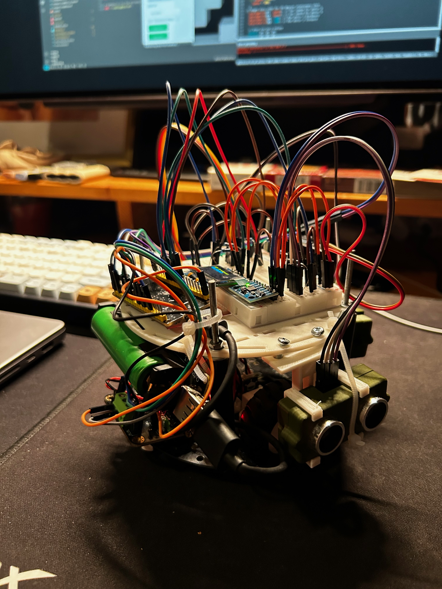

#### Components List

- **Core Components**:
  - ESP32-WROOM-32 module (Refer to the datasheet at [Espressif](https://www.espressif.com/sites/default/files/documentation/esp32-wroom-32_datasheet_en.pdf))
  - 3D printed parts from Thingiverse ([hc-sr04](https://www.thingiverse.com/thing:3436448/files), [top plate + alternative for the robot kit](https://www.thingiverse.com/thing:2544002))
  - Motor Driver - available at [DFRobot](https://www.dfrobot.com/product-66.html)
  - 2WD robot kit - available at [DFRobot](https://www.dfrobot.com/product-367.html)
  - Mini OlED screen - available at [Amazon](https://www.amazon.com.be/dp/B0BB1T23LF)
  - Sensors - available at [Amazon](https://www.amazon.com.be/dp/B07XF4815H)
  - Battery For ESP 32 - available at [Amazon](https://www.amazon.com.be/dp/B09Q4ZMNLW)
- **Supplementary Materials**: List of additional materials like screws, wires, and tools required for assembly.
  - 4mm thick screws 5mm long to hold the wood together - available at [brico](https://www.brico.be/nl/gereedschap-installatie/ijzerwaren/schroeven/universele-schroeven/sencys-universele-schroeven-torx-staal-gegalvaniseerd-20-x-4-mm-30-stuks/5368208)
  - m3 bolt & nuts - available at [brico](https://www.brico.be/nl/gereedschap-installatie/ijzerwaren/bouten/sencys-cilinderkop-bout-gegalvaniseerd-staal-m3-x-12-mm-30-stuks/5367637)
  - wood for the maze - available at [brico](https://www.brico.be/nl/bouwmaterialen/hout/multiplex-panelen/sencys-vochtwerend-multiplex-paneel-topplex-250x122x1-8cm/5356349)

#### Wiring Guide

**esp32 pins**

```c
int E1 = 2; //PWM motor 1
int M1 = 17; //GPIO motor 1
int E2 = 19; //PWM motor 2
int M2 = 4; //GPIO motor 2

int sensor0Trig = 27; //GPIO right sensor
int sensor0Echo = 26; //GPIO right sensor

int sensor1Trig = 33; //GPIO left sensor
int sensor1Echo = 32; //GPIO left sensor

int sensor2Trig = 25; //GPIO front sensor
int sensor2Echo = 35; //GPIO front sensor

// OLED display and MPU6050 pins
#define SDA_PIN 21 // this is the default sda pin on the esp32
#define SCL_PIN 22 // this is the default scl pin on the esp32
```

**ESP32 Wiring:**

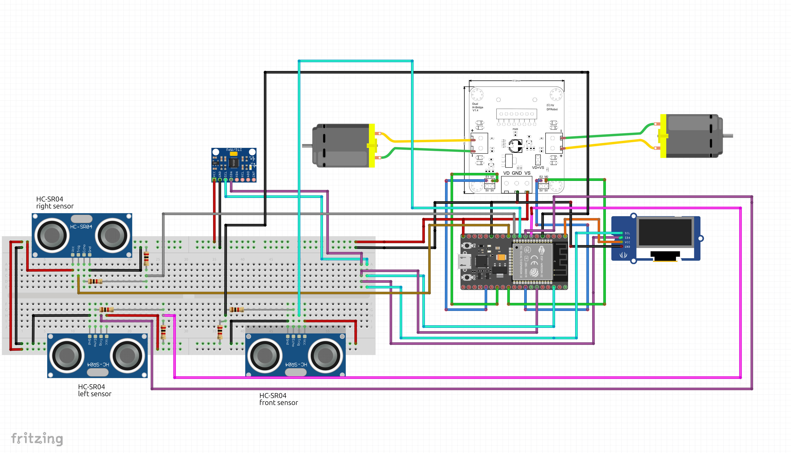

#### Software Configuration

2. **Library Installation:** Install the [ESP32_SSD1306](https://github.com/lexus2k/ssd1306/tree/master) library to support the OLED display functionality.
3. **Code Upload:** Transfer the scripts located in the [esp32](./esp32) folder to the ESP32 device. Modify the WiFi settings in the script to match your local network configuration for connectivity.

### Web Application Setup

#### Note

To ensure a seamless setup of the virtual display, it is recommended to execute `docker-compose down` following each session.

#### Steps

1. The web application's source code is stored within the [web app](./web_app/) directory. Access this directory:

   ```bash
   cd ./web_app/
   ```

2. To launch the Docker containers, use the following commands:

   ```bash
   docker-compose up -d
   ```

### Usage Instructions

1. Access the web application by navigating to <http://localhost:8500> or <http://localhost:5000> on your web browser.
2. Enter the ESP32's IP address within the web app and select the desired model for deployment.
3. The system provides an option for a virtual demonstration, allowing for operation without engaging the physical vehicle.
4. Initiate the maze navigation by clicking the `Start Maze` button.

A demonstration of the project is available [here](https://github.com/driessenslucas/researchproject/assets/91117911/b440b295-6430-4401-845a-a94186a9345f).

### Additional Information: Model Training

- Opt between utilizing a pre-trained model or conducting new training sessions using the script available in [train](./training/train.py).
- This training script is optimized for resource efficiency and can be executed directly on the Raspberry Pi.
- Upon completion, you will be prompted to save the new model. If saved, it will be stored within the [models](./web_app/models) directory of the `web_app` folder.

\pagebreak

## Supplementary Materials

### Experiment Links

Below are links to video demonstrations and detailed documentation of the experiments conducted during this research.

- **Experiment E1 - Utilizing the MPU6050 Gyroscope for Precise Orientation, Test 1**:  
  \[22\]\label{ref22} <https://github.com/driessenslucas/researchproject/assets/91117911/32d9e29f-6d5a-4676-b609-2c08923ca1ac>

- **Experiment E2 - Utilizing the MPU6050 Gyroscope for Precise Orientation, Test 2**:  
  \[23\]\label{ref23} <https://github.com/driessenslucas/researchproject/assets/91117911/624b40f2-bee8-49f6-961d-1f72ab18fe13>

- **Experiment E3 - Addressing Persistent Alignment Issue, Test 1**:  
  \[24\]\label{ref24} <https://github.com/driessenslucas/researchproject/assets/91117911/bb9aa643-9620-4979-a70c-ec2826c7dd33>

- **Experiment E4 - Addressing Persistent Alignment Issue, Test 2**:  
  \[25\]\label{ref25} <https://github.com/driessenslucas/researchproject/assets/91117911/689b590f-3a9a-4f63-ba9c-978ddd08ab53>

- **Experiment E5 - Addressing Persistent Alignment Issue, Test 3**:  
  \[26\]\label{ref26} <https://github.com/driessenslucas/researchproject/assets/91117911/99da37df-d147-43dc-828f-524f55dc6f70>

- **Experiment E6 - Enhancing Movement Precision with Encoders, Test 1**:  
  \[27\]\label{ref27} <https://github.com/driessenslucas/researchproject/assets/91117911/9728e29a-d2fa-48fa-b6e0-e2e1da92228f>

- **Experiment E7 - Enhancing Movement Precision with Encoders, Test 2**:  
  \[28\]\label{ref28} <https://github.com/driessenslucas/researchproject/assets/91117911/b9ce2cc3-85fd-4136-8670-516c123ba442>

- **Experiment E8 - Malfunction During Encoder Testing**:  
  \[29\]\label{ref29} <https://github.com/driessenslucas/researchproject/assets/91117911/ae5129fa-c25f-4f89-92bb-4ee81df9f7a5>

- **Experiment E9 - Outdoor Maze Test, Uneven Surfaces Test 1**:  
  \[30\]\label{ref30} <https://github.com/driessenslucas/researchproject/assets/91117911/02df8a25-b7f0-4061-89b7-414e6d25d31c>

- **Experiment E10 - Outdoor Maze Test, Uneven Surfaces Test 2**:  
  \[31\]\label{ref31} <https://github.com/driessenslucas/researchproject/assets/91117911/187561a7-c0cb-4921-af3e-9c2c99cb0137>

- **Experiment E11 - Indoor Maze Test 1**:  
  \[32\]\label{ref32} <https://github.com/driessenslucas/researchproject/assets/91117911/ce0f47e9-26cd-459e-8b26-ff345d1ee96b>

- **Experiment E12 - Indoor Maze Test 2**:  
  \[33\]\label{ref33} <https://github.com/driessenslucas/researchproject/assets/91117911/ea4a9bff-e191-4ce2-b2cc-acc57c781fa3>

- **Experiment E13 - Indoor Maze Test 3**:  
  \[34\]\label{ref34} <https://github.com/driessenslucas/researchproject/assets/91117911/4783729f-10cc-4c61-afa4-71cfc93d5d3e>

- **Experiment E14 - Indoor Maze Test 4**:  
  \[35\]\label{ref35} <https://github.com/driessenslucas/researchproject/assets/91117911/77091cb5-dbc5-4447-abc2-dc820dc66188>

\pagebreak

## References

\[1\]\label{ref1} G. Brockman et al., "OpenAI Gym," arXiv preprint arXiv:1606.01540, 2016.

\[2\]\label{ref2} A. Dosovitskiy et al., "CARLA: An Open Urban Driving Simulator," in Proceedings of the 1st Annual Conference on Robot Learning, 2017.

\[3\]\label{ref3} H. Van Hasselt, A. Guez, and D. Silver, "Deep Reinforcement Learning with Double Q-learning," in Proceedings of the AAAI Conference on Artificial Intelligence, 2016.

\[4\]\label{ref4} J. Schulman et al., "Proximal Policy Optimization Algorithms," arXiv preprint arXiv:1707.06347, 2017.

\[5\]\label{ref5} J. Tobin et al., "Domain Randomization for Transferring Deep Neural Networks from Simulation to the Real World," in 2017 IEEE/RSJ International Conference on Intelligent Robots and Systems (IROS), 2017.

\[6\]\label{ref6} K. Bousmalis et al., "Using Simulation and Domain Adaptation to Improve Efficiency of Deep Robotic Grasping," in IEEE International Conference on Robotics and Automation (ICRA), 2018.

\[7\]\label{ref7} Y. Pan and Q. Yang, "A Survey on Transfer Learning," IEEE Transactions on Knowledge and Data Engineering, vol. 22, no. 10, pp. 1345-1359, Oct. 2010.

\[8\]\label{ref8} A. A. Rusu et al., "Sim-to-Real Robot Learning from Pixels with Progressive Nets," in Proceedings of the Conference on Robot Learning, 2016.

\[9\]\label{ref9} S. James et al., "Sim-to-Real via Sim-to-Sim: Data-efficient Robotic Grasping via Randomized-to-Canonical Adaptation Networks," in Proceedings of the 2019 International Conference on Robotics and Automation (ICRA), 2019.

\[10\]\label{ref10} F. Sadeghi and S. Levine, "(CAD)^2RL: Real Single-Image Flight without a Single Real Image," in Proceedings of Robotics: Science and Systems, 2016.

\[11\]\label{ref11} "Self Driving and Drifting RC Car using Reinforcement Learning," YouTube, Aug. 19, 2019. [Online Video]. Available: <https://www.youtube.com/watch?v=U0-Jswwf0hw>. [Accessed: Jan. 29, 2024].

\[12\]\label{ref12} Q. Song et al., "Autonomous Driving Decision Control Based on Improved Proximal Policy Optimization Algorithm," Applied Sciences, vol. 13, no. 11, Art. no. 11, Jan. 2023. [Online]. Available: <https://www.mdpi.com/2076-3417/13/11/6400>. [Accessed: Jan. 29, 2024].

\[13\]\label{ref13} DailyL, "Sim2Real_autonomous_vehicle," GitHub repository, Nov. 14, 2023. [Online]. Available: <https://github.com/DailyL/Sim2Real_autonomous_vehicle>. [Accessed: Jan. 29, 2024].

\[14\]\label{ref14} "OpenGL inside Docker containers, this is how I did it," Reddit, r/docker. [Online]. Available: <https://www.reddit.com/r/docker/comments/8d3qox/opengl_inside_docker_containers_this_is_how_i_did/>. [Accessed: Jan. 29, 2024].

\[15\]\label{ref15} M. A. Dharmasiri, "Micromouse from scratch | Algorithm- Maze traversal | Shortest path | Floodfill," Medium, [Online]. Available: <https://medium.com/@minikiraniamayadharmasiri/micromouse-from-scratch-algorithm-maze-traversal-shortest-path-floodfill-741242e8510>. [Accessed: Jan. 29, 2024].

\[16\]\label{ref16} "Reinforcement Learning with Multi-Fidelity Simulators -- RC Car," YouTube, Dec. 30, 2014. [Online Video]. Available: <https://www.youtube.com/watch?v=c_d0Is3bxXA>. [Accessed: Jan. 29, 2024].

\[17\]\label{ref17} W. Zhao, J. P. Queralta, and T. Westerlund, "Sim-to-Real Transfer in Deep Reinforcement Learning for Robotics: A Survey," in 2020 IEEE Symposium Series on Computational Intelligence (SSCI), Dec. 2020, pp. 737–744. [Online]. Available: <https://arxiv.org/pdf/2009.13303.pdf>.

\[18\]\label{ref18} R. S. Sutton and A.G. Barto, Reinforcement Learning: An Introduction, 2nd ed. Cambridge, MA: The MIT Press, 2018.

\[19\]\label{ref19} H. van Hasselt, A. Guez, D. Silver, et al., "Deep Reinforcement Learning with Double Q-learning," arXiv preprint arXiv:1509.06461, 2015.

\[20\]\label{ref20} Papers With Code, "Double DQN Explained," [Online]. Available: <https://paperswithcode.com/method/double-dqn>.

\[21\]\label{ref21} D. Jayakody, "Double Deep Q-Networks (DDQN) - A Quick Intro (with Code)," 2020. [Online]. Available: <https://dilithjay.com/blog/2020/04/18/double-deep-q-networks-ddqn-a-quick-intro-with-code/>.
