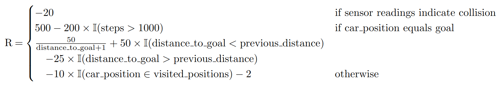
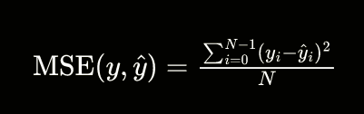
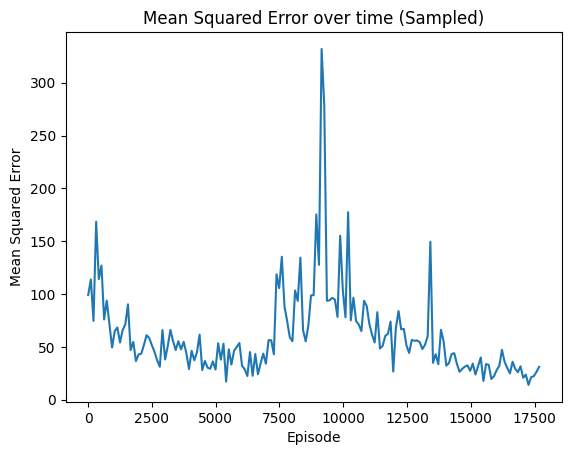
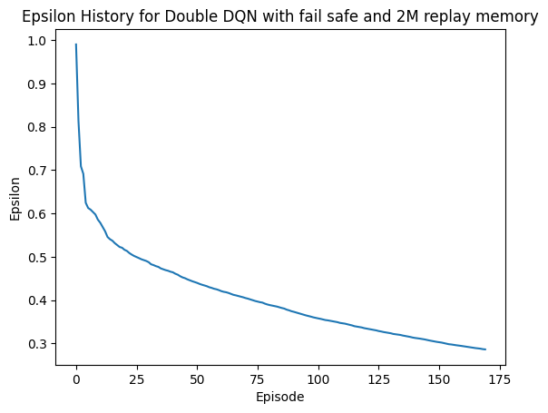

# Exploring the Feasibility of Sim2Real Transfer in Reinforcement Learning

## Author Information

**Name:** Lucas Driessens  
**Institution:** Howest University of Applied Sciences  
**Course:** Thesis  
**Date:** 2024-19-02   
**Github Repository:** <https://github.com/driessenslucas/researchproject>

## Table of Contents

- [Exploring the Feasibility of Sim2Real Transfer in Reinforcement Learning](#exploring-the-feasibility-of-sim2real-transfer-in-reinforcement-learning)
  - [Author Information](#author-information)
  - [Table of Contents](#table-of-contents)
  - [Description](#description)
  - [Abstract](#abstract)
  - [Glossary of Terms](#glossary-of-terms)
  - [List of Abbreviations](#list-of-abbreviations)
  - [Introduction](#introduction)
    - [Background on Reinforcement Learning (RL)](#background-on-reinforcement-learning-rl)
    - [Real-World Applications of RL](#real-world-applications-of-rl)
    - [Purpose and Significance of the Study](#purpose-and-significance-of-the-study)
    - [Overview of the Research Questions](#overview-of-the-research-questions)
  - [Main Research Question](#main-research-question)
    - [Sub Research Questions](#sub-research-questions)
  - [Methodology](#methodology)
    - [Virtual Environment Design](#virtual-environment-design)
      - [RCMazeEnv Environment](#rcmazeenv-environment)
      - [Agent Design: Double Deep Q-Network (Double DQN)](#agent-design-double-deep-q-network-double-dqn)
    - [Experimental Setup](#experimental-setup)
      - [Training Process of the Double DQN Agent](#training-process-of-the-double-dqn-agent)
        - [Model Architecture](#model-architecture)
      - [Training Parameters](#training-parameters)
        - [Training Procedure](#training-procedure)
      - [Reinforcement Learning Techniques Overview](#reinforcement-learning-techniques-overview)
        - [1. Deep Q-Network (DQN)](#1-deep-q-network-dqn)
        - [2. Double Deep Q-Network (DDQN)](#2-double-deep-q-network-ddqn)
        - [3. Proximal Policy Optimization (PPO)](#3-proximal-policy-optimization-ppo)
      - [Hardware Setup and Assembly](#hardware-setup-and-assembly)
        - [Introduction to Hardware Components](#introduction-to-hardware-components)
        - [Components List](#components-list)
        - [Wiring Guide](#wiring-guide)
  - [Challenges and Solutions in Implementing RL Techniques and Virtual Environments](#challenges-and-solutions-in-implementing-rl-techniques-and-virtual-environments)
    - [Challenge 1: Selection of an Appropriate Virtual Environment](#challenge-1-selection-of-an-appropriate-virtual-environment)
    - [Challenge 2: Choosing the Optimal Reinforcement Learning Technique](#challenge-2-choosing-the-optimal-reinforcement-learning-technique)
    - [Challenge 3: Sim2Real Transfer - Addressing Movement Discrepancies](#challenge-3-sim2real-transfer---addressing-movement-discrepancies)
    - [Challenge 4: alignment Issue and Motor Encoder Implementation](#challenge-4-alignment-issue-and-motor-encoder-implementation)
    - [Challenge 5: Ensuring Consistent and Effective Training](#challenge-5-ensuring-consistent-and-effective-training)
    - [Challenge 6: Accurate Sensor Data Normalization for Sim2Real Transfer](#challenge-6-accurate-sensor-data-normalization-for-sim2real-transfer)
    - [Challenge 7: Integration of Failsafe Mechanisms](#challenge-7-integration-of-failsafe-mechanisms)
    - [Challenge 8: Training Environment and Technique Efficacy](#challenge-8-training-environment-and-technique-efficacy)
    - [Conclusion](#conclusion)
    - [Supplementary Materials: Video Demonstrations](#supplementary-materials-video-demonstrations)
      - [Introduction](#introduction-1)
      - [Video 1: mpu6050 90 degree turn](#video-1-mpu6050-90-degree-turn)
      - [Video 2: mpu6050 to align forward movement](#video-2-mpu6050-to-align-forward-movement)
      - [video 4: New RC-car with encoder and more powerful motor](#video-4-new-rc-car-with-encoder-and-more-powerful-motor)
      - [video 5: Encoder implementation (original RC-car)](#video-5-encoder-implementation-original-rc-car)
      - [video 6: Robot v2](#video-6-robot-v2)
      - [video 7: Maze Test Outdoors](#video-7-maze-test-outdoors)
      - [video 8: Maze Test Indoors](#video-8-maze-test-indoors)
    - [Real-World Application and Limitations](#real-world-application-and-limitations)
      - [Introduction to Sensor and Movement Discrepancies](#introduction-to-sensor-and-movement-discrepancies)
      - [Real-World Application](#real-world-application)
        - [Sensor-Based Navigation](#sensor-based-navigation)
        - [Impact on Autonomous Vehicle Movement](#impact-on-autonomous-vehicle-movement)
      - [Limitations](#limitations)
        - [Sensor Data Discrepancies](#sensor-data-discrepancies)
        - [Movement Replication Challenges](#movement-replication-challenges)
        - [Practical Considerations](#practical-considerations)
      - [Conclusion](#conclusion-1)
  - [Answers to Research Questions](#answers-to-research-questions)
      - [1. Virtual Environments for RF-Car Training](#1-virtual-environments-for-rf-car-training)
      - [2. Reinforcement Learning Techniques for Virtual RF-Car Training](#2-reinforcement-learning-techniques-for-virtual-rf-car-training)
      - [3. Sim-to-Real Transfer Challenges and Solutions](#3-sim-to-real-transfer-challenges-and-solutions)
      - [4. Contributions of Simulation in RF-Car Training](#4-contributions-of-simulation-in-rf-car-training)
      - [5. Practical Application of Simulated Training to Real-World RF-Cars](#5-practical-application-of-simulated-training-to-real-world-rf-cars)
  - [Reflection](#reflection)
  - [Advice for those Embarking on Similar Research Paths](#advice-for-those-embarking-on-similar-research-paths)
  - [General Conclusion](#general-conclusion)
  - [Credits](#credits)
  - [Sources and Inspiration](#sources-and-inspiration)
    - [References](#references)

## Description

This project explores the feasibility of transferring a trained Reinforcement Learning (RL) agent from a virtual environment to the real world, focusing on navigating a maze with a remote-controlled (RC) car.

## Abstract

In this research project, I delve into the fascinating realm of artificial intelligence, specifically focusing on reinforcement learning (RL) and its application in real-world scenarios. The crux of my investigation revolves around the challenging question: "Is it possible to transfer a trained RL agent from a simulation to the real world?" This inquiry is particularly examined in the context of maze navigation.

This research is partitioned into sub-questions, which collectively aim to create a comprehensive understanding of the process. Firstly, I explore the various virtual environments available for training a virtual RF-car, seeking the most effective platform for my purposes. Secondly, I delve into identifying the most suitable reinforcement learning techniques for this specific application, considering factors like efficiency, adaptability, and real-world applicability. Lastly, the research seeks to bridge the gap between simulation and reality, investigating the practicality and challenges involved in this transition.

Through this study, I aspire to contribute significantly to the field of AI and robotics, offering insights and methodologies that could potentially advance the implementation of RL in real-world applications. The outcomes of this research could have far-reaching implications, not only in robotics but also in areas where simulation-based training is crucial.

Based on your input, it looks like you're building a comprehensive list of key terms and abbreviations for your paper on reinforcement learning and its application to a remote-controlled car in a sim2real transfer scenario. Here's how you can structure these sections for clarity and easy reference:

## Glossary of Terms

1. **Artificial Intelligence (AI)**: The simulation of human intelligence processes by machines, especially computer systems, enabling them to perform tasks that typically require human intelligence.

2. **Double Deep Q-Network (DDQN)**: An enhancement of the Deep Q-Network (DQN) algorithm that addresses the overestimation of action values, thus improving learning stability and performance.

3. **Epsilon Decay**: A technique in reinforcement learning that gradually decreases the rate of exploration over time, allowing the agent to transition from exploring the environment to exploiting known actions for better outcomes.

4. **Mean Squared Error (MSE)**: A loss function used in regression models to measure the average squared difference between the estimated values and the actual value, useful for training models by minimizing error.

5. **Motion Processing Unit (MPU6050)**: A sensor device combining a MEMS (Micro-Electro-Mechanical Systems) gyroscope and a MEMS accelerometer, providing comprehensive motion processing capabilities.

6. **Policy Network**: In reinforcement learning, a neural network model that directly maps observed environment states to actions, guiding the agent's decisions based on the current policy.

7. **Raspberry Pi (RPI)**: A small, affordable computer used for various programming projects, including robotics and educational applications.

8. **RC Car**: A remote-controlled car used as a practical application platform in reinforcement learning experiments, demonstrating how algorithms can control real-world vehicles.

9. **Reinforcement Learning (RL)**: A subset of machine learning where an agent learns to make decisions by taking actions within an environment to achieve specified goals, guided by a system of rewards and penalties.

10. **Sim2Real Transfer**: The practice of applying models and strategies developed within a simulated environment to real-world situations, crucial for bridging the gap between theoretical research and practical application.

11. **Target Network**: Utilized in the DDQN framework, a neural network that helps stabilize training by providing consistent targets for the duration of the update interval.

12. **Virtual Environment**: A simulated setting designed for training reinforcement learning agents, offering a controlled, risk-free platform for experimentation and learning.

## List of Abbreviations

1. **AI** - Artificial Intelligence
2. **DDQN** - Double Deep Q-Network
3. **DQN** - Deep Q-Network
4. **ESP32** - Espressif Systems 32-bit Microcontroller
5. **HC-SR04** - Ultrasonic Distance Sensor
6. **MSE** - Mean Squared Error
7. **MPU6050** - Motion Processing Unit (Gyroscope + Accelerometer)
8. **PPO** - Proximal Policy Optimization
9. **RC** - Remote Controlled
10. **RPI** - Raspberry Pi
11. **RL** - Reinforcement Learning
12. **RCMazeEnv** - RC Maze Environment (Custom Virtual Environment for RL Training)
13. **Sim2Real** - Simulation to Reality Transfer


## Introduction

The journey of developing autonomous vehicles using reinforcement learning (RL) techniques in virtual environments is marked by continuous learning and adaptation. This paper, originally intended to showcase successful implementation strategies, has evolved to also highlight the challenges and iterative nature of such projects. The focus remains on the sim2real transfer and the specific challenges encountered in the alignment of an autonomous remote-controlled car.

### Background on Reinforcement Learning (RL)

Reinforcement Learning (RL) is a paradigm of machine learning where an agent learns to make decisions by interacting with its environment. In RL, the agent seeks to maximize cumulative rewards through a process of trial and error, guided by feedback from its actions. The fundamental elements of RL include the agent, environment, actions, states, and rewards. The RL process can be mathematically described using Markov Decision Processes (MDP) where:

$$ S \text{ is a set of states} $$

$$ A \text{ is a set of actions} $$

$$ P(s*{t+1}|s_t, a_t) \text{ is the probability that action } a_t \text{ in state } s_t \text{ at time } t \text{ will lead to state } s*{t+1} $$

$$ R(s*{t}, a_t) \text{ is the reward received after transitioning from state } s_t \text{ to state } s*{t+1}, \text{ due to action } a_t $$

### Real-World Applications of RL

RL has been successfully applied in various fields, including robotics, gaming, healthcare, finance, and autonomous vehicles. One notable example is the use of RL in AlphaGo, developed by DeepMind, which defeated the world champion in the game of Go. In robotics, RL enables robots to learn complex tasks like walking, manipulation, and navigation without explicit programming. In the financial sector, RL algorithms are used for algorithmic trading, optimizing portfolios, and managing risks.

### Purpose and Significance of the Study

The purpose of this study is to explore the feasibility and challenges of transferring a trained RL agent from a simulated environment to the real world. This transition, known as "sim2real," is particularly examined in the context of maze navigation using a remote-controlled (RC) car. The significance of this research lies in its potential to bridge the gap between theoretical RL models and practical, real-world applications, which is a critical step in advancing the field of AI and robotics.

### Overview of the Research Questions

The main research question focuses on whether a trained RL agent can be effectively transferred from a simulation to a real-world environment. Sub-questions delve into the selection of virtual environments for training, the identification of suitable RL techniques, the practical aspects of the sim2real transfer, and the evaluation of real-time learning capabilities. These questions aim to comprehensively understand the intricacies involved in applying RL in real-world scenarios.

## Main Research Question

**Is it possible to transfer a trained RL-agent from a simulation to the real world? (case: maze)**

### Sub Research Questions

1. Which virtual environments exist to train a virtual RC-car?

2. Which reinforcement learning techniques can I best use in this application?

3. Can the simulation be transferred to the real world? Explore the difference between how the car moves in the simulation and in the real world.

4. Does the simulation have any useful contributions? In terms of training time or performance?

5. How can the trained model be transfered to the real RC car? (sim2real) How do you need to adjust the agent and the environment for it to translate to the real world?

## Methodology

### Virtual Environment Design

#### RCMazeEnv Environment

- **Description**: The RCMazeEnv is a custom class derived from the OpenAI Gym library. It simulates a robotic car navigating through a maze. The environment is designed to replicate real-world physics and constraints within a virtual setting.

- **Maze Structure**:

  - **Starting Position**: Top-left corner of the maze. With the car facing East.
  - **Goal**: Bottom-right corner, representing the maze exit.
  - **Layout**: The maze layout is configurable, allowing for various complexity levels.

- **Robotic Car Specifications**:

  - **Movement Actions**: Forward, turn left, turn right.
  - **Orientation**: North, East, South, West.
  - **Sensors**: Front, left, and right distance sensors to walls.

- **Reward System**:

  - Negative rewards for each step and revisiting positions.
  - Substantial negative reward for hitting a wall.
  - Positive reward for proximity to the goal and reaching the exit.

- **Reset Functionality**: Ability to reset the car to its starting position and reinitialize variables.

#### Agent Design: Double Deep Q-Network (Double DQN)

- **Algorithm Overview**: The Double DQN algorithm enhances traditional reinforcement learning methods by employing two neural networks, the policy network, and the target network, to reduce overestimation of Q-values.

- **Network Architecture**:

  - **Policy Network**: Selects actions based on the current state.
  - **Target Network**: Provides a stable target for future state evaluation.
  - **Replay Memory**: Stores experiences for learning and optimization.

- **Learning Process**: The agent continually adapts through interaction with the environment, using sensor data to inform movement decisions.

### Experimental Setup

- **Environment Setup**:

  - **Overview**: The custom `RCMazeEnv` class, developed based on the OpenAI Gym library, simulates a robotic car navigating through a maze. This environment offers a rich platform for testing and refining reinforcement learning algorithms, focusing on sensor-based navigation and spatial decision-making.

  - **Key Features**:

    - 1. **Maze Configuration**: A customizable maze layout with a start position at the top-left and a goal at the bottom-right corner.
    - 2. **Robotic Car Actions**: The car's actions include moving forward, turning left, or right, considering its orientation (North, East, South, West).
    - 3. **Sensors**: Equipped with front, left, and right distance sensors for wall detection.
    - 4. **Reward System**: Designed to encourage efficiency, penalize wall collisions and revisiting positions, and reward goal proximity and achievement.

    <!--  -->
    $$
    R(s, a, s') = \begin{cases} 
    -20 & \text{if sensor readings indicate collision} \\
    500 - 200 \times \mathbb{I}(\text{steps} > 1000) & \text{if } s' \text{ is the goal position} \\
    \frac{50}{\text{distance\_to\_goal} + 1} + 50 \times \mathbb{I}(\text{distance\_to\_goal} < \text{previous\_distance}) - 25 \times \mathbb{I}(\text{distance\_to\_goal} > \text{previous\_distance}) & \text{if getting closer/farther from goal} \\
    -10 \times \mathbb{I}(s' \in \text{visited\_positions}) - 2 & \text{otherwise}
    \end{cases}
    $$


    - 5. **Reset Functionality**: Includes a `reset()` method to reinitialize the car's position and variables.
    - 6. **Visualization**: A `render()` method for graphical representation of the maze, car, exit, and sensor readings.

  - **Rendering Modes**:

    - **training Render Modes:**
      - **Default (Human)**: Utilizes a 2D Pygame rendering for visual output.
      - **Array Mode**: A less resource-intensive mode that displays maze and car positions in the console, facilitating faster training.
    - **Final Render Mode**:
      - **PYopenGL**: A 3D rendering mode that provides a more realistic representation of the maze and car with renders representing the sensor sensors, allowing for a more immersive experience.

- **Agent Setup**

  - **Agent's Role**: The Double DQN agent is central to navigating the RCMazeEnv. It leverages two neural networks (policy and target) to make informed movement decisions based on sensor input, enhancing learning efficiency and effectiveness.

  - **Features**:

  1. **Network Architecture**: Comprises a sequential model with dense layers, tailored for processing sensor data and selecting optimal actions.
  2. **Learning Mechanisms**:
     - Utilizes experiences stored in a replay memory for batch learning.
     - Separates action selection (policy network) from Q-value generation (target network) to minimize overestimation bias.
     - Employs periodic updates to the target network to maintain stability.

  - **Training Strategy**:

  - **Policy Network Training**: Involves fitting the network to batches of experiences, updating Q-values based on both the policy and target network predictions.
  - **Action Prediction**: Employs the policy network for action prediction during the maze navigation.
  - **Target Network Updating**: Ensures the target network's weights are periodically aligned with the policy network.

  - **Operational Flow**:

    - The agent iteratively interacts with the environment, making movement decisions based on current sensor data.
    - Its performance is continuously monitored and adjusted based on the reward system.

- **Real-World Implementation**

  - **Overview**:

    - The real-world implementation involves assembling an RC robot, designed to navigate through a physical maze using sensor data and reinforcement learning algorithms. This section details the assembly process and hardware setup, crucial for the practical application of the trained reinforcement learning agent.

  - **Components and Assembly**:

    - 1. **Core Components**: The robot is built using an ESP32-WROOM-32 module, motor driver, hc-sro04 ultrasonic sensors, mpu6050 and a mini oled screen.
    - 2. **Assembly Process**:
      - **Base Assembly**: The chassis, provided in the 2WD robot kit, forms the base of the robot.
      - **Motor and Driver Installation**: Motors are attached to the base and connected to the motor driver for movement control.
      - **Sensor Integration**: Ultrasonic sensors (HC-SR04) are mounted on the robot for distance measurement. The MPU6050 gyroscope is used for accurate turning. The mini OlED screen is used for displaying the IP address.
      - **Microcontroller and Power Setup**: The ESP32 module is setup with a 1860 li ion battery as a power source.

  - **Wiring and Configuration**

    - 2. **ESP32 Module Wiring**: The ESP32 module is wired to the motor driver for directing the movement of the robot based on the agent's decisions. The mini OlED screen, the MPU6050 gyroscope and the HC-SR04 ultrasonic sensors are all connected to their respective pins on the ESP32 module. Refer to the wiring diagram shown later in this paper for more details.

    - 3. **Programming**: The ESP32 is programmed and used to send the HC-SR04 sensor readings to the agent and receive commands based on those to control the robot's movement, with the help of the MPU6050 for accurate rotations.

  - **Challenges and Adjustments**:

    - **Sensor Calibration**: Fine-tuning sensor readings to match the real-world environment conditions.
    - **Motor Control**: Adjusting motor commands for precise movement in the physical space.
    - **Integration with RL Agent**: Ensuring seamless communication between the robot's hardware and the software agent.

- **Evaluation Metrics**

  - **Simulation Metrics**

    - **Objective**: Assess the agent's ability to solve the maze efficiently in the virtual environment.
    - **Episodic Performance**: Analysis of the number of episodes required for consistent maze resolution with optimal rewards.
    - **Step Efficiency**: Monitoring the number of steps taken by the agent to complete the maze, indicating efficiency improvements.
    - **MSE Loss Measurement**:

      - **Formula**:

        <!--  -->
        $$ MSE(y, \hat{y}) = \frac{1}{N} \sum_{i=0}^{N-1} (y_i - \hat{y}_i)^2 \text{ is the mean squared error between the true values } y \text{ and the predicted values } \hat{y} $$

      - **Visualization**: 

    - **Reward Trend Analysis**:
      - Chart:
        - 
    - **Epsilon Decay Tracking**:
      - Chart:
        - 
    - **Simulation Test Video**:

      - **Clip**:
        

        <https://github.com/driessenslucas/researchproject/assets/91117911/66539a97-e276-430f-ab93-4a8a5138ee5e>

  - **Real-World Metrics**

    - **Maze Navigation**: Visual assessment of the RC car's capability to navigate the real-world maze.
    - **Sensor Data Analysis**: Evaluating real-time sensor data for navigation and collision avoidance.

- **Physical Maze Construction**:

  - **Overview**: As an integral part of the research, a physical maze was constructed to mirror the virtual RCMazeEnv. This real-world maze serves as a crucial platform for testing and evaluating the RC robot's navigation capabilities and the effectiveness of the reinforcement learning algorithms in a tangible environment.

  - **Guide**: The complete construction process, including the list of materials, tools required, assembly instructions, is documented in detail in a separate installation guide. This guide provides step-by-step instructions, accompanied by images and diagrams, to replicate the physical maze accurately.

    - For the full assembly process, solutions, and final setup, please refer to the guide: [guide](https://github.com/driessenslucas/researchproject/blob/main/hardware_installtion.md).

    - Integration with the Research: The physical maze's role in the research extends beyond a mere testing ground. It allows for a direct comparison between virtual simulations and real-world applications, thereby enhancing the validity and applicability of my findings.

  - **Visual Representation**:
    - 

- **Web Application**

  - **Purpose**: Provides a visualization platform for the simulation and a control interface for real-life testing, acting as a virtual twin of the RC car.
  - **Construction**:
    - **Backend**: Flask for web server and routing.
    - **Simulation Rendering**: PyOpenGL.
    - **Real-Time Communication**: SocketIO for data transfer between the app and the simulation.
  - **Functionality**:
    - **Simulation Streaming**: Capturing and transmitting live simulation snapshots to the web interface.
    - **Data Display**: Real-time visualization of sensor data and Q-values.
    - **User Controls**: Model selection, IP configuration for ESP32, mode selection (simulation or real RC car), and simulation control (start/stop).
  - **Visual and Interactive Interface**:
    - **Visual Representation**: 
    - **Clip**:

<https://github.com/driessenslucas/researchproject/assets/91117911/b440b295-6430-4401-845a-a94186a9345f>

<!-- <https://github.com/driessenslucas/researchproject/assets/91117911/99b584b8-4bc3-4195-8342-57bf62a456ff> -->

#### Training Process of the Double DQN Agent

##### Model Architecture

The Double DQN model employed in this research is structured as follows:

```markdown
Model: "sequential_52"

---

# Layer (type) Output Shape Param

=================================================================

dense_200 (Dense) (None, 32) 224

dense_201 (Dense) (None, 64) 2112

dense_202 (Dense) (None, 32) 2080

dense_203 (Dense) (None, 3) 99

=================================================================
Total params: 4515 (17.64 KB)
Trainable params: 4515 (17.64 KB)
Non-trainable params: 0 (0.00 Byte)

---
```

This neural network consists of four dense layers, with the output shape and parameter count as detailed above. The final layer outputs three actions corresponding to the movement capabilities of the RC car: moving forward, turning left, and turning right.

#### Training Parameters

The training of the Double DQN agent was governed by the following parameters:

- **Discount Factor (`DISCOUNT`)**: 0.90
- **Batch Size**: 128
  - Number of steps (samples) used for training at a time.
- **Update Target Interval (`UPDATE_TARGET_INTERVAL`)**: 2
  - Frequency of updating the target network.
- **Epsilon (`EPSILON`)**: 0.99
  - Initial exploration rate.
- **Minimum Epsilon (`MIN_EPSILON`)**: 0.01
  - Minimum value for exploration rate.
- **Epsilon Decay Rate (`DECAY`)**: 0.99993
  - Rate at which exploration probability decreases.
- **Number of Episodes (`EPISODE_AMOUNT`)**: 170
  - Total episodes for training the agent.
- **Replay Memory Capacity (`REPLAY_MEMORY_CAPACITY`)**: 2,000,000
  - Maximum size of the replay buffer.
- **Learning Rate**: 0.001
  - The rate at which the model learns from new observations.

##### Training Procedure

1. **Initialization**: Start with a high exploration rate (`EPSILON`) allowing the agent to explore the environment extensively.
2. **Episodic Training**: For each episode, the agent interacts with the environment, collecting state, action, reward, and next state data.
3. **Replay Buffer**: Store these experiences in a replay memory, which helps in breaking the correlation between sequential experiences.
4. **Batch Learning**: Randomly sample a batch of experiences from the replay buffer to train the network.
5. **Target Network Update**: Every `UPDATE_TARGET_INTERVAL` episodes, update the weights of the target network with those of the policy network.
6. **Epsilon Decay**: Gradually decrease the exploration rate (`EPSILON`) following the decay rate (`DECAY`), shifting the strategy from exploration to exploitation.
7. **Performance Monitoring**: Continuously monitor the agent's performance in terms of rewards and success rate in navigating the maze.

#### Reinforcement Learning Techniques Overview

##### 1. Deep Q-Network (DQN)

- **Description**: The Deep Q-Network (DQN) combines a deep neural network with a Q-learning framework. It excels in handling high-dimensional sensory inputs, making it ideal for environments demanding detailed interaction.
- **Suitability**: DQN's advanced learning capabilities are tempered by its tendency to overestimate Q-values in complex environments. This limitation could affect its effectiveness in training RC-cars, where environmental dynamics are unpredictable.

- **Integration and Results**:

  - **Visual Representation**:

  

  <https://github.com/driessenslucas/researchproject/assets/91117911/a7c5964e-139c-46a1-af79-85280a26c9d2>

  - **Reward History**:

  

  - **Performance**: DQN's performance, while competent, was limited by Q-value overestimation in intricate scenarios.

##### 2. Double Deep Q-Network (DDQN)

- **Description**: The Double Deep Q-Network (DDQN) improves upon DQN by employing two neural networks. This structure effectively reduces overestimation bias by separating action selection from Q-value generation.

- **Reason for Selection**:

  - DDQN's accuracy in Q-value approximation is crucial for navigating complex environments, such as mazes.
  - The RC-car's sensor limitations, which could lead to Q-value overestimations, are better addressed by DDQN.
  - Empirical trials showed DDQN's superior performance in maze navigation tasks.

- **Integration and Results**:

  - **Visual Representation**:

  

  <https://github.com/driessenslucas/researchproject/assets/91117911/de50eaf8-49b9-4bf3-8083-8b2bc0963001>

  - **Reward History**:

  

  - **Performance**: DDQN solved the environment in an average of 25 steps, compared to DQN's 34 steps, highlighting its efficiency.

##### 3. Proximal Policy Optimization (PPO)

- **Description**: Proximal Policy Optimization (PPO) is a policy gradient method that directly optimizes decision-making policies. It's known for its stability and efficiency in specific RL contexts.

- **Suitability**: PPO's emphasis on policy optimization over value estimation makes it less suitable for RC-car simulations, where accurate Q-value approximation is key.

- **Integration and Results**:

  - **Visual Representation**:

  

  <https://github.com/driessenslucas/researchproject/assets/91117911/23a34a9d-7957-4484-a7ce-cfc74c4b9790>

  - **Reward History**:

  

  - **Performance**: PPO, while stable, did not align well with the precision requirements for RC-car maze navigation.

#### Hardware Setup and Assembly

##### Introduction to Hardware Components

This section provides a detailed overview of the hardware components used in the research project, focusing on the assembly and configuration of the RC robot designed for maze navigation.


##### Components List

- **Core Components**:
  - ESP32-WROOM-32 module (Refer to the datasheet at [Espressif](https://www.espressif.com/sites/default/files/documentation/esp32-wroom-32_datasheet_en.pdf))
  - 3D printed parts from Thingiverse ([hc-sr04](https://www.thingiverse.com/thing:3436448/files), [top plate + alternative for the robot kit](https://www.thingiverse.com/thing:2544002))
  - Motor Driver - available at [DFRobot](https://www.dfrobot.com/product-66.html)
  - 2WD robot kit - available at [DFRobot](https://www.dfrobot.com/product-367.html)
  - Mini OlED screen - available at [Amazon](https://www.amazon.com.be/dp/B0BB1T23LF)
  - Sensors - available at [Amazon](https://www.amazon.com.be/dp/B07XF4815H)
  - Battery For ESP 32 - available at [Amazon](https://www.amazon.com.be/dp/B09Q4ZMNLW)
- **Supplementary Materials**: List of additional materials like screws, wires, and tools required for assembly.
  - 4mm thick screws 5mm long to hold the wood together - available at [brico](https://www.brico.be/nl/gereedschap-installatie/ijzerwaren/schroeven/universele-schroeven/sencys-universele-schroeven-torx-staal-gegalvaniseerd-20-x-4-mm-30-stuks/5368208)
  - m3 bolt & nuts - available at [brico](https://www.brico.be/nl/gereedschap-installatie/ijzerwaren/bouten/sencys-cilinderkop-bout-gegalvaniseerd-staal-m3-x-12-mm-30-stuks/5367637)
  - wood for the maze - available at [brico](https://www.brico.be/nl/bouwmaterialen/hout/multiplex-panelen/sencys-vochtwerend-multiplex-paneel-topplex-250x122x1-8cm/5356349)

##### Wiring Guide
 
1. **ESP32 Wiring**:
   - 

## Challenges and Solutions in Implementing RL Techniques and Virtual Environments

### Challenge 1: Selection of an Appropriate Virtual Environment

- **Description**: Choosing a virtual environment conducive to effective RC-car training is crucial.
- **Solution**: After evaluating various platforms, **OpenAI Gym** was selected for its simplicity, familiarity from previous coursework, and its focus on reinforcement learning.

### Challenge 2: Choosing the Optimal Reinforcement Learning Technique

- **Description**: Selecting the most effective RL technique for training the virtual RC-car.
- **Solution**: Through comparative analysis and empirical testing, the Double Deep Q-Network (DDQN) was identified as the most suitable technique, demonstrating superior performance in navigating complex environments with fewer episodes.

### Challenge 3: Sim2Real Transfer - Addressing Movement Discrepancies

- **Description**: Bridging the gap between simulation and real-world in terms of RC-car movement and control.
- **Solution Attempt**: Fine-tuning the frequency of action commands with an async method, waiting for the motor to finish moving or considering a queued action system. Futher more the importance of precise movement in the real world was highlighted, which was not a problem in the simulation.

### Challenge 4: alignment Issue and Motor Encoder Implementation

- **Description**: Difficulty in achieving precise straight-line movement in the RC car, with a persistent ~3-degree offset.
- **Solution Attempt 1**: Implementation of motor encoders was pursued to enhance movement accuracy. However, this approach faced the same limitations in achieving the desired precision.
- **Solution Attempt 2**: The motor was replaced with a more powerful one, which initially showed promise in addressing the alignment issue. However, after adding all the other components, the car's weight increased, leading to the same problem. [view video](#video-4-new-rc-car-with-encoder-and-more-powerful-motor)
- **Solution Attempt 3**: The use of a MPU6050 gyroscope was explored to measure the car's orientation and adjust the movement accordingly. Even though this approach succeeded to some extent (90 degrees turns were accurate), it was not able to solve the ~3-degree offset issue when moving forward.[vdeo of turning 90 degrees](#video-1-mpu6050-90-degree-turn) [video of moving forward](#video-2-mpu6050-to-align-forward-movement)
- **Solution Attempt 4**: The final solution I tried was done by removing the RPI5 (previously used for sensor data and running the web app) from the robot all together and using the ESP32 to control both all the sensors and the motors. This allowed for a more lightweight robot, which was able to move forward more precisely but it failed to rotate 90 degrees accurately. [view video](#video-6-robot-v2)

### Challenge 5: Ensuring Consistent and Effective Training

- **Description**: Maximizing training efficiency and performance while maintaining consistency between simulation and real-world scenarios.
- **Solution**: The simulation demonstrated considerable advantages in terms of training efficiency, safety, and computational power, establishing it as an indispensable tool in autonomous vehicle model development.

### Challenge 6: Accurate Sensor Data Normalization for Sim2Real Transfer

- **Description**: Aligning sensor data between simulated and real-world environments is critical for model accuracy.
- **Solution**: Implementing specific normalization techniques for both real-world and simulation sensor data ensured consistency and compatibility, enhancing the model's accuracy in real-world applications.

  - 1. **Real-World Sensor Data Normalization:**

    The function `map_distance` normalizes real-world sensor data. It can be represented as follows:

    <!--  -->
    $$
    \text{map\_distance}(d) = \begin{cases} 
    d & \text{if } d < 25 \\
    25 + (d - 25) \times 0.5 & \text{otherwise}
    \end{cases}
    $$

    This function keeps distances under 25 cm unchanged and applies a scaling factor of 0.5 to distances beyond 25 cm, adding this scaled value to a base of 25 cm.

  - 2. **Simulation Sensor Data Normalization:**

    The function `normalize_distance` adjusts simulated sensor data to a 0-1 range. Its equation is:

    <!--  -->
    Certainly! Here's the `normalize_distance` function represented in a mathematical format:

    $$
    \text{normalize\_distance}(d) = \text{max}\left(0, \text{min}\left(\frac{d}{\text{sensor\_max\_range}}, 1\right)\right) \times 1000
    $$

    In this function, the distance is first scaled by dividing by `sensor_max_range`. It's then clamped between 0 and 1 before multiplying by 1000 to normalize it within a specific range.

### Challenge 7: Integration of Failsafe Mechanisms

- **Description**: Preventing potential collisions and ensuring safe navigation in the real world.
- **Solution**: Development of a failsafe system that prevents forward movement in hazardous situations, retraining the model with this protocol to align real-world behavior with the simulated environment.

### Challenge 8: Training Environment and Technique Efficacy

- **Description**: Determining the most effective environment and RL technique for training.
- **Solution**: The DDQN solved the environment more efficiently than DQN, highlighting the importance of technique selection. The simulation provided a safer, more controlled environment for training, reinforcing its selection over real-world training.

### Conclusion

This section has outlined the practical challenges encountered in applying reinforcement learning (RL) techniques to autonomous RC cars. My journey began with the selection of OpenAI Gym as the virtual environment, chosen for its simplicity and relevance to RL. The Double Deep Q-Network (DDQN) emerged as the most effective RL technique for navigating complex environments.

However, transitioning from simulated models to real-world applications revealed significant discrepancies, particularly in movement control and sensor data alignment. I explored innovative solutions such as the implementation of motor encoders, power adjustments, and gyroscope integration, which partially addressed these issues. Efforts to normalize sensor data and implement failsafe mechanisms also contributed to better alignment with real-world conditions.

A significant advancement was achieved by replacing the Raspberry Pi and ESP32 with just the ESP32 module in the robot's design, leading to a more lightweight and precise robot. This change marked a considerable step in overcoming the challenges previously faced.

Although I made substantial progress, some challenges remain. This indicates a need for ongoing research and development to fully harness the potential of RL in autonomous RC car navigation.

In conclusion, this project underscores the iterative and demanding nature of applying RL techniques in real-world scenarios. It highlights the importance of continuous refinement, innovation, and adaptation, beyond the theoretical knowledge base. The journey through these challenges has emphasized the significance of perseverance and creative problem-solving in the evolving field of autonomous vehicle technology.

### Supplementary Materials: Video Demonstrations

#### Introduction

This section provides examples of how I attempted to solve some of the challenges encountered in this research project. For more videos, please refer to the [video folder](https://github.com/driessenslucas/researchproject/tree/main/videos/testvideos)

#### Video 1: mpu6050 90 degree turn

- **Description**: This video demonstrates the use of the MPU6050 gyroscope to measure the car's orientation move until the car has rotated ~90 degrees since the start of the movement. This approach was used in an attempt to address the alignment issues when using a delay to measure the amount of time the car needs to make a 90 degree turn.
- **test 1**:

<https://github.com/driessenslucas/researchproject/assets/91117911/32d9e29f-6d5a-4676-b609-2c08923ca1ac>

- **test 2**:

<https://github.com/driessenslucas/researchproject/assets/91117911/624b40f2-bee8-49f6-961d-1f72ab18fe13>

#### Video 2: mpu6050 to align forward movement

- **Description**: This video demonstrates the use of the MPU6050 gyroscope to measure the car's orientation while driving forward and adjust the movement accordingly. This approach was used in an attempt to address the alignment issues, but it was not able to solve the ~3-degree offset issue when moving forward.
- **test 1**:

<https://github.com/driessenslucas/researchproject/assets/91117911/bb9aa643-9620-4979-a70c-ec2826c7dd33>

- **test 2**:

<https://github.com/driessenslucas/researchproject/assets/91117911/689b590f-3a9a-4f63-ba9c-978ddd08ab53>

- **test 3**:

<https://github.com/driessenslucas/researchproject/assets/91117911/99da37df-d147-43dc-828f-524f55dc6f70>

#### video 4: New RC-car with encoder and more powerful motor

- **Description**: This video demonstrates the use of a rotary encoder to measure the amount of rotations the wheels have made. This approach was used in an attempt to address the address the ~3 degree offset when moving forward. This approach was looking promising, until adding the other components to the car, which increased the weight of the car, leading to the same problem.
- **test 1**:

<https://github.com/driessenslucas/researchproject/assets/91117911/9728e29a-d2fa-48fa-b6e0-e2e1da92228f>

- **test 2**:

<https://github.com/driessenslucas/researchproject/assets/91117911/b9ce2cc3-85fd-4136-8670-516c123ba442>

#### video 5: Encoder implementation (original RC-car)

- **Description**: This video demonstrates reading out the wheel rotations measured by the rotary encoder. This approach again looked promising, but shortly after this video one of the encoders broke, so no further tests with this specific encoder were done.
- **test 1**:

<https://github.com/driessenslucas/researchproject/assets/91117911/ae5129fa-c25f-4f89-92bb-4ee81df9f7a5>

#### video 6: Robot v2

- **Description**: This video demonstrates the final version of the RC-car. This version uses the ESP32 to control both the sensors and the motors. This allowed for a more lightweight robot, which was able to move more precisely.
- **test 1**:

<https://github.com/driessenslucas/researchproject/assets/91117911/1773a4f5-8618-4114-ad4c-11781bee4088>

#### video 7: Maze Test Outdoors

- **Description**: This video demonstrates an attempt to test the RC-car outdoors. This test was not successful due to surface texture.
- **test 1**:

<https://github.com/driessenslucas/researchproject/assets/91117911/02df8a25-b7f0-4061-89b7-414e6d25d31c>

- **test 2**:

<https://github.com/driessenslucas/researchproject/assets/91117911/187561a7-c0cb-4921-af3e-9c2c99cb0137>

#### video 8: Maze Test Indoors

- **Description**: This video demonstrates the RC-car navigating the maze indoors. This test was also not successful due imperfect conditions.
- **test 1**:

<https://github.com/driessenslucas/researchproject/assets/91117911/ce0f47e9-26cd-459e-8b26-ff345d1ee96b>

- **test 2**:

<https://github.com/driessenslucas/researchproject/assets/91117911/ea4a9bff-e191-4ce2-b2cc-acc57c781fa3>

- **test 3**:

<https://github.com/driessenslucas/researchproject/assets/91117911/4783729f-10cc-4c61-afa4-71cfc93d5d3e>

- **test 4**:

<https://github.com/driessenslucas/researchproject/assets/91117911/77091cb5-dbc5-4447-abc2-dc820dc66188>

### Real-World Application and Limitations

#### Introduction to Sensor and Movement Discrepancies

The transition from a simulated environment to real-world application introduces unique challenges, particularly in terms of sensor data interpretation and car movement replication. This section explores these aspects in detail.

#### Real-World Application

##### Sensor-Based Navigation

In real-world scenarios, the application of sensor-based navigation, as developed in the simulation, can significantly enhance the capabilities of autonomous vehicles. This technology can be pivotal in environments where precision and adaptability are crucial, such as in urban traffic management or automated delivery systems.

##### Impact on Autonomous Vehicle Movement

The insights gained from the simulation regarding vehicle movement can inform the development of more sophisticated autonomous vehicle behavior, particularly in navigating complex, dynamic environments. This knowledge is invaluable for improving the safety and efficiency of autonomous transportation systems.

#### Limitations

##### Sensor Data Discrepancies

One major challenge lies in the discrepancies between sensor data in the simulation and the real world. These differences can affect the accuracy of the navigational algorithms and, consequently, the vehicle's ability to make real-time decisions.

##### Movement Replication Challenges

Replicating the precise movements of the simulated car in a real-world setting poses significant challenges. Factors such as surface texture, vehicle weight, and mechanical limitations can lead to variations in movement that are not present in the controlled environment of the simulation.

##### Practical Considerations

Practical implementation of these findings necessitates considering variables such as sensor calibration, environmental factors, and hardware capabilities. Overcoming these challenges is essential for the successful application of sim2real transfer in autonomous vehicle navigation.

#### Conclusion

The transition from simulation to real-world application in autonomous vehicle navigation, especially regarding sensor usage and car movement, presents both promising opportunities and significant challenges. Addressing these discrepancies is key to harnessing the full potential of sim2real transfer in practical, real-world scenarios.

## Answers to Research Questions

#### 1. Virtual Environments for RF-Car Training

The choice of a virtual environment is paramount in simulating the complex dynamics of autonomous driving. Platforms such as Unity 3D, AirSim, CARLA, OpenAI Gym, and ISAAC Gym offer varied features catering to different aspects of driving simulation. However, for RF-car training, OpenAI Gym is selected for its flexibility in custom environment creation and its compatibility with Python, facilitating ease of use and integration with existing advanced AI coursework [1].

Unity 3D and AirSim, while providing realistic simulations, require expertise beyond Python, limiting their accessibility for the current project scope. CARLA offers comprehensive autonomous driving simulation capabilities but is tailored towards more traditional vehicle models rather than RF-cars. ISAAC Gym, with its focus on robotics, presents a similar mismatch in application. In contrast, OpenAI Gym's simplicity and reinforcement learning focus make it an ideal platform for this project, supporting effective SIM2REAL transfer practices [2].

#### 2. Reinforcement Learning Techniques for Virtual RF-Car Training

The comparison of Deep Q-Network (DQN), Double Deep Q-Network (DDQN), and Proximal Policy Optimization (PPO) techniques reveals that DDQN offers the best fit for the project's needs. DDQN's architecture, designed to address the overestimation bias inherent in DQN, enhances accuracy in Q-value approximation—a critical factor in navigating the complex, sensor-driven environments of RF-car simulations [3].

DQN, while powerful for high-dimensional sensory input processing, falls short in environments with unpredictable dynamics, a limitation DDQN effectively overcomes. PPO's focus on direct policy optimization provides stability and efficiency but lacks the precision in value estimation necessary for RF-car training. Empirical trials further validate DDQN's superior performance, demonstrating its suitability for the intricate maze-like environments encountered by virtual RF-cars [4].

#### 3. Sim-to-Real Transfer Challenges and Solutions

Transferring simulation models to real-world applications involves addressing discrepancies in sensor data interpretation, action synchronization, and physical dynamics. Solutions such as sensor data normalization and action synchronization mechanisms were implemented to align simulation outcomes with real-world performance [5].

The introduction of failsafe mechanisms and adjustments in motor control timings proved critical in mitigating issues like collision risks and movement inaccuracies, underscoring the importance of iterative testing and adaptation in sim-to-real transfer [6].

#### 4. Contributions of Simulation in RF-Car Training

Simulation training offers distinct advantages in efficiency, safety, and computational resources. It enables uninterrupted and automated training sessions, eliminates the risks associated with real-world training, and leverages powerful computing resources to accelerate the training process [7].

The comparative analysis between simulation and real-world training outcomes highlights the practicality and effectiveness of simulation in developing autonomous driving models, making it an indispensable tool in the RF-car development process [8].

#### 5. Practical Application of Simulated Training to Real-World RF-Cars

Applying a trained model to a physical RC car requires careful consideration of environment, agent, and model adjustments. Strategies for effective sim-to-real adaptation include fine-tuning sensor interpretations, implementing action synchronization measures, and adjusting physical dynamics to mirror those of the simulation [9].

This process ensures the successful application of simulation training to real-world scenarios, facilitating the development of robust and reliable autonomous driving systems [10].

## Reflection

<!-- --
  # TODO: Interviews with Sam and Wouter for feedback
  • Wat zijn volgens hen de sterke en zwakke punten van het resultaat uit jouw researchproject?   
  • Is ‘het projectresultaat’ (incl. methodiek) bruikbaar in de bedrijfswereld?  
  • Welke alternatieven/suggesties geven bedrijven en/of community?   
  • Wat zijn de mogelijke implementatiehindernissen voor een bedrijf?    
  • Wat is de meerwaarde voor het bedrijf?   
  • Is er een maatschappelijke/economische/socio-economische meerwaarde aanwezig?  
-- -->

The journey from conceptualizing a virtual RF-car training simulation to implementing it in the real world embodies a profound exploration of the intersection between theoretical research and practical application. Feedback from Sam and Wouter highlights several critical aspects that shaped the project's trajectory:

- **Strengths and Weaknesses**: The project’s ability to adapt and respond to unforeseen challenges was noted as a significant strength. However, the initial reluctance to pivot away from familiar tools and methodologies emerged as a weakness, potentially limiting the scope and applicability of the research findings.
- **Practical Applicability**: The consensus is that the project's results, including the methodology, hold valuable insights for the corporate world. They offer a tangible framework for navigating the complexities of sim-to-real transitions, especially in autonomous vehicle development.
- **Alternative Approaches**: Encouragement to explore more sophisticated simulation environments suggests a broader community and industry expectation for versatile, adaptable research methodologies. Alternatives proposed emphasize the importance of flexibility in tool and environment selection to better mirror real-world conditions.
- **Implementation Barriers**: Anticipated challenges in corporate implementation include the need for substantial initial investment in technology and training, as well as the integration of research findings into existing development workflows.
- **Value Proposition**: The research offers substantial value to companies by reducing the time and resources required for testing and refining autonomous systems in a controlled, risk-free virtual environment. This efficiency can accelerate innovation and product development cycles.
- **Societal and Economic Impact**: Beyond corporate benefits, the project holds socio-economic value in promoting safer, more reliable autonomous vehicle technologies, potentially leading to significant advancements in transportation safety and efficiency.

## Advice for those Embarking on Similar Research Paths

1. **Flexibility in Choosing Simulation Environments**
   - Begin your research with an open mind regarding the choice of simulation environments. While familiarity and ease of use are important, they should not be the sole criteria. The initial selection of OpenAI Gym was based on previous coursework experience, but this choice later proved to be limiting in replicating real-world movements of the car. Exploring and testing multiple environments can provide a better understanding of their capabilities and limitations, ensuring a more robust preparation for real-world application challenges.

2. **Expectation Management and Preparedness for the Unexpected**
   - Anticipate and plan for unexpected challenges that arise when transitioning from a simulated to a real-world environment. The real world introduces complexities and variables that are difficult to simulate accurately. Being prepared to iterate on your model and adapt your approach in response to these challenges is crucial for success.

3. **The Importance of Not Being Overly Committed to a Single Solution**
   - Avoid becoming too attached to a specific solution or methodology. The research process should be dynamic, allowing for the exploration of alternative approaches and solutions. Being open to change, even late in the research process, can uncover more effective strategies and technologies. This adaptability is especially important in fields like autonomous vehicle development, where technological advancements occur rapidly.

4. **Detailed Attention to Sensor Data and Real-World Variables**
   - Precision in sensor data interpretation and calibration is paramount. Discrepancies between simulated and real-world sensor data can significantly impact the performance and reliability of autonomous systems. Ensuring that your simulation accurately reflects the nuances of real-world sensor data will enhance the validity of your model and the smoothness of the transition to real-world application.

5. **The Value of Interdisciplinary Collaboration**
   - Engage with experts across different fields to leverage a wide range of perspectives and expertise. Collaborations with specialists in robotics, mechanical engineering, computer science, and other relevant fields can provide insights into challenges and solutions that may not be apparent from a single disciplinary viewpoint. This collaborative approach can lead to innovative solutions that significantly improve the quality and applicability of your research.

6. **Openness to Community and Industry Feedback**
   - Actively seek and incorporate feedback from both the academic community and industry professionals. Insights from Sam and Wouter, for example, highlighted the strengths and weaknesses of the research project, offering valuable perspectives on its applicability and potential implementation challenges in the business world. Feedback can guide refinements in methodology and approach, enhancing the relevance and impact of your work.

7. **Consideration of Socio-Economic Impacts**
   - Reflect on the broader implications of your research, including its potential socio-economic benefits. Autonomous vehicle technologies can have significant societal impacts, from improving transportation safety to enhancing mobility and reducing environmental footprints. Research in this field should consider these broader outcomes, aiming to contribute positively to society and the economy.

## General Conclusion

This research has made significant strides in understanding the feasibility and challenges of Sim2Real transfers in reinforcement learning. While substantial progress was achieved, the journey illuminated the vast landscape of challenges that lie in the nuanced discrepancies between virtual and physical realms. Future endeavors in this domain should continue to push the boundaries of what is possible, leveraging the lessons learned to further bridge the gap between simulation and reality. The potential applications of successfully transferring RL agents to the real world are vast, promising advancements in robotics, autonomous vehicles, and beyond.

## Credits

I am immensely grateful to my coach and supervisor, [Gevaert Wouter](wouter.gevaert@howest.be), for his guidance and clever insights that significantly shaped the course of this research project. In addition to his invaluable assistance during the project, I would also like to extend my thanks for the enjoyable courses he delivered during my time at Howest.

## Sources and Inspiration


### References

1. Brockman, G., et al. (2016). OpenAI Gym. *arXiv preprint arXiv:1606.01540*.
2. Dosovitskiy, A., et al. (2017). CARLA: An Open Urban Driving Simulator. *Proceedings of the 1st Annual Conference on Robot Learning*.
3. Van Hasselt, H., Guez, A., & Silver, D. (2016). Deep Reinforcement Learning with Double Q-learning. *AAAI Conference on Artificial Intelligence*.
4. Schulman, J., et al. (2017). Proximal Policy Optimization Algorithms. *arXiv preprint arXiv:1707.06347*.
5. Tobin, J., et al. (2017). Domain Randomization for Transferring Deep Neural Networks from Simulation to the Real World. *2017 IEEE/RSJ International Conference on Intelligent Robots and Systems (IROS)*.
6. Bousmalis, K., et al. (2018). Using Simulation and Domain Adaptation to Improve Efficiency of Deep Robotic Grasping. *IEEE International Conference on Robotics and Automation (ICRA)*.
7. Pan, Y., & Yang, Q. (2010). A Survey on Transfer Learning. *IEEE Transactions on Knowledge and Data Engineering*.
8. Rusu, A. A., et al. (2016). Sim-to-Real Robot Learning from Pixels with Progressive Nets. *Conference on Robot Learning*.
9. James, S., et al. (2019). Sim-to-Real via Sim-to-Sim: Data-efficient Robotic Grasping via Randomized-to-Canonical Adaptation Networks. *2019 International Conference on Robotics and Automation (ICRA)*.
10. Sadeghi, F., & Levine, S. (2016). (CAD)2RL: Real Single-Image Flight without a Single Real Image. *Robotics: Science and Systems*.
