# Installation Guide for Rc robot

## Table of Contents

- [Installation Guide for Rc robot](#installation-guide-for-rc-robot)
  - [Table of Contents](#table-of-contents)
  - [Introduction](#introduction)
  - [Safety Precautions](#safety-precautions)
  - [Components List](#components-list)
  - [Tools Required](#tools-required)
  - [Assembly Instructions](#assembly-instructions)
    - [Step 1: Base Assembly](#step-1-base-assembly)
    - [Step 2: Attach Motor Driver](#step-2-attach-motor-driver)
    - [Step 3: Attach ESP32-WROOM-32 module to the motor driver](#step-3-attach-esp32-wroom-32-module-to-the-motor-driver)
    - [Step 4: Cut the support beams](#step-4-cut-the-support-beams)
    - [Step 5: Screw in the supports on the bottom of the bottom plate](#step-5-screw-in-the-supports-on-the-bottom-of-the-bottom-plate)
    - [Step 6: Mount all the supports on the bottom plate](#step-6-mount-all-the-supports-on-the-bottom-plate)
    - [Step 7: Attach the top plate (you will need to drill holes so that the supports can fit through the top plate)](#step-7-attach-the-top-plate-you-will-need-to-drill-holes-so-that-the-supports-can-fit-through-the-top-plate)
    - [Step 8: Attach the ultrasonic sensor to the top plate](#step-8-attach-the-ultrasonic-sensor-to-the-top-plate)
    - [Step 9: place the esp32 on the top plate togheter with a mini breadboard for the sensor wires](#step-9-place-the-esp32-on-the-top-plate-togheter-with-a-mini-breadboard-for-the-sensor-wires)
  - [Wiring Guide](#wiring-guide)
    - [ESP32 Wiring](#esp32-wiring)
      - [esp32 pins](#esp32-pins)
  - [Building the maze](#building-the-maze)
    - [final result](#final-result)
    - [prerequisites](#prerequisites)
    - [Step 1: calculations](#step-1-calculations)
    - [step 2: cut the wood](#step-2-cut-the-wood)
    - [step 3: screw the wood together](#step-3-screw-the-wood-together)

## Introduction

This guide provides step-by-step instructions for assembling and configuring the RC robot used in our research project. The RC robot, powered by ESP32-WROOM-32 module, controlled by a web app is designed to navigate a maze using a combination of onboard sensors and reinforcement learning algorithms.

## Safety Precautions

- Always disconnect the device from the power source before assembling or disassembling.
- Be cautious of sharp edges on the metal or plastic parts.
- Handle the battery with care. Do not puncture, disassemble, short contacts, dispose of in fire, or expose to high temperatures.

## Components List

- ESP32-WROOM-32 module (Refer to the datasheet at [Espressif](https://www.espressif.com/sites/default/files/documentation/esp32-wroom-32_datasheet_en.pdf))
- 3D printed parts from Thingiverse ([hc-sr04](https://www.thingiverse.com/thing:3436448/files), [top plate + alternative for the robot kit](https://www.thingiverse.com/thing:2544002))
- Motor Driver - available at [DFRobot](https://www.dfrobot.com/product-66.html)
- 2WD robot kit - available at [DFRobot](https://www.dfrobot.com/product-367.html)
- Mini OlED screen - available at [Amazon](https://www.amazon.com.be/dp/B0BB1T23LF)
- Sensors - available at [Amazon](https://www.amazon.com.be/dp/B07XF4815H)
- Battery For RPI 5 - available at [Amazon](https://www.amazon.com.be/dp/B09QRS666Y)
- Battery Holder For ESP 32 - available at [Amazon](https://www.amazon.com.be/dp/B09Q4ZMNLW)

- Nuts and bolts (M3) - available at [brico](https://www.brico.be/nl/gereedschap-installatie/ijzerwaren/bouten/sencys-cilinderkop-bout-gegalvaniseerd-staal-m3-x-12-mm-30-stuks/5367637)
- Screws - available at [brico](https://www.brico.be/nl/gereedschap-installatie/ijzerwaren/schroeven/universele-schroeven/sencys-universele-schroeven-torx-staal-gegalvaniseerd-40-x-5-mm-15-stuks/5368216)
- wood for the maze - available at [brico](https://www.brico.be/nl/bouwmaterialen/hout/multiplex-panelen/sencys-vochtwerend-multiplex-paneel-topplex-250x122x1-8cm/5356349)

## Tools Required

- Screwdriver
- Wire cutter/stripper
- ...

## Assembly Instructions

### Step 1: Base Assembly

To assemble the base, you can follow this youtube video from the makers themselves:

[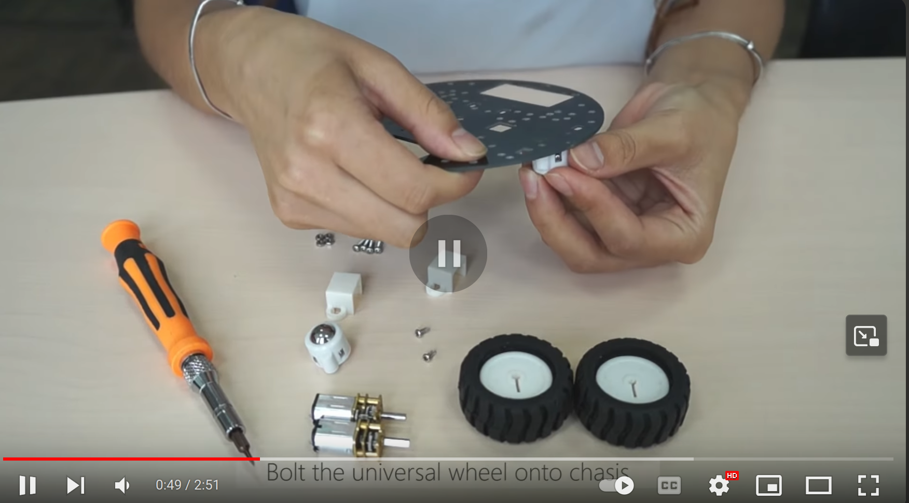](https://www.youtube.com/watch?v=tKakeyL_8Fg 'MiniQ 2WD Robot Chassis Quick Assembly Guide')

### Step 2: Attach Motor Driver

Attach the motor driver to the base using the 2 screws that came with the kit. The motor driver should be positioned on the base such that it fits snugly without obstructing any other components.

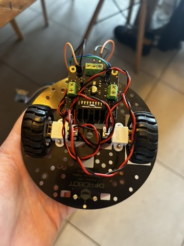

### Step 3: Attach ESP32-WROOM-32 module to the motor driver

Connect the Wires of the motor driver to the ESP32-WROOM-32 as shown in the electrical schematic below. with

```C
int E1 = 2; //PWM motor 1
int M1 = 17; //GPIO motor 1
int E2 = 19; //PWM motor 2
int M2 = 4; //GPIO motor 2
```


### Step 4: Cut the support beams

Cut the support beams so that we can securely attach the top plate to the base. I cut them to ~7cm.

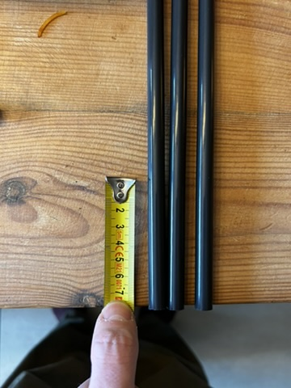

### Step 5: Screw in the supports on the bottom of the bottom plate

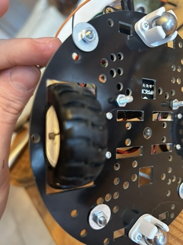

### Step 6: Mount all the supports on the bottom plate

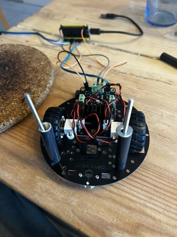

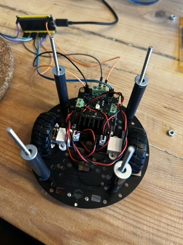

### Step 7: Attach the top plate (you will need to drill holes so that the supports can fit through the top plate)

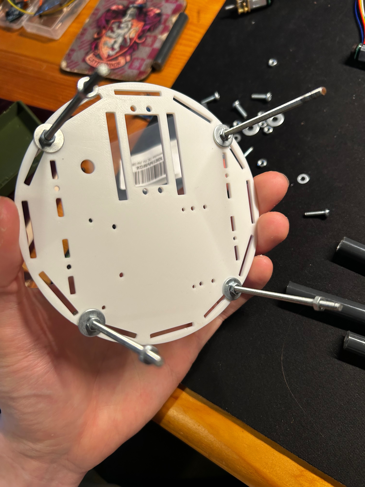

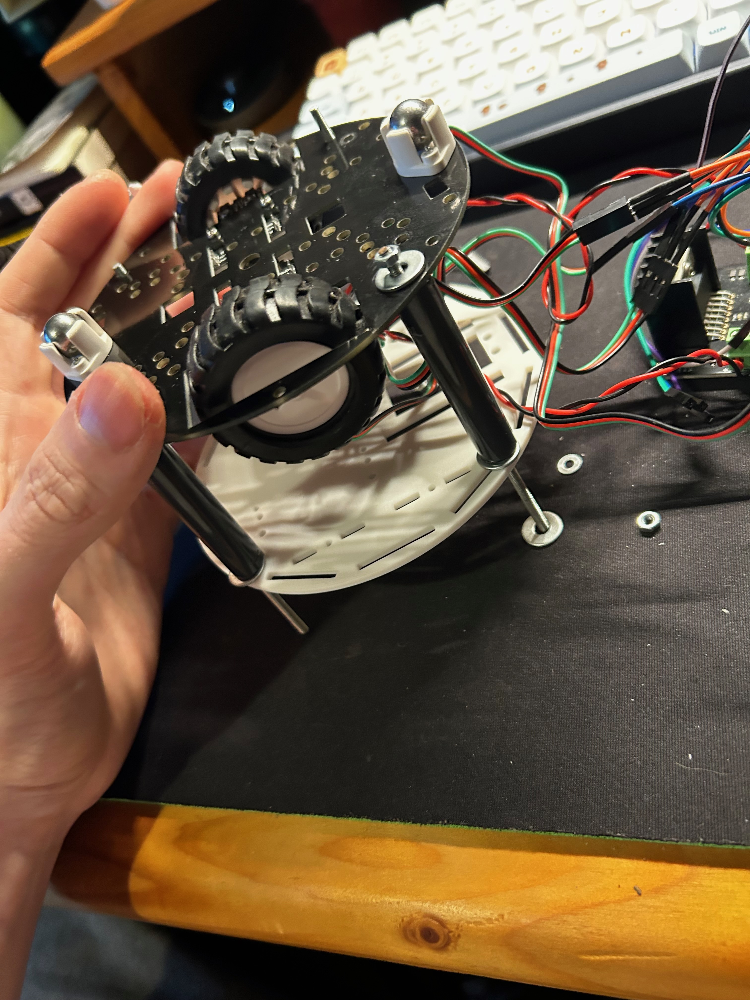

### Step 8: Attach the ultrasonic sensor to the top plate

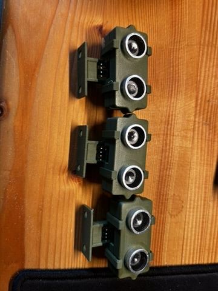

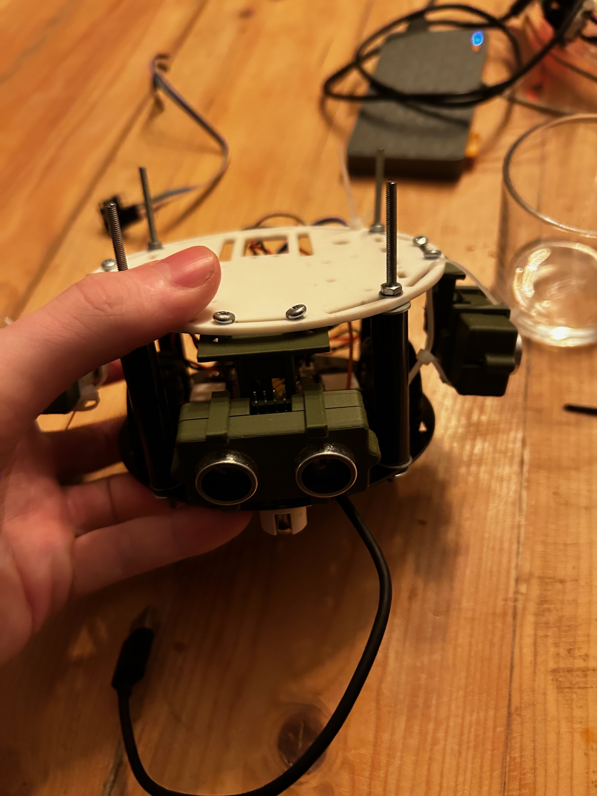

### Step 9: place the esp32 on the top plate togheter with a mini breadboard for the sensor wires

As you can see the battery for the esp is attached to the top plate with zip ties.

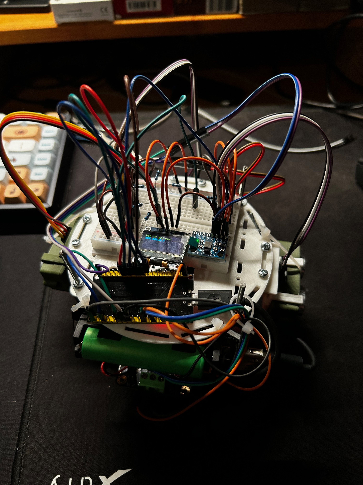


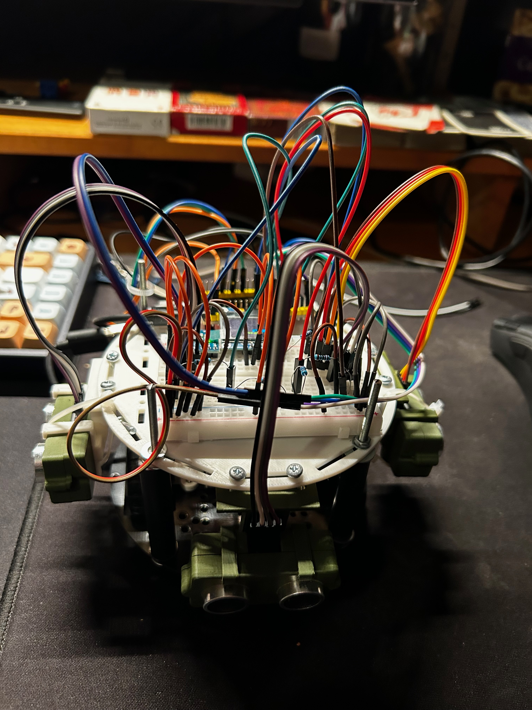

## Wiring Guide

### ESP32 Wiring


The above diagram shows the wiring connections for the ESP32-WROOM-32 module. The motors are connected to the motor driver LN298N.

#### esp32 pins

Since the schematic is not very clear (sorry for this), here is a list of the pins used on the ESP32:

```c

int E1 = 2; //PWM motor 1
int M1 = 17; //GPIO motor 1
int E2 = 19; //PWM motor 2
int M2 = 4; //GPIO motor 2

int sensor0Trig = 27; //GPIO right sensor
int sensor0Echo = 26; //GPIO right sensor

int sensor1Trig = 33; //GPIO left sensor
int sensor1Echo = 32; //GPIO left sensor

int sensor2Trig = 25; //GPIO front sensor
int sensor2Echo = 35; //GPIO front sensor

// OLED display pins
#define SDA_PIN 21 // this is the default sda pin on the esp32
#define SCL_PIN 22 // this is the default scl pin on the esp32

```

## Building the maze

### final result


### prerequisites

- screws used:
  - 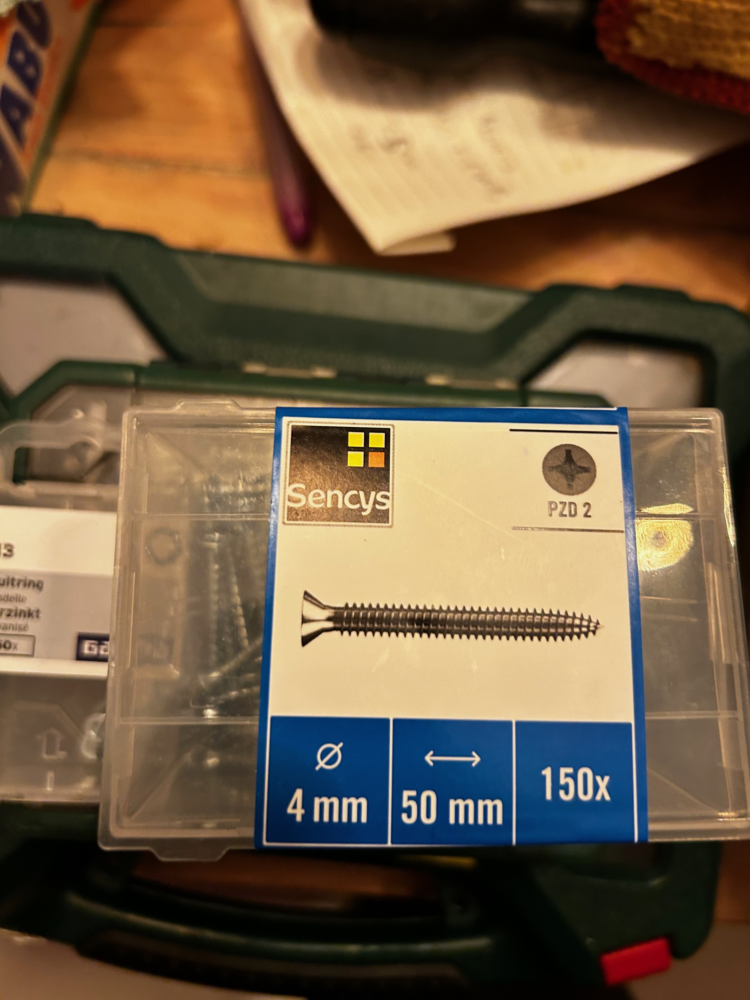
- Nuts used:
  - 
- Supports used:
  - 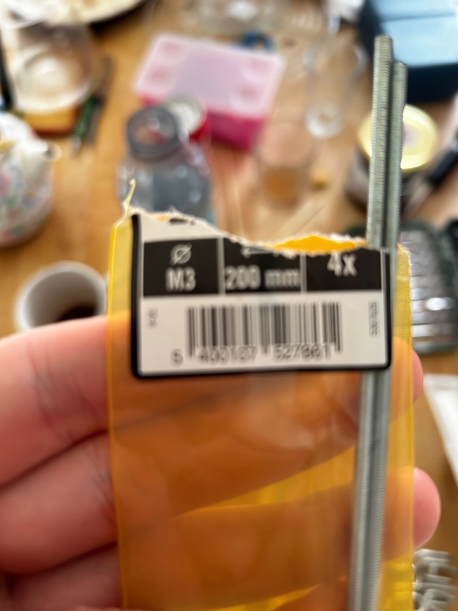
- Wood used:
  - planks cut to 10cm width by 120cm length
  - 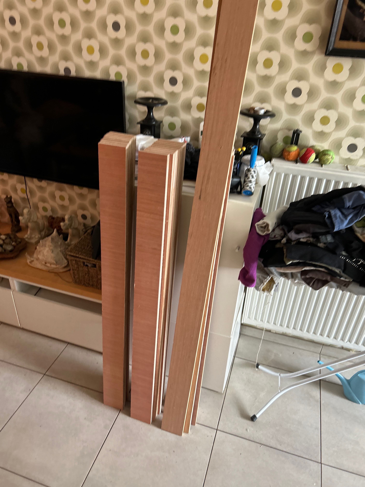

### Step 1: calculations

- where 1 cell is 25cm x 25cm
  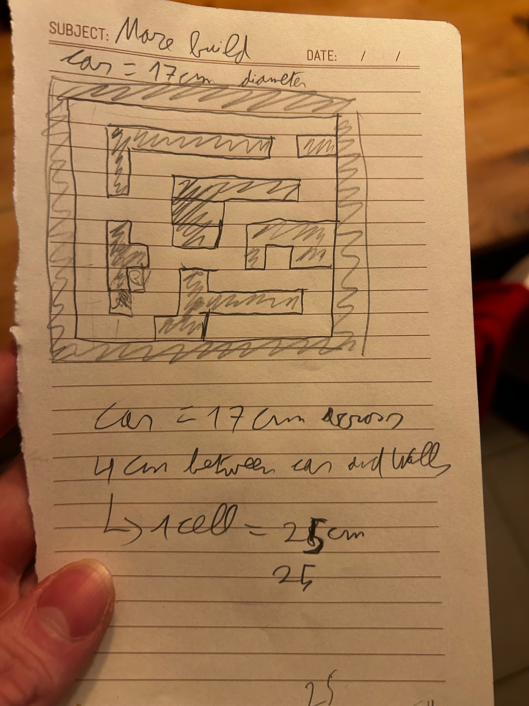

### step 2: cut the wood

I let the store cut the wooden planks for me to the correct size, As you could see in the prerequisites.

### step 3: screw the wood together

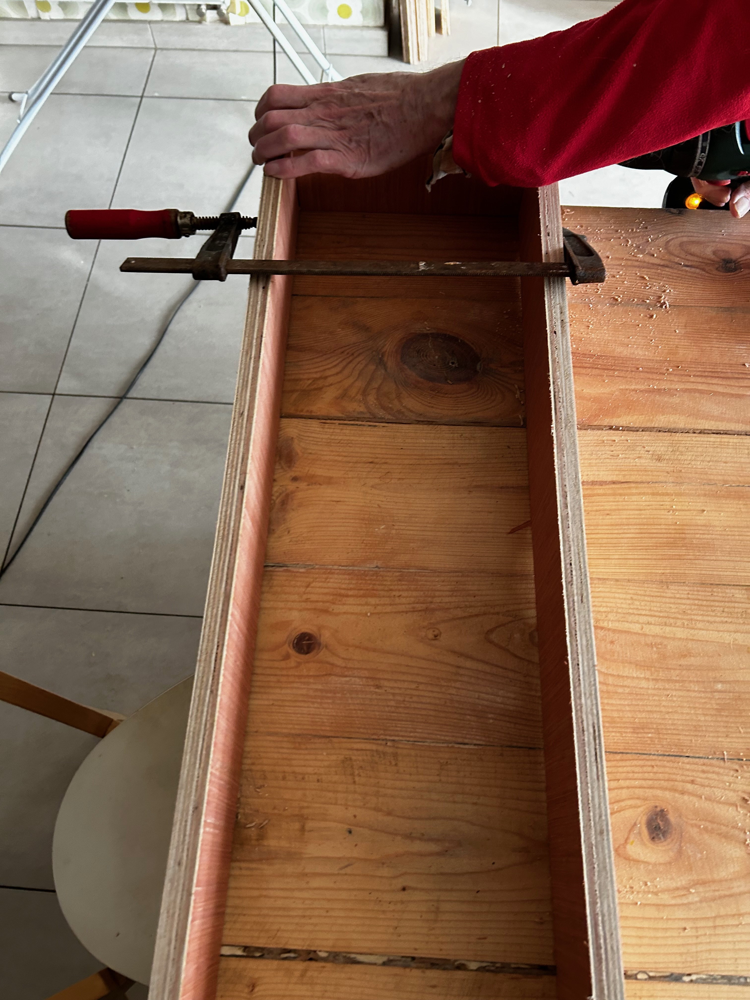

It should turn out like this, repeat this for all the blocks in the maze:


