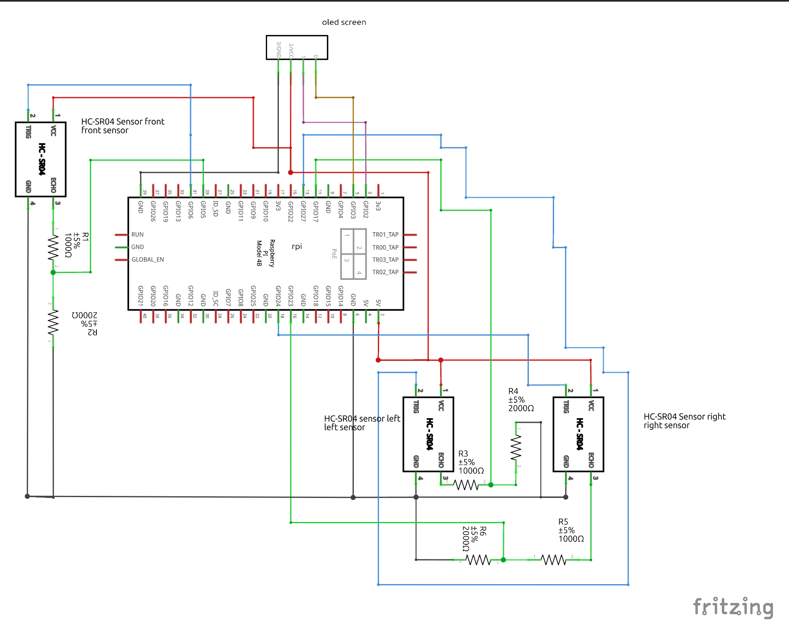
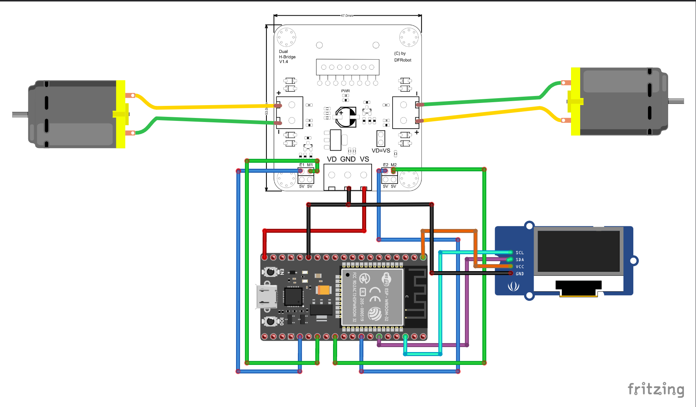

# Installation Guide for Rc robot

## Table of Contents

- [Installation Guide for Rc robot](#installation-guide-for-rc-robot)
  - [Table of Contents](#table-of-contents)
  - [Introduction](#introduction)
  - [Safety Precautions](#safety-precautions)
  - [Components List](#components-list)
  - [Tools Required](#tools-required)
  - [Assembly Instructions](#assembly-instructions)
    - [Step 1: Base Assembly](#step-1-base-assembly)
    - [Step 2: Attach Motor Driver](#step-2-attach-motor-driver)
    - [Step 3: Attach ESP32-WROOM-32 module to the motor driver](#step-3-attach-esp32-wroom-32-module-to-the-motor-driver)
    - [Step 4: Cut the support beams](#step-4-cut-the-support-beams)
    - [Step 5: Screw in the supports on the bottom of the bottom plate](#step-5-screw-in-the-supports-on-the-bottom-of-the-bottom-plate)
    - [Step 6: Mount all the supports on the bottom plate](#step-6-mount-all-the-supports-on-the-bottom-plate)
    - [Step 7: Attach the top plate (you will need to drill holes so that the supports can fit through the top plate)](#step-7-attach-the-top-plate-you-will-need-to-drill-holes-so-that-the-supports-can-fit-through-the-top-plate)
    - [Step 8: Attach the ultrasonic sensor to the top plate](#step-8-attach-the-ultrasonic-sensor-to-the-top-plate)
    - [Step 9: Attatch the battery pack to the RPI 5](#step-9-attatch-the-battery-pack-to-the-rpi-5)
    - [Step 9.5: Place RPI 5 on top of the top plate](#step-95-place-rpi-5-on-top-of-the-top-plate)
    - [Step 10: Connect the hc-sr04 sensor to the RPI 5 and try to fit them on the top plate, togheter with the battery holder for the ESP32 and the mini oled screen(s)](#step-10-connect-the-hc-sr04-sensor-to-the-rpi-5-and-try-to-fit-them-on-the-top-plate-togheter-with-the-battery-holder-for-the-esp32-and-the-mini-oled-screens)
  - [Wiring Guide](#wiring-guide)
    - [RPI5 Wiring](#rpi5-wiring)
    - [ESP32 Wiring](#esp32-wiring)
      - [esp32 Motor pins](#esp32-motor-pins)

## Introduction

This guide provides step-by-step instructions for assembling and configuring the RC robot used in our research project. The RC robot, powered by a Raspberry Pi 5 and an ESP32-WROOM-32 module, is designed to navigate a maze using a combination of onboard sensors and reinforcement learning algorithms.

## Safety Precautions

- Always disconnect the device from the power source before assembling or disassembling.
- Be cautious of sharp edges on the metal or plastic parts.
- Handle the battery with care. Do not puncture, disassemble, short contacts, dispose of in fire, or expose to high temperatures.

## Components List

- Raspberry Pi 5 8gb ram - Available at [KiwiElectronics](https://www.kiwi-electronics.com/en/raspberry-pi-5-computers-accessories-415/raspberry-pi-5-8gb-11580)
- ESP32-WROOM-32 module (Refer to the datasheet at [Espressif](https://www.espressif.com/sites/default/files/documentation/esp32-wroom-32_datasheet_en.pdf))
- 3D printed parts from Thingiverse ([hc-sr04](https://www.thingiverse.com/thing:3436448/files), [top plate + alternative for the robot kit](https://www.thingiverse.com/thing:2544002))
- Motor Driver - available at [DFRobot](https://www.dfrobot.com/product-66.html)
- 2WD robot kit - available at [DFRobot](https://www.dfrobot.com/product-367.html)
- Mini OlED screen - available at [Amazon](https://www.amazon.com.be/dp/B0BB1T23LF)
- Sensors - available at [Amazon](https://www.amazon.com.be/dp/B07XF4815H)
- Battery For RPI 5 - available at [Amazon](https://www.amazon.com.be/dp/B09QRS666Y)
- Battery Holder For ESP 32 - available at [Amazon](https://www.amazon.com.be/dp/B09Q4ZMNLW)

- Other miscellaneous components (screws, wires, etc.)

## Tools Required

- Screwdriver
- Wire cutter/stripper
- ...

## Assembly Instructions

### Step 1: Base Assembly

To assemble the base, you can follow this youtube video from the makers themselves:

[](https://www.youtube.com/watch?v=tKakeyL_8Fg 'MiniQ 2WD Robot Chassis Quick Assembly Guide')

### Step 2: Attach Motor Driver

Attach the motor driver to the base using the 2 screws that came with the kit. The motor driver should be positioned on the base such that it fits snugly without obstructing any other components.


### Step 3: Attach ESP32-WROOM-32 module to the motor driver

Connect the Wires of the motor driver to the ESP32-WROOM-32 as shown in the electrical schematic below.


### Step 4: Cut the support beams

Cut the support beams so that we can securely attach the top plate to the base. I cut them to ~7cm.


### Step 5: Screw in the supports on the bottom of the bottom plate

'

### Step 6: Mount all the supports on the bottom plate


### Step 7: Attach the top plate (you will need to drill holes so that the supports can fit through the top plate)


### Step 8: Attach the ultrasonic sensor to the top plate


### Step 9: Attatch the battery pack to the RPI 5


### Step 9.5: Place RPI 5 on top of the top plate


### Step 10: Connect the hc-sr04 sensor to the RPI 5 and try to fit them on the top plate, togheter with the battery holder for the ESP32 and the mini oled screen(s)


...

## Wiring Guide

### RPI5 Wiring


The above diagram shows the wiring connections for the Raspberry Pi 5. The ultrasonic sensors are connected to the GPIO pins as per the sensor documentation, same thing for the mini oled screen.

### ESP32 Wiring


The above diagram shows the wiring connections for the ESP32-WROOM-32 module. The motors are connected to the motor driver LN298N.

#### esp32 Motor pins

```c

int E1 = 2;
int M1 = 17;
int E2 = 19;
int M2 = 4;

```
