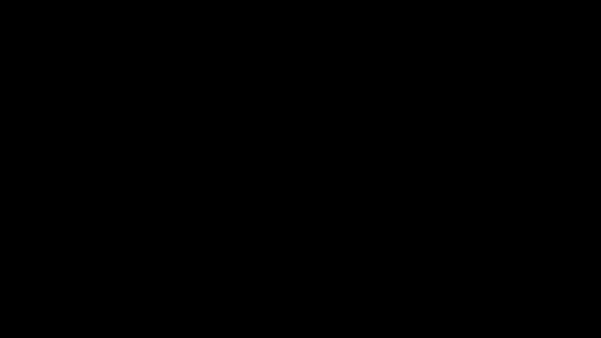

## struggles and observationss

1. first of all I had to reimagine how the distance between the walls in my simulation is getting determined.

   I used this function to determine the distance between the walls in the simulation:
   </details>
   <summary>distance to wall function </summary>

   ```python
      def distance_to_wall(self, direction):
        """
         Returns the distance to the wall. It is based on the car orientation and the position of the car

         @param direction - 'front'or'right'or'front'

         @return The distance to the wall
        """
        x, y = self.car_position
        sensor_max_range = 255  # Maximum range of the ultrasonic sensor

        def calculate_distance(dx, dy):
            """
             Calculates the distance from the sensor. This is used to calculate the distance between the maze and the sensor

             @param dx - The distance in the x direction
             @param dy - The distance in the y direction ( 0 is top 1 is bottom )

             @return The distance between the sensor and the maze
            """
            distance = 0
            # This function is used to determine the distance between the sensor range and the sensor range.
            while 0 <= x + distance * dx < self.maze_size_x and \
                0 <= y + distance * dy < self.maze_size_y and \
                self.maze[y + distance * dy][x + distance * dx] != 1:
                distance += 1
                # This method is used to limit the sensor range.
                if distance > sensor_max_range:  # Limiting the sensor range
                    break
            return distance

        # Calculates the distance between the two directions.
        if direction == 'front':
            # Calculates the distance between the car_orientation and the orientation of the car.
            if self.car_orientation == 'N':
                distance = calculate_distance(0, -1)
            elif self.car_orientation == 'S':
                distance = calculate_distance(0, 1)
            elif self.car_orientation == 'E':
                distance = calculate_distance(1, 0)
            elif self.car_orientation == 'W':
                distance = calculate_distance(-1, 0)

        elif direction == 'left':
            # Calculates the distance between the car_orientation and the orientation of the car.
            if self.car_orientation == 'N':
                distance = calculate_distance(-1, 0)
            elif self.car_orientation == 'S':
                distance = calculate_distance(1, 0)
            elif self.car_orientation == 'E':
                distance = calculate_distance(0, -1)
            elif self.car_orientation == 'W':
                distance = calculate_distance(0, 1)

        elif direction == 'right':
            # Calculates the distance between the car_orientation and the orientation of the car.
            if self.car_orientation == 'N':
                distance = calculate_distance(1, 0)
            elif self.car_orientation == 'S':
                distance = calculate_distance(-1, 0)
            elif self.car_orientation == 'E':
                distance = calculate_distance(0, 1)
            elif self.car_orientation == 'W':
                distance = calculate_distance(0, -1)

        # Normalize the distance to a range of 0-1
        normalized_distance = distance / sensor_max_range
        normalized_distance = max(0, min(normalized_distance, 1))


        return normalized_distance * 1000

   ```

   </details>
   I've had to adjust the normilized_distance to be multiplied by 1000, so that the measured values of the sensors are more in line with the real world.
   Before that I tried it the other way around, where I divided the measurements of the real sensors by 1000, but that didn't work as well.
   As the distances where something like 0.005 which would be too close and 0.01 would be enough distance to not crash into the wall, which made it difficult in my real world tests for the agent to predict on the correct action if the distances we're not alligned with the simulated distances.
   ```

2. The real car often drove into walls, thinking there was enough space to move foward. This is due to not having a failsafe in my simulation, as this was not something that had crossed my mind when I was building the simulation. I added this and then retrained the model, which solved the problem. (using a rotary encoder attached to the wheels to measure the number of rotations the wheels have made, would also have been a viable solution to this problem...)

3. Since I'm using a RF-car, the signals send to move the car where getting send too fast, causing the car to not move at all or it would execute the next action during the previous action. This was not a problem in the simulation... I solved this by slowing down the amount of actions the agent can take per second. Alternative solutions could be to not use RF and directly connect the motor driver to the raspberry pi, or to use a queue on the esp32 to queue the actions and then execute them one by one. I tried the queue solution, but then I had problems with syncing the real robot and the virtual twin.

4. Since I'm not using a rotary encoder to measure the amount of rotations the wheels have made, I used a delay where I turn the motors on and off for a certain amaount of time. I had to adjust the delay amount depending on the amount of weight the car was carrying.... At first the car would only do 15 degree turns, this had to be adjusted obviously.

5. yes it has a significant impact on how easy it is to train, since I don't have to program the car to get back to the start position after each episode, nor do I have to observe the car so it doesn't crash while training (even with failsafe mechanisms in place, this can happen) or have to manually pick up the car and put it back at the start position after each episode. Which would also require me to write code that would tell me when I need to place the car back at the start position, and wait for me to do so before starting the next episode.
   The training in real life uses the RPI to train the model, which is significantly slower than training on my powerful computer.
   The trained model when training in real life is very similar to the model trained in the simulation, but given how much more difficult it is to train in real life, it is simply not worth it.

- **Evaluation Metrics**

  - The main evaluation metric in the simulation was to see if the trained agent could solve the maze. On the other hand, there was looked at the number of episodes needed to consistantly solve the maze with an optimal reward. Then I also looked at the amount of steps needed to solve the maze. This was done to see if the agent was able to solve the maze more efficiently.
  - In the real world, the evaluation metric was to see if the car was able to solve the maze. This was done visually, by looking at the car's movement and the sensor data.

  - $$ \text{MSE}(y, \hat{y}) = \frac{\sum\_{i=0}^{N - 1} (y_i - \hat{y}\_i)^2}{N} $$

  - **MSE Loss**

    - 

  - **Reward history**

    - 

  - **Epsilon Decay**

    - 

  - **Test video**

    - 

- **Web Application**

  - The web app was created to have see the simulation and control the start/stop of the real life tests, further more it acts as a virtual twin of the real rc-car when not running the simulation.
  - The web app was built using Flask, PYopenGL and SocketIO.
  - Flask is used to create the web server and handle the routing.
  - PYopenGL is used to render the simulation.
  - SocketIO is used to communicate between the web app and the simulation.
  - While the simulation is running in pyopengl, each time the render function is called, there is a snapshot taken of the current state of the simulation. This snapshot is then send to the web app using socketIO. The web app then renders the image on the screen. Thus creating a live feed of the simulation. Besides that also the sensor data and the Q-values are send to the web app, which are then displayed on the screen.
  - The web app also has some controls and inputs:
    - A drop down list with all the available models to test the simulation with.
    - An input field for the IP address of the real esp32 for the motor control.
    - A select box to choose between running the simulation and the real rc-car.
    - A start/stop button to start and stop the simulation or the real rc-car.

  

  <https://github.com/driessenslucas/researchproject/assets/91117911/99b584b8-4bc3-4195-8342-57bf62a456ff>
