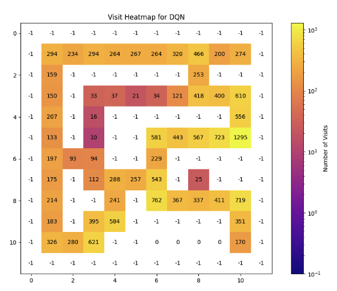
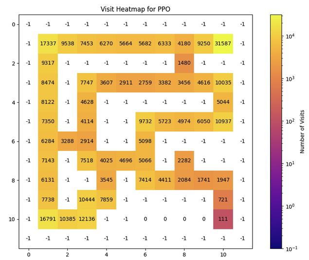
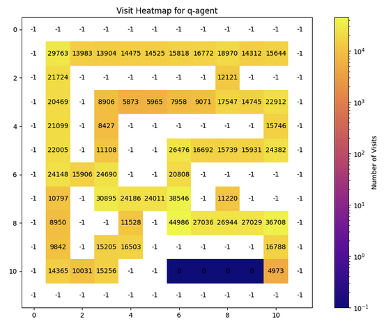
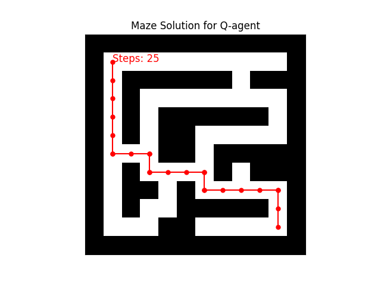
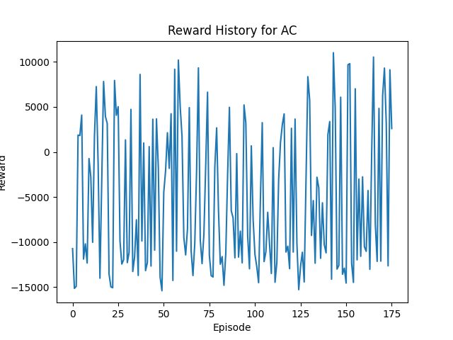
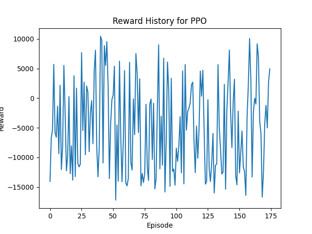
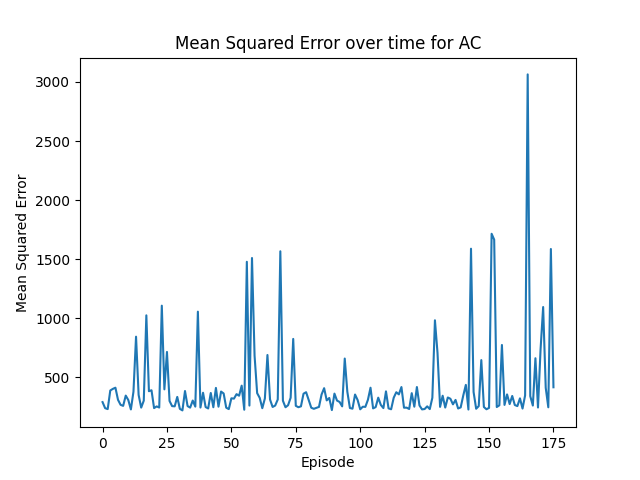
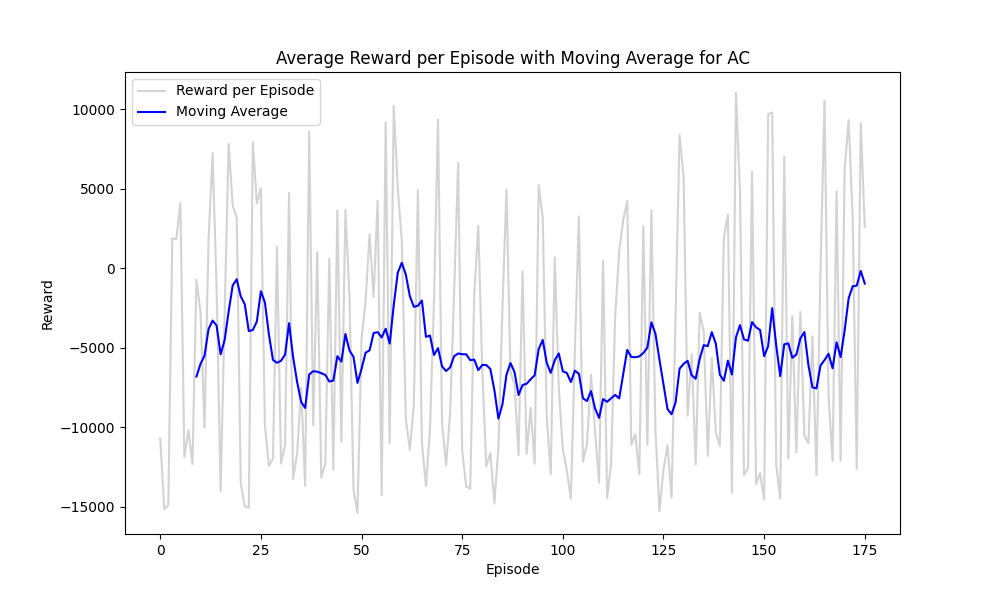

<!-- """"

Vooral nog wat dieper ingaan op het feit dat jouw sensoren niet voldoende data opleveren om de exacte positie te bepalen binnen de real-world grid. Je doet dat dan wel binnen jouw conclusies, maar hier mag je er ook al wat dieper op ingaan.

""" -->

<!-- 
Let's examine the reward history graphs for each algorithm to see how well they support the conclusions in your study.

### Graph Analysis

1. **Actor-Critic (AC)**: The reward history graph for AC shows a high level of variability in rewards, oscillating significantly between positive and negative values across episodes. This indicates inconsistency in performance, which aligns with the conclusion that AC requires more fine-tuning to reach the efficiency of model-free methods like DDQN and DQN.

2. **Deep Q-Network (DQN)**: DQN's reward history stabilizes quickly after an initial drop, maintaining a relatively consistent negative reward close to zero. This suggests a robust learning capability, albeit at a lower reward scale, which fits the description of varying degrees of efficiency and adaptability.

3. **Proximal Policy Optimization (PPO)**: PPO's graph also shows high variability, similar to AC, with frequent swings between high and low rewards. This reflects robust learning capabilities but confirms the conclusion about its variable efficiency and adaptability in different scenarios.

4. **Q-Learning (Q-agent)**: The reward history for Q-learning shows a long period of negative rewards that gradually stabilize over a much longer time frame (over 2000 episodes), supporting the conclusion that Q-agent struggles with the time it takes to learn the optimal policy in complex environments.

5. **Double Deep Q-Network (DDQN)**: The reward history for DDQN stabilizes quickly and remains relatively consistent throughout the episodes, staying closer to zero compared to DQN, which might imply a better balance between exploration and exploitation as mentioned in your conclusion.

### Conclusion Supportiveness

Based on the reward history graphs:
- **DDQN** shows evidence of enhanced stability and efficiency in learning, which supports your decision to primarily utilize it in the study.
- **DQN** shows robust learning capabilities, consistent with your conclusion.
- **PPO and AC** both exhibit high variability, indicating that while they have robust learning capabilities, their efficiency and adaptability are less consistent.
- **Q-agent**’s long stabilization period matches the conclusion about its slower learning process in complex environments.

Overall, the reward history graphs corroborate the conclusions drawn in your study regarding the performance and characteristics of each algorithm. This suggests that the conclusions are well-supported by the observed data.
 -->

## Comparative Analysis of Reinforcement Learning Algorithms in Maze Navigation

In this analysis, we compare various reinforcement learning algorithms, namely Double Deep Q-Network (DDQN), Deep Q-Network (DQN), Q-agent, Actor-Critic (AC), and Proximal Policy Optimization (PPO). This comparison is based on their performance in navigating a complex maze, focusing on efficiency, learning rate, and adaptability.

### Algorithm Overview

- **DDQN**: Enhances the stability of DQN by decoupling the target max operation into action selection and evaluation.
- **DQN**: Utilizes deep neural networks to approximate the Q-value function, mitigating challenges found in traditional Q-learning.
- **Q-agent**: Employs a tabular Q-learning approach, which is simpler but often less scalable for larger or more complex environments.
- **AC**: Combines value-based and policy-based methods, using two models: one as the actor for choosing actions and the other as the critic to evaluate actions.
- **PPO**: An advanced policy gradient method that optimizes policy iteration while ensuring small updates, improving training stability.

### Performance Metrics and Visualization

1. **Visit Heatmaps**
   - Provides insights into the exploration patterns of each agent.
   - 
   - 
   - 
   - 

2. **Maze Solution Efficiency**
    PPO and AC are not included in this visualization due to their relatively higher step counts compared to DDQN and DQN.

   - Number of steps taken to solve the maze:
     - DDQN: 
     - DQN: 
     - Q-agent: 

3. **Reward History and Distribution**
   - Indicates how quickly and consistently each algorithm learns to maximize rewards:
     - DDQN: 
     - DQN: 
     - AC: 
     - PPO: 
     - Q-agent: 

4. **Mean Squared Error (MSE) Over Time**
   - Reflects the prediction accuracy and learning stability of each algorithm:
     - DDQN: 
     - DQN: 
     - AC: 
     - PPO: 
  
5. **Moving average of rewards**
   - Shows the trend of rewards over time, indicating the learning progress:
     - DDQN: 
     - DQN: 
     - AC: 
     - PPO: 


### Conclusion and Insights

This in-depth comparative analysis of Double Deep Q-Network (DDQN), Deep Q-Network (DQN), Q-agent, Actor-Critic (AC), and Proximal Policy Optimization (PPO) provides a holistic view of their efficiencies and capabilities in maze navigation tasks, focusing on learning rates, adaptability, error reduction, and practical navigation effectiveness.

**DDQN** distinguishes itself as the most efficient performer, marked by its exceptional navigational proficiency and stable learning metrics. It accomplishes maze solutions in the fewest steps (25 steps) alongside the Q-agent, and maintains low Mean Squared Error (MSE) values, indicating superior stability and error management in complex scenarios.

**DQN**, while demonstrating robust learning stability and satisfactory model prediction accuracy, took slightly more steps (33 steps) to complete the maze, highlighting a potential trade-off between path efficiency and learning stability.

**Q-agent** proved surprisingly effective, matching DDQN in the number of steps to solve the maze, reflecting its potential in scenarios where a less complex, yet effective approach is adequate. However, its initial high MSE values reveal difficulties in early learning phases, which may pose challenges in rapidly changing environments.

**AC** and **PPO** showed greater fluctuations in their performance metrics, including MSE and reward patterns. AC, in particular, faced high volatility that may require additional tuning and adaptation to enhance prediction accuracy and learning stability. PPO displayed a consistent reduction in loss over time, suggesting potential improvements in efficiency, though its higher variability in practical maze-solving tasks needs attention.

In conclusion, **DDQN** stands out for its balanced performance across various metrics—efficient maze navigation, stable learning progress, and low prediction errors—making it a benchmark for reliability and efficiency in complex navigation tasks. **DQN** remains a robust alternative, albeit slightly less efficient in navigation but reliable in learning stability. **AC** and **PPO** necessitate careful adjustments to fully leverage their learning capabilities due to their higher variability. Lastly, **Q-agent**, while effective in navigation, faces early learning hurdles, making it less ideal for environments requiring rapid adaptation. This comprehensive understanding aids in selecting the most appropriate reinforcement learning algorithms based on specific performance criteria and environmental complexities, fostering optimized learning outcomes across diverse applications.


### **Conclusion**

The comparative analysis of Actor-Critic (AC), Deep Q-Network (DQN), Proximal Policy Optimization (PPO), Q-Learning, and Double Deep Q-Network (DDQN) provides a comprehensive overview of their respective performances and efficiencies in learning. The reward patterns observed underscore the inherent characteristics and potential limitations of each method in adapting to complex environments.

DDQN emerges as a notably stable and efficient algorithm, as evidenced by its quick stabilization and consistent reward patterns close to zero. This demonstrates an enhanced balance between exploration and exploitation, validating its selection as the primary focus of this study. DDQN's performance suggests that it could serve as a reliable benchmark for future research in similar settings.

Conversely, DQN, while robust, shows a generally lower reward scale, indicating that while it is capable of stable learning, its efficiency may not match that of DDQN. This insight is crucial for understanding the trade-offs between these two variants of the Q-Network.

The AC and PPO algorithms exhibited significant fluctuations in their reward trajectories, reflecting their robust learning capabilities but also highlighting their variability and less consistent performance. These fluctuations suggest a need for further fine-tuning and adaptation to enhance their efficiency and reliability in diverse scenarios.

Lastly, the Q-agent's learning curve, characterized by a prolonged period of negative rewards before stabilization, points to challenges in learning optimal policies within complex environments. This slower learning process suggests that while Q-learning can eventually achieve stability, the time required to reach effectiveness is considerably longer compared to more advanced methods like DDQN.

Overall, this analysis not only supports the continued use of DDQN in environments demanding stability and efficiency but also highlights the importance of selecting appropriate reinforcement learning algorithms based on specific performance criteria and environmental complexities. Future research should consider these dynamics to tailor algorithmic approaches that optimize learning outcomes across various applications.


### Revised Conclusion with Comprehensive Analysis

The comparative analysis of Double Deep Q-Network (DDQN), Deep Q-Network (DQN), Q-agent, Actor-Critic (AC), and Proximal Policy Optimization (PPO) reveals distinct characteristics and efficiencies of these algorithms in a complex maze navigation task, with a focus on efficiency, learning rate, adaptability, and error reduction.

**DDQN** emerges as the standout performer in our analysis, demonstrating not only efficient learning through its reward patterns but also exceptional navigational efficiency. The DDQN algorithm required the fewest steps to solve the maze, tied with Q-agent, while maintaining lower Mean Squared Error (MSE) values over time, which signifies its superior stability and error management in complex environments.

**DQN** shows strong learning capabilities with relatively stable reward patterns and MSE values that suggest good model prediction accuracy. However, DQN required more steps to solve the maze compared to DDQN and Q-agent, highlighting a trade-off between path efficiency and learning stability.

**Q-agent**, despite its simplistic approach, achieved the maze solution in fewer steps than DQN and demonstrated the ability to eventually stabilize in its learning process, as seen in the reward history. However, it exhibits high MSE values initially, indicating challenges in early learning phases before achieving stability.

**AC** and **PPO** displayed significant fluctuations in both reward patterns and MSE, underscoring their robust learning capabilities but also their variability and less consistent performance. The high volatility in AC’s MSE particularly highlights the need for fine-tuning and adaptation to improve prediction accuracy and learning stability. PPO, on the other hand, showed a consistent reduction in loss over time, which suggests improvements in learning efficiency despite its higher variability in maze-solving performance.

In conclusion, **DDQN**’s balanced performance across various metrics—efficient maze navigation, stable learning progress, and low prediction errors—makes it highly suitable for complex navigation tasks and serves as a benchmark for reliability and efficiency. **DQN** remains a robust alternative with slightly less efficiency in maze navigation but good learning stability. **AC** and **PPO**, while powerful, require careful tuning to harness their full potential due to their higher variability. **Q-agent**, surprisingly effective in navigation efficiency, still faces hurdles in early learning stages, making it less favorable for rapidly changing environments.


### Revised Conclusion with Integrated Maze Solution Analysis

The comprehensive evaluation of Double Deep Q-Network (DDQN), Deep Q-Network (DQN), Q-agent, Actor-Critic (AC), and Proximal Policy Optimization (PPO) has provided a detailed insight into their respective strengths and weaknesses in navigating a complex maze environment. This analysis has considered their efficiency in learning, adaptability, error reduction, and specific performance in actual maze navigation.

**DDQN** not only demonstrates superior stability and efficiency in the reward and error metrics but also excels in practical navigation tasks. Both DDQN and Q-agent solved the maze in the minimal number of steps (25 steps), showcasing their efficiency in finding optimal paths. This underscores DDQN's capability in effectively balancing exploration with exploitation, making it an excellent choice for tasks requiring high levels of both accuracy and efficiency.

**DQN**, while robust in learning stability as indicated by its reward and error trends, required more steps (33 steps) to solve the maze compared to DDQN and Q-agent. This suggests a slight compromise in pathfinding efficiency, though it remains a strong performer overall.

**Q-agent** displayed an unexpectedly efficient pathfinding ability, matching DDQN for the fewest steps to solve the maze. This highlights its potential in scenarios where a straightforward, less computationally intensive approach is sufficient, despite its longer initial learning curve indicated by its reward and error patterns.

**AC** and **PPO** were excluded from the maze solution visualization due to their relatively higher step counts, indicating less efficiency in direct maze-solving tasks. Their exclusion underscores a significant limitation in environments that prioritize direct path efficiency and quick problem-solving capabilities.

In conclusion, **DDQN** stands out as the most balanced and effective algorithm for complex navigation challenges, validated by its performance across all measured criteria. **DQN** and **Q-agent** also show valuable qualities, with DQN offering stability and Q-agent providing a simpler yet effective solution in certain contexts. **AC** and **PPO**, while powerful in learning capabilities, may require further refinement to optimize their pathfinding efficiencies in similar tasks.

-----

# Background Information
Here's the revised background information text with citations formatted in IEEE style:

# Background Information

## Background on Double Deep Q-Network (DDQN)

The Double Deep Q-Network (DDQN) is an enhancement of the Deep Q-Network (DQN), a pivotal algorithm in the field of deep reinforcement learning that integrates deep neural networks with Q-learning. DQN itself was a significant advancement as it demonstrated the capability to approximate the Q-value function, which represents the expected reward for taking an action in a given state, using high-capacity neural networks.

### Evolution from DQN to DDQN

**DQN Challenges**: While DQN substantially improved the stability and performance of Q-learning, it was susceptible to significant overestimations of Q-values due to the noise inherent in the approximation of complex functions by deep neural networks. This overestimation could lead to suboptimal policies and slower convergence during training.

**DDQN Solution**: Introduced by Hado van Hasselt et al., DDQN addresses the overestimation problem of DQN by decoupling the action selection from the target Q-value generation—a technique termed "double learning." In traditional DQN, a single neural network is used both to select the best action and to evaluate its value. DDQN modifies this by employing two networks:
- The **current network** determines the action with the highest Q-value for the current state.
- A separate **target network**, which is a delayed copy of the current network, is used to estimate the Q-value of taking that action at the next state [1].

### The Decoupling Effect

This separation ensures that the selection of the best action is less likely to overestimate Q-values, as the estimation is made using a different set of weights, thus reducing bias in the learning process. The target network's parameters are updated less frequently (often after a set number of steps), which further enhances the algorithm's stability.

### Impact and Applications

DDQN has been shown to achieve better performance and faster convergence in complex environments compared to DQN. It is particularly effective in scenarios where precise action evaluation is crucial, such as in video games and robotic navigation tasks. The improved reliability and accuracy of DDQN make it a valuable model for studying reinforcement learning in controlled environments where stability and efficiency are critical.

## Background on Deep Q-Network (DQN)

The Deep Q-Network (DQN) algorithm represents a significant breakthrough in reinforcement learning by combining traditional Q-learning with deep neural networks. This approach was popularized by researchers at DeepMind with their notable success in training agents that could perform at human levels across various Atari games [2].

**Core Mechanism**: DQN uses a deep neural network to approximate the Q-value function, which is the expected reward obtainable after taking an action in a given state and following a certain policy thereafter. The neural network inputs the state of the environment and outputs Q-values for each possible action, guiding the agent's decisions.

**Innovations Introduced**:
- **Experience Replay**: DQN utilizes a technique called experience replay, where experiences collected during training are stored in a replay buffer. This allows the network to learn from past experiences, reducing the correlations between sequential observations and smoothing over changes in the data distribution.
- **Fixed Q-Targets**: To further stabilize training, DQN employs a separate target network, whose weights are fixed for a number of steps and only periodically updated with the weights from the training network [2].

### Impact and Applications
DQN's ability to handle high-dimensional sensory inputs directly with minimal domain knowledge makes it highly versatile and effective in complex environments such as video games, where it can learn directly from pixels.

## Background on Q-agent (Q-learning)

Q-agent, based on the Q-learning algorithm, is one of the most fundamental types of reinforcement learning methods. It is a model-free algorithm that learns to estimate the values of actions at each state without requiring a model of the environment [3].

**Simplicity and Versatility**: Q-learning works by updating an action-value lookup table called the Q-table, which stores Q-values for each state-action pair. These values are updated using the Bellman equation during each step of training based on the reward received and the maximum predicted reward for the next state.

**Challenges**: While simple and effective for smaller state spaces, Q-learning's reliance on a Q-table becomes impractical in environments with large or continuous state spaces, where the table size would become infeasibly large.

### Impact and Applications
Q-learning has been foundational in teaching agents in environments with discrete, limited state spaces, such as simple mazes or decision-making scenarios with clear, defined states and actions.

## Background on Proximal Policy Optimization (PPO)

Proximal Policy Optimization (PPO) is a policy gradient method for reinforcement learning that simplifies and improves upon the Trust Region Policy Optimization (TRPO) approach. PPO has become popular due to its effectiveness and ease of use [4].

**Optimization Technique**: PPO seeks to take the largest possible improvement step on a policy while avoiding

 too large updates that might lead to performance collapse. It achieves this through an objective function that includes a clipped term, penalizing changes to the policy that move it too far from the previous policy.

**Advantages**: PPO is robust to a variety of hyperparameters and can be used in both continuous and discrete action spaces. It has shown great success in environments ranging from simulated robotics to complex game environments.

### Impact and Applications
PPO is favored in many modern RL applications due to its balance between efficiency, ease of implementation, and strong empirical performance.

## Background on Actor-Critic (AC)

Actor-Critic methods form a broad class of algorithms in reinforcement learning that combine both policy-based (actor) and value-based (critic) approaches [5].

**Dual Components**:
- **Actor**: Responsible for selecting actions based on a policy.
- **Critic**: Estimates the value function (or Q-value), which is used to evaluate how good the action taken by the actor is.

**Advantages**: By separating the action selection and evaluation, actor-critic methods can be more efficient than conventional policy-gradient methods. They reduce the variance of the updates and typically converge faster.

### Impact and Applications
Actor-Critic algorithms are versatile and can be applied to both discrete and continuous action spaces. They have been effectively used in applications that require balancing exploration of the environment with the exploitation of known rewards, such as in robotics and complex game environments.

## Citations

[1] H. van Hasselt, A. Guez, and D. Silver, "Deep reinforcement learning with double Q-learning," in *Proc. of AAAI Conf. on Artificial Intelligence*, 2016.

[2] V. Mnih et al., "Human-level control through deep reinforcement learning," *Nature*, vol. 518, no. 7540, pp. 529-533, 2015.

[3] C. J. C. H. Watkins and P. Dayan, "Q-learning," *Machine Learning*, vol. 8, no. 3-4, pp. 279-292, 1992.

[4] J. Schulman, F. Wolski, P. Dhariwal, A. Radford, and O. Klimov, "Proximal policy optimization algorithms," *arXiv preprint arXiv:1707.06347*, 2017.

[5] V. R. Konda and J. N. Tsitsiklis, "Actor-critic algorithms," in *Proc. of the 13th International Conf. on Neural Information Processing Systems*, pp. 1008-1014, 2000.


----


## Integration of Practical Experiments

Throughout this research project, I employed a series of practical experiments to navigate and overcome encountered challenges. These experiments, documented through video demonstrations, provide tangible insights into my problem-solving process.

### Addressing Alignment and Orientation Challenges

One of the key challenges I faced was ensuring precise orientation and alignment of the RC-car during movement. To tackle this, I utilized the MPU6050 gyroscope, aiming to correct alignment issues and achieve accurate 90-degree turns.

#### Utilizing the MPU6050 Gyroscope for Precise Orientation

- **Experiment E1 - Gyroscope Calibration**: Testing the MPU6050 gyroscope's ability to correct the car's orientation. [View Video](https://github.com/driessenslucas/researchproject/assets/91117911/32d9e29f-6d5a-4676-b609-2c08923ca1ac)
- **Experiment E2 - Navigational Corrections**: Further tests on realigning the car's forward movement to address a ~3-degree offset. [View Video](https://github.com/driessenslucas/researchproject/assets/91117911/624b40f2-bee8-49f6-961d-1f72ab18fe13)
- **Experiment E3 - Alignment Adjustment**: Tests focused on enhancing the car's alignment accuracy. [View Video](https://github.com/driessenslucas/researchproject/assets/91117911/bb9aa643-9620-4979-a70c-ec2826c7dd33)
- **Experiment E4 - Orientation Fine-tuning**: Continued efforts to refine the car’s orientation for precise maneuvering. [View Video](https://github.com/driessenslucas/researchproject/assets/91117911/689b590f-3a9a-4f63-ba9c-978ddd08ab53)
- **Experiment E5 - Advanced Alignment Solutions**: Further tests to tackle persistent alignment issues. [View Video](https://github.com/driessenslucas/researchproject/assets/91117911/99da37df-d147-43dc-828f-524f55dc6f70)

### Enhancing Movement Precision with Encoders

Exploration of rotary encoders to measure wheel rotations accurately, improving navigation precision.

- **Experiment E6 - Encoder Implementation**: Introduction of rotary encoders to enhance movement precision. [View Video](https://github.com/driessenslucas/researchproject/assets/91117911/9728e29a-d2fa-48fa-b6e0-e2e1da92228f)
- **Experiment E7 - Troubleshooting Encoder Malfunction**: Addressing challenges with encoder reliability. [View Video](https://github.com/driessenslucas/researchproject/assets/91117911/b9ce2cc3-85fd-4136-8670-516c123ba442)
- **Experiment E8 - Encoder Performance Analysis**: Evaluating the encoder functionality under varied conditions. [View Video](https://github.com/driessenslucas/researchproject/assets/91117911/ae5129fa-c25f-4f89-92bb-4ee81df9f7a5)

### Real-World Application Tests

Assessment of the RC-car's performance in varied environments to test the practical application of research findings.

- **Experiment E9 - Outdoor Navigation Test**: Evaluating performance on uneven outdoor surfaces. [View Video](https://github.com/driessenslucas/researchproject/assets/91117911/02df8a25-b7f0-4061-89b7-414e6d25d31c)
- **Experiment E10 - Advanced Outdoor Testing**: Further exploration in outdoor settings to understand environmental impacts. [View Video](https://github.com/driessenslucas/researchproject/assets/91117911/187561a7-c0cb-4921-af3e-9c2c99cb0137)
- **Experiment E11 - Indoor Controlled Test**: Controlled indoor testing to refine navigation strategies. [View Video](https://github.com/driessenslucas/researchproject/assets/91117911/ce0f47e9-26cd-459e-8b26-ff345d1ee96b)
- **Experiment E12 - Simulated to Real-world Transition Test**: Testing the RC-car's navigation in a controlled indoor environment. [View Video](https://github.com/driessenslucas/researchproject/assets/91117911/ea4a9bff-e191-4ce2-b2cc-acc57c781fa3)
- **Experiment E13 - Detailed Indoor Analysis**: Additional tests to finalize indoor navigation efficiency. [View Video](https

://github.com/driessenslucas/researchproject/assets/91117911/4783729f-10cc-4c61-afa4-71cfc93d5d3e)
- **Experiment E14 - Final Indoor Navigation Assessment**: Concluding tests focusing on critical aspects of indoor navigation. [View Video](https://github.com/driessenslucas/researchproject/assets/91117911/77091cb5-dbc5-4447-abc2-dc820dc66188)


-----

# Model Architecture and Training Insights

The architecture of the Double Deep Q-Network (Double DQN) plays a pivotal role in shaping the agent's learning process and decision-making capabilities. In the context of maze navigation, the Double DQN is designed to guide an RC car through complex environments.

## Model Architecture

```markdown
## Model: "sequential_52"

# Layer (type) Output Shape Param

=================================================================
dense_200 (Dense) (None, 32) 224
dense_201 (Dense) (None, 64) 2112
dense_202 (Dense) (None, 32) 2080
dense_203 (Dense) (None, 3) 99
=================================================================
Total params: 4515 (17.64 KB)
Trainable params: 4515 (17.64 KB)
Non-trainable params: 0 (0.00 Byte)

---
```

## Insights from Research

The choice of model complexity is critical in reinforcement learning. While complex architectures may seem appealing, simplicity often leads to better performance, faster learning, and improved generalization. Simpler models can capture essential temporal regularities, such as repeated sequences of actions, which are crucial for maze navigation.

In line with the research paper titled "Reinforcement Learning with Simple Sequence Priors" by T. Saanum [1], our Double DQN strikes a balance between simplicity and effectiveness. By prioritizing simplicity, we ensure optimal performance in maze-solving tasks.

## Citations

[1] Saanum, T. "Reinforcement Learning with Simple Sequence Priors." arXiv preprint arXiv:2305.17109 (2024).

[2] "COMP 542: Machine Learning Cite Your Sources." CSUN. Available: [link](https://libguides.csun.edu/comp542/citeyoursources).

[3] "IEEE Editorial Style Manual (Online)." IEEE, 2023. Available: [link](https://www.ieee.org/content/dam/ieee-org/ieee/web/org/conferences/style_references_manual.pdf).


----

## Model Architecture and Training Insights

To understand how our Double DQN model learns and makes decisions, let's dive into its architecture. The model consists of four dense layers, which output three actions tailored to the RC car's movement, enabling it to navigate the maze with ease.

Research has shown that, all things being equal, simpler models are often preferred in reinforcement learning [1]. This is because they can lead to better performance, faster learning, and improved generalization. However, finding the right balance of model complexity is crucial [1][3]. Simplicity is not just about the number of layers or parameters, but also about capturing temporal regularities, such as repetitions, in sequential strategies [1][2].

With these insights in mind, we designed the Double DQN model to strike a balance between simplicity and effectiveness, ensuring optimal performance in maze navigation tasks.

**Model Architecture:**

```markdown
## Model: "sequential_52"

# Layer (type) Output Shape Param

=================================================================
dense_200 (Dense) (None, 32) 224
dense_201 (Dense) (None, 64) 2112
dense_202 (Dense) (None, 32) 2080
dense_203 (Dense) (None, 3) 99
=================================================================
Total params: 4515 (17.64 KB)
Trainable params: 4515 (17.64 KB)
Non-trainable params: 0 (0.00 Byte)

---
```

## Citations

[1] T. Saanum, "Reinforcement Learning with Simple Sequence Priors," arXiv preprint arXiv:2305.17109, 2024.

[2] "COMP 542: Machine Learning Cite Your Sources," CSUN, [Online]. Available: https://libguides.csun.edu/comp542/citeyoursources. [Accessed: 12-May-2024].

[3] "IEEE Editorial Style Manual (Online)," IEEE, 2023. [Online]. Available: https://www.ieee.org/content/dam/ieee-org/ieee/web/org/conferences/style_references_manual.pdf. [Accessed: 12-May-2024]


------

### Vragen voor Externe Feedback

#### RC-Auto Oplossingen

- Welke RC-auto oplossing zou volgens u beter passen bij de doelstellingen en methodologie van mijn onderzoeksproject? Heeft u specifieke modellen of merken die u aanbeveelt en waarom?
  - 2WD zoals nu of 4WD en dan aangepaste virtuele omgeving (maakt de draaicirkel anders)?
  - Welke technische kenmerken van een RC-auto zijn cruciaal voor het succes van sim-to-real transfer? Denk aan sensoren, wendbaarheid, motorprestaties, etc.
  - Was mijn RC-auto limiterend in dit project?

**Answer:** Ja en nee, 4WD zou voor nog meer problemen kunnen zorgen, zeker met de over time slippage. Een camera als enige besturing zou ook niet per se beter zijn, aangezien je dan nog altijd vast zit aan het feit dat je de exacte positie van de auto in het doolhof niet weet.

#### Virtuele Omgevingen

- Welke virtuele omgeving zou mij meer vrijheid geven in de manier waarop de auto beweegt in de simulatie? Zijn er specifieke platforms of software die u zou aanraden voor meer realistische simulaties?
  - Of zou ik mijn actiemogelijkheden moeten aanpassen? Bijvoorbeeld controle geven over de motoren? De trainingstijd kan wel langer zijn, maar hierdoor zou de agent zelf kunnen bijsturen.
- Ik weet natuurlijk dat mijn uitwerking nu relatief simpel is, wat ook beperkingen oplegt. Denk je dat als ik mij eerst zou focussen op de autobevinging beter zou zijn geweest?
  - Nu heb ik veel tijd gestoken in de webapplicatie om het te besturen, en kwam ik eigenlijk pas laat erachter dat ik moeite had met de movement replication.

**Answer:** Enkel links, rechts en vooruit zou misschien genoeg zijn als de omgeving meer uitgebreid zou zijn, in plaats van een 2D-array waar de bewegingsmogelijkheden limiterend zijn. In de echte wereld zal de auto zich niet kunnen corrigeren aangezien hij de virtuele twin (of agent) nog altijd perfect op pad is en niet kan afwijken. Aangezien dit niet bestaat in de omgeving, zou controle geven over de motoren zelf niet genoeg zijn. De trainingstijd zou veel langer zijn en de agent zou ook de motor kunnen kapot maken —> goed idee maar zullen veel valkuilen zijn. Het opbouwen van de simulatie, dan de auto testen en vervolgens de simulatie afstemmen zou beter zijn geweest en mij hebben toegelaten om niet pas op het laatste moment te ontdekken dat de virtuele omgeving die ik in het begin had gemaakt toch niet uitgebreid genoeg bleek te zijn (te limiterend).

#### Virtual Twin versus Camera

- Vond u dat een virtual twin een meerwaarde had in deze situatie in vergelijking met het gebruik van een camera? Zo ja, op welke manieren verbeterde de virtual twin de prestaties en nauwkeurigheid van het model?
- Zijn er situaties waarin een camera beter zou presteren dan een virtual twin? Kunt u specifieke voorbeelden of scenario’s noemen waarin dit het geval is?

**Answer:** De virtual twin had hier weinig nut aangezien de simulatie toch niet kon afwijken en je dus eigenlijk niet kon zien waar de robot nu in het echt zit. Een top-down view camera zou nuttiger zijn geweest, al dan niet als input voor de agent.

#### Verdere Uitwerking

- Op welke manieren kan ik dit project verder uitwerken? Heeft u suggesties voor uitbreidingen, zoals het gebruik van geavanceerdere sensoren, meer complexe omgevingen, of integratie van machine learning technieken?
- Hoe ziet u de praktische toepassingen van de resultaten van mijn onderzoek? Zijn er specifieke industrieën of toepassingen waar u denkt dat mijn onderzoek een significante impact zou kunnen hebben?
- Ziet u mogelijkheden voor samenwerking of verdere ontwikkeling van dit project met andere bedrijven of onderzoeksinstituten? Zo ja, welke en op welke manier?
- Ziet u een maatschappelijke, economische of socio-economische meerwaarde in de resultaten van dit project? Kunt u specifieke voorbeelden geven van hoe deze technologieën de samenleving kunnen beïnvloeden?

**Answer:** De mogelijkheden zijn enorm, maar wel buiten het doolhof en RC-auto verhaal. Sim2real zou in veel toepassingen ideaal zijn, bijvoorbeeld customer service, wasmachines, en het vinden van optimale routes in navigatie (vooral in navigatie veel toepassingen), mits dat de omgeving meer uitgebreid is.

#### Algemene Vragen

- Wat zijn volgens u de sterke en zwakke punten van de resultaten uit mijn onderzoeksproject?
- Welke alternatieven of suggesties heeft u voor het project in termen van gebruikte RC-auto's, virtuele omgevingen of andere benaderingen?

**Answer:** Het sterkste punt ben ik zelf, aangezien het niet gebruikelijk is dat er zoveel op zo korte tijd wordt gedaan (simulatie, virtual twin, RC-auto bouwen en laten rijden, agent design, environment, testing in binnen- en buitenomgevingen). Het zwakste punt is geen manier om de RC-auto positie te bepalen.

### Reflection

Reflecting on this research project, I realize how much I've learned and how these insights have shaped my approach and perspective.

#### Openness to New Ideas

One of the biggest lessons I learned was the importance of being open to new ideas. Embracing unfamiliar concepts and stepping out of my comfort zone fostered creativity and led to innovative solutions. For example, transitioning from simulation to real-world testing required novel problem-solving to address discrepancies in sensor data and movement control. This openness not only improved my technical skills but also made me more adaptable to new challenges and environments. My coach, Gevaert Wouter, emphasized the value of staying receptive to technological advancements, which could further enhance system performance and reliability. He suggested exploring different RC car configurations and sensor setups but also warned that a 4WD setup might introduce more problems due to slippage.

#### Bridging Theory and Practice

Moving from theory to practice turned out to be more challenging than expected. Controlled virtual environments were manageable, but the real world presented unforeseen complexities. This experience sharpened my ability to balance theoretical knowledge with practical adaptability. For instance, integrating sensor calibration and adjusting control algorithms highlighted the gap between simulated and real-world conditions. This hands-on experience prepared me to handle real-world applications more effectively. Additionally, it underscored the importance of iterative testing and continuous learning. Wouter pointed out that starting with a more flexible virtual environment could have allowed for easier adjustments later on. He also suggested that while direct control over the motors might seem beneficial, it could lead to increased training time and potential damage to the motors. An anonymous contributor from Reddit emphasized the need for iterative design and testing to refine new sensory inputs, ensuring robustness in diverse environments.

#### Anticipatory Thinking

Overcoming various obstacles taught me the importance of anticipatory thinking. Navigating challenges and adapting to evolving conditions made me realize the need to think ahead. This proactive mindset has become integral to my approach, turning potential challenges into opportunities for innovation. For instance, anticipating sensor noise and environmental variability led to the development of robust policies and fine-tuning strategies, which improved system performance in real-world scenarios. This foresight is crucial for anticipating and mitigating risks, ensuring the robustness and reliability of autonomous systems. Wouter emphasized the importance of anticipating future technological trends and regulatory changes to stay ahead in the field.

#### Policy and Regulation

Engaging with policy and regulatory frameworks was eye-opening. It highlighted the delicate balance between fostering innovation and ensuring public safety. Collaborating with policymakers and industry leaders taught me the importance of creating regulations that encourage technological advancement while maintaining accountability. This experience underscored the need for ethical considerations and compliance when deploying autonomous systems. Understanding these regulatory landscapes will be essential as I continue to develop AI and robotics solutions. Wouter and other industry leaders emphasized the growing importance of ethical AI, urging the integration of ethical guidelines early in project development.

#### Feedback from the Jury

The feedback from the jury was predominantly positive, and their insights were incredibly valuable. They commended the practical aspects of my project, particularly the real-world testing of the RC car. Specific suggestions, like increasing the distance to the walls to reduce navigation errors and integrating a camera system for real-time visual feedback, were implemented to enhance accuracy and reliability. This feedback loop was instrumental in refining my approach and improving the overall quality of the project. Wouter suggested that a camera might not solve all positioning issues but could complement other sensory data to improve overall system accuracy. He also pointed out that a virtual twin might have limited usefulness in some scenarios compared to a top-down view camera.

#### Methodological Insights

Creating the custom maze navigation environment (RCMazeEnv) and using the DDQN architecture provided significant insights into the complexities of sim-to-real transfer. The iterative process of testing, calibration, and adjustment refined the system and improved its performance in navigating the physical maze. Designing an effective reward function was key to guiding the agent’s learning process, balancing immediate rewards and penalties for inefficient actions to optimize performance. This methodological rigor will serve as a foundation for future projects, ensuring a structured and systematic approach to research and development. Feedback from recent interviews, including Wouter's, suggested that while it was crucial to have a structured environment, there were limits to how much could be controlled virtually.

#### Societal Implications of Autonomous Systems

The potential applications of autonomous systems extend far beyond maze navigation. Insights from this research could contribute to developing autonomous vehicles, drones, and other robotic systems navigating complex environments. Ensuring these technologies are accessible and beneficial to society requires careful consideration of ethical, regulatory, and practical factors. For instance, autonomous systems must be designed to prioritize safety and reliability, minimizing risks to human users and the environment. Moreover, deploying such technologies should be accompanied by public education and engagement to build trust and understanding among stakeholders. Wouter and other contributors highlighted the importance of public engagement and education in fostering societal acceptance and trust in autonomous systems.

#### Future Directions

This project can be further developed by integrating more complex sensory systems, applying more sophisticated machine learning

 models, extending testing environments to include varying conditions, and fostering community collaboration. These enhancements could improve the technology and advance autonomous vehicle research and development. Future research could explore using multi-modal sensory inputs, such as combining visual, auditory, and tactile data to enhance the agent's perception and decision-making capabilities. Additionally, collaborations with other researchers and industry partners could provide valuable insights and resources for further advancements. Recent feedback, including from Wouter, emphasized the potential of cross-disciplinary collaboration to accelerate innovation and solve complex challenges.

#### Personal Growth and Future Aspirations

This research project has been transformative, shaping my understanding of AI and robotics and guiding my future aspirations. The lessons learned, from technical challenges to broader societal implications, have equipped me with the skills and knowledge to pursue further research and innovation in this field. I am particularly interested in exploring the ethical dimensions of AI and robotics, ensuring these technologies are developed and deployed in ways that are fair, transparent, and accountable. My future aspirations include contributing to the development of autonomous systems that can positively impact various sectors, from healthcare to transportation, enhancing efficiency and safety. Feedback from Wouter and other mentors highlighted the importance of balancing technical expertise and ethical considerations in future projects.

#### Commitment to Innovation and Societal Stewardship

As I move forward, my ethos will be defined by adaptability, responsiveness, and a commitment to societal stewardship. The lessons learned have prepared me for the next stage of my journey, where I will continue to engage with data, refine methodologies, and embrace future challenges. I am committed to fostering a culture of innovation and continuous improvement, where creative problem-solving and interdisciplinary collaboration are encouraged. Furthermore, I will strive to ensure that my work contributes to the greater good, addressing societal challenges and promoting sustainability.

### Personal Note

Even though this was an incredible project to work on and I loved every second of it, I can’t help but feel like I limited myself by not actively researching before starting this project. I went into this (and many other projects before this) headfirst, starting to make a maze in Pygame even before the three-week period began. However, by doing this, I limited myself by not exploring other methods of completing this maze, like giving the agents more controls than just moving forward, left, and right. For example, as Wouter suggested during one of our evaluations, the use of a top-down view camera to see where the car is in the maze. This would solve the problem of the car not knowing where it is in the maze, and potentially serve as another input for the agent to use, thus giving it more information to work with than just the distance sensors.

Feedback from another reddit user suggested that direct control over the motors could improve the transfer of the simulation and deal with the problem of fixed movements like it has now, although it might increase the training time and risk of damaging the motors. This insight highlights the importance of balancing control flexibility with practical constraints.

I doubt I would have been able to get as far as fast as I did if I had taken an alternative route, but I do think it would have been a lot more interesting and maybe even more rewarding as I don’t think this project is completely finished yet, and I look forward to continuing this journey.


----


In your interview with Wouter, it was emphasized that a more systematic approach could enhance the effectiveness of transitioning from simulation to reality. Here’s an integrated summary of advice and strategies that reflect your discussion:

---
Your revised approach is well-structured and detailed. Below is the refined step-by-step plan based on the lessons learned from your project:

## Advice for Simulation-to-Reality Transition

### Practical Utilization of Simulations

Simulations play a crucial role in research by providing a safe and controlled environment to develop and test algorithms without the immediate need for physical prototypes.

- **Cost-Effectiveness:** Simulations significantly reduce costs by limiting the need for physical prototypes and extensive real-world trials during the initial phases of research.

### Strategies for Effective Transition from Simulation to Reality

Successfully moving from simulations to real-world applications requires strategic planning and execution.

- **Incremental Testing:** Begin with simulations to refine algorithms. Gradually introduce real-world testing to validate results and adapt to environmental variables.
- **Feedback Loops:** Implement continuous feedback mechanisms to refine simulation models based on real-world insights, enhancing their accuracy and applicability.

### Overcoming Common Challenges in Simulation-to-Reality Transitions

Bridging the gap between simulations and actual conditions often necessitates specific adjustments, especially in sensor data and mechanical operations.

- **Sensor Discrepancy Adjustments:** Regular calibration of real-world sensors is crucial to align them with simulation inputs.
- **Movement and Mechanics Alignment:** Ensure physical movements and mechanics are synchronized with those anticipated by simulations to ensure smooth transitions.

### Insights from My Research

- **Simulation Platforms:** Selecting the appropriate simulation platform, like OpenAI Gym, is critical and may require additional tools for more complex scenarios.
- **DDQN Superiority:** My findings indicate that Double Deep Q-Network (DDQN) surpasses other models, such as DQN and PPO, by reducing overestimations and enhancing learning stability.

### Methodological Advice

- **Comprehensive Evaluation:** Utilize both qualitative and quantitative approaches to thoroughly evaluate the effectiveness of simulations and real-world applications.
- **Adaptive Techniques:** Remain flexible and responsive to feedback, crucial for addressing unexpected challenges effectively.

### Practical Experiment Integration

- **Prototyping and Iteration:** Use iterative design and prototyping to progressively refine systems, effectively linking theoretical research with practical implementation.
- **Continuous Feedback:** Regularly seek and incorporate feedback from stakeholders and peers to improve simulation models and real-world applications.

### Guidelines for Future Research

#### Introduction for Future Research

This chapter outlines a comprehensive methodology for researchers involved in simulation-based studies, emphasizing a smooth transition from theoretical models to practical applications.

#### Step-by-Step Plan

#### Step 1: Selection of Simulation Environments

**Research and Evaluation:**
1. **Survey Available Platforms:** Evaluate simulation tools such as OpenAI Gym, Unity 3D, AirSim, CARLA, and ISAAC Gym for their capabilities.
2. **Criteria Development:** Establish criteria focusing on fidelity, ease of use, integration capabilities, and specific needs like sensor simulation.
3. **Preliminary Testing:** Conduct initial tests to understand how well each platform replicates real-world conditions. Use simple test cases to evaluate performance, sensor accuracy, and ease of integration with real-world hardware.

**Detailed Actions:**
- **Benchmark Tests:** Run standard benchmarks on each platform to measure performance, realism, and computational efficiency.
- **Documentation Review:** Thoroughly review the documentation and community support for each tool to understand potential limitations and available resources.
- **Integration Trials:** Test integration with your existing hardware setup (e.g., sensors, actuators) to ensure compatibility and ease of data exchange.

#### Step 2: Designing the Simulation Environment

**Environment Setup:**
1. **Custom Environment Creation:** Develop a custom maze environment similar to RCMazeEnv in OpenAI Gym. Ensure it includes realistic physical properties such as friction and wheel slippage.
2. **Sensor Integration:** Integrate virtual sensors (e.g., ultrasonic, gyroscope) in the simulation that match the specifications of your real-world sensors.
3. **Realism Enhancement:** Introduce elements like sensor noise, dynamic obstacles, and varied lighting conditions to closely mimic real-world challenges.

**Detailed Actions:**
- **Physics Calibration:** Calibrate the physics engine to replicate real-world dynamics accurately. Adjust parameters like friction coefficients and collision responses.
- **Sensor Data Simulation:** Model sensor data with noise and delay characteristics observed in real-world sensors to train the agent under realistic conditions.
- **Incremental Complexity:** Start with a simple environment and gradually increase complexity by adding more obstacles, varied surfaces, and dynamic elements.

#### Step 3: Incremental Testing and Feedback Integration

**Incremental Testing:**
1. **Initial Simulation Testing:** Test the agent in the basic simulation environment to evaluate its learning curve and performance.
2. **Gradual Real-World Introduction:** Begin real-world testing with controlled, simple scenarios that match the initial simulation setup.
3. **Feedback Loops:** Use continuous feedback from real-world tests to refine the simulation environment. Adjust parameters based on discrepancies observed.

**Detailed Actions:**
- **Comparison Metrics:** Develop metrics to compare simulation and real-world performance, focusing on sensor readings, movement accuracy, and obstacle avoidance.
- **Iterative Adjustments:** Use insights from real-world tests to iteratively adjust the simulation environment, such as tweaking sensor noise models or physical parameters.
- **Documentation:** Keep detailed logs of all changes and observations to ensure systematic improvements and traceability.

#### Step 4: Addressing Sensor Discrepancies and Movement Alignment

**Sensor Calibration and Alignment:**
1. **Regular Calibration:** Perform regular calibration of sensors to ensure accuracy in data collection both in simulations and real-world tests.
2. **Movement Synchronization:** Align the movement mechanics of the simulated and real RC cars to ensure consistency. This includes motor speeds, wheel slippage, and turning radii.

**Detailed Actions:**
- **Calibration Protocols:** Develop detailed protocols for sensor calibration using standard references and automated calibration routines.
- **Movement Profiling:** Conduct experiments to profile the movement characteristics of the real RC car and adjust the simulation to match these profiles closely.
- **Real-Time Monitoring:** Implement real-time monitoring and logging during tests to capture data discrepancies immediately for further analysis.

#### Step 5: Enhancing Data Accuracy and Normalization

**Data Accuracy and Normalization:**
1. **Sensor Data Normalization:** Implement robust techniques to normalize sensor data between simulation and real-world environments.
2. **Consistency Checks:** Regularly perform consistency checks to ensure that the normalized data maintains its integrity across different scenarios.

**Detailed Actions:**
- **Normalization Algorithms:** Develop algorithms to adjust for differences in sensor data ranges and units between the simulation and the real world.
- **Validation Tests:** Conduct validation tests using known benchmarks to ensure that the normalization process does not introduce significant errors.
- **Continuous Calibration:** Continuously calibrate and adjust normalization algorithms based on real-world testing feedback.

#### Step 6: Future-Proofing and Scalability

**Scalability and Future-Proofing:**
1. **Scalable Design:** Design the simulation and real-world testing setup to be scalable for more complex and larger environments.
2. **Long-Term Vision:** Develop a long-term vision that anticipates future technological advancements and potential challenges.

**Detailed Actions:**
- **Modular Architecture:** Build the simulation environment and agent architecture in a modular way to facilitate easy updates and scalability.
- **Trend Monitoring:** Regularly monitor technological trends and advancements in the field to incorporate new techniques and tools.
- **Scalability Tests:** Perform scalability tests to ensure that the system can handle increased complexity and larger environments without significant performance degradation.

#### Conclusion for Future Research

By following these detailed steps, researchers can systematically enhance their simulation-to-reality transition projects, ensuring more accurate and reliable outcomes. This methodical approach leverages continuous feedback, interdisciplinary collaboration, and iterative testing to bridge the gap between simulations and real-world applications effectively.

Reflecting on my research journey, I recognize that I could have approached the project differently. Initially focusing on creating a simple simulation, then testing it with the RC car, and making necessary adjustments would have been more efficient. Instead, I began with a complex simulation without considering the practicalities of the real car. This realization highlights the importance of iterative testing and continuous adaptation in research.