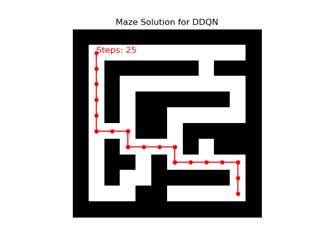

<!-- pandoc thesis_new.md --o thesis_new.pdf -H deeplist.tex -f markdown-implicit_figures  --template template.tex --lua-filter pagebreak.lua -->
<!-- pandoc --from markdown --to html5 --standalone --toc --number-sections --citeproc --wrap=preserve --highlight-style=kate --mathml -->

<!-- ## Abstract

In this research project, I delve into the fascinating realm of artificial intelligence, specifically focusing on reinforcement learning (RL) and its application in real-world scenarios. The crux of my investigation revolves around the challenging question: "Is it possible to transfer a trained RL agent from a simulation to the real world?" This inquiry is particularly examined in the context of maze navigation.

This research is partitioned into sub-questions, which collectively aim to create a comprehensive understanding of the process. Firstly, I explore the various virtual environments available for training a virtual RF-car, seeking the most effective platform for my purposes. Secondly, I delve into identifying the most suitable reinforcement learning techniques for this specific application, considering factors like efficiency, adaptability, and real-world applicability. Lastly, the research seeks to bridge the gap between simulation and reality, investigating the practicality and challenges involved in this transition.

Through this study, I aspire to contribute significantly to the field of AI and robotics, offering insights and methodologies that could potentially advance the implementation of RL in real-world applications. The outcomes of this research could have far-reaching implications, not only in robotics but also in areas where simulation-based training is crucial. -->

## 1. Glossary of Terms

1. **Artificial Intelligence (AI)**: The simulation of human intelligence processes by machines, especially computer systems, enabling them to perform tasks that typically require human intelligence.

2. **Double Deep Q-Network (DDQN)**: An enhancement of the Deep Q-Network (DQN) algorithm that addresses the overestimation of action values, thus improving learning stability and performance.

3. **Epsilon Decay**: A technique in reinforcement learning that gradually decreases the rate of exploration over time, allowing the agent to transition from exploring the environment to exploiting known actions for better outcomes.

4. **Mean Squared Error (MSE)**: A loss function used in regression models to measure the average squared difference between the estimated values and the actual value, useful for training models by minimizing error.

5. **Motion Processing Unit (MPU6050)**: A sensor device combining a MEMS (Micro-Electro-Mechanical Systems) gyroscope and a MEMS accelerometer, providing comprehensive motion processing capabilities.

6. **Policy Network**: In reinforcement learning, a neural network model that directly maps observed environment states to actions, guiding the agent's decisions based on the current policy.

7. **Raspberry Pi (RPI)**: A small, affordable computer used for various programming projects, including robotics and educational applications.

8. **RC Car**: A remote-controlled car used as a practical application platform in reinforcement learning experiments, demonstrating how algorithms can control real-world vehicles.

9. **Reinforcement Learning (RL)**: A subset of machine learning where an agent learns to make decisions by taking actions within an environment to achieve specified goals, guided by a system of rewards and penalties.

10. **Sim2Real Transfer**: The practice of applying models and strategies developed within a simulated environment to real-world situations, crucial for bridging the gap between theoretical research and practical application.

11. **Target Network**: Utilized in the DDQN framework, a neural network that helps stabilize training by providing consistent targets for the duration of the update interval.

12. **Virtual Environment**: A simulated setting designed for training reinforcement learning agents, offering a controlled, risk-free platform for experimentation and learning.

## 2. List of Abbreviations

1. **AI** - Artificial Intelligence
2. **DDQN** - Double Deep Q-Network
3. **DQN** - Deep Q-Network
4. **ESP32** - Espressif Systems 32-bit Microcontroller
5. **HC-SR04** - Ultrasonic Distance Sensor
6. **MSE** - Mean Squared Error
7. **MPU6050** - Motion Processing Unit (Gyroscope + Accelerometer)
8. **PPO** - Proximal Policy Optimization
9. **RC** - Remote Controlled
10. **RPI** - Raspberry Pi
11. **RL** - Reinforcement Learning
12. **RCMazeEnv** - RC Maze Environment (Custom Virtual Environment for RL Training)
13. **Sim2Real** - Simulation to Reality Transfer

<!-- ## Table of contents

- [Glossary of Terms](#glossary-of-terms)
- [List of Abbreviations](#list-of-abbreviations)
- [Table of contents](#table-of-contents)
- [Introduction](#introduction)
  - [Background on Reinforcement Learning](#background-on-reinforcement-learning)
- [Research Questions](#research-questions)
  - [Main Research Question](#main-research-question)
  - [Sub Research Questions](#sub-research-questions)
- [Methodology](#methodology)
  - [Environment Setup (RCMazeEnv)](#environment-setup-rcmazeenv)
  - [Agent Design (DDQNAgent)](#agent-design-ddqnagent)
  - [Training Process](#training-process)
  - [Reward Function Components](#reward-function-components)
    - [Collision Penalty $R\_{\\text{collision}}$](#collision-penalty-r_textcollision)
    - [Goal Achievement Bonus $R\_{\\text{goal}}$](#goal-achievement-bonus-r_textgoal)
    - [Proximity Reward $R\_{\\text{proximity}}$](#proximity-reward-r_textproximity)
    - [Progress Reward $R\_{\\text{progress}}$](#progress-reward-r_textprogress)
    - [Exploration Penalty $R\_{\\text{revisit}}$](#exploration-penalty-r_textrevisit)
    - [Efficiency Penalty $R\_{\\text{efficiency}}$](#efficiency-penalty-r_textefficiency)
    - [Generic Reward based on relative distance to goal](#generic-reward-based-on-relative-distance-to-goal)
  - [Scope of Real-World Testing](#scope-of-real-world-testing)
- [Answers to Research Questions](#answers-to-research-questions)
  - [1. Virtual Environments for RF-Car Training](#1-virtual-environments-for-rf-car-training)
  - [2. Reinforcement Learning Techniques for Virtual RF-Car Training](#2-reinforcement-learning-techniques-for-virtual-rf-car-training)
  - [3. Sim-to-Real Transfer Challenges and Solutions](#3-sim-to-real-transfer-challenges-and-solutions)
  - [4. Contributions of Simulation in RF-Car Training](#4-contributions-of-simulation-in-rf-car-training)
  - [5. Practical Application of Simulated Training to Real-World RF-Cars](#5-practical-application-of-simulated-training-to-real-world-rf-cars)
- [Experimental Outcomes and Implementation Details](#experimental-outcomes-and-implementation-details)
  - [Virtual Environment and Agent Design](#virtual-environment-and-agent-design)
  - [Implementation Highlights](#implementation-highlights)
  - [Evaluation and Metrics](#evaluation-and-metrics)
  - [Unique Features](#unique-features)
- [Model Architecture and Training Insights](#model-architecture-and-training-insights)
  - [Training Parameters](#training-parameters)
  - [Training Procedure](#training-procedure)
- [Visual Insights and Further Exploration](#visual-insights-and-further-exploration)
  - [Evaluation Metrics Overview](#evaluation-metrics-overview)
    - [Simulation Metrics](#simulation-metrics)
      - [1. Episodic Performance](#1-episodic-performance)
      - [2. Step Efficiency](#2-step-efficiency)
      - [3. MSE Loss Measurement](#3-mse-loss-measurement)
      - [4. Reward Trend Analysis](#4-reward-trend-analysis)
      - [5. Epsilon Decay Tracking](#5-epsilon-decay-tracking)
    - [Real-World Metrics](#real-world-metrics)
- [results](#results)
  - [Reinforcement Learning Techniques Overview](#reinforcement-learning-techniques-overview)
    - [final choice: DDQN](#final-choice-ddqn)
      - [1. **Visit Heatmap for DDQN:**](#1-visit-heatmap-for-ddqn)
      - [2. **Reward History for DDQN:**](#2-reward-history-for-ddqn)
      - [3. **Reward Distribution for DDQN:**](#3-reward-distribution-for-ddqn)
      - [4. **Maze Solution for DDQN:**](#4-maze-solution-for-ddqn)
      - [5. **Average Steps per Episode with Moving Average for DDQN:**](#5-average-steps-per-episode-with-moving-average-for-ddqn)
      - [6. **Epsilon History for DDQN:**](#6-epsilon-history-for-ddqn)
      - [7. **Mean Squared Error over time (Sampled) for DDQN:**](#7-mean-squared-error-over-time-sampled-for-ddqn)
    - [1. Deep Q-Network (DQN)](#1-deep-q-network-dqn)
    - [2. Double Deep Q-Network (DDQN)](#2-double-deep-q-network-ddqn)
    - [3. Proximal Policy Optimization (PPO)](#3-proximal-policy-optimization-ppo)
- [Hardware Setup and Assembly](#hardware-setup-and-assembly)
  - [Introduction to Hardware Components](#introduction-to-hardware-components)
  - [Components List](#components-list)
  - [Wiring Guide](#wiring-guide)
    - [esp32 pins](#esp32-pins)
- [Challenges and Solutions in Implementing RL Techniques and Virtual Environments](#challenges-and-solutions-in-implementing-rl-techniques-and-virtual-environments)
  - [Challenge 1: Selection of an Appropriate Virtual Environment](#challenge-1-selection-of-an-appropriate-virtual-environment)
  - [Challenge 2: Choosing the Optimal Reinforcement Learning Technique](#challenge-2-choosing-the-optimal-reinforcement-learning-technique)
  - [Challenge 3: Sim2Real Transfer - Addressing Movement Discrepancies](#challenge-3-sim2real-transfer---addressing-movement-discrepancies)
  - [Challenge 4: alignment Issue and Motor Encoder Implementation](#challenge-4-alignment-issue-and-motor-encoder-implementation)
  - [Challenge 5: Ensuring Consistent and Effective Training](#challenge-5-ensuring-consistent-and-effective-training)
  - [Challenge 6: Accurate Sensor Data Normalization for Sim2Real Transfer](#challenge-6-accurate-sensor-data-normalization-for-sim2real-transfer)
  - [Challenge 7: Integration of Failsafe Mechanisms](#challenge-7-integration-of-failsafe-mechanisms)
  - [Challenge 8: Training Environment and Technique Efficacy](#challenge-8-training-environment-and-technique-efficacy)
  - [Viewing Practical Experiments](#viewing-practical-experiments)
  - [Conclusion](#conclusion)
- [Real-World Application and Limitations](#real-world-application-and-limitations)
  - [Introduction to Sensor and Movement Discrepancies](#introduction-to-sensor-and-movement-discrepancies)
  - [Real-World Application](#real-world-application)
    - [Enhanced Sensor-Based Navigation](#enhanced-sensor-based-navigation)
    - [Informing Autonomous Vehicle Movement](#informing-autonomous-vehicle-movement)
  - [Limitations](#limitations)
    - [Discrepancies in Sensor Data Interpretation](#discrepancies-in-sensor-data-interpretation)
    - [Challenges in Movement Replication](#challenges-in-movement-replication)
    - [Practical Implementation Considerations](#practical-implementation-considerations)
  - [Conclusion](#conclusion-1)
- [Reflection](#reflection)
  - [Strengths and Weaknesses](#strengths-and-weaknesses)
  - [Practical Applicability and Industry Relevance](#practical-applicability-and-industry-relevance)
  - [Encountered Alternatives and Flexibility](#encountered-alternatives-and-flexibility)
  - [Anticipated Implementation Barriers](#anticipated-implementation-barriers)
  - [Ethical Considerations](#ethical-considerations)
  - [Societal Impact](#societal-impact)
  - [Policy and Regulation](#policy-and-regulation)
  - [Lessons Learned and Forward Path](#lessons-learned-and-forward-path)
- [Advice for those Embarking on Similar Research Paths](#advice-for-those-embarking-on-similar-research-paths)
- [General Conclusion](#general-conclusion)
- [Sources of Inspiration and Conceptual Framework](#sources-of-inspiration-and-conceptual-framework)
  - [Micro mouse Competitions and Reinforcement Learning](#micro-mouse-competitions-and-reinforcement-learning)
  - [Influential YouTube Demonstrations and GitHub Insights](#influential-youtube-demonstrations-and-github-insights)
  - [Technical Exploration and Academic Foundation](#technical-exploration-and-academic-foundation)
  - [Synthesis and Research Direction](#synthesis-and-research-direction)
- [Integration of Practical Experiments](#integration-of-practical-experiments)
  - [Addressing Alignment and Orientation Challenges](#addressing-alignment-and-orientation-challenges)
  - [Enhancing Movement Precision with Encoders](#enhancing-movement-precision-with-encoders)
  - [Real-World Application Tests](#real-world-application-tests)
- [Implementation of Real-World Control Algorithms](#implementation-of-real-world-control-algorithms)
  - [Introduction](#introduction-1)
  - [System Overview](#system-overview)
  - [Code Architecture and Integration](#code-architecture-and-integration)
  - [Practical Challenges in Sim2Real Transfer](#practical-challenges-in-sim2real-transfer)
  - [Testing and Validation](#testing-and-validation)
  - [Conclusion](#conclusion-2)
- [Guest Speakers](#guest-speakers)
  - [Innovations and Best Practices in AI Projects by Jeroen Boeye at Faktion](#innovations-and-best-practices-in-ai-projects-by-jeroen-boeye-at-faktion)
  - [Pioneering AI Solutions at Noest by Toon Vanhoutte](#pioneering-ai-solutions-at-noest-by-toon-vanhoutte)
- [Installation Steps](#installation-steps)
  - [Prerequisites](#prerequisites)
  - [Repository Setup](#repository-setup)
  - [ESP32 Setup](#esp32-setup)
    - [Hardware Installation](#hardware-installation)
    - [Software Configuration](#software-configuration)
  - [Web Application Setup](#web-application-setup)
    - [Note:](#note)
    - [Steps:](#steps)
  - [Usage Instructions](#usage-instructions)
  - [Additional Information: Model Training](#additional-information-model-training)
- [References](#references) -->

\pagebreak

## 3. Introduction

In the evolving landscape of artificial intelligence and robotics, the distinction between virtual simulations and real-world applications increasingly narrows, presenting unprecedented opportunities and challenges. This thesis explores the potential of Reinforcement Learning (RL) to bridge this gap, with a specific focus on the domain of autonomous navigation using a remote-controlled (RC) car in a maze. The endeavor to transfer a trained RL agent from a simulated environment to the real world encapsulates the core challenge of sim-to-real transferability, a pivotal step towards realizing the full spectrum of RL's applicability in complex, real-world scenarios.

The purpose of this study is to explore the feasibility and challenges of transferring a trained RL agent from a simulated environment to the real world. This transition, known as "sim2real," is particularly examined in the context of maze navigation using a remote-controlled (RC) car. The significance of this research lies in its potential to bridge the gap between theoretical RL models and practical, real-world applications, which is a critical step in advancing the field of AI and robotics.

### 1.1. Background on Reinforcement Learning

Reinforcement Learning (RL) employs a computational approach where agents learn to optimize their action sequences through trials and errors, engaging with their environment to maximize accumulated rewards over time. This learning framework is built upon the foundation of Markov Decision Processes (MDP), which includes:

- $S$: a definitive set of environmental states,
- $A$: a comprehensive set of possible actions for the agent,
- $P(s_{t+1} | s_t, a_t)$: the transition probability that signifies the chance of moving from state $s_t$ to state $s_{t+1}$ after the agent takes action $a_t$ at a given time $t$,
- $R(s_t, a_t)$: the reward received following the action $a_t$ from state $s_t$ to state $s_{t+1}$.

The principles of Reinforcement Learning, particularly the dynamics of Markov Decision Processes involving states $S$, actions $A$, transition probabilities $P(s_{t+1} | s_t, a_t)$, and rewards $R(s_t, a_t)$, form the foundation of how agents learn from and interact with their environment to optimize decision-making over time. This understanding is crucial in the development of autonomous vehicles, improving navigational strategies, decision-making capabilities, and adaptation to real-time environmental changes. The seminal work by R.S. Sutton and A.G. Barto significantly elucidates these principles and complexities of RL algorithms \hyperref[ref18]{[18]}.

## 4. Research Questions

This investigation is anchored by the question: "Can a trained RL agent be effectively transferred from a simulation to a real-world environment for maze navigation?" Addressing this question involves exploring multiple facets of RL training and implementation:

1. Selection of virtual environments for effective RL training.
2. Identification of RL techniques suited for autonomous navigation.
3. Evaluation of sim-to-real transfer in adapting to real-world dynamics.
4. Assessment of training efficacy and performance optimization through simulation.
5. Adaptation and transfer of a trained model to a real RC car, including necessary adjustments for real-world application.

A combination of qualitative and quantitative research methodologies underpins this study, encompassing simulation experiments, real-world trials, and an extensive review of existing literature. This multifaceted strategy not only seeks to corroborate the effectiveness of transferring simulations to real-world applications but also endeavors to enrich the ongoing conversation regarding the practical implementation and obstacles associated with Reinforcement Learning (RL).

### 1.2. Main Research Question

**Is it possible to transfer a trained RL-agent from a simulation to the real world? (case: maze)**

### 1.3. Sub Research Questions

1. Which virtual environments exist to train a virtual RC-car?

2. Which reinforcement learning techniques can I best use in this application?

3. Can the simulation be transferred to the real world? Explore the difference between how the car moves in the simulation and in the real world.

4. Does the simulation have any useful contributions? In terms of training time or performance?

5. How can the trained model be transferred to the real RC car? (sim2real) How do you need to adjust the agent and the environment for it to translate to the real world?

\pagebreak

## 5. Methodology

This section explores the Reinforcement Learning Maze Navigation (RCMazeEnv) method, utilizing a Double Deep Q-Network (DDQNAgent) architecture. It details the maze environment setup, the DDQN agent design, and the comprehensive training algorithm, incorporating mathematical functions to delineate the system's mechanics.

### 1.4. Environment Setup (RCMazeEnv)

The RCMazeEnv, a custom maze navigation environment derived from the OpenAI Gym framework, is designed for a 12x12 cell grid maze navigation task. Each cell within this grid can be identified as either a wall, represented by '1', or a path, represented by '0', with the goal designated at cell position (10, 10). The agent, visualized as a car, commences its journey from the starting position at cell (1, 1), facing eastward initially. The agent's navigation capabilities are enabled through a set of possible actions: moving forward, turning left, and turning right.

To assist in navigation, the agent is equipped with sensors that provide readings in three directions: front, left, and right. These sensors measure the distance to the nearest wall in their respective directions, offering crucial environmental information that aids in decision-making. The environment's state space, denoted as $\mathcal{S}$, encapsulates the agent's current position $(x, y)$, its orientation $\theta$, which can be one of $\{N, E, S, W\}$ representing north, east, south, and west respectively, and the sensor readings $\{s_{\text{front}}, s_{\text{left}}, s_{\text{right}}\}$. The goal of the agent is to navigate through the maze, from its starting point to the goal location, efficiently while avoiding collisions with walls and optimizing the path taken based on the sensor inputs and past experiences.

### 1.5. Agent Design (DDQNAgent)

The agent employs a Double Deep Q-Network (DDQN) architecture to learn the optimal policy $\pi^*$. This is an enhancement over the standard DQN that aims to reduce overestimation of Q-values by decoupling the action selection from its evaluation \hyperref[ref19]{[19]}.

- **Policy Network:** Estimates the Q-value $Q(s, a; \theta)$ for taking action $a$ in state $s$, parameterized by weights $\theta$. This network is responsible for selecting actions based on the current policy.
- **Target Network:** Independently parameterized by weights $\theta^-$, used to estimate the target Q-value for updating the policy network. It mirrors the architecture of the policy network but is updated less frequently to provide stable target values.

The Q-function update equation in DDQN is modified to:

$$
Y_t^{DDQN} = R_{t+1} + \gamma Q\left(S_{t+1}, \underset{a}{\mathrm{argmax}}\, Q(S_{t+1}, a; \theta); \theta^-\right)
$$

Where:

- $R_{t+1}$ is the reward received after taking action $a$ in state $s$.
- $\gamma$ is the discount factor.
- $\underset{a}{\mathrm{argmax}}\, Q(S_{t+1}, a; \theta)$ selects the action using the policy network.
- $Q\left(S_{t+1}, a; \theta^-\right)$ evaluates the action using the target network.

This approach is grounded in the principle of reducing overestimation by decomposing the max operation in the target into action selection and action evaluation, thereby mitigating the overoptimism often observed in Q-learning \hyperref[ref20]{[20]}.

The action space $\mathcal{A}$ and the rest of the agent's setup remain as previously described. The DDQN architecture significantly improves the stability and performance of the agent by addressing the overestimation of Q-values, promoting a more accurate and reliable learning process. However, it's important to note that the effectiveness of DDQN can vary depending on the specific task, and it may not always outperform traditional DQN approaches \hyperref[ref21]{[21]}.

### 1.6. Training Process

The training process utilizes the experience replay mechanism, storing transitions $(s, a, r, s')$ in a replay buffer $D$. The DQN is trained by minimizing the loss function $L(\theta)$ defined as the mean squared error between the current Q-values and the target Q-values:

$$
L(\theta) = \mathbb{E}_{(s,a,r,s') \sim U(D)}\left[\left(r + \gamma \max_{a'}Q(s', a'; \theta^-) - Q(s, a; \theta)\right)^2\right]
$$

where $\theta^-$ represents the weights of a target network, and $\gamma$ is the discount factor. The target network's weights are periodically updated to match the policy network, stabilizing training.

The epsilon-greedy strategy is employed for action selection, with $\epsilon$ gradually decaying from 1 to a minimum value, balancing exploration and exploitation.

### 1.7. Reward Function Components

#### Collision Penalty $R_{\text{collision}}$

When the agent attempts to move into a wall or outside the designated maze boundaries, it triggers a collision state. To discourage such actions, which are counterproductive to the goal of reaching the destination, a significant penalty is applied. This penalty is critical for teaching the agent about the boundaries and obstacles within the environment, ensuring that it learns to navigate safely and effectively.

$$ R\_{\text{collision}} = -20 $$

#### Goal Achievement Bonus $R_{\text{goal}}$

Reaching the goal is the primary objective of the maze navigation task. A substantial reward is given to the agent upon achieving this objective, signifying the completion of the episode. This reward serves as a strong positive reinforcement, guiding the agent's learning towards the goal-oriented behavior. However, an additional mechanism penalizes the agent if it takes an excessively long route to reach the goal, promoting efficiency in navigation.

$$ R\_{\text{goal}} = \begin{cases} +500, & \text{if goal is reached} \\ -200, & \text{if steps} > 1000 \end{cases} $$

#### Proximity Reward $R_{\text{proximity}}$

This component of the reward function incentivizes the agent to minimize its distance to the goal over time. By rewarding the agent based on its proximity to the goal, it encourages exploration and path optimization, guiding the agent to navigate the maze more effectively. The reward decreases as the distance to the goal increases, encouraging the agent to always move towards the goal.

$$ R*{\text{proximity}} = \frac{50}{d*{\text{goal}} + 1} $$

#### Progress Reward $R_{\text{progress}}$

The progress reward or penalty is designed to encourage the agent to make decisions that bring it closer to the goal and to penalize decisions that lead it away. This dynamic reward system provides immediate feedback based on the agent's movement relative to the goal, promoting smarter navigation decisions.

$$ R\_{\text{progress}} = \begin{cases} +50, & \text{if distance decreases} \\ -25, & \text{if distance increases} \end{cases} $$

#### Exploration Penalty $R_{\text{revisit}}$

To discourage repetitive exploration of the same areas, which indicates inefficient pathfinding, the agent receives a penalty for re-entering previously visited cells. This penalty is crucial for encouraging the exploration of new paths and preventing the agent from getting stuck in loops or dead ends.

$$ R\_{\text{revisit}} = -10 $$

#### Efficiency Penalty $R_{\text{efficiency}}$

Every step the agent takes incurs a small penalty. This mechanism ensures that the agent is incentivized to find the shortest possible path to the goal, balancing the need to explore the environment with the goal of reaching the destination as efficiently as possible.

$$ R\_{\text{efficiency}} = -5 $$

#### Generic Reward based on relative distance to goal

The reward function $R(s, a)$ is designed to encourage reaching the goal while penalizing collisions and inefficient paths. The reward for each step is defined as:

$$
R(s, a) = \begin{cases}
500 & \text{if goal is reached} \\
-20 & \text{if collision} \\
50 / (d + 1) & \text{otherwise}
\end{cases}
$$

where $d$ is the Euclidean distance to the goal, encouraging the agent to minimize the distance to the goal.

The episode terminates when the agent reaches the goal, collides with an obstacle, or exceeds a predefined step limit, aiming to learn an efficient navigation policy.

### 1.8. Scope of Real-World Testing

This study focused on conducting experiments within indoor settings, where environmental conditions could be precisely regulated to mirror theoretical constructs closely. Experiments were predominantly carried out on a meticulously selected hard cloth surface to eliminate ground flaws and ensure a uniform testing ground. This strategic selection was crucial for the replication of simulation outcomes and for a controlled assessment of the transition from simulation to reality (sim-to-real) for autonomous technologies.

Nevertheless, the ambit of real-world experimentation was not confined to indoor setups. Efforts were made to broaden the scope to outdoor environments to ascertain the adaptability and resilience of the proposed solutions under varied conditions. These ventures into the outdoors faced substantial obstacles, mainly due to the challenges in offsetting the differences in ground conditions. The variability and unpredictability of outdoor landscapes exposed significant gaps in the current method's capacity to adjust to diverse real-world settings.

This issue became particularly pronounced in the section discussing "Overcoming Navigation Challenges in Varying Environments," where the adaptation of the autonomous system to outdoor navigation met with significant hurdles. While the system demonstrated successful sim-to-real transfers in controlled indoor environments, the outdoor experiments highlighted the imperative for additional research and enhancement of the system’s flexibility. The outdoor testing difficulties underscore the importance of broadening the experimental scope and advancing autonomous technologies to navigate the intricacies of unregulated terrains.

## 6. Experimental Outcomes and Implementation Details

The project embarked on a journey to bridge the virtual and real-world through a meticulously designed environment and a cutting-edge agent architecture.

### 1.9. Virtual Environment and Agent Design

- **RCMazeEnv**: Customized for this project, the environment simulates a robotic car navigating a maze. Its design replicates real-world physics and constraints, offering a rich testing ground for reinforcement learning algorithms. The maze's structure, from its starting position to the goal, and the robotic car's specifications, including movement actions and sensor setups, are critical to the simulation's realism.

- **Double Deep Q-Network (DDQN)**: Employing two neural networks, this model enhances traditional reinforcement learning methods by reducing the overestimation of Q-values. The policy network and the target network work in tandem to refine the agent's learning process through continuous interaction and sensor data interpretation.

### 1.10. Implementation Highlights

- **Environment and Agent Interaction**: Central to the DDQN agent's strategy is its continuous adaptation to the environment, leveraging sensor inputs to inform its decisions and optimize its path through the maze. This iterative learning process is visually represented through a simulation platform that allows for detailed observation of the agent's performance and strategy adjustments.

- **Real-World Application**: Transferring the virtual training to a physical RC robot involved comprehensive hardware setup and calibration. Challenges such as sensor data normalization and precise movement control were addressed to ensure a seamless transition from virtual to real-world application.

### 1.11. Evaluation and Metrics

The project employed specific metrics to evaluate the agent's efficiency in navigating the maze, with emphasis on both simulation performance and real-world applicability. This involved monitoring the agent's episodic performance, step efficiency, and adaptation to real-world conditions.

### 1.12. Unique Features

- **Physical Maze and Web Application**: A constructed physical maze served as the tangible counterpart to the virtual `RCMazeEnv`, playing a crucial role in testing the RC robot's navigation capabilities. Additionally, a web application was developed to act as a visualization and control interface, enhancing the interaction between the virtual and real-world applications.

## 7. Answers to Research Questions

### 1.13. 1. Virtual Environments for RF-Car Training

The choice of a virtual environment is paramount in simulating the complex dynamics of autonomous driving. Platforms such as Unity 3D, AirSim, CARLA, OpenAI Gym, and ISAAC Gym offer varied features catering to different aspects of driving simulation. However, for RF-car training, OpenAI Gym is selected for its flexibility in custom environment creation and its compatibility with Python, facilitating ease of use and integration with existing advanced AI coursework \hyperref[ref1]{[1]}.

Unity 3D and AirSim, while providing realistic simulations, require expertise beyond Python, limiting their accessibility for the current project scope. CARLA offers comprehensive autonomous driving simulation capabilities but is tailored towards more traditional vehicle models rather than RF-cars. ISAAC Gym, with its focus on robotics, presents a similar mismatch in application. In contrast, OpenAI Gym's simplicity and reinforcement learning focus make it an ideal platform for this project, supporting effective SIM2REAL transfer practices \hyperref[ref2]{[2]}.

### 1.14. 2. Reinforcement Learning Techniques for Virtual RF-Car Training

The comparison of Deep Q-Network (DQN), Double Deep Q-Network (DDQN), and Proximal Policy Optimization (PPO) techniques reveals that DDQN offers the best fit for the project's needs. DDQN's architecture, designed to address the overestimation bias inherent in DQN, enhances accuracy in Q-value approximation—a critical factor in navigating the complex, sensor-driven environments of RF-car simulations \hyperref[ref3]{[3]}.

DQN, while powerful for high-dimensional sensory input processing, falls short in environments with unpredictable dynamics, a limitation DDQN effectively overcomes. PPO's focus on direct policy optimization provides stability and efficiency but lacks the precision in value estimation necessary for RF-car training. Empirical trials further validate DDQN's superior performance, demonstrating its suitability for the intricate maze-like environments encountered by virtual RF-cars \hyperref[ref4]{[4]}.

### 1.15. 3. Sim-to-Real Transfer Challenges and Solutions

Transferring simulation models to real-world applications involves addressing discrepancies in sensor data interpretation, action synchronization, and physical dynamics. Solutions such as sensor data normalization and action synchronization mechanisms were implemented to align simulation outcomes with real-world performance \hyperref[ref5]{[5]}.

The introduction of failsafe mechanisms and adjustments in motor control timings proved critical in mitigating issues like collision risks and movement inaccuracies, underscoring the importance of iterative testing and adaptation in sim-to-real transfer \hyperref[ref6]{[6]}.

### 1.16. 4. Contributions of Simulation in RF-Car Training

Simulation training offers distinct advantages in efficiency, safety, and computational resources. It enables uninterrupted and automated training sessions, eliminates the risks associated with real-world training, and leverages powerful computing resources to accelerate the training process \hyperref[ref7]{[7]}.

The comparative analysis between simulation and real-world training outcomes highlights the practicality and effectiveness of simulation in developing autonomous driving models, making it an indispensable tool in the RF-car development process \hyperref[ref8]{[8]}.

### 1.17. 5. Practical Application of Simulated Training to Real-World RF-Cars

Applying a trained model to a physical RC car requires careful consideration of environment, agent, and model adjustments. Strategies for effective sim-to-real adaptation include fine-tuning sensor interpretations, implementing action synchronization measures, and adjusting physical dynamics to mirror those of the simulation \hyperref[ref9]{[9]}.

This process ensures the successful application of simulation training to real-world scenarios, facilitating the development of robust and reliable autonomous driving systems \hyperref[ref10]{[10]}.

## 8. Model Architecture and Training Insights

The Double DQN model's architecture is central to understanding the agent's learning and decision-making capabilities. Structured with four dense layers, it outputs three actions tailored to the RC car's movement, enabling sophisticated navigation strategies within the maze.

**Model Architecture:**

```markdown
## 9. Model: "sequential_52"

# Layer (type) Output Shape Param

=================================================================
dense_200 (Dense) (None, 32) 224
dense_201 (Dense) (None, 64) 2112
dense_202 (Dense) (None, 32) 2080
dense_203 (Dense) (None, 3) 99
=================================================================
Total params: 4515 (17.64 KB)
Trainable params: 4515 (17.64 KB)
Non-trainable params: 0 (0.00 Byte)

---
```

This model is instrumental in the agent's ability to learn from its environment, adapting its strategy to optimize for both efficiency and effectiveness in maze navigation.

### 1.18. Training Parameters

The training of the Double DQN agent was governed by the following parameters:

- **Discount Factor (`DISCOUNT`)**: 0.90
- **Batch Size**: 128
  - Number of steps (samples) used for training at a time.
- **Update Target Interval (`UPDATE_TARGET_INTERVAL`)**: 2
  - Frequency of updating the target network.
- **Epsilon (`EPSILON`)**: 0.99
  - Initial exploration rate.
- **Minimum Epsilon (`MIN_EPSILON`)**: 0.01
  - Minimum value for exploration rate.
- **Epsilon Decay Rate (`DECAY`)**: 0.99973
  - Rate at which exploration probability decreases.
- **Number of Episodes (`EPISODE_AMOUNT`)**: 170
  - Total episodes for training the agent.
- **Replay Memory Capacity (`REPLAY_MEMORY_CAPACITY`)**: 2,000,000
  - Maximum size of the replay buffer.
- **Learning Rate**: 0.001
  - The rate at which the model learns from new observations.

### 1.19. Training Procedure

1. **Initialization**: Start with a high exploration rate (`EPSILON`) allowing the agent to explore the environment extensively.
2. **Episodic Training**: For each episode, the agent interacts with the environment, collecting state, action, reward, and next state data.
3. **Replay Buffer**: Store these experiences in a replay memory, which helps in breaking the correlation between sequential experiences.
4. **Batch Learning**: Randomly sample a batch of experiences from the replay buffer to train the network.
5. **Target Network Update**: Every `UPDATE_TARGET_INTERVAL` episodes, update the weights of the target network with those of the policy network.
6. **Epsilon Decay**: Gradually decrease the exploration rate (`EPSILON`) following the decay rate (`DECAY`), shifting the strategy from exploration to exploitation.
7. **Performance Monitoring**: Continuously monitor the agent's performance in terms of rewards and success rate in navigating the maze.

## 10. Visual Insights and Further Exploration

The project's innovative approach to sim-to-real transfer in reinforcement learning is encapsulated in a series of visual representations and demonstrations, from the detailed construction of the physical maze to the dynamic interface of the web application.

- **Maze Visualization:**

{ width=50% }

- **Web Application Interface:**

{ width=100% }

- **Simulation Test Video:**

[DDQN Test in Action](https://github.com/driessenslucas/researchproject/assets/91117911/66539a97-e276-430f-ab93-4a8a5138ee5e){ width=50% }

\newpage

### 1.20. Evaluation Metrics Overview

#### Simulation Metrics

##### 1. Episodic Performance

- **Objective and Goal:** This metric assesses the agent's learning curve and its ability to solve the maze with optimal efficiency over successive episodes. The primary goal is to evaluate how quickly and effectively the agent learns to reach the maze's end, reflecting on its strategy optimization and adaptation abilities.
- **How it's Assessed:** By tracking the number of episodes required before the agent can consistently solve the maze. A decreasing trend in episode count needed over time indicates effective learning and adaptation.
- **Analytical Techniques:** Statistical analysis or visual plots (e.g., learning curves) are used to assess changes in episodic performance across training sessions.
- **Accuracy and Consistency Measures:** Ensuring data integrity and a controlled environment allows for consistent episode comparison. Techniques might include averaging over multiple runs to mitigate randomness in the agent's learning process.

##### 2. Step Efficiency

- **Objective and Goal:** This measures the decision-making process and path optimization capabilities of the agent by counting the steps taken to solve the maze. Fewer steps indicate higher efficiency and learning.
- **How it's Assessed:** Tracking the number of steps required to reach the goal in each episode and analyzing the trend over time.
- **Analytical Techniques:** Quantitative analysis of step count trends, possibly applying smoothing techniques to observe the overall trend amidst the variability.
- **Accuracy and Consistency Measures:** Replication and averaging, as well as maintaining a consistent maze configuration across tests, help ensure reliable measurements.

##### 3. MSE Loss Measurement

$$
MSE(y, \hat{y}) = \frac{1}{N} \sum_{i=0}^{N-1} (y_i - \hat{y}_i)^2
$$

- **Objective and Goal:** Quantifies the prediction accuracy of the agent by measuring the squared discrepancy between the agent’s predicted values and the actual outcomes. It's a direct measure of the agent's learning accuracy.
- **How it's Assessed:** Through the mathematical formula provided, which averages the squared differences across all predictions (N) in a given episode or batch of episodes.
- **Analytical Techniques:** MSE calculation is straightforward but interpreting its trend over time requires understanding its relationship with the agent’s learning phase (e.g., initial learning vs. strategy refinement).
- **Accuracy and Consistency Measures:** Regular evaluation against a validation set or within a consistent testing framework can provide reliable insights into the agent's prediction accuracy and learning progress.

##### 4. Reward Trend Analysis

- **Objective and Goal:** To understand how the agent's actions lead to outcomes (rewards) and how this affects its ability to navigate the maze efficiently, indicating learning proficiency and strategy development.
- **How it's Assessed:** Monitoring and analyzing the history of rewards received by the agent, looking for trends of increasing reward accumulation over time.
- **Analytical Techniques:** Time series analysis or cumulative reward plots can illustrate the agent’s learning and decision-making improvements.
- **Accuracy and Consistency Measures:** Averaging reward trends over multiple runs and ensuring that reward distribution remains unchanged throughout experiments.

##### 5. Epsilon Decay Tracking

- **Objective and Goal:** This metric assesses the agent's balance between exploring new paths and exploiting known successful routes, crucial for adaptive learning strategies.
- **How it's Assessed:** By tracking the epsilon parameter’s value over episodes, observing how it decreases according to a predefined decay strategy, signaling a shift from exploration to exploitation.
- **Analytical Techniques:** Analysis involves plotting epsilon values over time to visualize the agent's transition in learning strategy.
- **Accuracy and Consistency Measures:** Consistent application of the epsilon decay strategy across training sessions and ensuring environmental stability for comparable results.

#### Real-World Metrics

Transitioning to real-world application involved assessing how the simulation-trained agent's strategies fared in a physical maze with tangible obstacles and limitations.

- **Maze Navigation**: A visual assessment of the RC car's ability to navigate a real-world maze provided direct evidence of the sim-to-real transfer's effectiveness, highlighting the practical application of the trained agent.
- **Sensor Data Analysis**: Evaluating the real-time sensor data in navigation scenarios enabled a detailed understanding of the agent's interaction with the physical world, particularly in terms of collision avoidance and pathfinding efficiency.

## 11. Implementation of Real-World Control Algorithms

### 1.21. Introduction

This section outlines the practical implementation of control algorithms developed and refined through simulations. We focus on their application in a physical robot equipped with motion, orientation, and communication systems. The primary objective is to evaluate the fidelity of simulated behaviors when transferred to real-world scenarios, demonstrating both the effectiveness and the limitations of the sim2real transfer.

### 1.22. System Overview

The experimental setup consists of an ESP32 microcontroller interfaced with MPU6050 gyroscopic sensors, ultrasonic sensors for distance measurement, and a motor control system. The robot's capabilities include navigational maneuvers such as moving forward, turning left, and turning right, which are fundamental for testing the real-world applicability of simulated algorithms.

### 1.23. Code Architecture and Integration

**System Initialization**

Before diving into the specific movement functions, it is essential to understand the initial configuration and setup processes that prepare the system for operation. The initialization sequence configures the hardware interfaces, establishes network connections, and sets up the sensors and actuators. This setup is crucial for ensuring that the system operates reliably and is prepared to execute the movement commands accurately.

<!-- ```cpp
void setup() {
  Serial.begin(9600);        // Start serial communication at 9600 baud rate
  setupWifiAndOTA();          // Initialize WiFi and OTA update services
  Wire.begin();               // Start the I2C communication
  setupSensorsAndDisplay();   // Configure sensors and initialize the display
  setupMPU();                 // Initialize and calibrate MPU6050 sensor
  setupMotors();              // Set motor pins and initialize motors
}
``` -->

- **WiFi and OTA Configuration**: Establishes a network connection and sets up Over-The-Air updates, allowing for remote firmware upgrades and maintenance, which is critical for iterative testing and enhancements.
- **Sensor and Display Setup**: Configures ultrasonic sensors for distance measurement and initializes the display to provide real-time feedback on the robot’s status and IP address, enhancing user interaction and debug capabilities.
- **MPU6050 Setup and Calibration**: Ensures that the gyroscopic sensor is calibrated to measure angles accurately, which is vital for precise movement control during turns.
- **Motor Setup**: Prepares the motor drivers and sets initial motor states, readying the system for movement commands.

**Motor Control Mechanism**

This subsection describes in detail the implementation of movement functions, showing the direct application of simulated navigation algorithms into the real-world robotic system.

- **Variables for the motor control**

  ```cpp
  int initialSpeed = 125; // Set a higher initial speed
  int minSpeed = 40;      // Set a minimum speed
  int speed = initialSpeed;
  constexpr int TURN_DURATION = 245;
  ```

  These variables define the initial and minimum speeds for the motors, along with the duration for turning actions. The `speed` variable dynamically adjusts the motor speed based on the turning angle, ensuring precise and controlled movements.

- **Forward Movement**

  <!-- ```cpp
  void move_forward() {
    if (shouldStop) {
      shouldStop = false;
      return;
    }
    analogWrite(motorEnablePins[0], 255);    // Set maximum speed
    analogWrite(motorEnablePins[1], 255);
    digitalWrite(motorPins[0], LOW);   // Drive motors forward
    digitalWrite(motorPins[1], HIGH);

    for (int i = 0; i < 7; ++i) {  // Continue movement for a brief period
      delay(100);
      if (shouldStop) {  // Check if stopping condition was triggered
        break;
      }
    }

    stop_moving();  // Stop movement by resetting motor speeds
  }
  ``` -->

  The `move_forward` function initiates forward motion at maximum speed, incorporating real-time checks for emergency stops to enhance safety. This reflects real-world conditions where response to dynamic changes is critical.

- **Left Turn**

  <!-- ```cpp
  void move_left() {
    calibrateSensors();  // Recalibrate sensors to ensure accuracy
    isTurning = true;
    int speedIncrement = 0;  // Additional speed adjustment parameter

    while (isTurning && !shouldStop) {
      int16_t gx, gy, gz;
      mpu.getMotion6(&ax, &ay, &az, &gx, &gy, &gz);  // Read gyroscopic data
      float gyroZ = gz / 131.0;
      unsigned long currentTime = millis();
      if (lastTime == 0) lastTime = currentTime;

      float deltaTime = (currentTime - lastTime) / 1000.0;
      lastTime = currentTime;
      angleZ += gyroZ * deltaTime;  // Integrate gyro data to compute angle

      float angleDifference = abs(angleZ - initialAngleZ);
      if (!initialAngleSet) {
          initialAngleZ = angleZ;  // Set initial angle at the start of the turn
          initialAngleSet = true;
      }

      speed = initialSpeed - (int)((angleDifference / 90) * (initialSpeed - minSpeed));
      speed = max(speed, minSpeed);  // Dynamically adjust speed based on angle turned

      analogWrite(motorEnablePins[0], speed);
      analogWrite(motorEnablePins[1], speed);
      digitalWrite(motorPins[0], HIGH);
      digitalWrite(motorPins[1], HIGH);

      if (angleDifference >= 88) {
          stop_moving();  // Complete the turn once the desired angle is reached
          isTurning = false;
      }
      delay(100);
    }
  }
  ``` -->

  `move_left` dynamically adjusts the speed of the motors based on the turning angle, a method developed from simulating how physical and inertia properties affect movement. This method ensures precise and controlled turns.

- **Right Turn**

  Similar to `move_left`, the `move_right` function involves similar gyroscopic feedback and dynamic speed adjustments but directs the motors to facilitate a right turn. The inclusion of `calibrateSensors()` before each movement ensures that the gyroscopic data is accurate, which is critical for maintaining precision in physical movements that were modeled in a virtual environment.

- **Stopping Movement**

  <!-- ```cpp
  void stop_moving() {
    shouldStop = true;  // Flag to indicate that stopping has been initiated
    isTurning = false;
    analogWrite(motorEnablePins[0], 0);  // Immediately cut power to motors
    analogWrite(motorEnablePins[1], 0);
    digitalWrite(motorPins[0], LOW);
    digitalWrite(motorPins[1], HIGH);
    shouldStop = false;  // Reset the stop flag after action is taken
  }
  ``` -->

  The `stop_moving` function is designed to halt all motion instantly, a feature that is essential for preventing accidents and handling unexpected scenarios in dynamic environments.

**Calibration and Sensor Data Interpretation**

The calibration process ensures that sensor data is accurate and reliable, a critical step in maintaining the fidelity of simulated behaviors in real-world applications. The `calibrateSensors` function recalibrates the gyroscopic sensor to account for any drift or inaccuracies that may arise during operation.

```cpp
void calibrateSensors()
{
    long gyroZAccum = 0;
    Serial.println("Calibrating...");
    for (int i = 0; i < 100; i++)
    {
        int16_t ax, ay, az, gx, gy, gz;
        mpu.getMotion6(&ax, &ay, &az, &gx, &gy, &gz);
        gyroZAccum += gz;
        delay(20);
    }
    mpu.setZGyroOffset(-gyroZAccum / 13100); // Adjust based on 100 readings
    Serial.println("Calibration Complete");
}
```

\pagebreak

## 12. results

### 1.24. Reinforcement Learning Techniques Overview

#### final choice: DDQN

- The research project explored various reinforcement learning techniques to train an agent for maze navigation, focusing on their adaptability, efficiency, and real-world applicability. The following techniques were evaluated:

##### 1. **Visit Heatmap for DDQN:**

- The visit heatmap offers a graphical representation of the agent’s frequency of visits to various states within the maze. The pattern displayed suggests the agent’s favored paths and identifies potential bottlenecks where the agent might have struggled. The heatmap serves as a tool for analyzing the agent's exploration patterns and its strategy development throughout training.


##### 2. **Reward History for DDQN:**

- The reward history graph illustrates that the rewards stabilized at around episode 50, indicating the agent's learning progress and improved decision-making. The consistent positive rewards signify the agent's successful navigation through the maze, with occasional dips reflecting exploratory actions or suboptimal decisions. The upward trend in rewards over time demonstrates the agent's learning efficiency and strategy optimization.


##### 3. **Reward Distribution for DDQN:**

- Analyzing the reward distribution histogram reveals the frequency of the received rewards. The concentration of instances near higher rewards implies that the agent often achieved positive outcomes, while the long tail towards negative rewards indicates the agent's occasional exploratory actions or suboptimal decisions.


##### 4. **Maze Solution for DDQN:**

- The maze solution visualization illustrates the agent's path to solving the maze. Notably, the agent achieved the goal in just 25 steps, a testament to the DDQN's efficiency in learning and path optimization. This graphical representation highlights the agent’s capability to derive an optimal route, avoiding backtracking and unnecessary detours.



##### 5. **Average Steps per Episode with Moving Average for DDQN:**

- The plot for the average steps per episode, smoothed by a moving average, clearly shows the agent’s learning progression. The decrease in the number of steps required to solve the maze, as portrayed by the moving average line, underscores the DDQN’s ability to enhance the agent’s efficiency in maze resolution.


##### 6. **Epsilon History for DDQN:**

- The graph depicting the epsilon decay showcases the agent’s transition from exploration to exploitation over time. Initially, a higher epsilon value encouraged exploration, aiding the agent in acquiring diverse experiences. As training progressed, the epsilon value decayed, as evident in the graph's steady decline, indicating the agent's increasing reliance on its learned policy. This adaptive strategy was crucial for fine-tuning the agent’s decision-making process, ensuring a balance between exploring new paths and exploiting known ones for improved maze navigation.


##### 7. **Mean Squared Error over time (Sampled) for DDQN:**

- The MSE graph, a reflection of the agent’s prediction accuracy, demonstrates a downward trend, indicative of the agent's improved learning over episodes. The initial spikes suggest a period of trial and error, where the agent was developing its understanding of the maze. Over time, the reduced variability in MSE values points towards the agent making more accurate predictions, further underscoring the DDQN's effective learning curve.


#### 1. Deep Q-Network (DQN)

- **Description**: The Deep Q-Network (DQN) combines a deep neural network with a Q-learning framework. It excels in handling high-dimensional sensory inputs, making it ideal for environments demanding detailed interaction.
- **Suitability**: DQN's advanced learning capabilities are tempered by its tendency to overestimate Q-values in complex environments. This limitation could affect its effectiveness in training RC-cars, where environmental dynamics are unpredictable.

- **Integration and Results**:

  - **Reward History**:

  

  - **Performance**: DQN's performance, while competent, was limited by Q-value overestimation in intricate scenarios.

#### 2. Double Deep Q-Network (DDQN)

- **Description**: The Double Deep Q-Network (DDQN) improves upon DQN by employing two neural networks. This structure effectively reduces overestimation bias by separating action selection from Q-value generation.

- **Reason for Selection**:

  - DDQN's accuracy in Q-value approximation is crucial for navigating complex environments, such as mazes.
  - The RC-car's sensor limitations, which could lead to Q-value overestimations, are better addressed by DDQN.
  - Empirical trials showed DDQN's superior performance in maze navigation tasks.

- **Integration and Results**:

  - **Reward History**:

  

  - **Performance**: DDQN solved the environment in an average of 25 steps, compared to DQN's 34 steps, highlighting its efficiency.

#### 3. Proximal Policy Optimization (PPO)

- **Description**: Proximal Policy Optimization (PPO) is a policy gradient method that directly optimizes decision-making policies. It's known for its stability and efficiency in specific RL contexts.

- **Suitability**: PPO's emphasis on policy optimization over value estimation makes it less suitable for RC-car simulations, where accurate Q-value approximation is key.

- **Integration and Results**:

  - **Reward History**:

  

  - **Performance**: PPO, while stable, did not align well with the precision requirements for RC-car maze navigation.

## 13. Real-World Application and Limitations

### 1.25. Introduction to Sensor and Movement Discrepancies

The leap from simulated environments to real-world application unveils a complex landscape of challenges, especially in the interpretation of sensor data and the replication of vehicle movements. This discussion delves into these critical aspects, highlighting both the opportunities and constraints of applying simulation-derived insights to actual autonomous vehicle (AV) operations.

### 1.26. Real-World Application

#### Enhanced Sensor-Based Navigation

Sensor-based navigation technologies, refined through simulation, promise substantial improvements in autonomous vehicles' functionality. In real-world applications, such technologies are pivotal for environments demanding high precision and adaptability. For instance, in congested urban settings or in automated delivery systems, the ability to dynamically navigate with high accuracy can significantly elevate both safety and efficiency. Integrating simulation insights into sensor-based navigation aids in refining these systems to better interpret complex, variable real-world conditions.

#### Informing Autonomous Vehicle Movement

Simulated environments offer a controlled setting to study vehicle dynamics and movement responses. Applying these insights to the development of autonomous vehicles can lead to advanced algorithms capable of handling the unpredictable nature of real-world environments. This knowledge is instrumental in enhancing autonomous systems' ability to safely and efficiently navigate through dynamic and often chaotic traffic conditions, thereby improving the overall functionality of autonomous transportation.

### 1.27. Limitations

#### Discrepancies in Sensor Data Interpretation

A substantial hurdle in the real-world application of simulation-based insights is the variation in sensor data accuracy between simulated and actual environments. These discrepancies can directly impact the effectiveness of navigational algorithms, potentially compromising the vehicle's decision-making processes and, by extension, its safety and operational efficiency.

#### Challenges in Movement Replication

The precise replication of simulated vehicle movements in real-world conditions encounters numerous obstacles. External factors such as road surface variations, environmental conditions, vehicle load, and mechanical constraints can introduce unforeseen deviations in vehicle behavior. These real-world variances necessitate adjustments and recalibration of the algorithms developed in simulated environments to ensure their effectiveness and reliability outside the lab.

#### Practical Implementation Considerations

Successfully translating simulation insights into real-world applications requires meticulous attention to several practical aspects. These include, but are not limited to, sensor calibration to account for environmental influences, adapting algorithms to hardware limitations, and ensuring the system's resilience to real-world unpredictabilities. Addressing these factors is crucial for the effective deployment and operational success of autonomous vehicles based on sim2real insights.

### 1.28. Conclusion

Transitioning from simulation-based research to practical real-world applications in autonomous vehicle navigation presents a unique set of challenges and opportunities. While the application of simulation-derived insights into sensor use and vehicle movement has the potential to revolutionize autonomous vehicle technologies, significant effort is required to bridge the gap between simulated accuracy and real-world variability. Overcoming these challenges is essential for the successful integration of sim2real technologies in enhancing the safety, efficiency, and reliability of autonomous transportation systems.

## 14. Challenges and Solutions in Implementing RL Techniques and Virtual Environments

### 1.29. Challenge 1: Selection of an Appropriate Virtual Environment

- **Description**: Choosing a virtual environment conducive to effective RC-car training is crucial.
- **Solution**: After evaluating various platforms, **OpenAI Gym** was selected for its simplicity, familiarity from previous coursework, and its focus on reinforcement learning.

### 1.30. Challenge 2: Choosing the Optimal Reinforcement Learning Technique

- **Description**: Selecting the most effective RL technique for training the virtual RC-car.
- **Solution**: Through comparative analysis and empirical testing, the Double Deep Q-Network (DDQN) was identified as the most suitable technique, demonstrating superior performance in navigating complex environments with fewer episodes.

### 1.31. Challenge 3: Sim2Real Transfer - Addressing Movement Discrepancies

- **Description**: Bridging the gap between simulation and real-world in terms of RC-car movement and control.
- **Solution Attempt**: Fine-tuning the frequency of action commands with an async method, waiting for the motor to finish moving or considering a queued action system. Further more the importance of precise movement in the real world was highlighted, which was not a problem in the simulation.

### 1.32. Challenge 4: alignment Issue and Motor Encoder Implementation

- **Description**: Difficulty in achieving precise straight-line movement in the RC car, with a persistent ~3-degree offset.
- **Solution Attempt 1**: Implementation of motor encoders was pursued to enhance movement accuracy. However, this approach faced the same limitations in achieving the desired precision.
- **Solution Attempt 2**: The motor was replaced with a more powerful one, which initially showed promise in addressing the alignment issue. However, after adding all the other components, the car's weight increased, leading to the same problem.
- **Solution Attempt 3**: The use of a MPU6050 gyroscope was explored to measure the car's orientation and adjust the movement accordingly. Even though this approach succeeded to some extent (90 degrees turns were accurate), it was not able to solve the ~3-degree offset issue when moving forward.

- **Solution Attempt 4**: The final solution I tried was done by removing the RPI5 (previously used for sensor data and running the web app) from the robot all together and using the ESP32 to control both all the sensors and the motors. This allowed for a more lightweight robot, which was able to move forward more precisely but it failed to rotate 90 degrees accurately.

### 1.33. Challenge 5: Ensuring Consistent and Effective Training

- **Description**: Maximizing training efficiency and performance while maintaining consistency between simulation and real-world scenarios.
- **Solution**: The simulation demonstrated considerable advantages in terms of training efficiency, safety, and computational power, establishing it as an indispensable tool in autonomous vehicle model development.

### 1.34. Challenge 6: Accurate Sensor Data Normalization for Sim2Real Transfer

- **Description**: Aligning sensor data between simulated and real-world environments is critical for model accuracy.
- **Solution**: Implementing specific normalization techniques for both real-world and simulation sensor data ensured consistency and compatibility, enhancing the model's accuracy in real-world applications.

  - **Real-World Sensor Data Normalization:**

    The function `map_distance` normalizes real-world sensor data. It can be represented as follows:

    <!--  -->

    $$
    \text{map\_distance}(d) = \begin{cases}
    d & \text{if } d < 25 \\
    25 + (d - 25) \times 0.5 & \text{otherwise}
    \end{cases}
    $$

    This function keeps distances under 25 cm unchanged and applies a scaling factor of 0.5 to distances beyond 25 cm, adding this scaled value to a base of 25 cm.

  - **Simulation Sensor Data Normalization:**

    The function `normalize_distance` adjusts simulated sensor data to a 0-1 range. Its equation is:

    <!--  -->

    $$
    \text{normalize\_distance}(d) = \text{max}\left(0, \text{min}\left(\frac{d}{\text{sensor\_max\_range}}, 1\right)\right) \times 1000
    $$

    In this function, the distance is first scaled by dividing by `sensor_max_range`. It's then clamped between 0 and 1 before multiplying by 1000 to normalize it within a specific range.

### 1.35. Challenge 7: Integration of Failsafe Mechanisms

- **Description**: Preventing potential collisions and ensuring safe navigation in the real world.
- **Solution**: Development of a failsafe system that prevents forward movement in hazardous situations, retraining the model with this protocol to align real-world behavior with the simulated environment.

### 1.36. Challenge 8: Training Environment and Technique Efficacy

- **Description**: Determining the most effective environment and RL technique for training.
- **Solution**: The DDQN solved the environment more efficiently than DQN, highlighting the importance of technique selection. The simulation provided a safer, more controlled environment for training, reinforcing its selection over real-world training.

### 1.37. Viewing Practical Experiments

For visual insights into my practical experiments addressing these challenges, please refer to my supplementary video materials, which illustrate the implementation and testing of solutions, from gyroscopic adjustments to the integration of a more sophisticated control system using the ESP32.

### 1.38. Conclusion

This section has outlined the practical challenges encountered in applying reinforcement learning (RL) techniques to autonomous RC cars. My journey began with the selection of OpenAI Gym as the virtual environment, chosen for its simplicity and relevance to RL. The Double Deep Q-Network (DDQN) emerged as the most effective RL technique for navigating complex environments.

However, transitioning from simulated models to real-world applications revealed significant discrepancies, particularly in movement control and sensor data alignment. I explored innovative solutions such as the implementation of motor encoders, power adjustments, and gyroscope integration, which partially addressed these issues. Efforts to normalize sensor data and implement failsafe mechanisms also contributed to better alignment with real-world conditions.

A significant advancement was achieved by replacing the Raspberry Pi and ESP32 with just the ESP32 module in the robot's design, leading to a more lightweight and precise robot. This change marked a considerable step in overcoming the challenges previously faced.

Although I made substantial progress, some challenges remain. This indicates a need for ongoing research and development to fully harness the potential of RL in autonomous RC car navigation.

In conclusion, this project underscores the iterative and demanding nature of applying RL techniques in real-world scenarios. It highlights the importance of continuous refinement, innovation, and adaptation, beyond the theoretical knowledge base. The journey through these challenges has emphasized the significance of perseverance and creative problem-solving in the evolving field of autonomous vehicle technology.

## 15. Sources of Inspiration and Conceptual Framework

The genesis of this research draws from a diverse collection of sources, uniquely combining insights from technical documentation, digital platforms, and academic literature. Central to the inspiration were the challenges of micro mouse competitions and the potential of reinforcement learning (RL) in navigating these complex mazes. These initial sparks of interest were further fueled by dynamic demonstrations of RL applications in autonomous vehicle control, particularly through the lens of YouTube and GitHub repositories, alongside influential academic research.

### 1.39. Micro mouse Competitions and Reinforcement Learning

Micro mouse competitions, which task small robotic mice with the navigation of mazes, served as a foundational inspiration for this study. The direct application of RL in these competitions and related technological showcases provided a compelling narrative on the potential of RL in real-world problem-solving and autonomous control. The exploration of maze traversal algorithms and the strategies for shortest path finding, as detailed in the insightful Medium article by M. A. Dharmasiri \hyperref[ref15]{[15]}, enriched the conceptual foundation by illustrating practical algorithmic approaches in similar contexts.

### 1.40. Influential YouTube Demonstrations and GitHub Insights

YouTube videos such as "Self Driving and Drifting RC Car using Reinforcement Learning" \hyperref[ref11]{[11]} and "Reinforcement Learning with Multi-Fidelity Simulators -- RC Car" \hyperref[ref16]{[16]} provided vivid demonstrations of RL's applicability in real-world settings, emphasizing the feasibility of sim-to-real transfer. These resources, along with GitHub repositories detailing ventures like the "Sim2Real_autonomous_vehicle" project \hyperref[ref13]{[13]}, highlighted the practical steps and challenges in implementing RL in physical systems.

### 1.41. Technical Exploration and Academic Foundation

The academic exploration was significantly shaped by articles on autonomous driving decision control by Q. Song et al.\hyperref[ref12]{[12]} and a survey on sim-to-real transfer in deep reinforcement learning for robotics by W. Zhao, J. P. Queralta, and T. Westerlund \hyperref[ref17]{[17]}, which detailed the application of advanced RL algorithms in controlling autonomous vehicles. These articles provided a deep dive into the methodologies and challenges of applying RL in autonomous systems, offering a broad academic perspective on the field.

### 1.42. Synthesis and Research Direction

These varied sources collectively informed the development of this research, steering the focus towards the feasibility and intricacies of sim2real transfer in the realm of autonomous navigation. The exploration aims to synthesize insights from both digital and academic realms, tackling the nuanced challenges of applying sophisticated RL models in practical, tangible scenarios.

## 16. Integration of Practical Experiments

Throughout this research project, I employed a series of practical experiments to navigate and overcome encountered challenges. These experiments, documented through video demonstrations, provide tangible insights into my problem-solving process.

### 1.43. Addressing Alignment and Orientation Challenges

One of the key challenges I faced was ensuring precise orientation and alignment of the RC-car during movement. To tackle this, I utilized the MPU6050 gyroscope, aiming to correct alignment issues and achieve accurate 90-degree turns.

- **Utilizing the MPU6050 Gyroscope for Precise Orientation**: My first set of experiments focused on leveraging the gyroscope to correct the car's orientation for accurate navigation. This approach was pivotal in my attempts to ensure the RC-car could navigate mazes with high precision.

  - To address alignment issues when attempting precise 90-degree turns, I explored the potential of the MPU6050 gyroscope to adjust the car's movement based on its orientation. This experiment aimed to refine my control over the vehicle's navigation through the maze ([View Test 1](https://github.com/driessenslucas/researchproject/assets/91117911/32d9e29f-6d5a-4676-b609-2c08923ca1ac), [View Test 2](https://github.com/driessenslucas/researchproject/assets/91117911/624b40f2-bee8-49f6-961d-1f72ab18fe13)).
  - Further testing focused on using the gyroscope for realigning the car's forward movement, aiming to rectify the persistent ~3-degree offset. Despite my efforts, completely eliminating this offset proved challenging, showcasing the complexities of simulating real-world physics ([View Test 1](https://github.com/driessenslucas/researchproject/assets/91117911/bb9aa643-9620-4979-a70c-ec2826c7dd33), [View Test 2](https://github.com/driessenslucas/researchproject/assets/91117911/689b590f-3a9a-4f63-ba9c-978ddd08ab53), [View Test 3](https://github.com/driessenslucas/researchproject/assets/91117911/99da37df-d147-43dc-828f-524f55dc6f70)).

### 1.44. Enhancing Movement Precision with Encoders

The pursuit of enhancing the RC-car's movement precision led us to experiment with rotary encoders. These devices were integrated to measure wheel rotations accurately, aiming to improve straight-line movements and correct the noted ~3-degree offset.

- **Experimenting with Rotary Encoders**: I introduced rotary encoders to my setup, hoping to gain more precise control over the car's movements by accurately measuring wheel rotations. This experiment represented a significant effort to refine the vehicle's navigation capabilities by ensuring more accurate movement and orientation.
  - Initial tests with a new RC-car model, equipped with an encoder and a more powerful motor, showed promise in addressing the forward movement precision. However, the addition of extra components increased the vehicle's weight, impacting its movement and reintroducing the alignment challenge ([View Test 1](https://github.com/driessenslucas/researchproject/assets/91117911/9728e29a-d2fa-48fa-b6e0-e2e1da92228f), [View Test 2](https://github.com/driessenslucas/researchproject/assets/91117911/b9ce2cc3-85fd-4136-8670-516c123ba442)).
  - Despite an encouraging start, a malfunction with one of the encoders halted further tests using this specific setup, highlighting the practical challenges of hardware reliability in real-world applications ([View Test](https://github.com/driessenslucas/researchproject/assets/91117911/ae5129fa-c25f-4f89-92bb-4ee81df9f7a5)).

### 1.45. Real-World Application Tests

Moving beyond controlled environments, I conducted tests in both outdoor and indoor settings to evaluate the RC-car's performance in real-world conditions. These tests were crucial for assessing the practical application of my research findings.

- **Outdoor and Indoor Maze Tests**: Real-world testing scenarios presented unique challenges, such as varying surface textures and unpredictable environmental conditions, which significantly impacted the RC-car's navigation capabilities.

  - The outdoor test attempted to navigate the RC-car on uneven surfaces, where surface texture variations greatly affected its performance. This test underscored the importance of environmental factors in autonomous navigation ([View Test 1](https://github.com/driessenslucas/researchproject/assets/91117911/02df8a25-b7f0-4061-89b7-414e6d25d31c), [View Test 2](https://github.com/driessenslucas/researchproject/assets/91117911/187561a7-c0cb-4921-af3e-9c2c99cb0137)).
  - Indoor testing provided a more controlled environment, allowing us to closely monitor and adjust the RC-car's navigation strategies. Despite the controlled conditions, these tests highlighted the challenge of accurately translating simulation models to real-world applications, reflecting on the complexities of sim-to-real transfer ([View Test 1](https://github.com/driessenslucas/researchproject/assets/91117911/ce0f47e9-26cd-459e-8b26-ff345d1ee96b), [View Test 2](https://github.com/driessenslucas/researchproject/assets/91117911/ea4a9bff-e191-4ce2-b2cc-acc57c781fa3), [View Test 3](https://github.com/driessenslucas/researchproject/assets/91117911/4783729f-10cc-4c61-afa4-71cfc93d5d3e), [View Test 4](https://github.com/driessenslucas/researchproject/assets/91117911/77091cb5-dbc5-4447-abc2-dc820dc66188)).

## 17. Reflection

<!-- --
  # TODO: Interviews with Sam and Wouter for feedback (have not done these interviews yet)
  • Wat zijn volgens hen de sterke en zwakke punten van het resultaat uit jouw researchproject?   
  • Is ‘het projectresultaat’ (incl. methodiek) bruikbaar in de bedrijfswereld?  
  • Welke alternatieven/suggesties geven bedrijven en/of community?   
  • Wat zijn de mogelijke implementatiehindernissen voor een bedrijf?    
  • Wat is de meerwaarde voor het bedrijf?   
  • Is er een maatschappelijke/economische/socio-economische meerwaarde aanwezig?  
-- -->

The path from conceptualizing a virtual RF-car training simulation to its real-world application traverses the rich terrain of integrating theoretical research with tangible, practical outcomes. Reflecting on feedback, along with the journey itself, unveils crucial insights into the research process, its achievements, and areas ripe for growth:

### 1.46. Strengths and Weaknesses

The project's resilience in adapting to unforeseen challenges stands out as a testament to the robustness and flexibility of the research approach. This adaptability is underscored by the ability to pivot in methodology when confronted with real-world complexities not mirrored in the simulation. However, an initial hesitancy to venture beyond familiar tools and methodologies highlighted a potential limitation in fully leveraging the breadth of available technologies and approaches. This reticence, perhaps rooted in comfort with established practices, may have initially narrowed the scope of exploration and innovation.

### 1.47. Practical Applicability and Industry Relevance

The feedback collectively emphasizes the practical applicability and value of the project's findings within the industry. The methodology and outcomes provide a concrete framework for navigating the intricacies of sim-to-real transitions, crucial for the development of autonomous vehicle technologies. This relevance extends beyond theoretical interest, suggesting a solid foundation for application in real-world autonomous system development.

### 1.48. Encountered Alternatives and Flexibility

The encouragement to explore sophisticated simulation environments and alternative machine learning methodologies resonates with a broader industry and academic expectation for versatile, dynamic research approaches. This suggests a pivotal learning moment: the importance of maintaining flexibility in both tools and conceptual frameworks to ensure research remains responsive and relevant to evolving technological landscapes and real-world demands.

### 1.49. Anticipated Implementation Barriers

Identifying anticipated challenges in corporate implementation, such as the need for significant investment and the integration of novel findings into established workflows, offers a grounded perspective on the path to practical application. This awareness is instrumental in bridging the gap between research outcomes and their industry adoption, guiding future strategies to mitigate these barriers.

### 1.50. Ethical Considerations

The deployment of autonomous systems, particularly those benefiting from sim2real transfer technologies, raises significant ethical considerations that must be addressed. Privacy concerns emerge as these systems often rely on collecting and processing vast amounts of data, potentially including personal information. Ensuring data protection and privacy standards are paramount to maintaining public trust.

Safety is another critical concern, as the deployment of autonomous systems in public spaces must not compromise human safety. The robustness of sim2real transfer methodologies—ensuring systems can reliably operate in unpredictable real-world conditions—is essential. Additionally, the potential for job displacement cannot be overlooked. As autonomous systems take on roles traditionally filled by humans, strategies for workforce transition and re-skilling become necessary. Our sim2real approach aims to address these concerns by advocating for transparent, safe, and reliable system deployment, and suggesting avenues for supporting affected workers through education and new job opportunities in the evolving tech landscape.

### 1.51. Societal Impact

The societal impacts of deploying advanced autonomous systems are wide-ranging. On the positive side, such systems can significantly improve accessibility for disabled and elderly populations, offering new levels of independence and mobility. Urban planning could also see transformative changes, with autonomous systems contributing to more efficient transportation networks and reduced traffic congestion. However, these benefits come with challenges, including the risk of increasing socio-economic divides if access to autonomous technologies is uneven. The environmental impact, while potentially positive through reduced emissions, also requires careful management to ensure sustainable practices in the production and deployment of autonomous systems.

### 1.52. Policy and Regulation

Current policies and regulations around the deployment of autonomous systems are often outpaced by technological advancements. As sim2real transfer techniques mature, it is imperative that legislation evolves accordingly. This includes updating safety standards to account for the unique challenges of autonomous operation in dynamic environments, as well as establishing clear liability frameworks for when things go wrong. Engaging with policymakers and industry stakeholders is crucial to developing a regulatory environment that supports innovation while protecting public interests and safety. Our research suggests a proactive approach, where the development of sim2real transfer technologies goes hand-in-hand with policy formulation, ensuring a harmonious integration of autonomous systems into society.

### 1.53. Lessons Learned and Forward Path

This reflective journey underscores several key lessons: the value of openness to new methodologies, the importance of bridging theory with practice through versatile research approaches, and the critical role of anticipatory thinking in addressing implementation barriers. Looking forward, these insights pave the way for a research ethos characterized by adaptability, responsiveness to industry needs, and a commitment to contributing to societal progress through technological innovation.

### 1.54. Self-reflection on the Research Project

**Proposed Success Criteria:**
The project aimed to autonomously drive an RC car, with each action decided by the trained model. If completed ahead of schedule, continual learning would be applied to enable ongoing learning for the RC car.

**Achieved Success Criteria:**

- **Complete Control of the RC Car:** Successfully controlling the RC car using agent actions was the primary goal of this project. This success illustrates the effectiveness of the reinforcement learning techniques applied and the successful transfer from simulation to real-world application.

**Unachieved Success Criteria:**

- **Consistency in Maze Navigation:** While RC car control was successful, the project faced challenges in consistently navigating through the entire maze in a real-world setting. This highlights the complexity of the sim2real transfer, a core theme of the research, and the practical difficulties of adapting simulation-based training to physical execution.

**What Went Smoothly:**

- **Creation of the Initial Virtual Environment:** Developing the virtual environment based on OpenAI Gym went smoothly, providing a solid foundation for training the RL agent.
- **Development and Integration of the Web Application:** Establishing a web application to visualize the simulation and facilitate real-time interaction with the RC car. This not only enabled monitoring and evaluation of the agent's performance but also provided an intuitive interface for experimentation and demonstration.

**Areas for Improvement:**

- **Complexity of the Virtual Environment:** Reflecting on the research project, it is clear that the simplicity of the created virtual environment limited its transferability to real-world scenarios. The limited complexity of the environment resulted in a higher precision requirement for the RC car, which was challenging to achieve in practice. This insight underscores the importance of developing a more advanced and realistic virtual environment that better reflects the challenges of the real world.

**Jury Feedback:**

The jury’s feedback was overwhelmingly positive, with expressions of admiration for the depth of the research. Hans Ameel suggested potential solutions for encountered challenges, such as increasing the distance from the walls to reduce the impact of deviations. Another suggestion was the use of a camera to monitor the position of the RC car within the maze. Additionally, a correction was made to my presentation: although I had indicated using an accelerometer to measure the rotation of my RC car, in reality, I used the gyroscope that is part of the MPU6050, which also includes an accelerometer and magnetometer.

\pagebreak

## 18. Advice

### 1.55. Practical Utilization of Simulations

Simulations offer a controlled environment that minimizes risks and enables the manipulation of variables with ease, which is ideal for refining algorithms and testing hypotheses.

- **Cost-Effectiveness:** By utilizing simulations, significant cost reductions can be achieved as they negate the need for physical prototypes and extensive real-world testing, especially during the preliminary stages of research.

### 1.56. Strategies for Effective Transition from Simulation to Reality

Transitioning from simulation environments to real-world applications requires careful planning and execution to ensure the reliability and validity of research outcomes.

- **Incremental Testing:** Begin with simulations to hone algorithms and methodologies, then progressively move towards real-world testing to validate results and adjust for environmental variables.
- **Feedback Loops:** Implement continuous feedback mechanisms to integrate insights from real-world tests back into the simulation models, enhancing their accuracy and relevance.

### 1.57. Overcoming Common Challenges in Simulation-to-Reality Transitions

Adjustments are often necessary to bridge the gap between simulated environments and actual conditions, particularly concerning sensor data and mechanical operations.

- **Sensor Discrepancy Adjustments:** Ensure sensors used in real-world testing are regularly calibrated to match simulation inputs, maintaining consistency and reliability.
- **Movement and Mechanics Alignment:** Prioritize the alignment of physical movements and mechanics with those predicted by simulations to facilitate seamless transitions.

### 1.58. Insights from My Research

- **Simulation Platforms:** The selection of an appropriate simulation platform, such as OpenAI Gym, is crucial, though it may require supplementary tools for complex scenarios.
- **DDQN Superiority:** My research indicates that the Double Deep Q-Network (DDQN) outperforms other models like DQN or PPO by minimizing overestimations and stabilizing learning outcomes.

### 1.59. Methodological Advice

- **Comprehensive Evaluation:** Employ both qualitative and quantitative methods to assess the effectiveness of simulations and real-world tests comprehensively.
- **Adaptive Techniques:** Remain flexible and responsive to results and external feedback, which are vital for addressing unforeseen challenges effectively.

### 1.60. Practical Experiment Integration

- **Prototyping and Iteration:** Employ iterative designs and prototyping to refine systems incrementally, bridging the theoretical and practical aspects of research.
- **Continuous Feedback:** Actively seek and incorporate feedback from stakeholders and peers, utilizing their insights to refine both simulation models and real-world applications.

### 1.61. Guidelines for Future Research

#### Introduction

This chapter offers a comprehensive methodology and advice for researchers engaged in simulation-based studies, aiming to transition successfully from theoretical models to practical applications.

#### Step-by-Step Plan

##### Step 1: Selection of Simulation Environments

- **Research and Evaluation:** Investigate available simulation tools appropriate for your study, considering platforms like OpenAI Gym, Unity 3D, and CARLA.
- **Criteria Development:** Establish criteria based on fidelity, scalability, and integration capabilities.
- **Preliminary Testing:** Evaluate the environments against these criteria through initial testing.

##### Step 2: Managing Expectations and Adaptability

- **Expectation Setting:** Define realistic expectations for what simulations can achieve.
- **Adaptation Strategies:** Prepare to adjust your research approach based on simulation outcomes and data discrepancies.

##### Step 3: Methodology Flexibility

- **Continuous Evaluation:** Regularly reassess the effectiveness of your methodologies.
- **Integration of New Technologies:** Incorporate emerging technologies to enhance simulation outcomes.

##### Step 4: Sensor Data and Validation

- **Data Calibration:** Calibrate sensors to ensure alignment with real-world conditions.
- **Data Validation:** Consistently validate simulated data against real-world outcomes for accuracy.

##### Step 5: Socio-Economic Impact Consideration

- **Impact Assessment:** Evaluate how your research could impact societal issues like safety and sustainability.
- **Alignment with Broader Goals:** Align your research objectives with these broader societal impacts.

<!-- ## General Conclusion

This research has made significant strides in understanding the feasibility and challenges of Sim2Real transfers in reinforcement learning. While substantial progress was achieved, the journey illuminated the vast landscape of challenges that lie in the nuanced discrepancies between virtual and physical realms. Future endeavors in this domain should continue to push the boundaries of what is possible, leveraging the lessons learned to further bridge the gap between simulation and reality. The potential applications of successfully transferring RL agents to the real world are vast, promising advancements in robotics, autonomous vehicles, and beyond. -->

## 19. General Conclusion

My thesis set out to explore whether a trained reinforcement learning (RL) agent could be transitioned from a simulated environment to a real-world setting, specifically focusing on navigating a maze using a remote-controlled (RC) car. The extensive experiments and discussions detailed in previous chapters have thoroughly addressed this query.

My research conclusively demonstrates that such a transfer is feasible, albeit replete with substantial challenges. The crucial experiments outlined in Chapter 5 underline the importance of sensor data normalization and the necessary tweaks to control algorithms to fit the unpredictable dynamics of the real world. These adjustments were essential to reconcile the simulated models with the tangible realities we faced during implementation.

The selection of suitable virtual environments and reinforcement learning techniques, as discussed in Chapter 3, were pivotal in shaping my experimental approach, ensuring the applicability of my simulation training. The Double Deep Q-Network (DDQN) proved to be the most effective technique for my requirements, offering a resilient framework to navigate the complexities we encountered in practical applications.

This inquiry does more than simply affirm the possibility of sim-to-real transfer; it delves deep into the nuanced mechanics of this process, a burgeoning area of significance in AI and robotics. By merging theoretical insights with practical applications, this study contributes meaningfully to the ongoing discourse on the viability and constraints of applying reinforcement learning in real-world contexts.

In conclusion, while transitioning a trained RL agent from simulation to a real environment is achievable, it demands meticulous preparation, adaptation, and ongoing refinement. The challenges we encountered underscore the imperative for continued research to enhance the robustness and reliability of sim-to-real applications. Future studies should aim to improve the adaptability of RL agents across varied and unpredictable real-world environments, broadening the impact and applicability of reinforcement learning in practical settings.


<!-- ## Credits

I am immensely grateful to my coach and supervisor, [Gevaert Wouter](wouter.gevaert@howest.be), for his guidance and clever insights that significantly shaped the course of this research project. In addition to his invaluable assistance during the project, I would also like to extend my thanks for the enjoyable courses he delivered during my time at Howest. -->

\pagebreak

## 20. Guest Speakers

### 1.62. Innovations and Best Practices in AI Projects by Jeroen Boeye at Faktion

Jeroen Boeye's comprehensive lecture, representing Faktion, offered profound insights into the symbiotic relationship between software engineering and artificial intelligence in the realm of AI solutions development. He emphasized the critical importance of not merely focusing on AI technology but also on the software engineering principles that underpin the development of robust, scalable, and maintainable AI systems. This approach ensures that AI solutions are not only technically proficient but also practical and sustainable in long-term applications.

The discussion delved into various aspects of AI applications, notably highlighting Chatlayer's contributions to the field of conversational AI. Jeroen detailed how Chatlayer enhances chatbot functionalities through dynamic conversational flows, significantly improving the accuracy and contextuality of user interactions. Another spotlight was on Metamaze, praised for its innovative approach to automating document processing. By generating concise summaries from documents and emails, Metamaze exemplifies the potential of supervised machine learning to streamline and improve administrative tasks.

Jeroen provided a clear roadmap for the successful implementation of AI projects, emphasizing the importance of validating business cases and adopting a problem-first approach. He highlighted the necessity of quality data as the foundation for any AI initiative and discussed strategies for overcoming data limitations creatively. The lecture also touched on the crucial mindset of embracing failure as a stepping stone to innovation, stressing the importance of open communication with stakeholders about challenges and setbacks.

The lecture further explored several practical use cases, demonstrating the versatility and potential of AI across various industries. From the detection of solar panels and unauthorized pools to the damage inspection of air freight containers and early warning systems for wind turbine gearboxes, Jeroen showcased how AI can address complex challenges through innovative data sourcing, synthetic data generation, and anomaly detection techniques. He also presented case studies on energy analysis in brick ovens and egg incubation processes, highlighting the critical role of data preprocessing and the application of machine learning models to enhance efficiency and outcomes.

Key takeaways from Jeroen's lecture underscored the importance of mastering data preprocessing and treating data as a dynamic asset to tailor AI models more precisely to specific needs. He offered practical advice on operational efficiency, including the use of host mounts for code integration and Streamlit for dashboard creation, to streamline development processes.

In conclusion, Jeroen Boeye's lecture provided a rich and detailed perspective on the integration of AI technologies in real-world scenarios. His insights into the critical importance of software engineering principles, combined with a deep understanding of AI's capabilities and limitations, offered valuable guidance for developing effective, sustainable AI solutions. This lecture not only highlighted the current state and future directions of AI but also imparted practical wisdom on navigating the complexities of AI project implementation.

### 1.63. Pioneering AI Solutions at Noest by Toon Vanhoutte

Toon Vanhoutte's enlightening lecture, representing Noest, a notable entity within the Cronos Group, shared profound insights into the harmonious blend of artificial intelligence and software engineering in crafting state-of-the-art business solutions. With a strong team of 56 local experts, Noest prides itself on its pragmatic approach to projects, aiming for a global impact while emphasizing craftsmanship, partnership, and pleasure as its foundational pillars. This philosophy extends across their diverse service offerings, including application development, cloud computing, data analytics, AI innovations, low-code platforms, ERP solutions, and comprehensive system integrations, all underpinned by a strong partnership with Microsoft.

A particularly captivating case study presented was a project for a packaging company, aimed at revolutionizing image search capabilities based on product labels. The project encountered various challenges, from dealing with inconsistent PDF formats to managing large file sizes and overcoming processing limitations. These hurdles were adeptly navigated using a combination of Azure Blob Storage for data management and event-driven processing strategies for efficient and cost-effective solutions, showcasing Noest's adeptness in leveraging cloud technologies to solve complex problems.

Enhancing searchability of images, a task that encompassed recognizing text and objects within images, was another significant challenge tackled by employing Azure AI Search, complemented by the power of Large Language Models (LLMs) and vector search techniques. This innovative approach enabled nuanced search functionalities beyond traditional text queries, demonstrating the advanced capabilities of AI in understanding and interpreting complex data.

Toon's lecture further delved into the advancements in semantic search, revealing how keyword, vector, and hybrid searches, alongside semantic ranking, could dramatically enhance the accuracy and contextuality of search results. Through practical demonstrations, including comparisons between OCR and GPT-4 vision, attendees were shown the potential of AI to transcend basic search functionalities and offer deeper, more meaningful insights based on semantic understanding.

A key takeaway from the lecture was the importance of setting realistic expectations with clients regarding AI's capabilities and potential inaccuracies, emphasizing the experimental nature of these technologies. The journey through AI's evolving landscape highlighted the necessity of prompt engineering, the challenges of navigating an immature yet rapidly developing field, and the crucial role of client education in managing expectations around the capabilities of AI technologies like GPT.

In conclusion, Toon Vanhoutte's presentation not only showcased Noest's cutting-edge work in AI and software engineering but also imparted valuable lessons on innovation, the importance of adaptable problem-solving strategies, and the need for continuous learning in the ever-evolving AI domain. It was a testament to Noest's commitment to pushing the boundaries of technology to create impactful, pragmatic solutions that leverage the full spectrum of AI's potential.

## 21. Installation Steps

This section outlines the required steps to install and set up the project environment. Adherence to these instructions will ensure the successful deployment of the autonomous navigation system.

### 1.64. Prerequisites

Before initiating the setup process, ensure the following prerequisites are met:

- **Git:** Necessary for cloning the project repository.
- **Docker:** Utilized for containerizing the web application and ensuring a consistent runtime environment.
- Optionally, **Python 3.11** and **pip** may be installed along with the dependencies listed in `requirements.txt` for running the project without Docker.

### 1.65. Repository Setup

To clone the repository and navigate to the project directory, execute the following commands:

```bash
git clone https://github.com/driessenslucas/researchproject.git
cd researchproject
```

### 1.66. Hardware Setup and Assembly

#### Introduction to Hardware Components

This section provides an overview of the hardware components used in the research project.


#### Components List

- **Core Components**:
  - ESP32-WROOM-32 module (Refer to the datasheet at [Espressif](https://www.espressif.com/sites/default/files/documentation/esp32-wroom-32_datasheet_en.pdf))
  - 3D printed parts from Thingiverse ([hc-sr04](https://www.thingiverse.com/thing:3436448/files), [top plate + alternative for the robot kit](https://www.thingiverse.com/thing:2544002))
  - Motor Driver - available at [DFRobot](https://www.dfrobot.com/product-66.html)
  - 2WD robot kit - available at [DFRobot](https://www.dfrobot.com/product-367.html)
  - Mini OlED screen - available at [Amazon](https://www.amazon.com.be/dp/B0BB1T23LF)
  - Sensors - available at [Amazon](https://www.amazon.com.be/dp/B07XF4815H)
  - Battery For ESP 32 - available at [Amazon](https://www.amazon.com.be/dp/B09Q4ZMNLW)
- **Supplementary Materials**: List of additional materials like screws, wires, and tools required for assembly.
  - 4mm thick screws 5mm long to hold the wood together - available at [brico](https://www.brico.be/nl/gereedschap-installatie/ijzerwaren/schroeven/universele-schroeven/sencys-universele-schroeven-torx-staal-gegalvaniseerd-20-x-4-mm-30-stuks/5368208)
  - m3 bolt & nuts - available at [brico](https://www.brico.be/nl/gereedschap-installatie/ijzerwaren/bouten/sencys-cilinderkop-bout-gegalvaniseerd-staal-m3-x-12-mm-30-stuks/5367637)
  - wood for the maze - available at [brico](https://www.brico.be/nl/bouwmaterialen/hout/multiplex-panelen/sencys-vochtwerend-multiplex-paneel-topplex-250x122x1-8cm/5356349)

#### Wiring Guide

**esp32 pins**

```c
int E1 = 2; //PWM motor 1
int M1 = 17; //GPIO motor 1
int E2 = 19; //PWM motor 2
int M2 = 4; //GPIO motor 2

int sensor0Trig = 27; //GPIO right sensor
int sensor0Echo = 26; //GPIO right sensor

int sensor1Trig = 33; //GPIO left sensor
int sensor1Echo = 32; //GPIO left sensor

int sensor2Trig = 25; //GPIO front sensor
int sensor2Echo = 35; //GPIO front sensor

// OLED display and MPU6050 pins
#define SDA_PIN 21 // this is the default sda pin on the esp32
#define SCL_PIN 22 // this is the default scl pin on the esp32
```

**ESP32 Wiring:**


#### Software Configuration

2. **Library Installation:** Install the [ESP32_SSD1306](https://github.com/lexus2k/ssd1306/tree/master) library to support the OLED display functionality.
3. **Code Upload:** Transfer the scripts located in the [esp32](./esp32) folder to the ESP32 device. Modify the WiFi settings in the script to match your local network configuration for connectivity.

### 1.67. Web Application Setup

#### Note

To ensure a seamless setup of the virtual display, it is recommended to execute `docker-compose down` following each session.

#### Steps

1. The web application's source code is stored within the [web app](./web_app/) directory. Access this directory:

   ```bash
   cd ./web_app/
   ```

2. To launch the Docker containers, use the following commands:

   ```bash
   docker-compose up -d
   ```

### 1.68. Usage Instructions

1. Access the web application by navigating to <http://localhost:8500> or <http://localhost:5000> on your web browser.
2. Enter the ESP32's IP address within the web app and select the desired model for deployment.
3. The system provides an option for a virtual demonstration, allowing for operation without engaging the physical vehicle.
4. Initiate the maze navigation by clicking the `Start Maze` button.

A demonstration of the project is available [here](https://github.com/driessenslucas/researchproject/assets/91117911/b440b295-6430-4401-845a-a94186a9345f).

### 1.69. Additional Information: Model Training

- Opt between utilizing a pre-trained model or conducting new training sessions using the script available in [train](./training/train.py).
- This training script is optimized for resource efficiency and can be executed directly on the Raspberry Pi.
- Upon completion, you will be prompted to save the new model. If saved, it will be stored within the [models](./web_app/models) directory of the `web_app` folder.

\pagebreak

## 22. References

\[1\]\label{ref1} G. Brockman et al., "OpenAI Gym," arXiv preprint arXiv:1606.01540, 2016.

\[2\]\label{ref2} A. Dosovitskiy et al., "CARLA: An Open Urban Driving Simulator," in Proceedings of the 1st Annual Conference on Robot Learning, 2017.

\[3\]\label{ref3} H. Van Hasselt, A. Guez, and D. Silver, "Deep Reinforcement Learning with Double Q-learning," in Proceedings of the AAAI Conference on Artificial Intelligence, 2016.

\[4\]\label{ref4} J. Schulman et al., "Proximal Policy Optimization Algorithms," arXiv preprint arXiv:1707.06347, 2017.

\[5\]\label{ref5} J. Tobin et al., "Domain Randomization for Transferring Deep Neural Networks from Simulation to the Real World," in 2017 IEEE/RSJ International Conference on Intelligent Robots and Systems (IROS), 2017.

\[6\]\label{ref6} K. Bousmalis et al., "Using Simulation and Domain Adaptation to Improve Efficiency of Deep Robotic Grasping," in IEEE International Conference on Robotics and Automation (ICRA), 2018.

\[7\]\label{ref7} Y. Pan and Q. Yang, "A Survey on Transfer Learning," IEEE Transactions on Knowledge and Data Engineering, vol. 22, no. 10, pp. 1345-1359, Oct. 2010.

\[8\]\label{ref8} A. A. Rusu et al., "Sim-to-Real Robot Learning from Pixels with Progressive Nets," in Proceedings of the Conference on Robot Learning, 2016.

\[9\]\label{ref9} S. James et al., "Sim-to-Real via Sim-to-Sim: Data-efficient Robotic Grasping via Randomized-to-Canonical Adaptation Networks," in Proceedings of the 2019 International Conference on Robotics and Automation (ICRA), 2019.

\[10\]\label{ref10} F. Sadeghi and S. Levine, "(CAD)^2RL: Real Single-Image Flight without a Single Real Image," in Proceedings of Robotics: Science and Systems, 2016.

\[11\]\label{ref11} "Self Driving and Drifting RC Car using Reinforcement Learning," YouTube, Aug. 19, 2019. [Online Video]. Available: <https://www.youtube.com/watch?v=U0-Jswwf0hw>. [Accessed: Jan. 29, 2024].

\[12\]\label{ref12} Q. Song et al., "Autonomous Driving Decision Control Based on Improved Proximal Policy Optimization Algorithm," Applied Sciences, vol. 13, no. 11, Art. no. 11, Jan. 2023. [Online]. Available: <https://www.mdpi.com/2076-3417/13/11/6400>. [Accessed: Jan. 29, 2024].

\[13\]\label{ref13} DailyL, "Sim2Real_autonomous_vehicle," GitHub repository, Nov. 14, 2023. [Online]. Available: <https://github.com/DailyL/Sim2Real_autonomous_vehicle>. [Accessed: Jan. 29, 2024].

\[14\]\label{ref14} "OpenGL inside Docker containers, this is how I did it," Reddit, r/docker. [Online]. Available: <https://www.reddit.com/r/docker/comments/8d3qox/opengl_inside_docker_containers_this_is_how_i_did/>. [Accessed: Jan. 29, 2024].

\[15\]\label{ref15} M. A. Dharmasiri, "Micromouse from scratch | Algorithm- Maze traversal | Shortest path | Floodfill," Medium, [Online]. Available: <https://medium.com/@minikiraniamayadharmasiri/micromouse-from-scratch-algorithm-maze-traversal-shortest-path-floodfill-741242e8510>. [Accessed: Jan. 29, 2024].

\[16\]\label{ref16} "Reinforcement Learning with Multi-Fidelity Simulators -- RC Car," YouTube, Dec. 30, 2014. [Online Video]. Available: <https://www.youtube.com/watch?v=c_d0Is3bxXA>. [Accessed: Jan. 29, 2024].

\[17\]\label{ref17} W. Zhao, J. P. Queralta, and T. Westerlund, "Sim-to-Real Transfer in Deep Reinforcement Learning for Robotics: A Survey," in 2020 IEEE Symposium Series on Computational Intelligence (SSCI), Dec. 2020, pp. 737–744. [Online]. Available: <https://arxiv.org/pdf/2009.13303.pdf>.

\[18\]\label{ref18} R. S. Sutton and A.G. Barto, Reinforcement Learning: An Introduction, 2nd ed. Cambridge, MA: The MIT Press, 2018.

\[19\]\label{ref19} H. van Hasselt, A. Guez, D. Silver, et al., "Deep Reinforcement Learning with Double Q-learning," arXiv preprint arXiv:1509.06461, 2015.

\[20\]\label{ref20} Papers With Code, "Double DQN Explained," [Online]. Available: <https://paperswithcode.com/method/double-dqn>.

\[21\]\label{ref21} D. Jayakody, "Double Deep Q-Networks (DDQN) - A Quick Intro (with Code)," 2020. [Online]. Available: <https://dilithjay.com/blog/2020/04/18/double-deep-q-networks-ddqn-a-quick-intro-with-code/>.
